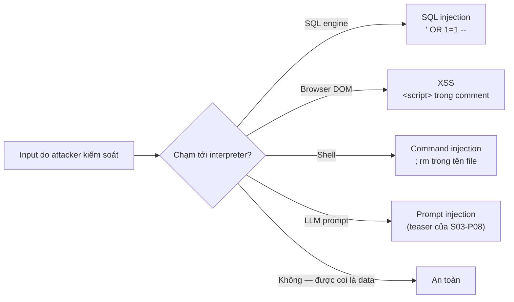

Security được dạy như môn tự chọn chuyên sâu, rồi hoá ra lại là một dòng trong code review của *bạn*, mãi mãi. Tin tốt: phần lớn các vụ breach ngoài đời đến từ một nhúm họ bug, và tất cả đều gục trước một mental model. **Mọi input là code cho tới khi được chứng minh là data.** Một URL parameter, một ô form, một tên file, một JSON body, một HTTP header — kẻ tấn công là người viết chúng, và đâu đó trong hệ thống của bạn có một interpreter (SQL engine, browser, shell, template engine) sẵn lòng *thực thi* thứ bạn chuyển tiếp. Security cơ bản = biết các interpreter của mình và không bao giờ để văn bản không đáng tin chạm vào chúng ở dạng thô.

## Họ injection: một bug, nhiều bộ áo

**SQL injection** là bài kinh điển: dựng query bằng nối chuỗi và input `' OR 1=1 --` viết lại mệnh đề `WHERE` của bạn. Cách chữa hai mươi năm nay vẫn vậy và bạn đã gặp ở P7: **parameterized query, luôn luôn** — driver gửi hình dạng query và các giá trị tách rời nhau, nên giá trị không bao giờ biến thành cú pháp được. Bất kỳ SQL nối chuỗi nào trong review là một blocking comment (phân loại của P9), bất kể tool "nội bộ" tới đâu.

**XSS (cross-site scripting)** là cùng bug đó với interpreter là *browser*: nội dung người dùng render vào HTML không escape nghĩa là "comment" của ai đó chạy như script trong session của mọi khách khác — kèm cookie của họ. Framework hiện đại escape mặc định; XSS sống sót ở các cửa thoát hiểm (prop raw-HTML với cái tên nghe đã nguy hiểm — cái tên chính là lời cảnh báo) và trong template dựng chuỗi thủ công. Luật: giữ nguyên escape của framework, raw HTML chỉ cho nội dung *bạn* tự viết, không bao giờ cho bất kỳ thứ gì hình-dạng-người-dùng.

**Command injection** là cùng bug đó với interpreter là shell: `os.system("convert " + filename)` cộng một tên file chứa `;` sẽ chạy lệnh của kẻ tấn công. Cách chữa: mảng đối số (`subprocess.run([...])`, không bao giờ `shell=True` với input người dùng) — nước đi parameterized-query của P7, phiên bản shell. Và **prompt injection** (S03-P08) là bộ áo mới nhất: văn bản mà LLM của bạn đọc là input hành xử như chỉ thị. Cùng model, chưa có cách chữa triệt để — đó là lý do ở đấy bạn thấy "least privilege trên tool."

## Auth: phần ai cũng tự chế và tự chế sai

Hai từ không đồng nghĩa: **authentication** (bạn là ai) và **authorization** (bạn được làm gì). Luật thực chiến cho từng cái:

- **Không bao giờ lưu password** — lưu hash chậm có salt (họ bcrypt/argon2). Một bảng hash nhanh bị lộ (hay tệ hơn, plaintext) biến một vụ breach thành credential-stuffing nhắm vào mọi site mà người dùng xài chung mật khẩu. Đây cũng là lý do đừng tự phát minh scheme riêng: dùng auth của framework hoặc managed identity provider; bản tự chế là một học kỳ toàn câu hỏi thi bạn chưa từng thấy.
- **Authorization kiểm tra ở server, mỗi request, đối chiếu với tài nguyên.** Lỗ hổng kinh điển không phải login hỏng — mà là `GET /invoices/4823` trả về hoá đơn của người khác, vì code kiểm tra *rằng* bạn đã đăng nhập chứ không kiểm tra hoá đơn đó *của ai* (IDOR — insecure direct object reference). Giấu cái nút trong UI không phải là một cú kiểm tra; kẻ tấn công dùng `curl` (P6), không dùng frontend của bạn.
- **Session cưỡi trên cookie, nên hãy bảo vệ cookie**: `HttpOnly` (script không đọc được — chặn bớt thiệt hại XSS), `Secure` (chỉ HTTPS, mindset của P6), `SameSite` (bẻ cùn cross-site request forgery). Bốn lá cờ biến vài lớp tấn công thành chuyện không xảy ra.

## Secrets: vụ breach do chính bạn commit

Một password nằm trong code chỉ cách công khai đúng một cú `git push` — và **git nhớ** (cái graph của P9: xoá file ở commit mới chẳng xoá gì cả; secret sống trong lịch sử và phải được *rotate*, không phải remove). Kỷ luật:

- Secret sống trong **env/config tiêm lúc runtime** — biến môi trường, secrets manager — không bao giờ trong code, không bao giờ trong repo, soi gương thói quen config-ngoài-code của S02-P03 và sự cố key-trong-repo của S04-P02.
- **`.gitignore` file env từ ngày số không** và commit một `.env.example` có tên biến nhưng không có giá trị.
- Mặc định coi mọi secret từng chạm repo, dòng log, hay tin nhắn chat là đã cháy: **rotate nó**. Bản thân việc rotation rẻ là một mục tiêu thiết kế — đó là lý do auth theo danh tính, không key (role của S04-P02) thắng key sống dai ở mọi nơi có thể.

## Least privilege như tư thế mặc định

Ý tưởng bán kính vụ nổ từ S04-P02, tổng quát hoá: mỗi thành phần nhận đúng mức tối thiểu nó cần, để một thành phần bị chiếm là một sự cố, không phải một thảm hoạ. DB user của app không thể `DROP TABLE` (constraint của P7 là tuyến cuối); service upload chỉ ghi được vào bucket *của nó* (Block Public Access mặc định của S04-P04); job báo cáo dùng replica read-only; script của thực tập sinh không chạy quyền admin. Không thứ nào ở đây ngăn cái bug ban đầu — chúng ngăn cái bug trở thành tít báo.

Hai thói quen hoàn thiện tư thế: **HTTPS mọi nơi, bật verification** (P6 nói rồi: `verify=false` trong code production là blocking comment — bạn đang tắt bằng chứng duy nhất rằng mình nói chuyện đúng server), và **vá dependency đều tay** — đa số vụ chiếm quyền thật khai thác lỗ hổng *đã biết* trong thư viện *chưa vá*; con bot cập nhật dependency (CI của P9 khiến điều đúng thành tự động) là một security control, không phải việc vặt.

## Điều cần nhớ

- Một model phủ đa số vụ breach: input là code cho tới khi chứng minh là data — biết các interpreter (SQL, browser, shell, LLM) và đi đường parameterized/escape, không bao giờ dựng chuỗi.
- Auth: framework hoặc managed identity, hash chậm có salt, và authorization kiểm ở server theo từng tài nguyên — login có thể hoàn hảo trong khi `/invoices/4823` rò rỉ tất cả.
- Secret không bao giờ chạm git; tiêm qua env/secrets manager, `.env.example` cho hình dạng, và rotate mọi thứ từng rò rỉ — lịch sử git là mãi mãi.
- Least privilege + HTTPS-có-verification + dependency được vá: ba mặc định nhàm chán biến bug thành sự cố thay vì tít báo.

*Tiếp theo — Phần 12: Từ đồ án đến hệ thống production — hồi kết của series.*
