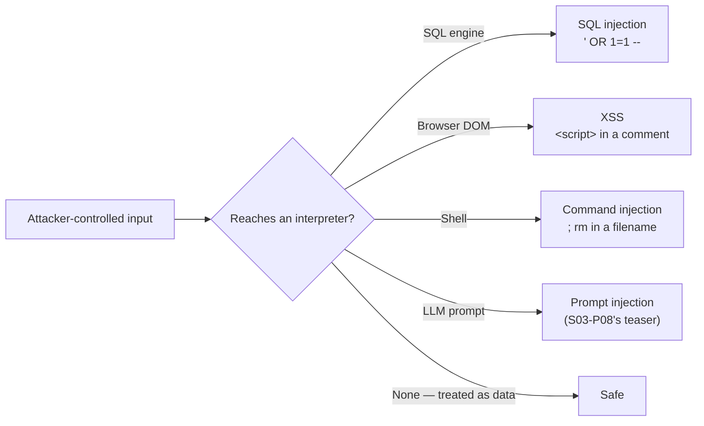

Security is taught as a specialist elective and then turns out to be a line item in *your* code review, forever. The good news: the bulk of real-world breaches come from a handful of bug families, and all of them fall to one mental model. **Every input is code until proven data.** A URL parameter, a form field, a filename, a JSON body, an HTTP header — the attacker writes them, and somewhere in your system there's an interpreter (SQL engine, browser, shell, template engine) willing to *execute* what you pass along. Security basics = knowing your interpreters and never letting untrusted text reach one raw.

## What you'll learn

- Recognize the injection family from one shared cause, across four different costumes.
- Store passwords and check authorization the way that survives a breach.
- Handle secrets so a leaked repository isn't a leaked production system.
- Adopt least privilege as a default posture rather than a cleanup task.

**Prerequisites:** Part 6 (HTTP and TLS) and Part 7 (databases). Everything here is defensive.

## 1. The injection family: one bug, many costumes



**SQL injection** is the classic: build a query with string concatenation and the input `' OR 1=1 --` rewrites your `WHERE` clause. The fix has been the same for twenty years and you already met it in P7: **parameterized queries, always** — the driver sends the query shape and the values separately, so values can never become syntax. Any string-built SQL in review is a blocking comment (P9's category), no matter how "internal" the tool.

**XSS (cross-site scripting)** is the same bug where the interpreter is the *browser*: user content rendered into HTML unescaped means someone's "comment" runs as script in every other visitor's session — with their cookies. Modern frameworks escape by default; XSS survives at the escape hatches (raw-HTML props with dangerous-sounding names — the name is the warning) and in hand-built string templates. Rule: framework escaping stays on, raw HTML only for content *you* authored, never for anything user-shaped.

**Command injection** is the same bug where the interpreter is the shell: `os.system("convert " + filename)` plus a filename containing `;` runs the attacker's command. Fix: argument arrays (`subprocess.run([...])`, never `shell=True` with user input) — the P7 parameterized-query move, shell edition. And **prompt injection** (S03-P08) is the newest costume: text your LLM reads is input that behaves like instructions. Same model, no complete fix yet — which is why you saw "least privilege on tools" there.

## 2. Auth: the part everyone hand-rolls wrong

Two words that aren't synonyms: **authentication** (who are you) and **authorization** (what may you do). The working rules for each:

- **Never store passwords** — store slow, salted hashes (bcrypt/argon2-family). A leaked table of fast hashes (or worse, plaintext) turns one breach into credential-stuffing against every site the users share passwords with. This is also why you don't invent your own scheme: use your framework's auth or a managed identity provider; the hand-rolled version is a semester of exam questions you haven't seen.
- **Authorization is checked on the server, per request, against the resource.** The classic hole isn't a broken login — it's `GET /invoices/4823` returning someone else's invoice because the code checked *that* you're logged in but not *whose* invoice that is (IDOR — insecure direct object reference). Hiding the button in the UI is not a check; the attacker uses `curl` (P6), not your frontend.
- **Sessions ride on cookies, so protect the cookies**: `HttpOnly` (scripts can't read them — caps XSS damage), `Secure` (HTTPS only, P6's mindset), `SameSite` (blunts cross-site request forgery). Four flags that turn several attack classes into non-events.

## 3. Secrets: the breach you commit yourself

A password in code is one `git push` from public — and **git remembers** (P9's graph: deleting the file in a new commit deletes nothing; the secret lives in history and must be rotated, not removed). The discipline:

- Secrets live in **environment/config injected at runtime** — env vars, a secrets manager — never in code, never in the repo, mirroring S02-P03's config-outside-code habit and S04-P02's key-in-repo incident.
- **`.gitignore` the env file from day zero** and commit a `.env.example` with names but no values.
- Assume any secret that ever touched a repo, a log line, or a chat message is burned: **rotate it**. Rotation being cheap is itself a design goal — it's why identity-based, keyless auth (S04-P02's roles) beats long-lived keys wherever available.

## 4. Least privilege as a default posture

The blast-radius idea from S04-P02, generalized: every component gets the minimum it needs, so a compromise of one piece is an incident, not a catastrophe. The app's DB user can't `DROP TABLE` (P7's constraints as last line); the upload service can write to *its* bucket only (S04-P04's Block Public Access by default); the reporting job gets read-only replicas; the intern's script doesn't run as admin. None of this prevents the initial bug — it prevents the bug from becoming the headline.

Two habits complete the posture: **HTTPS everywhere, verification on** (P6 said it: `verify=false` in production code is a blocking review comment — you're switching off the only proof you're talking to the right server), and **keep dependencies patched** — most real compromises exploit a *known* vulnerability in an *unpatched* library; the dependency-update bot (P9's CI making the right thing automatic) is a security control, not busywork.

## Practice (25 minutes — break your own toy app, then close each hole)

Everything below runs locally against code you wrote, which is the only place this kind of practice belongs. Nothing here targets a system you don't own.

```python
import sqlite3, hashlib, secrets, time

db = sqlite3.connect(":memory:")
db.executescript('''
CREATE TABLE users(id INTEGER PRIMARY KEY, name TEXT, pw TEXT, role TEXT);
CREATE TABLE notes(id INTEGER PRIMARY KEY, owner_id INT, body TEXT);
INSERT INTO users VALUES (1,'alice','x','user'), (2,'bob','x','admin');
INSERT INTO notes VALUES (1,1,'alice private note'), (2,2,'bob admin note');
''')

# 1. INJECTION — the vulnerable version builds a query by concatenation
def find_user_bad(name):
    return db.execute(f"SELECT id,name,role FROM users WHERE name = '{name}'").fetchall()
print("normal :", find_user_bad("alice"))
print("attack :", find_user_bad("alice' OR '1'='1"))      # every user, from one input

# FIX: parameters keep data as data, never as code
def find_user_good(name):
    return db.execute("SELECT id,name,role FROM users WHERE name = ?", (name,)).fetchall()
print("fixed  :", find_user_good("alice' OR '1'='1"))     # zero rows: it's just a weird name

# 2. PASSWORD STORAGE — fast hash vs deliberately slow hash
pw = "correct horse battery staple"
t = time.perf_counter(); [hashlib.sha256(pw.encode()).hexdigest() for _ in range(50000)]
print(f"sha256 x50k: {time.perf_counter()-t:.2f}s   ← an attacker does this per guess")
salt = secrets.token_bytes(16)
t = time.perf_counter(); hashlib.pbkdf2_hmac("sha256", pw.encode(), salt, 200_000)
print(f"pbkdf2  x1 : {time.perf_counter()-t:.2f}s   ← slowness IS the feature")

# 3. IDOR — authentication is not authorization
def get_note_bad(note_id):                                # "the UI only shows their own notes"
    return db.execute("SELECT body FROM notes WHERE id = ?", (note_id,)).fetchone()
print("alice reads note 2:", get_note_bad(2))             # bob's note, via a changed URL

def get_note_good(note_id, current_user_id):              # ownership checked in the QUERY
    return db.execute("SELECT body FROM notes WHERE id = ? AND owner_id = ?",
                      (note_id, current_user_id)).fetchone()
print("alice reads note 2 (fixed):", get_note_good(2, 1)) # None — not found, for her
```

Expected results: the concatenated query returns every user from a single crafted name, and the parameterized one returns nothing — because parameters mean the database never treats input as syntax. The timing block makes the password argument concrete: a fast hash lets an attacker try tens of thousands of guesses per second against a stolen table, while a deliberately slow one makes the same attack impractical. The third block is the one that ships to production most often: the model was logged in *as Alice*, so the code felt safe, but nothing checked that note 2 was hers. Authorization belongs in the query, not in the interface that renders the links.

## Check yourself

1. Your ORM protects you from SQL injection. Which members of the injection family does it *not* protect you from?
2. A colleague says storing passwords with SHA-256 plus a salt is fine because "SHA-256 is unbroken." What's wrong with the reasoning?
3. A secret was committed and then removed in a follow-up commit. Is the problem solved?

<details><summary>See answers</summary>

1. All the others: cross-site scripting when you render user input into HTML, command injection when you build a shell string, and prompt injection when you concatenate user text into an LLM prompt. The shared cause is treating input as code somewhere else in the stack — an ORM only fixes the database boundary.
2. SHA-256 is unbroken *as a hash*, which isn't the property you need. It's designed to be fast, and speed is exactly what helps an attacker who stole the table: they can compute billions of guesses. Password hashing needs a deliberately slow, memory-hard function (bcrypt, scrypt, Argon2, or PBKDF2 with a high iteration count) so each guess costs real time.
3. No. Git keeps history, so the secret is still in the repository and in every clone and fork. The only real fix is to rotate the credential so the leaked value stops working; rewriting history is optional cleanup afterwards, and it never reaches copies other people already have.

</details>

## Key takeaways

- One model covers most breaches: input is code until proven data — know your interpreters (SQL, browser, shell, LLM) and use parameterized/escaped paths, never string-building.
- Auth: framework or managed identity, slow salted hashes, and authorization checked server-side per resource — the login can be perfect while `/invoices/4823` leaks everything.
- Secrets never touch git; env/secret-manager injection, `.env.example` for shape, and rotate anything that ever leaked — git history is forever.
- Least privilege + HTTPS-with-verification + patched dependencies: three boring defaults that turn bugs into incidents instead of headlines.

*Next up — Part 12: From School Project to Production System — the series finale.*
