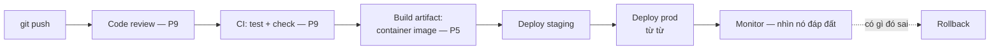

Đồ án xong khi nó chạy một lần, trên máy bạn, cho buổi demo. Hệ thống production không bao giờ xong — nó chạy *không người trông*, cho *người lạ*, dưới *tải bạn không được chọn*, và nó hỏng lúc 3 giờ sáng (P5 đã cho bạn thấy sự cố trông thế nào từ bên trong). Khoảng cách giữa hai trạng thái đó làm mọi sinh viên mới ra trường sợ, và không nên: nó không phải bí ẩn, nó là một **checklist** — và series này đã lặng lẽ trao bạn từng mục trên đó. Hồi kết này lắp các mảnh lại và kể cho bạn on-call thật ra là gì.

## Bạn sẽ học được gì

- Lần theo con đường từ một cú push tới một người lạ đang dùng code của bạn, gọi tên từng cổng.
- Dựng năm tính năng vận hành không ai demo mà ai cũng cần lúc 3 giờ sáng.
- Tiếp cận on-call như một thực hành máy móc chứ không phải một nét tính cách.
- Nhìn trọn tấm bản đồ mười hai phần như một hệ thống duy nhất.

**Cần biết trước:** Phần 9–11 (CI, testing, bảo mật) chính là các mảnh mà bài này lắp lại.

## 1. Pipeline: code đến tay người lạ bằng cách nào



Không có gì trong pipeline này mới với bạn — nó là review và CI của P9 với hai bổ sung hạng production. Thứ nhất, **artifact**: bạn không deploy "code," bạn deploy một *thứ đã build, có version, bất biến* (thường là container image — "process + cgroup" của P5), cùng một artifact ở staging và prod, để "chạy ở staging" thật sự có nghĩa. Thứ hai, **rollback là một cái nút hạng nhất**: vì artifact trước vẫn còn đó, quay lại là redeploy nó — vài phút, không phải một cú sửa code hoảng loạn lúc 2 giờ sáng. Các thói quen senior theo sau: **deploy nhỏ và thường xuyên** (cú deploy 10 dòng mà hỏng là không gian tìm kiếm 10 dòng; ba tuần thay đổi là một cuộc khai quật — luật diff-nhỏ của P9 ở tầm hệ thống), **rải ra từ từ** (vài instance trước; cú deploy làm hỏng 5% traffic trong hai phút là một giai thoại, không phải một sự cố), và **không bao giờ deploy thứ không rollback được** — đó là lý do migration database đi bài expand-rồi-contract: thêm cột mới, ship code chạy được với cả hai, bỏ cột cũ ở release sau (sự nâng niu schema của P7, phiên bản deploy).

## 2. Tính vận hành được: các feature không ai demo

Khác biệt giữa code chạy được và hệ thống *vận hành được* là một danh sách ngắn các feature kém hào nhoáng, tất cả bạn đều đã gặp:

- **Config ngoài code** (kỷ luật secrets của P11 tổng quát hoá): cùng một artifact phải chạy ở dev/staging/prod — khác biệt hành vi đến từ môi trường, không phải từ các cú sửa `if env == "prod"`.
- **Log mà ai đó dùng được lúc 3 giờ sáng**: structured, có request ID, level thật thà (một ERROR giả huấn luyện người ta phớt lờ ERROR — cậu bé chăn cừu là một bug vận hành).
- **Health check và graceful shutdown** (SIGTERM của P5): platform restart thứ hỏng và rút cạn thứ bị thay; việc của app bạn là báo cáo trung thực và chết sạch sẽ.
- **Timeout, retry có backoff, idempotency** (P6, P8): mọi cú gọi mạng của hệ thống bạn rồi sẽ có lúc treo, và mọi retry rồi sẽ có lúc bắn đúp. Bạn đã biết thuốc từ phần concurrency.
- **Một dashboard trả lời "nó có đang chạy không?"** bằng bốn con số — rate, errors, duration, saturation (tài nguyên của P5) — và *alarm theo triệu chứng, không theo nguyên nhân*.

Không mục nào ở đây được một slide demo. Tất cả quyết định việc người trực pager — sớm thôi: là bạn — có được ngủ không.

## 3. On-call, giải ảo

On-call làm junior sợ chủ yếu bằng lớp sương huyền bí, nên đây là bản mô tả công việc trong một đoạn: *đeo pager một tuần; alarm nổ thì làm theo runbook; runbook không phủ thì mitigate trước, hiểu sau; ghi lại chuyện đã xảy ra.* Các từ khoá: **runbook** — cái checklist viết lúc ban ngày bình tĩnh ("queue dồn: xem log consumer, xem DLQ, scale consumer, đây là cách") biến hoảng loạn 3 giờ sáng thành thủ tục 3 giờ sáng; **mitigate trước** — rollback (ở trên), restart, failover; truy căn nguyên là hoạt động ban ngày (playbook triage của P5 chính là nó); và **postmortem không đổ lỗi** — bản viết hỏi "điều gì khiến thất bại này khả dĩ?", không bao giờ hỏi "ai?", vì văn hoá trừng phạt con người bảo đảm *hệ thống* tiếp tục hỏng (văn hoá review của P9, áp vào thất bại). On-call cũng, một cách lặng lẽ, là người thầy nhanh nhất của ngành này: một vòng trực dạy bạn về cách hệ thống thật sự hành xử nhiều hơn một học kỳ — mỗi sự cố là một bài kiểm tra bất chợt về phần 2 tới phần 11.

## 4. Tấm bản đồ, lắp hoàn chỉnh

Nhìn lại thứ series này thật sự xây — không phải mười hai chủ đề, mà một hệ bản năng: cỗ máy và các cái giá của nó (P2–P4), OS dưới lửa đạn (P5), bốn màn kịch của mạng (P6), dữ liệu sống sót (P7), một hình dạng bug của concurrency (P8), vòng lặp nghề git/test/review (P9), abstraction là khoản vay (P10), security input-là-code (P11), và giờ là pipeline ship tất cả. Đó là 20% của tấm bằng vận hành 80% còn lại của sự nghiệp bạn.

Đi tiếp đâu, tuỳ khẩu vị: xây hệ thống dữ liệu → **Lộ trình Data Engineer** (S02) bắt đầu đúng nơi P7 dừng; hệ thống AI → **Lộ trình AI Engineer** (S03) nối từ bản năng async của P8 và threat model của P11; chính đám mây → **AWS từ cơ bản đến nâng cao** (S04), nơi P5/P6 trở thành các service có hoá đơn; và khi bạn sẵn sàng nghĩ theo cả hệ thống → **Các kiến trúc Data Platform** (S07). Mỗi series đều giả định chính xác thứ bạn giờ đã có.

## Thực hành (30 phút — dựng trọn pipeline cho một app một file)

Mọi thứ trong bài này gói gọn trong một repository GitHub, và dựng nó một lần là các khái niệm ở lại vĩnh viễn. Dùng app tí hon nào bạn thích:

```yaml
# .github/workflows/ship.yml — bốn cái cổng, xếp theo chi phí
name: ship
on: [push]
jobs:
  test:
    runs-on: ubuntu-latest
    steps:
      - uses: actions/checkout@v4
      - run: pip install -r requirements.txt
      - run: python -m pytest -q                    # cổng 1: nó có chạy không?
      - run: python -m pip check                    # cổng 2: dependency có lành không?

  build:
    needs: test
    runs-on: ubuntu-latest
    steps:
      - uses: actions/checkout@v4
      - run: docker build -t app:${{ github.sha }} .   # cổng 3: một artifact BẤT BIẾN,
      - run: docker run --rm app:${{ github.sha }} --version   #        đặt tên theo commit

  deploy:
    needs: build
    runs-on: ubuntu-latest
    environment: production                          # cổng 4: một cú duyệt của con người, có ghi sổ
    steps:
      - run: echo "deploying app:${{ github.sha }}"   # bước deploy thật của bạn đặt ở đây
```

Rồi thêm các tính năng vận hành vào chính app — mỗi cái vài dòng và mỗi cái đều xứng đáng chỗ đứng:

```python
import os, sys, json, signal, logging, time

VERSION = os.environ.get("GIT_SHA", "dev")           # 1. nó nói được nó là bản build nào
health = {"ready": False}

def handle_sigterm(*_):                              # 2. nó tắt một cách có chủ đích
    logging.info(json.dumps({"event": "shutdown", "version": VERSION}))
    health["ready"] = False; time.sleep(0.5); sys.exit(0)
signal.signal(signal.SIGTERM, handle_sigterm)

def healthz(): return {"status": "ok", "version": VERSION}          # 3. liveness
def readyz():  return {"ready": health["ready"], "version": VERSION} # 4. readiness ≠ liveness

logging.basicConfig(format="%(message)s", level=logging.INFO)        # 5. log có cấu trúc
logging.info(json.dumps({"event": "startup", "version": VERSION,
                         "config_source": "env"}))                   #    config từ env, không từ code
health["ready"] = True
```

Kết quả mong đợi: pipeline cho bạn tính chất khiến rollback thành một cái nút thay vì một dự án — artifact được đặt tên theo commit SHA, nên "quay lui" nghĩa là deploy một tag vốn đã tồn tại và đã được test. Hãy làm một cú rollback có chủ đích để cảm nhận. Năm tính năng của app nhìn riêng thì tầm thường, nhưng cộng lại chúng là thứ tách một service bạn *vận hành được* khỏi một service bạn chỉ *restart được*: có version trên mọi dòng log nghĩa là bạn biết bản build NÀO hỏng, readiness tách khỏi liveness nghĩa là một cú deploy không đẩy traffic vào tiến trình chưa sẵn sàng, và xử lý SIGTERM nghĩa là deploy thôi cắt đôi các request.

## Tự kiểm tra

1. Pipeline deploy của bạn build lại image ở mỗi chặng — một lần cho staging, một lần cho production. Sai ở đâu?
2. Một health check trả về 200 bất cứ khi nào tiến trình còn sống. Thiết kế này gây ra sự cố gì trong lúc deploy?
3. Production đang hỏng và nguyên nhân chưa rõ. Việc đầu tiên bạn làm là gì?

<details><summary>Xem đáp án</summary>

1. Bạn đang test một artifact và ship một artifact khác. Kể cả cùng mã nguồn, hai bản build vẫn có thể khác nhau — một dependency vừa ra bản vá mới, một base image vừa dịch chuyển. Hãy build một lần, rồi thăng cấp *chính* artifact bất biến đó qua từng môi trường; đó là thứ khiến staging là bằng chứng chứ không phải diễn kịch.
2. Nó khiến traffic bị đẩy vào các instance đang chạy nhưng chưa sẵn sàng — còn đang nạp config, hâm nóng cache, hay chờ kết nối database. Người dùng nhận lỗi từ một cú deploy mà dashboard gọi là thành công. Liveness trả lời "có nên restart tôi không?"; readiness trả lời "có nên gửi traffic cho tôi không?" — chúng phải là hai endpoint khác nhau.
3. Giảm thiểu trước, chẩn đoán sau: quay lui về artifact tốt-đã-biết gần nhất, hoặc tắt feature flag. Khôi phục dịch vụ là ưu tiên, và bằng chứng bạn cần để chẩn đoán (log, metric, chính cái artifact) đằng nào cũng còn nguyên. Debug trên production trong lúc người dùng đang chịu ảnh hưởng là bản năng cần bỏ đi.

</details>

## Điều cần nhớ

- Production = checklist, không phải bí ẩn: artifact bất biến có version, deploy theo tầng và từ từ, rollback là một cái nút, migration expand-rồi-contract.
- Các feature vận hành — config ngoài code, log structured thật thà, health check, timeout/retry/idempotency, dashboard bốn con số — quyết định giấc ngủ của on-call; xây chúng từ ngày một.
- On-call là runbook + mitigate-trước + postmortem không đổ lỗi, và là người thầy nhanh nhất bạn từng có.
- Series là một hệ bản năng, và các lộ trình (S02 data, S03 AI, S04 cloud, S07 kiến trúc) đều bắt đầu đúng nơi nó kết thúc. Series hoàn tất — đi xây một thứ chạy cho người lạ thôi.
