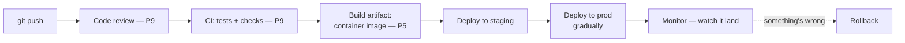

A school project is done when it runs once, on your machine, for the demo. A production system is never done — it runs *unattended*, for *strangers*, under *load you didn't pick*, and it fails at 3 a.m. (P5 taught you what the incident looks like from the inside). The gap between those two states scares every new grad, and it shouldn't: it's not a mystery, it's a **checklist** — and this series has quietly handed you every item on it. This finale assembles the pieces and tells you what on-call actually is.

## The pipeline: how code reaches strangers

Nothing in this pipeline is new to you — it's P9's review and CI with two production-grade additions. First, **the artifact**: you don't deploy "the code," you deploy a *built, versioned, immutable thing* (usually a container image — P5's "process + cgroups"), the same artifact in staging and prod, so "works in staging" actually means something. Second, **rollback is a first-class button**: because the previous artifact still exists, going back is redeploying it — minutes, not a frantic 2 a.m. code fix. The senior habits that follow: **deploy small and often** (a 10-line deploy that breaks is a 10-line search space; three weeks of changes is an excavation — P9's small-diff rule at system scale), **roll out gradually** (a few instances first; the deploy that breaks 5% of traffic for two minutes is an anecdote, not an incident), and **never deploy what you can't roll back** — which is why database migrations get the expand-then-contract treatment: add the new column, ship code that works with both, remove the old one a release later (P7's schema care, deploy edition).

## Operability: the features nobody demos

The difference between code that runs and a system that *operates* is a short list of unglamorous features, all of which you've met:

- **Config outside code** (P11's secrets discipline generalized): the same artifact must run in dev/staging/prod — behavior differences come from environment, not from `if env == "prod"` edits.
- **Logs someone can use at 3 a.m.**: structured, with request IDs, honest levels (a false ERROR trains people to ignore ERROR — the boy who cried wolf is an operability bug).
- **Health checks and graceful shutdown** (P5's SIGTERM): the platform restarts what fails and drains what's replaced; your app's job is to report honestly and die cleanly.
- **Timeouts, retries with backoff, idempotency** (P6, P8): every network call your system makes will eventually hang, and every retry will eventually double-fire. You've known the fixes since the concurrency part.
- **A dashboard answering "is it working?"** in four numbers — rate, errors, duration, saturation (P5's resources) — and *alarms on symptoms, not causes*.

None of these earn a demo slide. All of them decide whether the person on call — soon: you — sleeps.

## On-call, demystified

On-call terrifies juniors mostly through mystique, so here is the job description in one paragraph: *carry the pager for a week; when an alarm fires, follow the runbook; if the runbook doesn't cover it, mitigate first, understand later; write down what happened.* The keywords: **runbook** — the checklist written in calm daylight ("if the queue backs up: check consumer logs, check the DLQ, scale consumers, here's how") that converts 3 a.m. panic into 3 a.m. procedure; **mitigate first** — rollback (above), restart, failover; root cause is a daylight activity (your P5 triage playbook is exactly this); and **blameless postmortem** — the write-up asks "what made this failure possible?", never "who?", because a culture that punishes the person guarantees the *system* stays broken (P9's review culture, applied to failure). On-call is also, quietly, the fastest teacher in this industry: one rotation teaches you more about how systems actually behave than a semester — every incident is a pop quiz on parts 2 through 11.

## The map, assembled

Look back at what this series actually built — not twelve topics, but one system of instincts: the machine and its costs (P2–P4), the OS under fire (P5), the network's four acts (P6), data that survives (P7), concurrency's one bug shape (P8), the craft loop of git/tests/review (P9), abstraction as a loan (P10), input-is-code security (P11), and now the pipeline that ships it all. That's the 20% of the degree that runs the other 80% of your career.

Where next, by appetite: building data systems → the **Data Engineer Roadmap** (S02) starts where P7 ended; AI systems → the **AI Engineer Roadmap** (S03) picks up from P8's async instincts and P11's threat model; the cloud itself → **AWS from Zero to Advanced** (S04), where P5/P6 become services with bills; and when you're ready to think in whole systems → **Data Platform Architectures** (S07). Every one of them assumes exactly what you now have.

## Key takeaways

- Production = the checklist, not a mystery: versioned immutable artifacts, staged gradual deploys, rollback as a button, expand-then-contract migrations.
- Operability features — config outside code, honest structured logs, health checks, timeouts/retries/idempotency, a four-number dashboard — decide whether on-call sleeps; build them in from day one.
- On-call is runbooks + mitigate-first + blameless postmortems, and it's the fastest teacher you'll ever have.
- The series is one system of instincts, and the roadmaps (S02 data, S03 AI, S04 cloud, S07 architecture) each start exactly where it ends. Series complete — go build something that runs for strangers.
