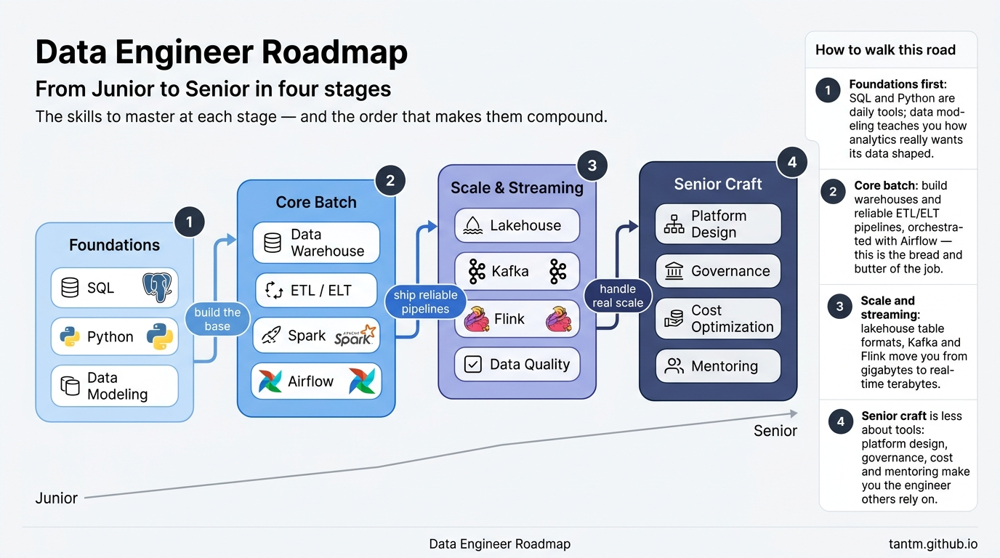
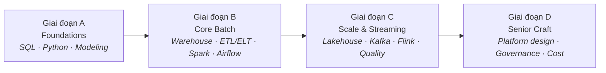
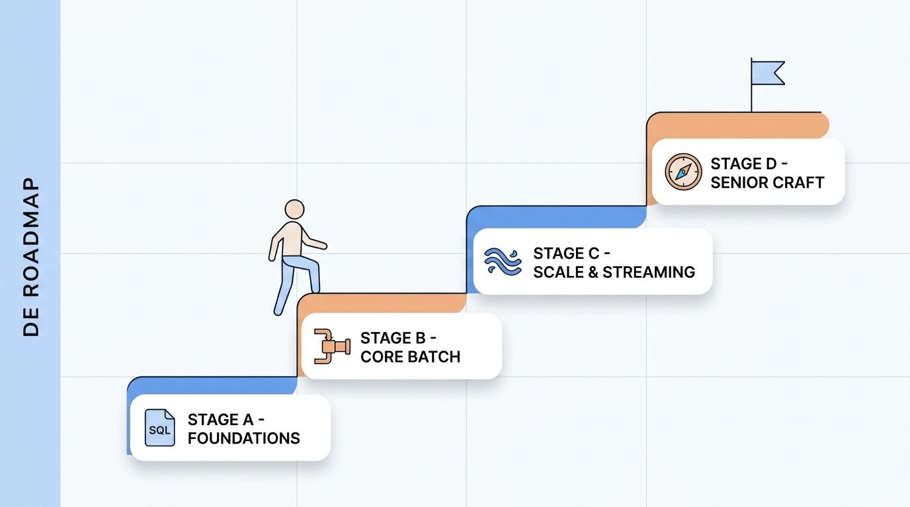

Giờ đây công ty nào cũng là công ty dữ liệu — và phải có ai đó xây đường ống. Người đó là Data Engineer: người biến đống dữ liệu rời rạc, bừa bộn, đến trễ thành thứ mà cả công ty tin được và dùng được.

Series này là roadmap thực dụng cho nghề đó: mười bốn phần, bốn giai đoạn, từ câu SQL nghiêm túc đầu tiên đến lối tư duy của người thiết kế cả platform.

## Bạn sẽ học được gì

- Giải thích được Data Engineer làm gì, khác DA, DS, MLE chỗ nào.
- Gọi tên 4 giai đoạn từ junior tới senior và mỗi giai đoạn thêm gì.
- Tự định vị bản thân bằng bảng kỹ năng theo cấp bậc.
- Nắm thứ tự đọc và cách thực hành song song.

**Cần biết trước:** biết lập trình cơ bản. Nếu nền tảng còn lung lay, học CS Foundations trước.

## 1. Data Engineer thực sự làm gì?

Phiên bản một dòng: **Data Engineer xây và vận hành các hệ thống di chuyển, biến đổi và phục vụ dữ liệu một cách đáng tin cậy.**

Phiên bản thật thà hơn là một ngày như thế này: hệ thống nguồn đổi một column mà không báo ai, pipeline đêm qua load trùng nửa số dữ liệu, analyst cần một bảng mới trước thứ Sáu, và hoá đơn cloud vừa tăng vọt. Công việc này là hỗn hợp đều tay của software engineering, nghề sửa ống nước, và nghề thám tử.

Dễ hình dung nhất là đặt vai trò này cạnh hàng xóm:

| Vai trò | Câu hỏi cốt lõi | Sản phẩm điển hình |
|---|---|---|
| **Data Engineer** | "Dữ liệu đi từ A đến B thế nào, đúng và đúng giờ?" | Pipeline, bảng, platform |
| Data Analyst | "Chuyện gì đã xảy ra, vì sao?" | Dashboard, report, insight |
| Data Scientist | "Chuyện gì sẽ xảy ra? Nên làm gì?" | Model, thử nghiệm |
| ML Engineer | "Model này chạy production ra sao?" | Hệ thống serving, ML pipeline |

Ranh giới ở mỗi công ty mỗi khác, nhưng trọng tâm thì rõ: analyst và scientist **dùng** data platform; data engineer **xây** nó. Platform tốt thì mọi người khác chạy nhanh hơn — đó chính là lý do nghề này được săn đón.

## 2. Bốn giai đoạn

### Giai đoạn A — Foundations (Phần 2–4)

Ba kỹ năng bạn sẽ dùng mỗi ngày suốt sự nghiệp:

- **SQL vượt khỏi SELECT** — JOIN không gây bất ngờ, window function, CTE. SQL không phải bước đệm; senior viết SQL *nhiều hơn* junior, chỉ là viết hay hơn.
- **Python như bộ đồ nghề** — script chạy lại an toàn, environment không mục nát, code đồng đội đọc được.
- **Data modeling** — khác biệt giữa schema xây cho app (OLTP) và schema xây cho analytics (OLAP), và vì sao star schema mãi không chịu chết.

Chỉ với Giai đoạn A bạn đã xin được việc junior DE. Mọi thứ sau đó khiến bạn trở nên đáng giá.

### Giai đoạn B — Core batch (Phần 5–8)

Cơm áo gạo tiền của nghề: xây **warehouse** có layer sạch sẽ, viết **ETL/ELT pipeline** idempotent (chạy lại an toàn — từ này sẽ theo bạn khắp nơi), scale bằng **Spark** khi một máy không còn đủ, và điều phối tất cả bằng **Airflow** để mọi thứ chạy lúc 3 giờ sáng mà không cần bạn.

Phần lớn data engineer dành phần lớn thời gian ở đây. Làm Giai đoạn B *tử tế* — pipeline không âm thầm mất dữ liệu, backfill không nuốt trọn cuối tuần — chính là ranh giới giữa mid-level vững và junior.

### Giai đoạn C — Scale & streaming (Phần 9–12)

Thế giới không còn là một batch job chạy đêm:

- **Lakehouse** table format (Parquet, Iceberg, Delta) — đảm bảo kiểu warehouse trên chi phí kiểu data lake.
- **Kafka** — cái log tách rời producer khỏi consumer.
- **Stream processing** (Flink và bạn bè) — window, watermark, và cái giá thật thà của "real-time".
- **Data quality** — test và contract cho dữ liệu, vì ở quy mô lớn bạn không thể soi bằng mắt nữa.

Giai đoạn C cũng là nơi bạn học được câu nói senior đáng giá nhất của nghề: *"Bài toán này có thật sự cần streaming không?"* (Đáp án bất ngờ thường xuyên: không.)

### Giai đoạn D — Senior craft (Phần 13–14)

Công cụ lùi về hậu trường và câu hỏi đổi hẳn: Cả platform nên ghép với nhau thế nào? Ai được truy cập gì, và làm sao biết lineage của con số trên dashboard của CEO? Vì sao hoá đơn tăng nhanh hơn dữ liệu? Làm sao kèm hai bạn junior trong team lên trình?

Seniority trong nghề này không phải biết nhiều tool hơn — mà là **chịu trách nhiệm về kết quả**: dữ liệu đáng tin, chi phí dự đoán được, team ship đều.

## 3. Kỹ năng theo cấp bậc, nói thật

| | Junior | Mid | Senior |
|---|---|---|---|
| Phạm vi | Một task trong pipeline | Một pipeline end-to-end | Cả platform & các trade-off |
| SQL/Python | Viết code chạy được | Viết code bảo trì được | Đặt chuẩn cho người khác theo |
| Khi có sự cố | Báo lên trên | Tự debug phần mình | Thiết kế sẵn để blast radius nhỏ |
| Chọn công nghệ | Dùng cái có sẵn | Đề xuất trong stack | Quyết định, và thường xuyên nói "không" |

## 4. Cách dùng series này

- **Theo thứ tự, mỗi lần một phần.** Các giai đoạn cố tình xây chồng lên nhau.
- **Vừa đọc vừa build.** Phần nào cũng có yếu tố thực hành — roadmap chỉ đọc suông là tờ rơi du lịch.
- **Đừng nhảy tool.** Một warehouse, một orchestrator, một nền tảng streaming — học sâu — thắng một CV mười cái logo.

## Thực hành (10 phút)

Định vị mình trên bản đồ trước khi bắt đầu:

1. Dùng bảng kỹ-năng-theo-cấp, tự chấm trung thực mỗi hàng một mức. Lệch mức giữa các hàng là chuyện bình thường.
2. Viết một câu: "Hàng yếu nhất của mình là ___, nên mình sẽ đọc kỹ nhất Giai đoạn ___."
3. Chọn ngay dataset thực hành — một bộ dữ liệu thật, hơi bừa bộn (của công ty bạn, hoặc bất kỳ bộ public nào). Mọi phần hands-on của series sẽ tái dùng nó. Quyết một lần là gỡ được cái cớ lớn nhất để bỏ qua thực hành.

## Tự kiểm tra

1. Analyst hỏi "vì sao doanh thu giảm?", còn data engineer hỏi một câu khác về cùng bảng đó. Câu của DE là gì?
2. "Idempotent" nghĩa là gì, và vì sao từ này quan trọng đến vậy trong nghề?
3. Giai đoạn nào dạy bạn hỏi "mình có thật sự cần streaming không?" — và vì sao đó là câu hỏi senior?

Xem đáp án

1. "Dữ liệu này tới đây bằng đường nào, có đủ không, có đúng giờ không?" — DE sở hữu sự di chuyển và độ tin cậy của dữ liệu, không phải cách diễn giải business.
2. An toàn để chạy lại: chạy pipeline hai lần cho cùng kết quả như một lần. Pipeline fail và retry liên tục, nên thiếu idempotency thì mỗi cú retry là một nguy cơ nhân đôi hay làm hỏng dữ liệu.
3. Giai đoạn C. Streaming đắt hơn hẳn batch để vận hành; biết khi nào business thật sự cần độ tươi tính bằng giây — và khi nào batch chạy đêm là đủ — là phán đoán về kết quả, không phải về tool.

## Điều cần nhớ

- Data Engineer xây và vận hành hệ thống di chuyển, biến đổi, phục vụ dữ liệu — cái nền mọi người khác đứng lên.
- Đường từ junior đến senior gồm bốn giai đoạn: foundations, core batch, scale & streaming, senior craft.
- Seniority không đo bằng số tool; nó là chịu trách nhiệm kết quả và làm rõ các trade-off.

**Lộ trình liên quan:** chưa vững nền tảng? Bắt đầu với [CS Foundations](/vi/series/cs-foundations). Làm việc trên AWS? [AWS từ cơ bản đến nâng cao](/vi/series/aws-zero-to-advanced) ghép tự nhiên với series này.

*Tiếp theo — Phần 2: SQL cho Data Engineer: vượt khỏi SELECT.*
