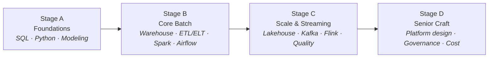

Every company is now a data company — and someone has to build the pipes. That someone is the Data Engineer: the person who turns scattered, messy, late-arriving data into something the rest of the company can trust and use.

This series is a practical roadmap for that career: fourteen parts, four stages, from your first serious SQL query to thinking like the engineer who designs the whole platform.

## What you'll learn

- Explain what a Data Engineer does, and how the role differs from DA, DS, and MLE.
- Name the four stages from junior to senior and what each stage adds.
- Self-assess your current stage with the skills-by-level table.
- Know the reading order and how to practice alongside it.

**Prerequisites:** comfortable with basic programming. If fundamentals feel shaky, do CS Foundations first.

## 1. What does a Data Engineer actually do?

The one-line version: **a Data Engineer builds and operates the systems that move, shape, and serve data reliably.**

A more honest version is a day that looks like this: a source system changed a column without telling anyone, last night's pipeline loaded half the data twice, an analyst needs a new table by Friday, and the cloud bill just spiked. The job is equal parts software engineering, plumbing, and detective work.

It helps to see the role next to its neighbors:

| Role | Core question | Typical output |
|---|---|---|
| **Data Engineer** | "How does data get from A to B, correctly and on time?" | Pipelines, tables, platforms |
| Data Analyst | "What happened, and why?" | Dashboards, reports, insights |
| Data Scientist | "What will happen? What should we do?" | Models, experiments |
| ML Engineer | "How does this model run in production?" | Serving systems, ML pipelines |

The boundaries blur at every company, but the center of gravity is clear: analysts and scientists **consume** the data platform; the data engineer **builds** it. When the platform is good, everyone else moves faster — which is exactly why the role is in demand.

## 2. The four stages

### Stage A — Foundations (Parts 2–4)

Three skills you will use every day for the rest of the career:

- **SQL beyond SELECT** — joins that don't surprise you, window functions, CTEs. SQL is not a stepping stone; seniors write *more* SQL than juniors, just better.
- **Python as a working toolkit** — scripts that can be re-run safely, environments that don't rot, code a teammate can read.
- **Data modeling** — the difference between a schema built for an app (OLTP) and one built for analytics (OLAP), and why star schemas refuse to die.

You can get a junior DE job on Stage A alone. Everything after makes you valuable.

### Stage B — Core batch (Parts 5–8)

The bread and butter of the job: build a **warehouse** with clean layers, write **ETL/ELT pipelines** that are idempotent (safe to re-run — this word will follow you everywhere), scale them with **Spark** when a single machine stops being enough, and orchestrate everything with **Airflow** so it runs at 3 a.m. without you.

Most working data engineers spend most of their time here. Doing Stage B *well* — pipelines that don't silently lose data, backfills that don't take a weekend — is what separates solid mid-level engineers from juniors.

### Stage C — Scale & streaming (Parts 9–12)

The world stops being one nightly batch job:

- **Lakehouse** table formats (Parquet, Iceberg, Delta) — warehouse guarantees on data-lake economics.
- **Kafka** — the log that decouples producers from consumers.
- **Stream processing** (Flink and friends) — windows, watermarks, and the honest cost of "real-time".
- **Data quality** — tests and contracts for data, because at scale you can't eyeball it anymore.

Stage C is also where you learn the most valuable senior sentence in data engineering: *"Do we actually need streaming for this?"* (Surprisingly often: no.)

### Stage D — Senior craft (Parts 13–14)

The tools fade into the background and the questions change: How should the whole platform fit together? Who can access what, and how do we know the lineage of a number on the CEO's dashboard? Why is the bill growing faster than the data? How do I level up the two juniors on my team?

Seniority in this field is not knowing more tools — it is **owning outcomes**: trustworthy data, predictable costs, a team that ships.

## 3. Skills by level, honestly

| | Junior | Mid | Senior |
|---|---|---|---|
| Scope | A task in a pipeline | A pipeline end-to-end | The platform & the trade-offs |
| SQL/Python | Writes working code | Writes maintainable code | Sets the standard others copy |
| When things break | Escalates | Debugs their area | Designed it so the blast radius is small |
| Technology choices | Uses what's there | Recommends within the stack | Decides, and says "no" often |

## 4. How to use this series

- **In order, one part at a time.** The stages build on each other deliberately.
- **Build as you read.** Every part has hands-on elements — a roadmap you only read is a travel brochure.
- **Don't tool-hop.** One warehouse, one orchestrator, one streaming platform — learned deeply — beats a résumé of ten logos.

## Practice (10 minutes)

Locate yourself on the map before starting:

1. Using the skills-by-level table, give yourself one honest level per row. Mixed levels are normal.
2. Write one sentence: "My weakest row is ___, so I will read Stage ___ most carefully."
3. Pick your practice dataset now — one real, slightly messy dataset (your company's, or any public one). Every hands-on part of this series will reuse it. Deciding once removes the biggest excuse for skipping practice.

## Check yourself

1. An analyst asks "why is revenue down?" and a data engineer asks a different question about the same table. What is the DE's question?
2. What does "idempotent" mean, and why does the word matter so much in this career?
3. Which stage teaches you to ask "do we actually need streaming for this?" — and why is that a senior question?

See answers

1. "How did this data get here, is it complete, and did it arrive on time?" — the DE owns the movement and trustworthiness of the data, not the business interpretation.
2. Safe to re-run: running a pipeline twice produces the same result as once. Pipelines fail and retry constantly, so without idempotency every retry risks duplicating or corrupting data.
3. Stage C. Streaming costs far more to operate than batch; knowing when the business genuinely needs seconds-level freshness — and when a nightly batch is enough — is a judgment call about outcomes, not tools.

## Key takeaways

- A Data Engineer builds and operates the systems that move, shape, and serve data — the platform everyone else stands on.
- The path from junior to senior has four stages: foundations, core batch, scale & streaming, senior craft.
- Seniority is not tool count; it is owning outcomes and making the trade-offs visible.

**Related paths:** shaky on fundamentals? Start with [CS Foundations](/series/cs-foundations). Working on AWS? [AWS from Zero to Advanced](/series/aws-zero-to-advanced) pairs naturally with this series.

*Next up — Part 2: SQL for Data Engineers: Beyond SELECT.*
