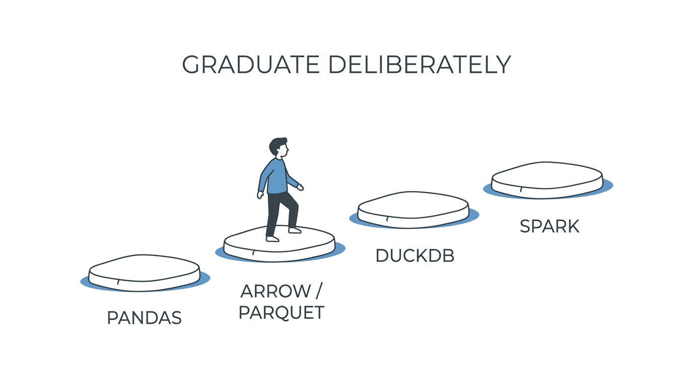

You already know Python — the syntax, anyway. This part is about the gap between "I can write a script" and "my script has run nightly for a year and nobody thinks about it." Data engineering Python is a *dialect*: fewer clever abstractions, more paranoia about re-runs, environments, and the borders where data enters.

## What you'll learn

- Set up pinned, reproducible environments the scheduler can rebuild exactly.
- Write jobs that pass the re-run test (idempotency) and expose a proper CLI with logs and exit codes.
- Type the borders where data enters, so the inside of your pipeline can trust its inputs.
- Escalate pandas → Arrow → DuckDB → Spark deliberately, and write the two kinds of tests that pay rent.

**Prerequisites:** Part 2 (what a pipeline is and why re-runs happen). Basic Python — functions, dicts, running scripts.

## 1. Environments that pin, or it didn't happen

The oldest pipeline failure in the book: works on your laptop, dies on the scheduler, because two machines resolved "pandas" to two different versions. The cure is mechanical:

```bash
uv init my-pipeline && cd my-pipeline
uv add pandas pyarrow
# → pyproject.toml (what you want) + uv.lock (exactly what everyone gets)
uv run python pipeline.py
```

The tool matters less than the contract (uv is today's fast default; the venv+pip ritual is fine too): **dependencies declared in a file, versions locked, environment rebuilt from the lock — never "pip install into whatever's there."** Your scheduler and your laptop must build the same world from the same lockfile, or Part 2's "works on my machine" mystery becomes your Tuesday.

## 2. Idempotency: the re-run test

We've chanted the word since Part 1; here is what it means in Python. Ask of every job: **if this runs twice, what happens?** Pipelines *will* re-run — retries, backfills, a nervous human at 2 a.m.

```python
# Appends: two runs = doubled rows. FAILS the test.
df.to_sql("daily_sales", conn, if_exists="append")

# Overwrite the partition this run owns: two runs = same result. PASSES.
(pq.write_to_dataset(table, "sales", partition_cols=["day"],
                     existing_data_behavior="delete_matching"))
```

The general pattern: **a run owns a well-defined slice** (usually a date partition), writes it atomically (write temp → swap), and derives everything from its parameters — no `datetime.now()` buried in transform logic ("today's" run rerun tomorrow must produce *the same* output; the run date is a parameter, not a discovery).

## 3. Parameterized CLI, not editable constants

The scheduler needs to call your script; a human needs to backfill Tuesday. Both are the same interface:

```python
import argparse, sys, logging

def main() -> int:
    p = argparse.ArgumentParser()
    p.add_argument("--run-date", required=True)   # the slice this run owns
    p.add_argument("--source", default="orders")
    args = p.parse_args()
    logging.basicConfig(level=logging.INFO,
        format="%(asctime)s %(levelname)s %(message)s")
    ...
    return 0                                      # non-zero = scheduler retries

if __name__ == "__main__":
    sys.exit(main())
```

Small, boring, and it encodes three contracts at once: parameters over edited constants, logs over prints (your 2 a.m. self reads timestamps), and **exit codes over silent failure** — a pipeline that swallows exceptions and exits 0 is lying to its orchestrator, and Part 8 (Airflow) will believe the lie.

## 4. Types at the borders

Deep type-theory isn't required; **annotated borders** are. Data enters your code from CSVs, APIs, and other people's tables — the borders are where lies come in:

```python
from dataclasses import dataclass

@dataclass
class OrderRow:
    order_id: str
    amount_cents: int      # not float — money arithmetic, Part 7 of SQL Mastery nods
    country: str

def parse_row(raw: dict) -> OrderRow:
    return OrderRow(order_id=str(raw["order_id"]),
                    amount_cents=int(raw["amount_cents"]),
                    country=raw.get("country", "unknown"))
```

Parse once at the edge into a typed shape; everything downstream trusts it. This is the code-level twin of schema-on-write (S07-P03), and `mypy` in CI turns the annotations from documentation into a tripwire. For heavier validation needs, the pydantic/pandera family industrializes this same idea — start with dataclasses, escalate when the borders get hostile.

## 5. The pandas → Arrow → engine escalation path

pandas is the daily driver; know where its floor creaks:

- **Memory:** a DataFrame wants ~5–10× its CSV size in RAM. A 5 GB file on a 16 GB scheduler node is already an incident.
- **Types:** silent `int` → `float` upcasts when NaN appears, `object` columns hiding mixed types — border typing (section 4) is your defense.

The modern escalation path, in order: **pandas** (fits in RAM, exploratory) → **pyarrow / Parquet** (columnar interchange — this is why every file in S07 was Parquet) → **a single-node engine** (DuckDB querying Parquet directly, often replacing a whole "we need Spark" conversation — S07-P08's thesis) → **Spark** only when data genuinely exceeds one machine (Part 7 ahead). Each step is a deliberate graduation, not a default.

```python
import duckdb
# SQL over Parquet, no cluster, larger-than-RAM capable:
duckdb.sql("SELECT country, SUM(amount_cents) FROM 'sales/*.parquet' GROUP BY 1")
```

## 6. Tests that pay rent

Skip the coverage theater. Two kinds of tests earn their keep in pipelines: **transform logic on tiny fixture data** (5 rows, hand-computable answer) and **the ugly-input cases** you've already been burned by (empty file, duplicate keys, the timezone that shifted):

```python
def test_daily_totals_dedupes():
    rows = [order(id="a", amount=100), order(id="a", amount=100)]  # dupe
    assert daily_totals(rows)["total_cents"] == 100
```

Every production incident should leave a fixture behind — that's how pipeline test suites grow teeth instead of weight. (Data-quality checks on *real* data are a different layer — dbt tests and Part 12's territory.)

## Practice (25 minutes — laptop only)

Build a tiny pipeline that passes every habit's test:

```bash
# 1. Pinned environment
uv init rerun-lab && cd rerun-lab && uv add duckdb

# 2. Write pipeline.py: a CLI taking --run-date, which writes
#    out/sales-<run-date>.parquet from a small hardcoded list of dicts
#    (parse each dict through a dataclass first — habit 4).
#    Use DuckDB: duckdb.sql("SELECT ...").write_parquet(...)

# 3. The re-run test — the point of the lab:
uv run python pipeline.py --run-date 2026-08-01
uv run python pipeline.py --run-date 2026-08-01     # run it AGAIN
python -c "import duckdb; print(duckdb.sql(\"SELECT count(*) FROM 'out/*.parquet'\"))"

# 4. The lying-pipeline test: make parse raise on a bad row and check
uv run python pipeline.py --run-date bad-input; echo "exit=$?"
```

Expected results: step 3's count is identical after the second run — same slice, same output, idempotent. Step 4 prints a non-zero exit code — your script tells the truth to its future orchestrator. If either check fails, you've found the bug this part exists to prevent.

## Check yourself

1. A job works locally but crashes on the scheduler with an `AttributeError` inside pandas. What's the first suspect, and which habit prevents it?
2. Why must the run date be a CLI parameter instead of `datetime.now()` inside the transform?
3. Your 4 GB CSV analysis is hitting memory limits on a 16 GB machine. What's the next step on the escalation path — and what would justify jumping to Spark?

<details><summary>See answers</summary>

1. Version drift: the scheduler resolved a different pandas version than your laptop. A committed lockfile plus rebuilding the environment from it (habit 1) makes both machines identical.
2. Because re-runs are normal: a backfill of "today's" job tomorrow must produce the same output. With `datetime.now()`, the same command means a different result each day — the run no longer owns a well-defined slice, and idempotency breaks.
3. Convert to Parquet and query with DuckDB — columnar reads plus larger-than-RAM execution usually retire the problem on one machine. Spark is justified only when the data genuinely exceeds a single machine's capability, not by file size fashion.

</details>

## Key takeaways

- Lock your environments; the scheduler and your laptop must build the same world from the same file.
- Idempotency is a test you can run: twice = same result; a run owns its slice and takes the date as a parameter.
- Scripts are CLIs with logs and exit codes — silent success-faking is how orchestrators get lied to.
- Type the borders, then trust the inside; escalate pandas → Arrow → DuckDB → Spark deliberately, not by fashion.

*Next up — Part 4: Data Modeling: OLTP vs OLAP, Star Schema.*
