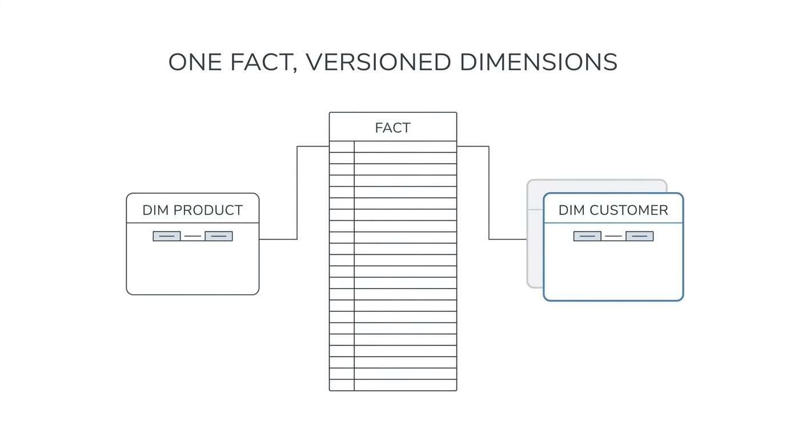
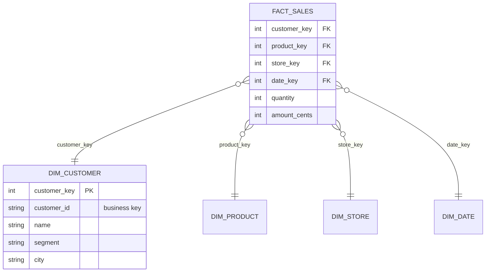

S07-P02 kể câu chuyện *vì sao* star schema thắng. Phần này là chính tay nghề — những quyết định bạn thực sự đưa ra khi biến "chúng tôi muốn phân tích bán hàng" thành các bảng: chọn grain, thiết kế fact và dimension, và xử lý việc thực tại cứ đổi thay bên dưới model. Modeling là kỹ năng đòn bẩy cao nhất của roadmap này: pipeline chuyển dữ liệu, nhưng **model quyết định có ai tin được thứ được chuyển đến hay không**.

## Bạn sẽ học được gì

- Nói được vì sao OLTP chuẩn hoá còn OLAP phi chuẩn hoá — và vì sao trộn hai thứ thừa kế điểm yếu của cả hai.
- Khai báo grain trong một câu và bảo vệ nó như quyết định chủ chốt.
- Thiết kế fact (ba vị, cột additive) và dimension với surrogate key.
- Cài SCD Type 2 và chạy workflow modeling năm bước với câu hỏi stakeholder thật.

**Cần biết trước:** S07-P02 (vì sao star schema thắng) và SQL của Phần 2. Ví dụ là SQL thuần — warehouse nào hay DuckDB đều chạy.

## 1. Hai hình dạng cho hai công việc

Database của app được **chuẩn hoá**: mỗi sự thật sống ở đúng một chỗ, nên cập nhật địa chỉ khách chạm đúng một dòng. Hoàn hảo cho hàng nghìn cú ghi nhỏ (OLTP). Nhưng hỏi nó một câu phân tích là bạn join sáu bảng trước giờ ăn sáng.

Warehouse **phi chuẩn hoá có chủ đích**: chấp nhận dư thừa để câu hỏi trở nên rẻ. Một bảng sự kiện, ngữ cảnh mô tả vây quanh:



Cùng một lượng thông tin, khác mục tiêu tối ưu. Sai lầm cần tránh là model *lai* — chuẩn hoá nửa vời "vì thấy dư thừa phí quá" — thứ thừa kế điểm yếu của cả hai.

## 2. Grain: một quyết định cai trị tất cả

Trước mọi danh sách cột, hãy hoàn thành câu này: **"Một dòng trong fact table này đại diện cho đúng một ___."** Một *dòng hàng* của đơn? Một đơn? Một khách mỗi ngày? Đó là **grain**, và mọi quyết định sau treo lên nó:

- Quá thô (một dòng mỗi đơn) thì "doanh thu theo sản phẩm" thành câu hỏi không trả lời nổi — chi tiết đã mất vĩnh viễn.
- Trộn lẫn (dòng này là line, dòng kia là tổng đơn) thì mọi `SUM` sai trong im lặng — con bug modeling đắt nhất trần đời, vì nó *trông* rất ổn.

Quy tắc bỏ túi: **khai grain mịn nhất mà nguồn chống đỡ được** — bạn luôn aggregate lên được, không bao giờ tách ngược xuống được. Viết câu grain thành comment đầu file model; phiên bản tương lai của bạn sẽ cảm ơn trong một buổi code review.

## 3. Fact: ba vị bạn sẽ gặp thật

- **Transaction fact** — một dòng mỗi sự kiện (một lượt bán, một cú click). Append-only, lớn mãi; là mặc định.
- **Periodic snapshot** — một dòng mỗi thực thể mỗi kỳ (số dư tài khoản theo ngày). Cho các câu hỏi "trạng thái theo thời gian" mà transaction không trả lời rẻ được.
- **Accumulating snapshot** — một dòng mỗi *quy trình*, cập nhật khi nó tiến (một đơn với ngày đặt/gửi/giao). Cho phân tích funnel và lead-time.

Và một kỷ luật trả lãi hằng ngày: giữ cột fact **cộng được** (amount, count — `SUM` an toàn theo mọi chiều). Tỷ lệ và phần trăm không cộng được — lưu tử số và mẫu số, tính tỷ lệ lúc query. Ai pre-compute `avg_margin_pct` vào fact table là kết án tử mọi cú roll-up tương lai của nó.

## 4. Dimension, surrogate key, và vì sao không xài luôn `customer_id`

Dimension chở ngữ cảnh mô tả — và mỗi cái nhận một **surrogate key** (một số nguyên vô nghĩa do warehouse cấp) thay vì join bằng business key. Ba lý do khiến thói quen mấy chục năm tuổi này sống dai:

1. **Business key nói dối**: nguồn tái sử dụng ID, hệ thống sáp nhập va chạm nhau, "cùng một khách" đến với ba cách viết tên.
2. **Tích hợp**: một dimension khách hàng *conformed* với một surrogate key cho phép fact bán hàng và fact ticket hỗ trợ đồng thuận khách đó là ai (data-as-product của S07-P07, ở quy mô bảng).
3. **Lịch sử** — lý do thật, mục kế tiếp.

## 5. SCD Type 2: giữ lịch sử mà không mất trí

Một khách chuyển từ Hà Nội vào Đà Nẵng. Ghi đè city (**Type 1**) là "doanh thu theo thành phố" của năm ngoái tự viết lại chính nó trong im lặng — báo cáo hôm qua hết tái tạo được (S07-P10 xin có ý kiến). **Type 2** thay vào đó đánh phiên bản cho dòng:

| customer_key | customer_id | city | valid_from | valid_to | is_current |
|---|---|---|---|---|---|
| 1017 | C-042 | Hà Nội | 2024-01-01 | 2026-03-15 | false |
| 2214 | C-042 | Đà Nẵng | 2026-03-15 | 9999-12-31 | true |

Fact ghi trước cú chuyển trỏ vào key `1017`; fact sau trỏ `2214`. Báo cáo lịch sử giữ nguyên sự thật *tại thời điểm nó xảy ra*, và cả hai câu hỏi đều trả lời được: "doanh thu theo thành phố *lúc bán*" (join surrogate key, không cần gì đặc biệt) và "thành phố hiện tại của mọi khách trong lịch sử" (join qua business key, lọc `is_current`).

```sql
-- Pattern "as-of" kinh điển khi phải resolve theo ngày:
SELECT f.amount_cents, d.city
FROM fact_sales f
JOIN dim_customer d
  ON d.customer_id = f.customer_id
 AND f.sold_at >= d.valid_from AND f.sold_at < d.valid_to
```

Lời khuyên thật thà: Type 2 tốn độ phức tạp pipeline (tính năng snapshot của dbt tồn tại chính xác cho việc này) — áp nó cho các dimension mà lịch sử *quan trọng với business* (segment khách, địa bàn sales), và dùng Type 1 ghi đè vui vẻ cho các cú sửa typo. Khai báo cột nào Type 1, cột nào Type 2 *chính là* một phần của model.

## 6. Workflow modeling sống sót khi va chạm stakeholder

1. **Gom câu hỏi thật**, không phải điều ước về bảng: "doanh thu theo sản phẩm theo vùng, hằng tháng" — mười câu như thế thắng mọi tài liệu yêu cầu.
2. **Gạch chân danh từ** → ứng viên dimension; **gạch chân động từ/con số** → ứng viên fact.
3. **Khai grain** cho từng fact, thành tiếng, thành văn bản.
4. **Phác cái star**, và kiểm tra mọi câu hỏi đã gom đều trả lời được bằng `metric theo dimension, lọc theo dimension` trên nó.
5. **Quyết chính sách SCD theo từng cột dimension** — đây là cuộc trò chuyện *business* ("segment cũ có quan trọng không?"), không phải kỹ thuật.

Hai mươi phút việc này trước khi viết SQL đều đặn tiết kiệm nhiều tuần remodel về sau.

## Thực hành (30 phút — DuckDB hoặc engine SQL bất kỳ)

Cảm nhận bộ máy SCD Type 2 với năm dòng:

```sql
CREATE TABLE dim_customer AS
SELECT * FROM (VALUES
  (1017, 'C-042', 'Hanoi',   DATE '2024-01-01', DATE '2026-03-15', false),
  (2214, 'C-042', 'Da Nang', DATE '2026-03-15', DATE '9999-12-31', true)
) t(customer_key, customer_id, city, valid_from, valid_to, is_current);

CREATE TABLE fact_sales AS
SELECT * FROM (VALUES
  ('C-042', DATE '2025-06-01', 100),   -- bán khi còn ở Hà Nội
  ('C-042', DATE '2026-05-01', 250)    -- bán sau khi chuyển
) t(customer_id, sold_at, amount_cents);

-- 1. Doanh thu theo thành phố TẠI THỜI ĐIỂM bán (join as-of):
SELECT d.city, SUM(f.amount_cents)
FROM fact_sales f JOIN dim_customer d
  ON d.customer_id = f.customer_id
 AND f.sold_at >= d.valid_from AND f.sold_at < d.valid_to
GROUP BY d.city;

-- 2. Toàn bộ doanh thu quy về thành phố HIỆN TẠI của khách:
SELECT d.city, SUM(f.amount_cents)
FROM fact_sales f JOIN dim_customer d
  ON d.customer_id = f.customer_id AND d.is_current
GROUP BY d.city;

-- 3. Phá thử: join business-key trần (không lọc ngày) trả về gì?
SELECT count(*) FROM fact_sales f JOIN dim_customer d ON d.customer_id = f.customer_id;
```

Rồi trên giấy: lấy ba câu hỏi thật từ công việc của bạn, chạy workflow bước 1–4 (danh từ → dimension, động từ → fact, câu grain, phác ngôi sao), và kiểm mỗi câu đọc được thành *metric theo dimension*.

Kết quả mong đợi: query 1 chia doanh thu 100/Hà Nội, 250/Đà Nẵng — lịch sử được giữ; query 2 dồn cả 350 về Đà Nẵng — cả hai đáp án đều đúng *cho hai câu hỏi khác nhau*, chính là mục đích của Type 2. Query 3 trả 4 dòng từ 2 fact — cái bẫy đếm-đôi mà bộ lọc ngày (hoặc surrogate key) sinh ra để chặn.

## Tự kiểm tra

1. Một fact table trộn dòng order-line với dòng order-total. Triệu chứng gì xuất hiện, và vì sao đây là loại bug modeling đắt nhất?
2. Vì sao lưu `amount_cents` và `quantity` nhưng không bao giờ lưu `avg_margin_pct` trong fact table?
3. Marketing hỏi "doanh thu theo segment khách" — nhưng segment vừa xáo lại quý trước. `dim_customer` phải thoả điều gì để cả đáp án lịch-sử lẫn đáp án góc-nhìn-hiện-tại cùng tồn tại?

<details><summary>Xem đáp án</summary>

1. Mọi `SUM` lặng lẽ đếm đôi (số tiền dòng cộng luôn tổng của chính chúng) trong khi trông hoàn toàn hợp lý — không lỗi, không NULL, chỉ có con số sai lọt qua review. Grain trộn phá vỡ bản hợp đồng duy nhất mà mọi phép gộp dựa vào.
2. Số tiền và số lượng là additive — SUM an toàn trên mọi lát cắt. Ratio tính sẵn không gộp được (trung bình của các trung bình không phải trung bình); lưu tử số và mẫu số, tính ratio lúc query.
3. Segment phải là cột SCD Type 2: các dòng theo phiên bản với ngày hiệu lực và surrogate key. Khi đó "doanh thu theo segment tại thời điểm bán" join theo surrogate key/as-of, còn "doanh thu theo segment hiện tại" join qua business key lọc `is_current` — cùng từ một dimension.

</details>

## Điều cần nhớ

- OLTP chuẩn hoá để cú ghi chạm một chỗ; OLAP phi chuẩn hoá để câu hỏi chạm ít join — trộn hai thứ là thừa kế điểm yếu của cả hai.
- Grain là quyết định chúa tể: mịn nhất mà nguồn chống đỡ được, khai thành một câu, một grain mỗi fact table.
- Lưu số cộng được; giữ surrogate key vì business key nói dối và lịch sử cần chúng.
- SCD Type 2 khiến báo cáo hôm qua tái tạo được — áp nơi lịch sử quan trọng, Type 1 nơi không, và viết chính sách ra giấy.

*Tiếp theo — Phần 5: Data warehouse & kiến trúc medallion.*
