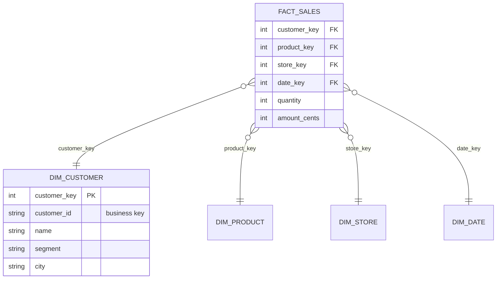

S07-P02 told the story of *why* the star schema won. This part is the craft itself — the decisions you actually make when turning "we want to analyze sales" into tables: choosing a grain, designing facts and dimensions, and handling the fact that reality keeps changing under your model. Modeling is the highest-leverage skill in this roadmap: pipelines move data, but the **model decides whether anyone can trust what arrives**.

## Two shapes for two jobs

The app's database is **normalized**: every fact lives in exactly one place, so a customer's address update touches one row. Perfect for thousands of small writes (OLTP). Ask it an analytical question, though, and you're joining six tables before breakfast.

The warehouse **denormalizes on purpose**: redundancy is accepted to make questions cheap. One events table, descriptive context around it:



Same information, different optimization target. The mistake to avoid is the *mixed* model — half-normalized "because it feels wasteful" — which inherits the weaknesses of both.

## Grain: the one decision that rules them all

Before any column list, finish this sentence: **"One row in this fact table represents exactly one ___."** One order *line*? One order? One customer per day? That's the **grain**, and every later decision hangs on it:

- Too coarse (one row per order) and "revenue by product" is unanswerable — the detail is gone forever.
- Mixed (some rows are lines, some are order totals) and every `SUM` is silently wrong — the most expensive modeling bug there is, because it *looks* fine.

Rule of thumb: **declare the finest grain the source can support** — you can always aggregate up, never disaggregate down. Write the grain sentence as a comment at the top of the model file; future-you will thank present-you in a code review.

## Facts: three flavors you'll actually meet

- **Transaction facts** — one row per event (a sale, a click). Append-only, grows forever; the default.
- **Periodic snapshots** — one row per entity per period (account balance per day). For "state over time" questions transactions can't answer cheaply.
- **Accumulating snapshots** — one row per *process*, updated as it moves (an order with placed/shipped/delivered dates). For funnel and lead-time analysis.

And one discipline that pays daily: keep fact columns **additive** where possible (amounts, counts — safe to `SUM` across anything). Ratios and percentages don't add — store numerator and denominator, compute the ratio at query time. Whoever pre-computes `avg_margin_pct` into a fact table dooms every future roll-up of it.

## Dimensions, surrogate keys, and why not just use `customer_id`

Dimensions carry the descriptive context — and each gets a **surrogate key** (a meaningless integer the warehouse assigns) instead of joining on the business key. Three reasons this decades-old habit survives:

1. **Business keys lie**: sources recycle IDs, merge systems collide, "the same customer" arrives with three spellings.
2. **Integration**: a *conformed* customer dimension with one surrogate key lets sales facts and support-ticket facts agree on who the customer is (S07-P07's data-as-product, at table scale).
3. **History** — the real reason, next section.

## SCD Type 2: keeping history without losing your mind

A customer moves from Hanoi to Da Nang. Overwrite the city (**Type 1**) and last year's "revenue by city" silently rewrites itself — yesterday's report is no longer reproducible (S07-P10 would like a word). **Type 2** versions the row instead:

| customer_key | customer_id | city | valid_from | valid_to | is_current |
|---|---|---|---|---|---|
| 1017 | C-042 | Hanoi | 2024-01-01 | 2026-03-15 | false |
| 2214 | C-042 | Da Nang | 2026-03-15 | 9999-12-31 | true |

Facts recorded before the move point at key `1017`; facts after point at `2214`. Historical reports stay true *as of when they happened*, and both questions become answerable: "revenue by city *at time of sale*" (join on surrogate key, nothing special) and "current city of every historical customer" (join through the business key filtered to `is_current`).

```sql
-- The classic "as-of" pattern when you must resolve by date:
SELECT f.amount_cents, d.city
FROM fact_sales f
JOIN dim_customer d
  ON d.customer_id = f.customer_id
 AND f.sold_at >= d.valid_from AND f.sold_at < d.valid_to
```

The honest advice: Type 2 costs pipeline complexity (dbt's snapshot feature exists for exactly this) — apply it to dimensions where history *matters to the business* (customer segment, sales territory), and use cheerful Type 1 overwrites for typo fixes. Declaring which columns are Type 1 vs Type 2 *is* part of the model.

## A modeling workflow that survives contact with stakeholders

1. **Collect real questions**, not table wishes: "revenue by product by region, monthly" — ten of these beat any requirements doc.
2. **Underline the nouns** → dimension candidates; **underline the verbs/numbers** → fact candidates.
3. **Declare the grain** per fact, out loud, in writing.
4. **Sketch the star**, and check every collected question can be answered by `metric by dimension, filtered by dimension` against it.
5. **Decide SCD policy per dimension column** — this is a *business* conversation ("does old segment matter?"), not a technical one.

Twenty minutes of this before writing SQL routinely saves weeks of remodeling after.

## Key takeaways

- OLTP normalizes so writes touch one place; OLAP denormalizes so questions touch few joins — mixing the two inherits both weaknesses.
- Grain is the master decision: finest supportable grain, declared in a sentence, one grain per fact table.
- Store additive numbers; keep surrogate keys because business keys lie and history needs them.
- SCD Type 2 makes yesterday's reports reproducible — apply it where history matters, Type 1 where it doesn't, and write the policy down.

*Next up — Part 5: Data Warehouse & the Medallion Architecture.*
