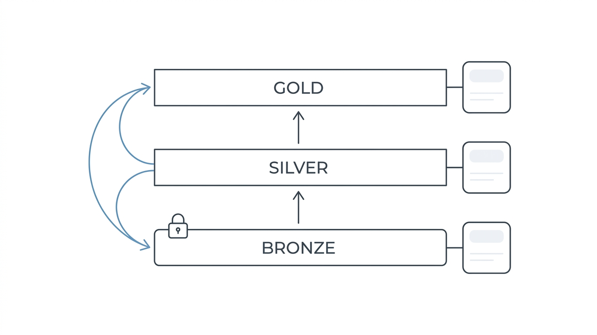

Phần 4 trao cho bạn star schema. Phần này là nơi một data engineer thực thụ sinh sống: **thật sự xây các lớp** — mỗi lớp hứa gì, code gì chạy giữa chúng, và các convention giữ cho một warehouse 40 model còn điều hướng được thay vì thành di chỉ khảo cổ. Ta sẽ dắt một dataset (orders, dĩ nhiên) đi trọn con đường.

## Bạn sẽ học được gì

- Nói được mỗi lớp medallion đảm bảo điều gì, và quyết định một bảng mới thuộc lớp nào.
- Đáp dữ liệu vào bronze kèm metadata và partition khiến việc chạy lại an toàn.
- Chạy bốn nước đi kinh điển của silver đúng thứ tự: cast, dedup, conform, cổng chất lượng.
- Viết incremental model mà không dính hai con bug nó mời gọi (dữ liệu muộn và drift).

**Cần biết trước:** Phần 4 (grain, star schema, SCD Type 2). Window function của Phần 2 xuất hiện ở bước dedup.

## 1. Lớp là hợp đồng, không phải folder

Tên gọi medallion không quan trọng bằng thứ mỗi lớp *đảm bảo* với người đọc nó:

| Lớp | Hợp đồng | Rebuild? | Ai đọc |
|---|---|---|---|
| **Bronze** | Chính xác thứ đã đến, lúc nó đến — kèm metadata của lượt load | **Không bao giờ** — nó là bằng chứng | Chỉ pipeline & người debug |
| **Silver** | Đã ép kiểu, đã dedup, một dòng mang một nghĩa; entity đã conform | Bất cứ lúc nào, từ bronze | DE + analyst cứng |
| **Gold** | Định nghĩa business đã áp; star schema & metric (tay nghề S02-P04 sống ở đây) | Bất cứ lúc nào, từ silver | BI, ML, tất cả |

Hai hệ quả rút ra từ việc nghĩ "hợp đồng" thay vì "folder".

Một, bảng thuộc lớp nào được quyết bởi *lời đảm bảo của nó*, không phải bởi phép biến đổi nào sinh ra nó.

Hai, **cột rebuild chính là toàn bộ kế hoạch disaster-recovery.** Bronze bất biến cộng mọi thứ khác dẫn xuất nghĩa là con bug pipeline tệ nhất chỉ tốn của bạn một lần chạy lại, không tốn dữ liệu.

## 2. Bronze: đáp thô, đóng dấu kỹ

Toàn bộ kỹ năng của bronze là sự kiềm chế — cộng metadata:

```sql
-- bronze.orders_raw : các cột Y NHƯ LÚC ĐẾN (toàn string cũng được), cộng thêm:
_loaded_at        timestamp,   -- ingest lúc nào
_source_file      text,        -- đến từ đâu
_batch_id         text         -- lượt chạy nào sở hữu (key ghi đè idempotent)
```

Không đổi tên, không sửa kiểu, không "dọn nhẹ". Mỗi cú sửa bạn áp vào bronze là một mẩu bằng chứng bị tiêu huỷ — khi một con số ở silver trông sai, bronze là cách bạn biết source nói dối hay transform của mình nói dối.

Quyết định cấu trúc duy nhất quan trọng ở đây là **partitioning** (chia bảng theo giá trị một cột, ở mức vật lý). Tổ chức theo ngày load, để một lượt chạy sở hữu "một ngày" ghi đè đúng lát cắt của nó, và query quét "tuần trước" chạm 7 partition thay vì 7 năm. Một quyết định mua được cả idempotency, tốc độ, lẫn khống chế chi phí.

## 3. Silver: nơi niềm tin được sản xuất

Silver là lớp nhiều code thật nhất. Các nước đi lặp lại, theo thứ tự kinh điển:

1. **Cast & rename** — string thành kiểu (`amount_cents int`, không phải float — luật tiền bạc), `cryptic_col_7` của source thành `order_status`.
2. **Dedup** — pattern window của Phần 2 (`ROW_NUMBER() OVER (PARTITION BY order_id ORDER BY _loaded_at DESC)`), giữ phiên bản mới nhất của mỗi business key. Có change-data-capture feed thì bước này hết là tuỳ chọn: cùng một đơn *chắc chắn sẽ* đến năm lần.
3. **Conform entity** — customer và product nhận surrogate key và chế độ SCD tại đây, để mọi fact hạ nguồn đồng thuận ai là ai.
4. **Cổng chất lượng** — các check nhàm chán page bạn *trước khi* CEO page: key not-null, status nằm trong tập cho phép, số dòng trong khoảng kỳ vọng.

Naming convention scale được: `stg_<source>__<entity>` cho staging hình-source, `int_<động từ>_<entity>` cho intermediate tái dùng. Mỗi file model mở đầu bằng câu grain của nó — thói quen Phần 4, enforce bằng áp lực xã hội trong review.

## 4. Gold: business logic có đúng một mái nhà

Gold là star schema cộng **định nghĩa metric** — và một luật có răng: **một quy tắc business được định nghĩa một lần, ở gold, không bao giờ ở dashboard**. Cái ngày "doanh thu" bị tính hơi khác nhau ở ba BI tool là cái ngày platform thua cuộc chiến niềm tin, bất kể pipeline tốt cỡ nào. Stack hiện đại đẩy ý này vào semantic layer, nhưng kỷ luật vẫn vậy: một định nghĩa, một owner, mọi nơi tham chiếu.

```sql
-- gold.fct_orders : grain = một dòng hàng của đơn
SELECT
    o.order_line_id,
    c.customer_key,           -- surrogate, resolve SCD2 theo thời điểm bán (P04)
    d.date_key,
    o.quantity,
    o.amount_cents,
    o.amount_cents - o.cost_cents AS margin_cents   -- định nghĩa TẠI ĐÂY, chỉ tại đây
FROM silver.orders o
JOIN gold.dim_customer c ON ...
```

## 5. Incremental, nói thật

Rebuild-toàn-bộ-mỗi-đêm bị đánh giá thấp — nó tự lành và đơn giản; cứ chạy chừng nào con số còn cho phép. Khi bảng lớn vượt ngưỡng, **incremental model** chỉ xử lý lát cắt mới:

```sql
-- incremental kiểu dbt: chỉ xử lý phần mới đến
{{ config(materialized='incremental', unique_key='order_line_id') }}
SELECT ... FROM {{ ref('stg_shop__orders') }}

WHERE _loaded_at > (SELECT max(_loaded_at) FROM {{ this }})

```

Hai chi phí thật đi kèm.

**Dữ liệu đến muộn:** một đơn đáp trễ ba ngày sẽ lọt lưới cái `WHERE` ngây thơ. Cách sửa chuẩn là *lookback* — mỗi lượt chạy xử lý lại N ngày đuôi, một cách idempotent.

**Drift:** trạng thái incremental có thể lặng lẽ lệch khỏi thứ một cú full rebuild sẽ tạo ra. Xếp lịch full refresh định kỳ làm dây bẫy.

Incremental là tối ưu hiệu năng *đặt trên* một thiết kế full-rebuild idempotent — không bao giờ là thứ thay thế nó.

## 6. Dataset orders, đầu-cuối

`bronze.orders_raw` (y-như-đến, partition theo ngày load) → `stg_shop__orders` (ép kiểu, dedup, qua cổng chất lượng) → join `dim_customer` và `dim_product` (SCD2) → `fct_orders` (một dòng mỗi line, measure cộng được, margin định nghĩa một lần) → BI chỉ đọc gold.

Mỗi mũi tên là một job chạy-lại-được sở hữu một lát cắt có ngày. Mỗi bảng khai grain của nó. Cái DAG xếp thứ tự các mũi tên này chính xác là thứ Phần 8 sẽ lập lịch.



## Thực hành (25 phút — dựng cả ba lớp bằng DuckDB, ngay trên máy)

Không cần tài khoản warehouse. Bạn sẽ tạo các lớp, cố tình phá một lớp, và xem hợp đồng rebuild cứu bạn:

```sql
-- duckdb medallion.db
-- 1. BRONZE: y như lúc đến, cộng metadata load. Để ý đơn 1002 bị trùng.
CREATE TABLE bronze_orders_raw AS
SELECT * FROM (VALUES
  ('1001','C1','120.00','2026-03-01','shipped', DATE '2026-03-01'),
  ('1002','C2','80.00', '2026-03-01','pending', DATE '2026-03-01'),
  ('1002','C2','80.00', '2026-03-01','shipped', DATE '2026-03-02'),  -- cùng đơn, sự thật muộn hơn
  ('1003','C1','45.50', '2026-03-02','shipped', DATE '2026-03-02')
) AS t(order_id, customer_id, amount, order_date, status, _loaded_at);

SELECT count(*) FROM bronze_orders_raw;          -- 4 dòng: bằng chứng, kể cả bản trùng

-- 2. SILVER: cast → dedup → cổng chất lượng
CREATE TABLE silver_orders AS
SELECT order_id, customer_id,
       CAST(amount AS DECIMAL(10,2)) AS amount,   -- đã ép kiểu, không còn string
       CAST(order_date AS DATE)      AS order_date,
       status, _loaded_at
FROM (SELECT *, ROW_NUMBER() OVER (PARTITION BY order_id ORDER BY _loaded_at DESC) AS rn
      FROM bronze_orders_raw) WHERE rn = 1;       -- giữ bản mới nhất mỗi key

SELECT count(*) FROM silver_orders;               -- 3 dòng: một dòng mang một nghĩa
SELECT status FROM silver_orders WHERE order_id = '1002';   -- shipped, không phải pending

-- cổng chất lượng: câu này phải trả về 0 dòng, nếu không pipeline phải fail
SELECT * FROM silver_orders WHERE order_id IS NULL OR amount < 0;

-- 3. GOLD: định nghĩa business, viết đúng một lần
CREATE TABLE gold_daily_revenue AS
SELECT order_date, sum(amount) AS revenue, count(*) AS orders
FROM silver_orders WHERE status = 'shipped'       -- "doanh thu" nghĩa là đã ship. Ở đây. Chỉ ở đây.
GROUP BY order_date ORDER BY order_date;
SELECT * FROM gold_daily_revenue;

-- 4. Hợp đồng rebuild: xoá sạch các lớp dẫn xuất, dựng lại từ bằng chứng
DROP TABLE gold_daily_revenue; DROP TABLE silver_orders;
-- …rồi chạy lại bước 2 và 3 y nguyên. Cùng con số, không mất dữ liệu.
```

Kết quả mong đợi: bronze giữ 4 dòng còn silver giữ 3 — cái window dedup chính là thứ biến "mọi thứ đã đến" thành "một dòng mang một nghĩa", và đơn 1002 hiện `shipped` vì lượt load muộn hơn thắng. Doanh thu ở gold chỉ đếm đơn đã ship, và mệnh đề `WHERE` đó chính là toàn bộ định nghĩa business sống ở đúng một chỗ. Rồi việc drop silver và gold chẳng tốn gì ngoài một lần chạy lại: đó là cột rebuild của bảng hợp đồng, được chứng minh chứ không phải được tuyên bố.

## Tự kiểm tra

1. Đồng nghiệp sửa một mã quốc gia viết sai ngay lúc load vào bronze. Vì sao đây là vấn đề, và cú sửa đó thuộc về đâu?
2. Incremental model của bạn dùng `WHERE _loaded_at > (SELECT max(_loaded_at) FROM this)`. Nó mời gọi hai chế độ hỏng nào, và cách giảm thiểu chuẩn cho từng cái là gì?
3. Dashboard của marketing hiện doanh thu khác của finance. Cả hai đều query warehouse. Sai ở đâu về mặt kiến trúc?

<details><summary>Xem đáp án</summary>

1. Nó tiêu huỷ bằng chứng. Khi một con số ở gold sau này trông sai, bronze là cách duy nhất để biết source gửi dữ liệu hỏng hay một transform làm hỏng nó — và một cú sửa "có thiện chí" ở bronze khiến câu hỏi đó không còn trả lời được. Cú sửa thuộc về silver, nơi làm sạch là nhiệm vụ đã khai báo của lớp.
2. Dữ liệu đến muộn (dòng đáp sau khi watermark đã vượt qua timestamp của nó sẽ không bao giờ được lấy — giảm thiểu bằng lookback xử lý lại N ngày đuôi một cách idempotent), và drift (trạng thái incremental lệch dần khỏi thứ full rebuild tạo ra — giảm thiểu bằng full refresh định kỳ làm dây bẫy).
3. Một quy tắc business được định nghĩa bên ngoài gold. Mỗi BI tool tự cài "doanh thu" theo cách riêng, nên platform có hai đáp án và không có chủ. Cách sửa là một định nghĩa ở gold (hoặc semantic layer), cả hai dashboard cùng tham chiếu.

</details>

## Điều cần nhớ

- Lớp là hợp đồng: bronze = bằng chứng (không bao giờ rebuild), silver = nhà máy sản xuất niềm tin, gold = định nghĩa business với đúng một mái nhà.
- Partition bronze theo ngày load — nó đồng thời là key idempotency, máy tăng tốc query, và van khống chế chi phí.
- Kinh điển của silver: cast → dedup (pattern window) → conform (SCD) → cổng chất lượng; đặt tên model sao cho nhìn tên thấy lớp.
- Incremental là tối ưu trên nền thiết kế full-rebuild idempotent — kèm lookback cho dữ liệu muộn và full refresh định kỳ làm dây bẫy drift.

*Tiếp theo — Phần 6: ETL vs ELT: xây batch pipeline đáng tin.*
