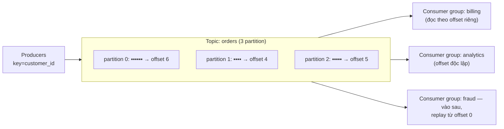

S04-P09 đưa bạn queue: message tới, một consumer xử lý, nó biến mất. Kafka nhìn từ xa thì giống, lại gần là một con thú khác hẳn về căn bản: **Kafka là một cái log, không phải queue.** Message không bị xoá khi được tiêu thụ — chúng được append vào một log bền vững, có thứ tự, và nằm đó hết cửa sổ retention; consumer chỉ việc nhớ *mình đã đọc tới đâu*. Một lựa chọn thiết kế đó là lý do Kafka nuôi được năm consumer độc lập từ cùng một stream, replay lịch sử sau một cú bug, và làm xương sống cho các pipeline CDC của S07-P06 — và là lý do failure mode của nó khác hẳn SQS. Phần này là cơ khí; xử lý kiểu Flink bên trên sẽ tới ở P11.

## Bạn sẽ học được gì

- Giải thích vì sao log không phải queue, và điều đó mua được gì cho bạn lúc 3 giờ sáng.
- Dùng partition có chủ đích: key, đảm bảo thứ tự, và trần song song.
- Đọc consumer lag như metric duy nhất báo trước rắc rối.
- Nói chính xác "exactly-once" bắt đầu ở đâu và dừng ở đâu.

**Cần biết trước:** Phần 6 (at-least-once và load idempotent) và Phần 5 (partition).

## 1. Cái log, và vì sao "không phải queue" quan trọng



Vì tiêu thụ không phá huỷ, ba thứ queue không làm nổi trở thành chuyện vặt: **fan-out không cần hạ tầng fan-out** (mỗi consumer group nhận trọn stream theo nhịp riêng — pattern SNS+SQS, nhưng cài sẵn trong mô hình lưu trữ); **replay** (bug ship hôm thứ Ba? Reset offset về thứ Hai và xử lý lại — bản năng backfill của S02-P06, phiên bản streaming); và **consumer mới đọc dữ liệu cũ** (team fraud tới sau một năm và đọc được lịch sử). Cái giá: *bạn* quản lý vị trí (offset), và retention là một quyết định thiết kế thật — theo thời gian cho event stream, hoặc **log compaction** (giữ bản ghi mới nhất theo từng key) cho topic dạng changelog, đúng hình dạng mà CDC muốn.

## 2. Partition: đơn vị của mọi thứ

Một topic được cắt thành các **partition**, và partition là đơn vị của *thứ tự*, *song song*, và *scale* cùng một lúc:

- **Thứ tự chỉ tồn tại bên trong một partition.** Producer định tuyến theo **key** của message (cùng key → cùng partition → thứ tự nghiêm ngặt). Chọn key bằng câu hỏi "cái gì buộc phải giữ thứ tự?" — thường là một entity: `customer_id`, `order_id`. Đây là "state machine theo entity thắng thứ tự toàn cục" của S04-P09, hiện hình vật lý.
- **Song song bị chặn trần bởi số partition**: một consumer group dùng tối đa một consumer mỗi partition. Sáu partition = tối đa sáu worker. Hãy hoạch định số partition có dư địa (về sau đổi cho tử tế rất đau, vì rekey chuyển entity giữa các partition và phá lịch sử thứ tự).
- **Key nóng tạo partition nóng** — một khách hàng khổng lồ có thể ghim một partition ở 100% trong khi số còn lại ngồi chơi (bài học skew của S02-P07 mặc áo streaming). Nhìn throughput theo từng partition, đừng chỉ nhìn tổng.

## 3. Consumer group và lag: trái tim vận hành

Một **consumer group** là một đội cùng đọc một topic: partition được chia cho các thành viên, và khi có thành viên vào hoặc chết, một cú **rebalance** chia lại (khựng ngắn — cơ chế đứng sau hiện tượng "consumer đứng hình vài giây"). Metric quan trọng — thứ *duy nhất* cần alarm trước tiên — là **consumer lag**: mỗi group đang tụt sau đầu log bao xa. Lag là "tuổi của message cũ nhất" của S04-P09 với tooling tốt hơn: lag tăng dần nghĩa là consumer của bạn quá chậm, quá ít (tới trần partition), hoặc đang crash-loop. Lag phẳng-nhưng-khác-không thì ổn; lag tăng đơn điệu là một sự cố đang diễn ra.

## 4. Delivery semantics: "exactly-once" sống ở đâu

Vòng lặp consumer là: đọc message → xử lý → **commit offset**. Thứ tự của hai bước cuối *chính là* delivery semantics của bạn:

- Commit **sau** khi xử lý → **at-least-once**: crash giữa hai bước và bạn sẽ xử lý lại. Mặc định, và là mặc định đúng — đi kèm consumer idempotent (lần lặp thứ ba của luật sắt giáo trình: S02-P06, S02-P08, S04-P09).
- Commit **trước** khi xử lý → **at-most-once**: crash và message bị bỏ qua vĩnh viễn. Gần như không bao giờ là thứ một data pipeline muốn.
- **"Exactly-once"** — phiên bản thật thà: Kafka cung cấp idempotent producer (retry không nhân đôi *bản ghi vào log*) và transaction (consume-process-produce nguyên tử, bên trong hệ sinh thái Kafka). Khoảnh khắc consumer của bạn chạm vào hệ thống *bên ngoài* — một warehouse, một API — bạn quay lại at-least-once + idempotency: upsert theo key, hoặc ghi offset *cùng* dữ liệu trong cùng một transaction. Exactly-once là thuộc tính bạn *xây đầu-cuối*, không phải một checkbox để bật.

## 5. Kafka hợp chỗ nào (và không hợp chỗ nào)

Với lấy cái log khi: nhiều consumer cần cùng một dòng event (xương sống outbox/CDC của S07-P06), replay quan trọng, thứ tự theo entity quan trọng, hoặc throughput thật sự cao. Ở lại với queue họ SQS (S04-P09) cho phân phối task đơn giản — queue *ít* thứ phải vận hành hơn, và "biết đâu sau này cần replay" chính là abstraction suy đoán của S01-P10 trong hình hài hạ tầng. Và nhớ cú bắt tay lakehouse từ P09: consumer streaming ghi vào bảng phải gom commit theo lô, không thì bạn đang vận hành một nhà máy small-files. Về vận hành, managed Kafka (tầng MSK/Confluent) lại là lập luận scheduler của S02-P08: cái log là hạ tầng production, và tự chạy broker là công việc nên từ chối cho tới khi scale ép mở cuộc nói chuyện.

## Thực hành (30 phút — replay một topic, rồi cố tình tạo skew)

Một container Docker là bạn có broker chạy được. Hai thứ đáng cảm nhận là *replay* (queue không làm được) và *skew* (kiểu hỏng không ai cảnh báo trước).

```bash
docker run -d --name kafka -p 9092:9092 apache/kafka:latest

# 1. Một topic 3 partition
docker exec kafka /opt/kafka/bin/kafka-topics.sh --bootstrap-server localhost:9092 \
  --create --topic orders --partitions 3

# 2. Produce KÈM KEY — key quyết định partition, và do đó quyết định nhóm thứ tự
docker exec -i kafka /opt/kafka/bin/kafka-console-producer.sh --bootstrap-server localhost:9092 \
  --topic orders --property parse.key=true --property key.separator=: <<'EOF'
C1:order 1 placed
C2:order 2 placed
C1:order 1 shipped
C3:order 3 placed
C1:order 1 delivered
EOF

# 3. Đọc TỪ ĐẦU — các message vẫn còn nguyên, không gì bị tiêu huỷ
docker exec kafka /opt/kafka/bin/kafka-console-consumer.sh --bootstrap-server localhost:9092 \
  --topic orders --from-beginning --property print.key=true --timeout-ms 5000

# 4. REPLAY: một consumer group hoàn toàn mới đọc lại chính lịch sử đó từ số không
docker exec kafka /opt/kafka/bin/kafka-console-consumer.sh --bootstrap-server localhost:9092 \
  --topic orders --group analytics --from-beginning --timeout-ms 5000
docker exec kafka /opt/kafka/bin/kafka-console-consumer.sh --bootstrap-server localhost:9092 \
  --topic orders --group ml-features --from-beginning --timeout-ms 5000   # cùng dữ liệu, lần nữa

# 5. Lag mới là metric đáng giá — xem theo từng partition
docker exec kafka /opt/kafka/bin/kafka-consumer-groups.sh --bootstrap-server localhost:9092 \
  --describe --group analytics

# 6. SKEW có chủ đích: gửi tất cả dưới một key và xem một partition ôm trọn
for i in $(seq 1 200); do echo "HOT:event $i"; done | \
  docker exec -i kafka /opt/kafka/bin/kafka-console-producer.sh --bootstrap-server localhost:9092 \
  --topic orders --property parse.key=true --property key.separator=:
docker exec kafka /opt/kafka/bin/kafka-run-class.sh kafka.tools.GetOffsetShell \
  --bootstrap-server localhost:9092 --topic orders     # một partition vượt xa các partition kia

docker rm -f kafka
```

Kết quả mong đợi: bước 3 và 4 mới là điểm mấu chốt — hai consumer group khác nhau đọc *cùng* các message một cách độc lập, và việc đọc không tiêu thụ mất gì. Đó là tính chất mà một cái queue không thể cho bạn, và là lý do một team mới có thể bắt đầu tiêu thụ các event của tháng trước mà không phải nhờ ai gửi lại. Bước 6 làm skew hiện hình: cả 200 message dưới một key rơi vào đúng một partition, nên một consumer làm hết việc bất kể bạn chạy bao nhiêu con. Số partition là trần song song của bạn, và một key nóng hạ trần đó xuống còn một.

## Tự kiểm tra

1. Team bạn muốn thêm một pipeline machine learning cần 30 ngày event đơn hàng gần nhất. Các event đó vốn đã chảy qua Kafka vào warehouse. Bạn nói gì với họ?
2. Bạn có 12 partition và 20 consumer trong một group. Bao nhiêu con đang làm việc?
3. Consumer lag ở một partition leo đều trong khi các partition khác ở mức không. Nguyên nhân khả dĩ là gì?

<details><summary>Xem đáp án</summary>

1. Họ có được nó mà không ai phải đổi phía producer: tạo một consumer group mới rồi đọc từ đầu vùng retention. Việc tiêu thụ không phá huỷ, nên pipeline warehouse hiện tại không bị ảnh hưởng và không đọc khác đi chút nào. Câu hỏi thật duy nhất là retention có phủ nổi 30 ngày không — nếu không, đó là một thiết lập retention, không phải một thay đổi kiến trúc.
2. Mười hai. Một partition được giao cho đúng một consumer trong một group, nên tám con thừa ngồi không như dự phòng nóng. Partition là trần song song — muốn dùng 20 consumer thì cần ít nhất 20 partition, quyết định lúc tạo topic (và tăng về sau sẽ đổi ánh xạ key-sang-partition, nên hãy tính trước).
3. Một key nóng: một key nhận phần message lớn bất thường, và vì key quyết định partition nên một consumer làm hết việc. Sửa bằng cách đổi key sang thứ có lực lượng cao hơn, thêm salt để rải key nóng ra nhiều partition, hoặc xử lý riêng key đó trên một đường khác nếu nó thật sự là một thực thể lưu lượng lớn.

</details>

## Điều cần nhớ

- Kafka là log bền vững, không phải queue: tiêu thụ không xoá, nên fan-out, replay, và consumer tới muộn là bản năng — đổi lại offset và retention thành trách nhiệm của bạn.
- Partition là đơn vị của thứ tự, song song, và scale: key theo entity buộc phải giữ thứ tự, worker chặn trần ở số partition, và canh chừng key nóng.
- Alarm trên consumer lag trước mọi thứ khác; chấp nhận khựng ngắn lúc rebalance.
- Semantics do thời điểm commit offset quyết định: mặc định at-least-once + consumer idempotent, và coi exactly-once là thuộc tính đầu-cuối dừng lại ở biên giới Kafka.

*Tiếp theo — Phần 11: Stream processing: Flink và bạn bè.*
