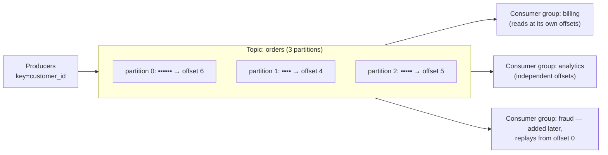

S04-P09 gave you queues: a message arrives, one consumer processes it, it's gone. Kafka looks similar from a distance and is a fundamentally different animal up close: **Kafka is a log, not a queue.** Messages aren't deleted on consumption — they're appended to an ordered, durable log and stay for the retention window; consumers just remember *how far they've read*. That one design choice is why Kafka can feed five independent consumers from the same stream, replay history after a bug, and back the CDC pipelines of S07-P06 — and why its failure modes are different from SQS's. This part is the mechanics; Flink-style processing on top comes in P11.

## What you'll learn

- Explain why a log is not a queue, and what that buys you at 3 a.m.
- Use partitions deliberately: keys, ordering guarantees, and the parallelism ceiling.
- Read consumer lag as the one metric that predicts trouble.
- Say precisely where "exactly-once" starts and where it stops.

**Prerequisites:** Part 6 (at-least-once and idempotent loads) and Part 5 (partitions).

## 1. The log, and why "not a queue" matters



Because consuming doesn't destroy, three things queues can't do become trivial: **fan-out without fan-out infrastructure** (each consumer group gets the full stream at its own pace — the SNS+SQS pattern, built into the storage model); **replay** (bug shipped Tuesday? Reset offsets to Monday and reprocess — S02-P06's backfill instinct, streaming edition); and **new consumers of old data** (the fraud team arrives a year later and reads history). The cost: *you* manage position (offsets), and retention is a real design decision — time-based for event streams, or **log compaction** (keep the latest record per key) for changelog topics, which is exactly the shape CDC wants.

## 2. Partitions: the unit of everything

A topic is split into **partitions**, and the partition is the unit of *ordering*, *parallelism*, and *scaling* all at once:

- **Ordering exists only within a partition.** The producer routes by message **key** (same key → same partition → strict order). Choose the key by asking "what must stay in order?" — usually an entity: `customer_id`, `order_id`. This is S04-P09's "per-entity state machines beat global order," made physical.
- **Parallelism is capped by partition count**: a consumer group can use at most one consumer per partition. Six partitions = at most six workers. Plan partition counts with headroom (they're painful to change well later, because rekeying moves entities between partitions and breaks order history).
- **Hot keys make hot partitions** — one huge customer can pin a partition at 100% while others idle (S02-P07's skew lesson wearing streaming clothes). Watch per-partition throughput, not just totals.

## 3. Consumer groups and lag: the operational heart

A **consumer group** is a team reading a topic together: partitions are divided among members, and when a member joins or dies, a **rebalance** redistributes them (brief pause — the mechanism behind "consumers stopped for a few seconds"). The metric that matters — the *only* one to alarm on first — is **consumer lag**: how far behind the log's head each group is. Lag is S04-P09's "age of oldest message" with better tooling: growing lag means your consumers are too slow, too few (up to the partition cap), or crash-looping. Flat-but-nonzero lag is fine; monotonically growing lag is an incident in progress.

## 4. Delivery semantics: where "exactly-once" lives

The consumer loop is: read messages → process → **commit offset**. The order of those last two steps *is* your delivery semantics:

- Commit **after** processing → **at-least-once**: crash between the two and you'll reprocess. The default, and the right default — paired with idempotent consumers (third repetition of the curriculum's iron rule: S02-P06, S02-P08, S04-P09).
- Commit **before** processing → **at-most-once**: crash and the message is skipped forever. Almost never what a data pipeline wants.
- **"Exactly-once"** — the honest version: Kafka provides idempotent producers (retries don't duplicate *writes to the log*) and transactions (consume-process-produce atomically, within the Kafka ecosystem). The moment your consumer touches an *external* system — a warehouse, an API — you're back to at-least-once + idempotency: upsert by key, or write offsets *with* the data in the same transaction. Exactly-once is a property you *build end-to-end*, not a checkbox you enable.

## 5. Where Kafka fits (and where it doesn't)

Reach for the log when: multiple consumers need the same events (the S07-P06 outbox/CDC backbone), replay matters, order-per-entity matters, or throughput is genuinely high. Stay with SQS-class queues (S04-P09) for simple task distribution — a queue is *less* to operate, and "we might need replay someday" is S01-P10's speculative abstraction in infrastructure form. And remember the lakehouse handshake from P09: streaming consumers writing to tables must batch their commits, or you're running a small-files factory. Operationally, managed Kafka (the MSK/Confluent tier) is the S02-P08 scheduler argument again — the log is production infrastructure, and running brokers is a job you should decline until scale forces the conversation.

## Practice (30 minutes — replay a topic, then create skew on purpose)

One Docker container gives you a working broker. The two things worth feeling are *replay* (impossible with a queue) and *skew* (the failure mode nobody warns you about).

```bash
docker run -d --name kafka -p 9092:9092 apache/kafka:latest
alias kt='docker exec kafka /opt/kafka/bin'

# 1. A topic with 3 partitions
docker exec kafka /opt/kafka/bin/kafka-topics.sh --bootstrap-server localhost:9092 \
  --create --topic orders --partitions 3

# 2. Produce with KEYS — the key decides the partition, and therefore the ordering group
docker exec -i kafka /opt/kafka/bin/kafka-console-producer.sh --bootstrap-server localhost:9092 \
  --topic orders --property parse.key=true --property key.separator=: <<'EOF'
C1:order 1 placed
C2:order 2 placed
C1:order 1 shipped
C3:order 3 placed
C1:order 1 delivered
EOF

# 3. Consume from the BEGINNING — the messages are still there, nothing was destroyed
docker exec kafka /opt/kafka/bin/kafka-console-consumer.sh --bootstrap-server localhost:9092 \
  --topic orders --from-beginning --property print.key=true --timeout-ms 5000

# 4. REPLAY: a brand-new consumer group reads the same history from scratch
docker exec kafka /opt/kafka/bin/kafka-console-consumer.sh --bootstrap-server localhost:9092 \
  --topic orders --group analytics --from-beginning --timeout-ms 5000
docker exec kafka /opt/kafka/bin/kafka-console-consumer.sh --bootstrap-server localhost:9092 \
  --topic orders --group ml-features --from-beginning --timeout-ms 5000   # same data, again

# 5. Lag is the metric that matters — check it per partition
docker exec kafka /opt/kafka/bin/kafka-consumer-groups.sh --bootstrap-server localhost:9092 \
  --describe --group analytics

# 6. SKEW on purpose: send everything under one key and watch one partition take it all
for i in $(seq 1 200); do echo "HOT:event $i"; done | \
  docker exec -i kafka /opt/kafka/bin/kafka-console-producer.sh --bootstrap-server localhost:9092 \
  --topic orders --property parse.key=true --property key.separator=:
docker exec kafka /opt/kafka/bin/kafka-run-class.sh kafka.tools.GetOffsetShell \
  --bootstrap-server localhost:9092 --topic orders     # one partition far ahead of the others

docker rm -f kafka
```

Expected results: step 3 and 4 are the point — two different consumer groups read the *same* messages independently, and reading does not consume. That's the property a queue cannot give you, and it's why a new team can start consuming last month's events without asking anyone to re-send them. Step 6 makes skew visible: all 200 messages under one key land in a single partition, so one consumer does all the work no matter how many you run. Partition count is your parallelism ceiling, and a hot key lowers it to one.

## Check yourself

1. Your team wants to add a machine-learning pipeline that needs the last 30 days of order events. The events already flow through Kafka to the warehouse. What do you tell them?
2. You have 12 partitions and 20 consumers in one group. How many are doing work?
3. Consumer lag on one partition climbs steadily while the other partitions stay at zero. What's the likely cause?

<details><summary>See answers</summary>

1. They can have it without anyone changing the producer: create a new consumer group and read from the beginning of retention. Consumption is non-destructive, so the existing warehouse pipeline is unaffected and reads nothing differently. The only real question is whether retention covers 30 days — if not, that's a retention setting, not an architecture change.
2. Twelve. A partition is assigned to exactly one consumer within a group, so the eight extra consumers sit idle as hot standbys. Partitions are the parallelism ceiling — to use 20 consumers you need at least 20 partitions, decided when you create the topic (and increasing it later changes key-to-partition mapping, so plan it).
3. A hot key: one key is receiving a disproportionate share of messages, and since key determines partition, one consumer is doing all the work. Fix by changing the key to something with higher cardinality, adding a salt to spread the hot key across partitions, or handling that key on a separate path if it's genuinely a single high-volume entity.

</details>

## Key takeaways

- Kafka is a durable log, not a queue: consumption doesn't delete, so fan-out, replay, and late-arriving consumers are native — and offsets plus retention become your responsibilities.
- Partitions are the unit of order, parallelism, and scale: key by the entity that must stay ordered, cap workers at partition count, and watch for hot keys.
- Alarm on consumer lag before anything else; expect brief pauses at rebalance.
- Semantics are set by when you commit offsets: default to at-least-once + idempotent consumers, and treat exactly-once as an end-to-end property that stops at Kafka's border.

*Next up — Part 11: Stream Processing: Flink & Friends.*
