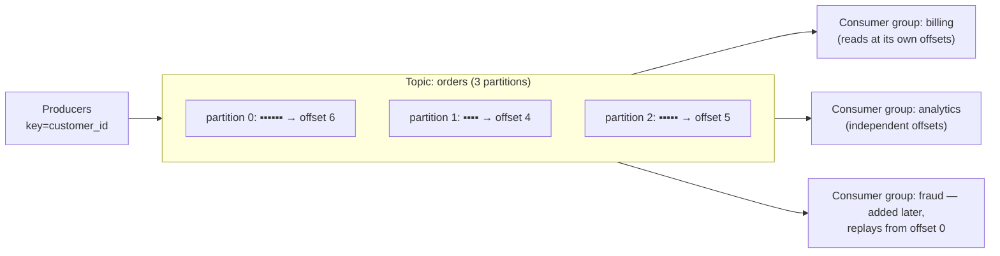

S04-P09 gave you queues: a message arrives, one consumer processes it, it's gone. Kafka looks similar from a distance and is a fundamentally different animal up close: **Kafka is a log, not a queue.** Messages aren't deleted on consumption — they're appended to an ordered, durable log and stay for the retention window; consumers just remember *how far they've read*. That one design choice is why Kafka can feed five independent consumers from the same stream, replay history after a bug, and back the CDC pipelines of S07-P06 — and why its failure modes are different from SQS's. This part is the mechanics; Flink-style processing on top comes in P11.

## The log, and why "not a queue" matters

Because consuming doesn't destroy, three things queues can't do become trivial: **fan-out without fan-out infrastructure** (each consumer group gets the full stream at its own pace — the SNS+SQS pattern, built into the storage model); **replay** (bug shipped Tuesday? Reset offsets to Monday and reprocess — S02-P06's backfill instinct, streaming edition); and **new consumers of old data** (the fraud team arrives a year later and reads history). The cost: *you* manage position (offsets), and retention is a real design decision — time-based for event streams, or **log compaction** (keep the latest record per key) for changelog topics, which is exactly the shape CDC wants.

## Partitions: the unit of everything

A topic is split into **partitions**, and the partition is the unit of *ordering*, *parallelism*, and *scaling* all at once:

- **Ordering exists only within a partition.** The producer routes by message **key** (same key → same partition → strict order). Choose the key by asking "what must stay in order?" — usually an entity: `customer_id`, `order_id`. This is S04-P09's "per-entity state machines beat global order," made physical.
- **Parallelism is capped by partition count**: a consumer group can use at most one consumer per partition. Six partitions = at most six workers. Plan partition counts with headroom (they're painful to change well later, because rekeying moves entities between partitions and breaks order history).
- **Hot keys make hot partitions** — one huge customer can pin a partition at 100% while others idle (S02-P07's skew lesson wearing streaming clothes). Watch per-partition throughput, not just totals.

## Consumer groups and lag: the operational heart

A **consumer group** is a team reading a topic together: partitions are divided among members, and when a member joins or dies, a **rebalance** redistributes them (brief pause — the mechanism behind "consumers stopped for a few seconds"). The metric that matters — the *only* one to alarm on first — is **consumer lag**: how far behind the log's head each group is. Lag is S04-P09's "age of oldest message" with better tooling: growing lag means your consumers are too slow, too few (up to the partition cap), or crash-looping. Flat-but-nonzero lag is fine; monotonically growing lag is an incident in progress.

## Delivery semantics: where "exactly-once" lives

The consumer loop is: read messages → process → **commit offset**. The order of those last two steps *is* your delivery semantics:

- Commit **after** processing → **at-least-once**: crash between the two and you'll reprocess. The default, and the right default — paired with idempotent consumers (third repetition of the curriculum's iron rule: S02-P06, S02-P08, S04-P09).
- Commit **before** processing → **at-most-once**: crash and the message is skipped forever. Almost never what a data pipeline wants.
- **"Exactly-once"** — the honest version: Kafka provides idempotent producers (retries don't duplicate *writes to the log*) and transactions (consume-process-produce atomically, within the Kafka ecosystem). The moment your consumer touches an *external* system — a warehouse, an API — you're back to at-least-once + idempotency: upsert by key, or write offsets *with* the data in the same transaction. Exactly-once is a property you *build end-to-end*, not a checkbox you enable.

## Where Kafka fits (and where it doesn't)

Reach for the log when: multiple consumers need the same events (the S07-P06 outbox/CDC backbone), replay matters, order-per-entity matters, or throughput is genuinely high. Stay with SQS-class queues (S04-P09) for simple task distribution — a queue is *less* to operate, and "we might need replay someday" is S01-P10's speculative abstraction in infrastructure form. And remember the lakehouse handshake from P09: streaming consumers writing to tables must batch their commits, or you're running a small-files factory. Operationally, managed Kafka (the MSK/Confluent tier) is the S02-P08 scheduler argument again — the log is production infrastructure, and running brokers is a job you should decline until scale forces the conversation.

## Key takeaways

- Kafka is a durable log, not a queue: consumption doesn't delete, so fan-out, replay, and late-arriving consumers are native — and offsets plus retention become your responsibilities.
- Partitions are the unit of order, parallelism, and scale: key by the entity that must stay ordered, cap workers at partition count, and watch for hot keys.
- Alarm on consumer lag before anything else; expect brief pauses at rebalance.
- Semantics are set by when you commit offsets: default to at-least-once + idempotent consumers, and treat exactly-once as an end-to-end property that stops at Kafka's border.

*Next up — Part 11: Stream Processing: Flink & Friends.*
