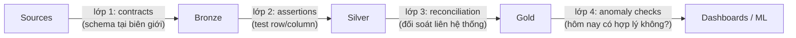

Đây là failure mode định nghĩa phần này: **mọi task xanh, mọi con số sai.** Orchestrator (P08) không retry gì vì không gì crash; pipeline chạy hoàn hảo và trung thành lan truyền rác — một cú export nguồn hỏng trong im lặng, một cột tiền tệ đổi đơn vị, một cú JOIN bắt đầu fan-out (P02). Software testing (S01-P09) kiểm *code bạn viết*; data quality kiểm *input bạn không kiểm soát*, và input đó tới mới mỗi ngày. Bài toán khác, bộ đồ nghề khác — và đồng tiền đặt cược không phải uptime mà là **niềm tin**: lần đầu một giám đốc bắt được số sai trên dashboard, mọi con số tương lai đều ship kèm một dấu hoa thị.

## Phòng thủ bốn lớp

**Lớp 1 — contract tại biên giới.** Pattern biên-giới-có-type (P03) được chính thức hoá: producer khai schema + ngữ nghĩa (kiểu cột, nullability, "amount là VND, đã gồm thuế"), và vi phạm bị bắt ngay lúc *ingest*, nơi bán kính vụ nổ là một bảng bronze — không phải ở dashboard của CEO, năm tầng transform sau. Đây là bản năng schema-registry (event của P10, CDC của S07-P06) áp vào mọi nguồn, và phiên bản thật thà bao gồm một *cuộc nói chuyện*: contract không ai đồng ý chỉ là tài liệu ghi các giả định của bạn.

**Lớp 2 — assertion trên mọi model.** Bộ test kiểu dbt (ranh giới dbt của P06): `not_null`, `unique` trên primary key (grain của P04 — một cú fail unique *chính là* chuông báo fan-out vô tình), `accepted_values` trên enum, check tham chiếu giữa các bảng silver. Rẻ để viết, chạy mỗi lần build, và sản phẩm thật của chúng là *vị trí*: một cú fail nói cho bạn **lớp nào** hỏng, biến "dashboard sai" (tìm khắp nơi) thành "silver orders fail uniqueness lúc 06:10" (tìm một cú JOIN).

**Lớp 3 — reconciliation.** Assertion kiểm một bảng với chính nó; reconciliation kiểm nó với *một hệ thống khác*: đếm row nguồn-vs-bronze, tổng doanh thu gold vs tổng giao dịch, độ trôi hôm-qua-vs-hôm-nay trên các aggregate chủ chốt. Đây là lớp bắt được thứ test từng-row không thể — cú export lặng lẽ rơi mất một partition, cú lệch timezone đẩy 4% đơn hàng sang nhầm ngày (bài học event-time của P11, phiên bản batch).

**Lớp 4 — anomaly check.** Dữ liệu hôm qua hoàn hảo *và* hôm nay đậu hết test — nhưng row count hôm nay gấp 3× bình thường, hay null-rate của `email` nhảy từ 2% lên 40%. Không gì vi phạm luật; mọi thứ vi phạm *lịch sử*. Bắt đầu đơn giản tới mức ngượng — hôm nay có nằm trong dải hợp lý quanh trung bình trượt không? — trước khi với tới các công cụ vị-ML; một moving average kèm ngưỡng bắt được đa số sự cố thật và không bao giờ nổ một cách bí ẩn (luật "alarm bạn không học cách phớt lờ" của S04-P10 áp dụng gấp đôi ở đây, vì data team mute các check ồn ào *rất nhanh*).

## Severity, hay: không phải test fail nào cũng nên dừng thế giới

Bản năng biến mọi check thành blocking là cách các sáng kiến quality chết. Mượn kỷ luật phân rọ (P06, S04-P10) và trao mỗi test một trong ba số phận: **fail** — dừng pipeline, không publish (vi phạm grain, trượt reconciliation: dữ liệu sai *tệ hơn* dữ liệu trễ); **warn** — publish nhưng log và theo dõi trend (null-rate bò dần trên một cột nice-to-have: dữ liệu trễ *tệ hơn* dữ liệu hơi-lệch — lựa chọn theo từng bảng và đáng viết ra giấy); **quarantine** — rẽ row hỏng sang bảng phụ, publish phần còn lại (side output late-data của P09, phiên bản batch — pipeline ship 99.7% đúng giờ trong khi 0.3% chờ một con người). Quyết định severity *chính là* cuộc nói chuyện data SLA: thống nhất với consumer thế nào là "đủ tốt để publish", theo từng bảng, trước sự cố — và đó cũng là nơi "data SLA" hết là khẩu hiệu: freshness ("gold trước 07:00" — alarm SLA của P08), completeness ("≥99% row nguồn"), accuracy ("đối soát lệch trong 0.1%") thành *các con số có người ký*.

## Phần văn hoá (nhỏ hơn bạn sợ)

Test không có chủ sẽ mục thành các biến thể của `--no-verify`. Văn hoá tối thiểu khả dụng: mọi alarm quality có *chủ và runbook* (S01-P12 — "orders reconciliation fail: xem log export, đây là lệnh backfill"); metric quality *nhìn thấy được* với consumer (một panel nhỏ freshness/test-status trên mỗi dashboard đổi nỗi lo "số này đúng không?" thành một cái liếc); và mọi sự cố dữ liệu kết thúc bằng câu hỏi postmortem của S01-P12 — *"lớp nào lẽ ra phải bắt được cú này?"* — cộng một test mới ở đúng lớp đó. Vòng lặp cuối ấy là cách một bộ test xoàng thành bộ test tốt trong một năm: test suite của bạn, như fixture của P03, là viện bảo tàng các sự cố đã qua.

## Điều cần nhớ

- Pipeline xanh vẫn ship số sai: software test canh code của bạn, data quality canh input bạn không kiểm soát — và thứ đặt cược là niềm tin, món đắt nhất để backfill.
- Bốn lớp, lớp sau bắt thứ lớp trước không thể: contract lúc ingest, assertion mỗi model, reconciliation liên hệ thống, anomaly check so với lịch sử.
- Không phải cú fail nào cũng dừng thế giới: fail/warn/quarantine theo từng test, quyết cùng consumer — quyết định đó chính là data SLA, bằng con số có người ký.
- Mọi alarm cần chủ và runbook, mọi sự cố thêm một test ở lớp đã bỏ lọt — bộ test là viện bảo tàng các sự cố không còn tái diễn.

*Tiếp theo — Phần 13: Governance, catalog & hạ tầng cho data team.*
