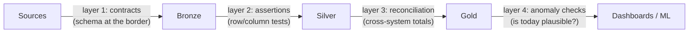

Here is the failure mode that defines this part: **every task green, every number wrong.** The orchestrator (P08) retried nothing because nothing crashed; the pipeline ran perfectly and faithfully propagated garbage — a silently broken source export, a currency column that switched units, a JOIN that started fanning out (P02). Software testing (S01-P09) checks *code you wrote*; data quality checks *inputs you don't control*, arriving fresh every day. Different problem, different toolkit — and the currency at stake is not uptime but **trust**: the first time a director catches a wrong number in a dashboard, every future number ships with an asterisk.

## What you'll learn

- Build the four defensive layers, and know which failure each one is positioned to catch.
- Assign severity so that not every failed check stops the business.
- Turn a data SLA into something with a named owner rather than a wish.
- Grow the test suite from incidents, so it becomes a museum of real failures.

**Prerequisites:** Part 5 (layer contracts) and Part 6 (failure taxonomy). Part 3's idempotency habit underpins all of it.

## 1. The four-layer defense



**Layer 1 — contracts at the border.** The typed-border pattern (P03) formalized: producers declare schema + semantics (column types, nullability, "amount is VND, tax included"), and violations are caught at *ingest*, where the blast radius is one bronze table — not at the CEO dashboard, five transformations later. This is the schema-registry instinct (P10's events, S07-P06's CDC) applied to every source, and the honest version includes a *conversation*: a contract nobody agreed to is just documentation of your assumptions.

**Layer 2 — assertions on every model.** The dbt-style test suite (P06's dbt boundary): `not_null`, `unique` on the primary key (P04's grain — a failed unique test *is* an accidental fan-out alarm), `accepted_values` on enums, referential checks between silver tables. Cheap to write, run on every build, and their real product is *placement*: a failure tells you **which layer** broke, turning "the dashboard is wrong" (search everything) into "silver orders failed uniqueness at 06:10" (search one JOIN).

**Layer 3 — reconciliation.** Assertions validate a table against itself; reconciliation validates it against *another system*: row counts source-vs-bronze, sum of gold revenue vs the transactional total, yesterday-vs-today drift on key aggregates. This is the layer that catches what per-row tests can't — the export that silently dropped a partition, the timezone shift that moved 4% of orders into the wrong day (P11's event-time lesson, batch edition).

**Layer 4 — anomaly checks.** Yesterday's data was perfect *and* today's passes all tests — but today's row count is 3× normal, or null-rate on `email` jumped from 2% to 40%. Nothing violated a rule; everything violated *history*. Start embarrassingly simple — is today within a sane band of the trailing average? — before reaching for ML-flavored tools; a moving average with thresholds catches most real incidents and never fires mysteriously (S04-P10's "alarm you won't learn to ignore" rule applies double here, because data teams mute noisy quality checks *fast*).

## 2. Severity, or: not every failed test should stop the world

The instinct to make every check blocking is how quality initiatives die. Borrow the basket discipline (P06, S04-P10) and give every test one of three fates: **fail** — stop the pipeline, don't publish (grain violations, reconciliation misses: wrong data *worse* than late data); **warn** — publish but log and trend it (null-rate creep on a nice-to-have column: late data *worse* than slightly-imperfect data — the choice is per-table and worth writing down); **quarantine** — route bad rows to a side table, publish the rest (P09's late-data side output, batch edition — the pipeline ships 99.7% on time while the 0.3% waits for a human). The severity decision *is* the data SLA conversation: agreeing with consumers what "good enough to publish" means, per table, before the incident — which is also where "data SLA" stops being a slogan: freshness ("gold by 07:00" — P08's SLA alarm), completeness ("≥99% of source rows"), and accuracy ("reconciles within 0.1%") as *numbers someone signed off on*.

## 3. The culture part (smaller than you fear)

Tests without owners rot into `--no-verify` equivalents. The minimum viable culture: every quality alarm has an *owner and a runbook* (S01-P12 — "orders reconciliation failed: check export logs, here's the backfill command"); quality metrics are *visible* to consumers (a tiny freshness/test-status panel per dashboard converts "is this right?" anxiety into a glance); and every data incident ends with the S01-P12 postmortem question — *"which layer should have caught this?"* — plus one new test there. That last loop is how a mediocre suite becomes a good one in a year: your test suite, like P03's fixtures, is a museum of past incidents.

## Practice (25 minutes — build all four layers over one small table)

DuckDB and a handful of assertions. The point is that each layer catches something the others structurally cannot:

```sql
-- duckdb quality.db
CREATE TABLE orders_raw(order_id VARCHAR, customer_id VARCHAR, amount VARCHAR,
                        status VARCHAR, order_date VARCHAR);
INSERT INTO orders_raw VALUES
  ('A-1','C1','120.00','shipped','2026-03-01'),
  ('A-2','C2','-45.00','shipped','2026-03-01'),   -- negative amount: a value bug
  ('A-3',NULL ,'80.00' ,'shipped','2026-03-02'),  -- missing key: a contract breach
  ('A-1','C1','120.00','shipped','2026-03-01'),   -- duplicate: a uniqueness breach
  ('A-4','C3','60.00' ,'pending','2026-03-02');

-- LAYER 1: contract at the boundary — types and required fields, checked on arrival
SELECT 'null_customer' AS check, count(*) AS violations FROM orders_raw WHERE customer_id IS NULL
UNION ALL SELECT 'bad_amount', count(*) FROM orders_raw WHERE TRY_CAST(amount AS DECIMAL) IS NULL;

-- LAYER 2: assertions on the modeled table — uniqueness and accepted values
CREATE TABLE orders AS SELECT order_id, customer_id, CAST(amount AS DECIMAL(10,2)) AS amount,
       status, CAST(order_date AS DATE) AS order_date FROM orders_raw;
SELECT 'dup_order_id' AS check, count(*) AS violations FROM (
  SELECT order_id FROM orders GROUP BY 1 HAVING count(*) > 1)
UNION ALL SELECT 'bad_status', count(*) FROM orders WHERE status NOT IN ('shipped','pending','cancelled')
UNION ALL SELECT 'negative_amount', count(*) FROM orders WHERE amount < 0;

-- LAYER 3: reconciliation against the source — the check that catches a dropped partition
SELECT (SELECT count(*) FROM orders_raw) AS source_rows,
       (SELECT count(*) FROM orders)     AS target_rows,
       (SELECT count(*) FROM orders_raw) - (SELECT count(*) FROM orders) AS lost_rows;

-- LAYER 4: anomaly vs history — "embarrassingly simple" and it works
CREATE TABLE daily_history(d DATE, n INT);
INSERT INTO daily_history VALUES ('2026-02-26',1000),('2026-02-27',1020),
                                 ('2026-02-28',980),('2026-03-01',1010);
SELECT d, n, round(avg(n) OVER (ORDER BY d ROWS 3 PRECEDING), 1) AS trailing_avg,
       CASE WHEN n < 0.5 * avg(n) OVER (ORDER BY d ROWS 3 PRECEDING) THEN 'ALERT' ELSE 'ok' END
FROM (SELECT * FROM daily_history UNION ALL SELECT DATE '2026-03-02', 3) ORDER BY d;
```

Expected results: layer 1 catches the missing customer and would have caught a type change at the source; layer 2 catches the duplicate and the negative amount, neither of which is a *type* problem so layer 1 was blind to them. Layer 3 is the one teams skip and then regret — every task green while a partition silently didn't land shows up here as a row-count gap and nowhere else. Layer 4 catches the case all three miss: perfectly valid data, correct types, no duplicates, and only 3 rows on a day that normally has a thousand. That last check is the one that catches upstream outages, and it is genuinely two lines of SQL.

## Check yourself

1. Every pipeline task is green, every dbt test passes, and the daily revenue number is half what it should be. Which layer was missing?
2. Your quality suite has 60 checks and they all fail the pipeline. What's the likely outcome after a month?
3. A stakeholder asks for a "data SLA". What do you need before you can agree to one?

<details><summary>See answers</summary>

1. Reconciliation, or anomaly detection against history. Assertions verify that the rows you *have* are valid; they cannot notice rows that never arrived. A source-versus-target row count, or a volume comparison against the trailing average, is what makes a silently dropped partition visible.
2. Alarm fatigue and a disabled suite. When a cosmetic check can stop the business, people start bypassing checks as a routine — and then the important ones get bypassed too. Assign severity: fail the pipeline on breaches that make downstream numbers wrong, warn on the rest, and quarantine bad rows rather than halting everything.
3. A named owner, a measurable definition, and an agreed consequence. "Fresh by 7 a.m." means nothing without who is paged when it isn't, how freshness is measured, and what downstream consumers should do while it's late. An SLA nobody is accountable for is a wish with a formal-sounding name.

</details>

## Key takeaways

- Green pipelines ship wrong numbers: software tests guard your code, data quality guards inputs you don't control — and the stake is trust, the most expensive thing to backfill.
- Four layers, each catching what the previous can't: contracts at ingest, assertions per model, reconciliation across systems, anomaly checks against history.
- Not every failure stops the world: fail/warn/quarantine per test, decided with consumers — that decision is the data SLA, in numbers someone signed.
- Every alarm needs an owner and a runbook, every incident adds a test at the layer that missed it — the suite is a museum of incidents that no longer recur.

*Next up — Part 13: Governance, Catalog & Infra for Data Teams.*
