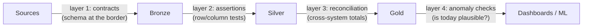

Here is the failure mode that defines this part: **every task green, every number wrong.** The orchestrator (P08) retried nothing because nothing crashed; the pipeline ran perfectly and faithfully propagated garbage — a silently broken source export, a currency column that switched units, a JOIN that started fanning out (P02). Software testing (S01-P09) checks *code you wrote*; data quality checks *inputs you don't control*, arriving fresh every day. Different problem, different toolkit — and the currency at stake is not uptime but **trust**: the first time a director catches a wrong number in a dashboard, every future number ships with an asterisk.

## The four-layer defense

**Layer 1 — contracts at the border.** The typed-border pattern (P03) formalized: producers declare schema + semantics (column types, nullability, "amount is VND, tax included"), and violations are caught at *ingest*, where the blast radius is one bronze table — not at the CEO dashboard, five transformations later. This is the schema-registry instinct (P10's events, S07-P06's CDC) applied to every source, and the honest version includes a *conversation*: a contract nobody agreed to is just documentation of your assumptions.

**Layer 2 — assertions on every model.** The dbt-style test suite (P06's dbt boundary): `not_null`, `unique` on the primary key (P04's grain — a failed unique test *is* an accidental fan-out alarm), `accepted_values` on enums, referential checks between silver tables. Cheap to write, run on every build, and their real product is *placement*: a failure tells you **which layer** broke, turning "the dashboard is wrong" (search everything) into "silver orders failed uniqueness at 06:10" (search one JOIN).

**Layer 3 — reconciliation.** Assertions validate a table against itself; reconciliation validates it against *another system*: row counts source-vs-bronze, sum of gold revenue vs the transactional total, yesterday-vs-today drift on key aggregates. This is the layer that catches what per-row tests can't — the export that silently dropped a partition, the timezone shift that moved 4% of orders into the wrong day (P11's event-time lesson, batch edition).

**Layer 4 — anomaly checks.** Yesterday's data was perfect *and* today's passes all tests — but today's row count is 3× normal, or null-rate on `email` jumped from 2% to 40%. Nothing violated a rule; everything violated *history*. Start embarrassingly simple — is today within a sane band of the trailing average? — before reaching for ML-flavored tools; a moving average with thresholds catches most real incidents and never fires mysteriously (S04-P10's "alarm you won't learn to ignore" rule applies double here, because data teams mute noisy quality checks *fast*).

## Severity, or: not every failed test should stop the world

The instinct to make every check blocking is how quality initiatives die. Borrow the basket discipline (P06, S04-P10) and give every test one of three fates: **fail** — stop the pipeline, don't publish (grain violations, reconciliation misses: wrong data *worse* than late data); **warn** — publish but log and trend it (null-rate creep on a nice-to-have column: late data *worse* than slightly-imperfect data — the choice is per-table and worth writing down); **quarantine** — route bad rows to a side table, publish the rest (P09's late-data side output, batch edition — the pipeline ships 99.7% on time while the 0.3% waits for a human). The severity decision *is* the data SLA conversation: agreeing with consumers what "good enough to publish" means, per table, before the incident — which is also where "data SLA" stops being a slogan: freshness ("gold by 07:00" — P08's SLA alarm), completeness ("≥99% of source rows"), and accuracy ("reconciles within 0.1%") as *numbers someone signed off on*.

## The culture part (smaller than you fear)

Tests without owners rot into `--no-verify` equivalents. The minimum viable culture: every quality alarm has an *owner and a runbook* (S01-P12 — "orders reconciliation failed: check export logs, here's the backfill command"); quality metrics are *visible* to consumers (a tiny freshness/test-status panel per dashboard converts "is this right?" anxiety into a glance); and every data incident ends with the S01-P12 postmortem question — *"which layer should have caught this?"* — plus one new test there. That last loop is how a mediocre suite becomes a good one in a year: your test suite, like P03's fixtures, is a museum of past incidents.

## Key takeaways

- Green pipelines ship wrong numbers: software tests guard your code, data quality guards inputs you don't control — and the stake is trust, the most expensive thing to backfill.
- Four layers, each catching what the previous can't: contracts at ingest, assertions per model, reconciliation across systems, anomaly checks against history.
- Not every failure stops the world: fail/warn/quarantine per test, decided with consumers — that decision is the data SLA, in numbers someone signed.
- Every alarm needs an owner and a runbook, every incident adds a test at the layer that missed it — the suite is a museum of incidents that no longer recur.

*Next up — Part 13: Governance, Catalog & Infra for Data Teams.*
