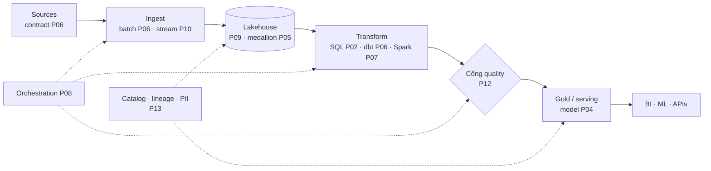

Mười ba phần trước, series này hứa một con đường từ junior tới senior. Đây là định nghĩa thật thà của đích đến, và nó không phải "biết nhiều tool hơn": **một senior data engineer đổi đơn vị công việc của mình.** Junior sở hữu *pipeline* (làm cho dữ liệu này chảy); senior sở hữu *kết quả* (làm cho công ty này tin được và dùng được dữ liệu của nó) — và mỗi mục bên dưới là đúng một cú đổi đó áp lên một bề mặt khác nhau. Đó cũng là lý do các phần tooling của series này luôn kết ở trade-off thay vì khuyến nghị: tool chưa bao giờ là điểm chính; sự phán đoán mới là.

## Bạn sẽ học được gì

- Giữ trọn platform trong một sơ đồ, và nói thật thà cái gì vỡ trước ở mức tải gấp mười.
- Chọn công nghệ bằng một kỷ luật năm điểm thay vì bằng sở thích.
- Coi chi phí là một chiều thiết kế, vì đúng-nhưng-phá-sản thì vẫn là sai.
- Làm phần con người của nghề: phiên dịch, nói không kèm bảng giá, và xây thứ sống qua một kỳ nghỉ.

**Cần biết trước:** Cả series — bài này là phần tổng hợp.

## 1. Góc nhìn platform: một sơ đồ, mười ba phần

Một senior vẽ được sơ đồ này *cho công ty của mình* từ trí nhớ — kèm các chú thích thật thà: SLA nằm đâu (P12), mỗi hộp tốn bao nhiêu (bên dưới), mũi tên nào giòn, và hộp nào sẽ vỡ kế tiếp ở 10× volume. Chú thích cuối đó là kỹ năng mà phỏng vấn gọi là "system design" còn công việc gọi là *tầm nhìn dung lượng*: không phải xây cho 10× ngay hôm nay (khoản vay suy đoán của S01-P10), mà biết hộp *nào* hỏng trước và bạn sẽ biết bằng cách nào (các alarm lag và freshness của P08/P10 chính là sợi dây bẫy đó).

## 2. Chọn công nghệ: kỷ luật

Nước đi senior trong mọi cuộc tranh luận "X vs Y" là từ chối phiên bản trừu tượng của câu hỏi. Checklist thực chiến, chưng cất từ mọi lựa chọn của series này:

- **Xuất phát từ workload, không phải từ tool**: volume, nhu cầu độ trễ ("ai cần kết quả này, tươi cỡ nào?" — P11), hình dạng query, cỡ team. Đa số tranh luận X-vs-Y tan biến khi bốn con số này nằm trên bàn.
- **Nhàm chán thắng theo mặc định** (lòng can đảm của S01-P10, phiên bản platform): lựa chọn trưởng thành với failure mode đã biết thắng lựa chọn hào hứng với failure mode chưa biết — bạn sẽ là người on-call cho các thứ chưa biết đó (S01-P12).
- **Managed cho tới khi scale phản đối** — luật đã áp ở mọi tầng của series (Spark P07, Airflow P08, Kafka P10); tài nguyên khan hiếm của bạn là sự chú tâm kỹ thuật, và ops hạ tầng không-tạo-khác-biệt là nơi nó tới để chết.
- **Khăng khăng đòi lối thoát**: format mở (P09), SQL chuẩn, orchestration khả chuyển. Bạn sẽ sai về một thứ gì đó; hãy làm cho việc sai trở nên rẻ (trọn luận đề của S07-P03).
- **Viết quyết định ra giấy** — một trang: bối cảnh, các lựa chọn, lựa chọn cuối, *điều gì sẽ khiến mình đổi ý*. Nửa giá trị là sự suy nghĩ nó ép ra; nửa kia là người đồng đội mới hai năm sau không phải mở lại phiên toà trong mù mờ.

## 3. Chi phí như một chiều thiết kế

Kỹ sư junior coi hoá đơn là chuyện của người khác; senior coi **chi phí là một chiều của tính đúng đắn** — một pipeline đúng-nhưng-phá-sản là một pipeline sai. Các bản năng, đều đã gieo từ trước: biết *đơn vị chi tiêu* của platform mình (theo-TB-scan, theo-DPU-giờ, theo-slot — bài học Athena của S04-P13 tổng quát hoá: mô hình giá *chính là* áp lực thiết kế); khiến chi tiêu nhìn thấy được theo từng pipeline và từng bảng (tagging của S04-P10 — phiên bản platform của panel quality P12); và kéo các đòn bẩy chuẩn theo thứ tự — layout storage trước (Parquet, partitioning, compaction: đòn bẩy 10–100×), rồi scheduling (cái này có thật cần chạy hằng giờ không? — câu hỏi độ tươi của P11), rồi right-size compute, rồi giá hợp đồng. Và nước đi senior nhất: *xoá thứ đi*. Cái pipeline không ai dùng vẫn chạy hằng đêm, cái bảng sáu tháng không ai query (catalog biết — P13) — mỗi pipeline bị xoá là chi phí, rủi ro, và bề mặt on-call được gỡ bỏ cùng lúc.

## 4. Tầng con người: nơi senior thật sự diễn ra

Sự thật khó chịu về cú chuyển junior→senior: cái trần thôi còn là kỹ thuật. Ba thực hành gánh phần lớn:

- **Phiên dịch cả hai chiều.** Với stakeholder: không phải "CDC lag vượt watermark" mà là "số doanh thu đang ôi 4 tiếng; quyết định trước 11h sáng dùng dữ liệu hôm qua; sửa xong trước 14h." Với engineer: biến "dashboard nhìn sai sai" thành một chuỗi giả thuyết từng-lớp của P12. Kỷ luật postmortem của S01-P12 — triệu chứng, tác động, bước kế, không jargon, không đổ lỗi — là template cho *tất cả*.
- **Nói không kèm bảng giá.** Mỗi cú "pull nhanh giúp anh ít data" và "thêm một cột thôi" là công việc thật mặc bộ đồ nhỏ. Câu trả lời senior không bao giờ là "không" — mà là "được, và đây là cái giá / đây là phiên bản rẻ hơn đạt 90%": cuộc nói chuyện severity của P12 (fail/warn/quarantine) áp vào các yêu cầu thay vì các bài test.
- **Nhân bản, đừng tích trữ.** Runbook của P13, các bản ghi quyết định ở trên, những comment review dạy *pattern* thay vì sửa một instance (S01-P09), bản postmortem thêm một test (P12) — seniority lãi kép qua những thứ tiếp tục chạy khi bạn không có trong phòng. Nếu platform không sống nổi qua kỳ nghỉ của bạn, bạn đã xây một sự phụ thuộc, không phải một platform.

## 5. Tấm bản đồ, và đi tiếp đâu

Nhìn lại thứ lộ trình này thật sự lắp ráp: nền móng (P01–P04: SQL, Python, modeling), xương sống warehouse (P05–P08: medallion, ELT, Spark, orchestration), platform hiện đại (P09–P11: lakehouse, Kafka, streaming), và tầng niềm tin (P12–P13: quality, governance) — chốt bằng cú đổi đơn vị từ pipeline sang kết quả của phần này. Từ đây, ba đường đi tiếp tự nhiên: **chiều sâu kiến trúc** → Các kiến trúc Data Platform (S07) — series này dạy bạn *xây* các chiếc hộp; S07 dạy bạn *chọn* chúng theo từng khách hàng và use case; **chiều sâu cloud** → AWS từ cơ bản đến nâng cao (S04), nơi mỗi chiếc hộp có một hoá đơn và một IAM policy; **lân cận AI** → Lộ trình AI Engineer (S03) — data engineer với pipeline chuẩn P09 đã là nửa một AI-platform engineer (pipeline ingest của S03-P09 *chính là* việc hằng ngày của bạn).

Series hoàn tất. Các tool trong mười bốn phần này sẽ già đi; các câu hỏi — ai cần nó, tươi cỡ nào, tốn bao nhiêu, cái gì vỡ trước, ai tin nó — thì không.

## Thực hành (30 phút — vẽ platform của bạn, rồi phá nó trên giấy)

Kỹ năng senior mà bài này mô tả là giữ trọn hệ thống trong tầm nhìn và trung thực về nó. Đó là bài tập vẽ và bài kiểm áp lực, không phải bài code.

**Phần 1 — sơ đồ (10 phút).** Vẽ platform thật của bạn gọn trong một trang: nguồn, ingestion, các lớp lưu trữ, biến đổi, serving, consumer. Rồi chú thích mỗi cái hộp bằng ba thứ, viết ra:

| Hộp | Ai sở hữu | Tốn bao nhiêu mỗi tháng | Chuyện gì xảy ra nếu nó chết 4 tiếng |
|---|---|---|---|

Cột thứ ba là cột khiến đa số phòng họp im lặng.

**Phần 2 — bài kiểm áp lực 10 lần (10 phút).** Hỏi lần lượt từng hộp: *cái gì vỡ trước nếu khối lượng tăng gấp mười?* Không phải "nó có scale được không" — mà hộp nào, và vỡ theo kiểu gì. Lưu trữ hiếm khi vỡ; các câu trả lời thường gặp là một bước biến đổi đơn luồng, một trần connection database, một cửa sổ chạy đêm thôi vừa vào ban đêm, hoặc một dòng chi phí trở nên bất khả thi về mặt chính trị. Viết ra ba cái đầu tiên theo thứ tự.

**Phần 3 — bản ghi quyết định (10 phút).** Chọn lựa chọn công nghệ đáng kể gần nhất trên sơ đồ đó và viết lại nó sau khi việc đã rồi: nó giải bài toán gì, thứ gì bị gạt đi, điều gì sẽ khiến bạn xem lại. Nếu bạn không dựng lại nổi lập luận, thì chính đó là phát hiện — và đó là lý do cái kỷ luật ở mục 2 tồn tại.

Kết quả mong đợi: cột thứ ba của phần 1 thường là output giá trị nhất của cả bài tập, vì "chuyện gì xảy ra nếu cái này chết" là câu hỏi tách các thành phần có kế hoạch khôi phục thật khỏi những thành phần đang đứng vững chỉ nhờ chưa hỏng lần nào. Phần 2 thường làm lộ một nút cổ chai *không phải* cái mà team hay bàn — người ta bàn lưu trữ và compute trong khi trần thật là một connection pool hay một cửa sổ batch. Còn phần 3 là thói quen đáng giữ vĩnh viễn: quyết định viết xuống ngay lúc đó tốn hai mươi phút, còn dựng lại hai năm sau thì tốn một tuần và thường sai.

## Tự kiểm tra

1. Một stakeholder xin một tính năng đòi hỏi xử lý real-time. Bạn biết về mặt kỹ thuật là làm được. Bạn làm gì trước khi nói có?
2. Platform của bạn chạy hoàn hảo và bạn là người duy nhất hiểu nó. Rủi ro thật là gì, và sửa nó trông như thế nào?
3. Team bạn muốn dùng một engine xử lý mới thật sự tốt hơn. Bạn kiểm năm thứ nào trước?

Xem đáp án

1. Gắn một cái giá vào nó: giờ công kỹ thuật, chi phí vận hành thường xuyên, và thứ nó đẩy khỏi roadmap. "Được, và đây là cái giá" là câu trả lời senior; "không" mà không kèm giá là cản trở, còn "được" mà không kèm giá là cách các platform tích luỹ nghĩa vụ không ai chọn. Cũng hãy hỏi câu gác cổng — ai hành động, trong cửa sổ nào — vì câu trả lời thường là mỗi giờ cũng đủ.
2. Rủi ro không phải chuyện xe buýt, mà là chuyện một kỳ nghỉ: bất cứ thứ gì chỉ mình bạn vận hành được sẽ thành sự cố ngay khi bạn vắng mặt, và nó âm thầm bó hẹp khả năng thay đổi bất cứ điều gì của cả team. Sửa nó nghĩa là runbook, một người thứ hai đã THẬT SỰ chạy qua đường khôi phục, và gỡ bỏ những chỗ khôn khéo chỉ tồn tại vì bạn hiểu chúng.
3. Workload có thật sự cần nó không; lựa chọn nhàm chán đã thật sự cạn chưa; có bản managed không; đường thoát là gì nếu nó gây thất vọng; và ai sẽ vận hành nó lúc 3 giờ sáng. Một engine tốt hơn mà chỉ một người chạy nổi là một platform tệ hơn.

## Điều cần nhớ

- Seniority là một cú đổi đơn vị: từ pipeline chạy được sang dữ liệu công ty tin được và dùng được — tầm nhìn dung lượng, không phải dung lượng suy đoán.
- Chọn công nghệ có kỷ luật: số liệu workload trước, nhàm chán theo mặc định, managed tới khi scale phản đối, luôn có lối thoát, quyết định viết ra giấy.
- Chi phí là một chiều đúng đắn: biết đơn vị chi tiêu, hiện hình nó theo pipeline, kéo đòn bẩy layout trước, và xoá thứ catalog nói không ai dùng.
- Cái trần là con người: phiên dịch hai chiều, nói không kèm bảng giá, nhân bản qua runbook/bản ghi/test — platform phải sống qua kỳ nghỉ của bạn. Series hoàn tất — S07 cho kiến trúc, S04 cho cloud, S03 cho AI.
