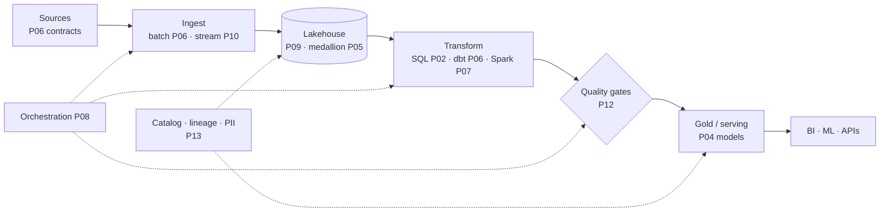

Thirteen parts ago this series promised a path from junior to senior. Here is the honest definition of the destination, and it isn't "knows more tools": **a senior data engineer changes their unit of work.** A junior owns *pipelines* (make this data flow); a senior owns *outcomes* (make this company able to trust and use its data) — and every section below is that one shift applied to a different surface. It's also why the tooling parts of this series kept ending in trade-offs rather than recommendations: the tools were never the point; the judgment was.

## The platform view: one diagram, thirteen parts

A senior can draw this *for their company* from memory — with the honest annotations: where the SLAs are (P12), what each box costs (below), which arrows are brittle, and which box is next to break at 10× volume. That last annotation is the skill interviews call "system design" and the job calls *capacity foresight*: not building for 10× today (S01-P10's speculative loan), but knowing *which* box fails first and how you'd know (the P08/P10 lag and freshness alarms are exactly that tripwire).

## Choosing technology: the discipline

The senior move in every "X vs Y" debate is refusing the abstract version of the question. The working checklist, distilled from every choice this series made:

- **Start from the workload, not the tool**: volume, latency need ("who needs this result, how fresh?" — P11), query shape, team size. Most X-vs-Y debates dissolve when these four numbers are on the table.
- **Boring wins by default** (S01-P10's courage, platform edition): the mature option with known failure modes beats the exciting one with unknown ones — you'll be on call for the unknowns (S01-P12).
- **Managed until scale argues otherwise** — the rule applied at every layer of this series (P07 Spark, P08 Airflow, P10 Kafka); your scarce resource is engineering attention, and undifferentiated infrastructure ops is where it goes to die.
- **Insist on exit ramps**: open formats (P09), standard SQL, portable orchestration. You will be wrong about something; make being wrong cheap (S07-P03's whole thesis).
- **Write the decision down** — a one-page record: context, options, choice, *what would change our mind*. Half its value is the thinking it forces; the other half is the new teammate two years later who doesn't relitigate it blind.

## Cost as a design dimension

Junior engineers treat the bill as someone else's problem; seniors treat **cost as a correctness dimension** — a pipeline that's right-but-ruinous is wrong. The instincts, all planted earlier: know your platform's *unit of spend* (per-TB-scanned, per-DPU-hour, per-slot — S04-P13's Athena lesson generalized: the pricing model *is* the design pressure); make spend visible per pipeline and per table (S04-P10's tagging — the platform version of P12's quality panel); and apply the standard levers in order — storage layout first (Parquet, partitioning, compaction: the 10–100× lever), then scheduling (does this really need hourly? — P11's freshness question), then compute right-sizing, then contract pricing. And the senior-most move: *delete things*. The unused pipeline still running nightly, the table nobody queried in six months (the catalog knows — P13) — every deleted pipeline is cost, risk, and on-call surface removed simultaneously.

## The human layer: where senior actually happens

The uncomfortable truth about the junior→senior transition: the ceiling stops being technical. Three practices carry most of it:

- **Translate in both directions.** To stakeholders: not "the CDC lag breached the watermark" but "revenue numbers are 4 hours stale; decisions made before 11am used yesterday's data; fix by 2pm." To engineers: turn "the dashboard feels wrong" into a P12 layer-by-layer hypothesis. The S01-P12 postmortem discipline — symptoms, impact, next step, no jargon, no blame — is the template for *all* of it.
- **Say no with a price tag.** Every "quick data pull" and "one more column" is real work wearing a small costume. The senior response is never "no" — it's "yes, and here's what it costs / here's the cheaper version that gets you 90%": the P12 severity conversation (fail/warn/quarantine) applied to requests instead of tests.
- **Multiply, don't accumulate.** The P13 runbooks, the decision records above, the review comments that teach the *pattern* instead of fixing the instance (S01-P09), the postmortem that adds a test (P12) — seniority compounds through what keeps working when you're not in the room. If the platform can't survive your vacation, you built a dependency, not a platform.

## The map, and where to go next

Look at what the roadmap actually assembled: foundations (P01–P04: SQL, Python, modeling), the warehouse spine (P05–P08: medallion, ELT, Spark, orchestration), the modern platform (P09–P11: lakehouse, Kafka, streaming), and the trust layer (P12–P13: quality, governance) — capped by this part's shift from pipelines to outcomes. From here, three natural continuations: **architecture depth** → Data Platform Architectures (S07) — this series taught you to *build* the boxes; S07 teaches you to *choose* them per customer and use case; **cloud depth** → AWS from Zero to Advanced (S04), where every box gets a bill and an IAM policy; **AI adjacency** → the AI Engineer Roadmap (S03) — data engineers with P09-grade pipelines are half an AI-platform engineer already (S03-P09's ingest pipeline *is* your day job).

Series complete. The tools in these fourteen parts will age; the questions — who needs this, how fresh, what does it cost, what breaks first, who trusts it — will not.

## Key takeaways

- Seniority is a change of unit: from pipelines that run to data the company can trust and use — capacity foresight, not speculative capacity.
- Choose technology with the discipline: workload numbers first, boring by default, managed until scale objects, exit ramps always, decisions written down.
- Cost is a correctness dimension: know the unit of spend, make it visible per pipeline, pull the layout lever first, and delete what the catalog says nobody uses.
- The ceiling is human: translate both directions, say no with a price tag, and multiply through runbooks, records, and tests — the platform must survive your vacation. Series complete — S07 for architecture, S04 for cloud, S03 for AI.
