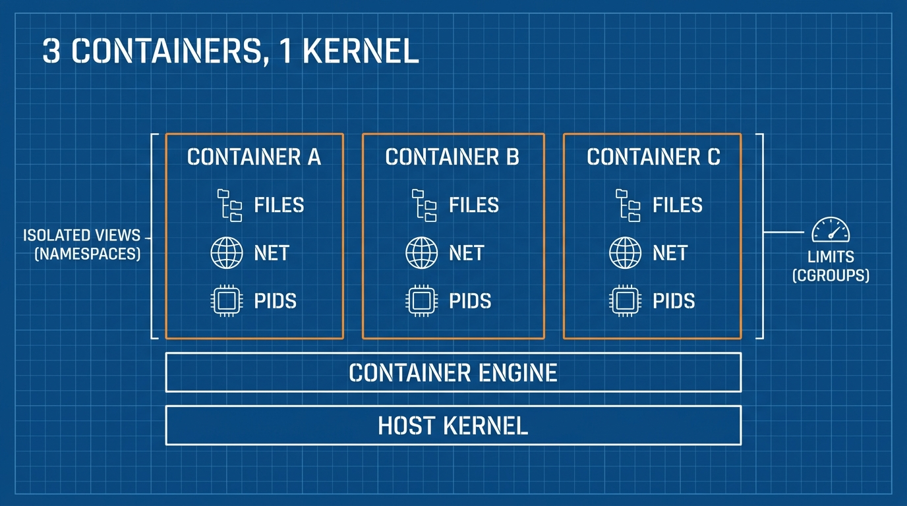
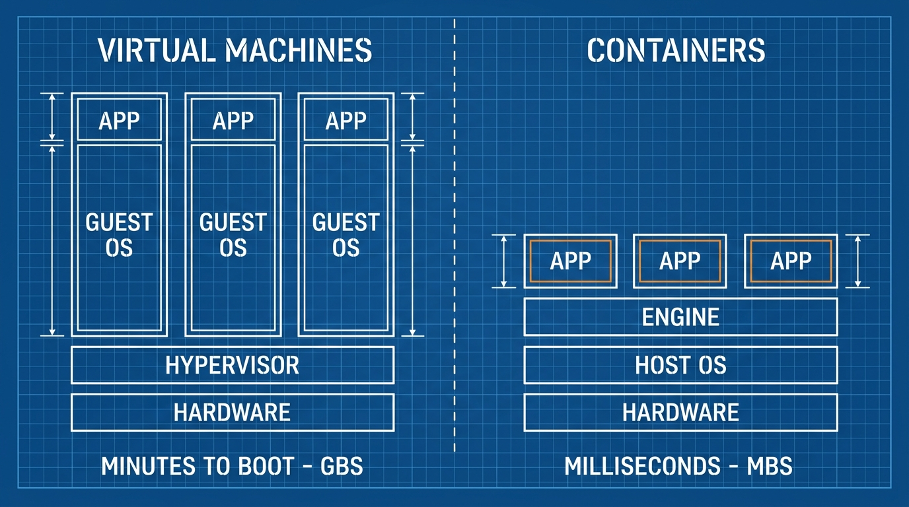
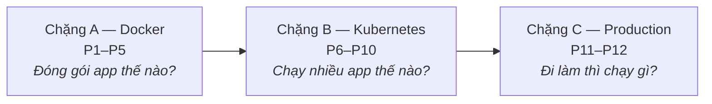

Bạn làm xong một feature. Nó chạy hoàn hảo trên laptop. Bạn deploy — và nó crash, vì server cài Python phiên bản khác. Container sinh ra để chấm dứt đúng câu chuyện này. Khoá học này dạy bạn dùng nó tử tế: từ một lệnh `docker run` đầu tiên tới Kubernetes trong production.

## Bạn sẽ học được gì

- Giải thích được container là gì và khác virtual machine chỗ nào.
- Gọi tên 3 vấn đề container giải quyết: lệch môi trường, xung đột dependency, deploy thủ công.
- Tự tay chạy container đầu tiên và soi xem nó gồm những gì.
- Nắm lộ trình 12 bài và biết phần nào có thể bỏ qua.

**Cần biết trước:** không cần gì — khoá này bắt đầu từ số 0. Biết dùng terminal cơ bản là một lợi thế.

## 1. Vấn đề: môi trường là hành lý vô hình

App của bạn không bao giờ chỉ là code. Nó còn cần một phiên bản ngôn ngữ cụ thể, thư viện hệ thống, package của OS, và các giá trị config.

Không thứ nào trong đó nằm trong repository. Chúng sống lặng lẽ trên chiếc máy mà code chạy. Vì vậy 3 sự cố này lặp lại ở mọi team:

- **Lệch môi trường** — laptop bạn có Python 3.12, server có 3.9. Code chạy với bạn, và chỉ với bạn.
- **Xung đột dependency** — app A cần thư viện v1, app B cần v2, cả hai dùng chung một server.
- **"Deploy" nghĩa là một checklist** — dựng server mới tốn một trang wiki các bước thủ công. Mỗi bước đều có thể làm hơi khác nhau.

Cách chữa rất cũ, đến từ ngành vận tải biển. Trước thập niên 1960, hàng hoá được bốc từng món: thùng, hộp, bao. Chậm, dễ sai, mỗi cảng một kiểu. Rồi cả ngành thống nhất **một chiếc hộp thép tiêu chuẩn**. Tàu, cẩu, xe tải — tất cả được thiết kế lại quanh chiếc hộp, và không ai cần quan tâm bên trong chứa gì nữa.

**Container** phần mềm chính là chiếc hộp đó: app của bạn *cộng mọi thứ nó cần*, đóng thành một đơn vị tiêu chuẩn chạy giống hệt nhau trên mọi máy.

## 2. Container thực sự là gì

Container là **một process bình thường trên máy host, được bọc trong lớp cách ly**. Nó không phải máy tính mini. Bên trong không có hệ điều hành riêng.

Hai tính năng của Linux tạo ra lớp cách ly:

- **namespaces** (mỗi container có góc nhìn hệ thống riêng: danh sách process riêng, network riêng, filesystem riêng)
- **cgroups** (mỗi container bị giới hạn cứng về CPU và memory)

Toàn bộ mánh khoé chỉ có vậy. Bài 2 sẽ đào sâu — bây giờ chỉ cần nhớ: *container = process + cách ly*.



Từ khoá thứ hai là **image**. Image là gói đóng băng, chỉ-đọc: code, runtime, thư viện, xếp thành từng lớp. Container là một *bản đang chạy* của image.

```
image     = công thức, đóng băng, chia sẻ được   (như một class)
container = một bản chạy của công thức đó         (như một object)
```

Bạn build image một lần. Sau đó khởi động 1 hay 100 container giống hệt nhau từ nó, trên bất kỳ máy nào có container engine.

## 3. Container vs virtual machine

Nhiều người nói "container là VM gọn nhẹ". Câu đó đủ đúng để bắt đầu, và đủ sai để gây bug về sau. Khác biệt thật:

| | Virtual machine | Container |
|---|---|---|
| Chứa gì | Nguyên OS + kernel + app | Chỉ app + thư viện |
| Cách ly bằng | Hypervisor (mức phần cứng) | Tính năng kernel (mức process) |
| Thời gian khởi động | Phút | Mili-giây |
| Kích thước | Hàng GB | Hàng MB |
| Mật độ mỗi host | Vài cái | Hàng chục tới hàng trăm |
| Độ mạnh cách ly | Mạnh hơn | Tốt, nhưng chung kernel |

Luật thực dụng: **VM cách ly máy, container cách ly ứng dụng.** Trên cloud, bạn thường chạy container *bên trên* VM — VM cho bạn một lát phần cứng an toàn, container tổ chức các app bên trong lát đó.



## 4. Lộ trình phía trước: 12 bài, 3 chặng

Khoá này có 3 chặng. Mỗi chặng trả lời một câu hỏi:



- **Chặng A (P1–P5):** mental model container, build image tốt, Docker Compose cho môi trường local, registry và best practices.
- **Chặng B (P6–P10):** vì sao cần orchestration, các object lõi của Kubernetes, config và networking, state và job, pattern deploy.
- **Chặng C (P11–P12):** managed Kubernetes vs các lựa chọn khác như ECS, rồi CI/CD và security để khép vòng.

Có bỏ qua được không? Có: nếu bạn chỉ dev local, chặng A đã đủ giá trị dùng nhiều tháng. Quay lại chặng B khi ai đó nói "team mình sắp lên Kubernetes".

## Thực hành (10 phút)

Cài Docker Desktop (Mac/Windows) hoặc Docker Engine (Linux), rồi chạy:

```bash
# 1. Container đầu tiên
docker run hello-world

# 2. Chạy một web server thật, ở chế độ nền, cổng 8080
#    (-p 8080:80 = cổng 8080 của máy -> cổng 80 trong hộp, nơi nginx lắng nghe)
docker run -d -p 8080:80 --name web nginx

# 3. Chứng minh nó chỉ là một process
docker ps                  # container đang chạy
curl localhost:8080        # nginx trả lời

# 4. Dọn dẹp
docker rm -f web
```

Kết quả mong đợi: bước 1 in một thông điệp chào giải thích chuyện vừa xảy ra. Bước 3 trả về trang HTML chào của nginx. Để ý điều bạn *không* làm: bạn chưa hề cài nginx.

## Tự kiểm tra

1. Đồng nghiệp nói "container là VM gọn nhẹ thôi". Hãy nêu 2 khác biệt cụ thể.
2. Image và container khác nhau thế nào?
3. App chạy local nhưng crash trên server vì thiếu thư viện. Đây là vấn đề nào trong 3 vấn đề ở mục 1, và container chữa nó ra sao?

<details><summary>Xem đáp án</summary>

1. Container dùng chung kernel của host và không chứa OS riêng (VM boot nguyên một OS); container khởi động trong mili-giây và nặng vài MB, VM boot trong vài phút và nặng vài GB.
2. Image là gói đóng băng, chia sẻ được (công thức); container là một bản đang chạy của nó (một process có lớp cách ly).
3. Lệch môi trường. Container đóng thư viện *cùng* app, nên server chạy đúng cái gói mà laptop bạn đã chạy.

</details>

## Điều cần nhớ

- Container giải quyết lệch môi trường, xung đột dependency và deploy thủ công — bằng cách đóng app *cùng* môi trường của nó thành một đơn vị tiêu chuẩn.
- Container là một process bình thường cộng lớp cách ly mức kernel (namespaces + cgroups). Không có OS bên trong.
- Image = công thức đóng băng, container = bản đang chạy. Build một lần, chạy các bản giống hệt ở mọi nơi.
- VM cách ly máy, container cách ly ứng dụng — trên cloud bạn thường chạy cả hai, container nằm trên VM.

**Đọc thêm:** phần process/kernel của câu chuyện này nằm ở CS Foundations Phần 5; cloud chạy container hộ bạn thế nào nằm ở series AWS Phần 8.

*Bài tiếp theo — Phần 2: Container chỉ là một process.*
