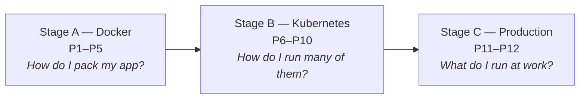

You finish a feature. It runs perfectly on your laptop. You deploy it — and it crashes, because the server has a different Python version. Containers exist to end this exact story, and this course teaches you to use them properly: from a single `docker run` to Kubernetes in production.

## What you'll learn

- Explain what a container is and how it differs from a virtual machine.
- Name the three problems containers solve: environment drift, dependency conflicts, and deployment inconsistency.
- Run your first container and inspect what it's made of.
- Navigate the 12-part roadmap and know which parts you can skip.

**Prerequisites:** none — this course starts from zero. Basic terminal comfort helps.

## 1. The problem: your environment is invisible baggage

Your app is never just your code. It also needs a specific language version, system libraries, OS packages, and config values.

None of that is visible in your repository. It lives silently on whatever machine the code runs on. So three failures keep happening in every team:

- **Environment drift** — your laptop has Python 3.12, the server has 3.9. The code works for you, and only for you.
- **Dependency conflicts** — app A needs library v1, app B needs v2, and both share one server.
- **"Deploy" means a checklist** — installing a new server takes a wiki page of manual steps. Every step can be done slightly differently.

The fix is old and comes from shipping. Before the 1960s, cargo was loaded piece by piece: barrels, boxes, sacks. Slow, error-prone, different at every port. Then the industry agreed on **one standard steel box**. Ships, cranes, trucks — everything was rebuilt around the box, and nobody cared what was inside anymore.

A software **container** is that box: your app *plus everything it needs*, packed into one standard unit that runs the same on any machine.

## 2. What a container actually is

A container is **a normal process on the host machine, wrapped in isolation**. It is not a mini-computer and there is no separate operating system inside.

Two Linux features create the isolation:

- **namespaces** (each container gets its own view of the system: its own process list, network, filesystem)
- **cgroups** (each container gets a hard limit on CPU and memory)

That's the entire trick. We go deeper in Part 2 — for now, remember: *container = process + isolation*.


The second key word is **image**. An image is the frozen, read-only package: your code, the runtime, the libraries, all layered together. A container is a *running instance* of an image.

```
image     = the recipe, frozen and shareable   (like a class)
container = one running copy of it             (like an object)
```

You build an image once. You can then start 1 or 100 identical containers from it, on any machine that runs a container engine.

## 3. Container vs virtual machine

People often say "a container is a lightweight VM". That is close enough to start, and wrong enough to cause bugs later. The real difference:

| | Virtual machine | Container |
|---|---|---|
| Contains | Full OS + kernel + your app | Your app + libraries only |
| Isolation by | Hypervisor (hardware level) | Kernel features (process level) |
| Boot time | Minutes | Milliseconds |
| Size | GBs | MBs |
| Density per host | A handful | Dozens to hundreds |
| Isolation strength | Stronger | Good, but shares the kernel |

The practical rule: **VMs isolate machines, containers isolate applications.** In the cloud, you usually run containers *on top of* VMs — the VM gives you a secure slice of hardware, the containers organize your apps inside it.


## 4. The road ahead: 12 parts, 3 stages

This course has three stages. Each stage answers one question:



- **Stage A (P1–P5):** the container mental model, building good images, Docker Compose for local development, registries and best practices.
- **Stage B (P6–P10):** why orchestration exists, Kubernetes core objects, config and networking, state and jobs, deploy patterns.
- **Stage C (P11–P12):** managed Kubernetes vs alternatives like ECS, then CI/CD and security to close the loop.

Can you skip parts? Yes: if you only develop locally, Stage A is enough for months of value. Come back for Stage B when someone says "we're moving to Kubernetes".

## Practice (10 minutes)

Install Docker Desktop (Mac/Windows) or Docker Engine (Linux), then run:

```bash
# 1. Run your first container
docker run hello-world

# 2. Run a real web server, in the background, on port 8080
#    (-p 8080:80 = host port 8080 -> container port 80, where nginx listens)
docker run -d -p 8080:80 --name web nginx

# 3. Prove it's just a process
docker ps                  # the container is running
curl localhost:8080        # nginx answers

# 4. Clean up
docker rm -f web
```

Expected result: step 1 prints a welcome message that explains what just happened. Step 3 returns the nginx welcome HTML. Notice what you did *not* do: you never installed nginx.

## Check yourself

1. A teammate says "containers are just lightweight VMs". What are two concrete differences?
2. What is the difference between an image and a container?
3. Your app works locally but crashes on the server with a missing-library error. Which of the three problems from section 1 is this, and how does a container fix it?

<details><summary>See answers</summary>

1. A container shares the host kernel and contains no OS of its own (a VM boots a full OS); containers start in milliseconds and are MBs, VMs boot in minutes and are GBs.
2. The image is the frozen, shareable package (recipe); the container is one running instance of it (a process with isolation).
3. Environment drift. The container packs the library *with* the app, so the server runs the exact same bundle your laptop ran.

</details>

## Key takeaways

- Containers solve environment drift, dependency conflicts, and manual deploys — by packing the app *with* its environment into one standard unit.
- A container is a normal process plus kernel-level isolation (namespaces + cgroups). No OS inside.
- Image = frozen recipe, container = running instance. Build once, run identical copies anywhere.
- VMs isolate machines, containers isolate applications — in the cloud you typically run both, containers on top of VMs.

**Read more:** the process/kernel side of this story is covered in CS Foundations Part 5; how the cloud runs containers for you is in AWS Series Part 8.

*Next — Part 2: A Container Is Just a Process.*
