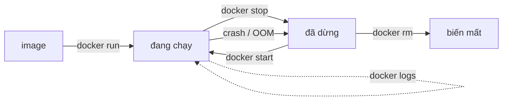

Bài 1 tuyên bố container là "một process bình thường cộng lớp cách ly". Bài này chứng minh điều đó — bằng các lệnh bạn tự chạy. Đọc xong, container hết là phép màu. Điều đó quan trọng: engineer biết container *là gì* thì debug được nó khi nó giở chứng.

## Bạn sẽ học được gì

- Nhìn container từ bên ngoài: một process trần trụi trong process list của host.
- Giải thích 3 nguyên liệu: namespaces (góc nhìn riêng), cgroups (giới hạn tài nguyên), image xếp lớp (ổ đĩa riêng).
- Tự kích hoạt và nhận diện một cú OOM kill (out-of-memory) — sự cố container phổ biến nhất.
- Dùng thành thạo các lệnh vòng đời: run, stop, exec, logs, rm.

**Cần biết trước:** Bài 1 (container là gì). Một máy Linux hoặc Docker Desktop.

## 1. Chứng minh: host nhìn thấy container "cách ly" của bạn

Chạy một container, rồi nhìn nó từ bên ngoài:

```bash
# Trong container: ngủ 10 phút
docker run -d --name naptime alpine sleep 600

# Giờ, từ HOST, xem process list bình thường:
ps aux | grep "sleep 600"
```

Bạn sẽ thấy `sleep 600` trong process list của host — một process thường, có process ID thường. Không có máy ảo, không có OS riêng. Kernel chạy trực tiếp process của bạn; nó chỉ *nói dối* process đó về thế giới xung quanh.

Lời nói dối có 3 phần. Gặp từng phần nào.

## 2. Nguyên liệu 1 — namespaces: góc nhìn hệ thống riêng

**Namespace** là tính năng kernel cho một process bản sao riêng của một phần hệ thống. Docker dùng nhiều loại cùng lúc:

| Namespace | Container có riêng... | Bạn từng thấy khi... |
|---|---|---|
| PID | danh sách process (process chính là PID 1) | `ps` trong container hiện 2 process, không phải 300 |
| Network | interface mạng, các cổng | hai container cùng bind cổng 80 được |
| Mount | cây filesystem | `ls /` bên trong hiện file của image, không phải của host |
| UTS | hostname | hostname của container là cái ID của nó |

Xem lời nói dối của PID namespace hoạt động:

```bash
docker exec naptime ps aux   # bên trong: ~2 process, sleep là PID 1
ps aux | wc -l               # host: hàng trăm
```

Cùng một kernel, hai câu trả lời khác nhau — đó chính là namespace.


Một hệ quả bạn sẽ dùng mãi: **PID 1 trong container chính là app của bạn**. Khi container dừng, kernel gửi signal tới PID 1 đó. App lờ signal thì mỗi cú dừng tốn 10 giây rồi bị kill cưỡng bức (bài 5 sẽ sửa thói này).

## 3. Nguyên liệu 2 — cgroups: giới hạn tài nguyên cứng

**cgroup** (control group) chặn trần lượng CPU và memory một nhóm process được dùng. Không có giới hạn, một container tham ăn sẽ bỏ đói mọi hàng xóm trên máy.

Cố ý chạm trần memory — đây là sự cố hữu ích nhất nên gặp *trước* khi vào production:

```bash
# Cho container đúng 64MB, rồi bắt nó cấp phát 200MB
docker run --rm -m 64m --name greedy \
  python:3.12-alpine \
  python -c "x = bytearray(200 * 1024 * 1024)"
echo $?   # in ra 137
```

Exit code **137** nghĩa là kernel đã giết process (128 + signal 9). Đây là **OOM kill** (out-of-memory). Nhớ pattern này: *container chết với 137, log không có lỗi gì* → kiểm tra memory limit trước tiên. Triệu chứng này là sự cố container số 1 trong hệ thống thật, và Kubernetes báo nó là `OOMKilled` (bài 7).

## 4. Nguyên liệu 3 — image: ổ đĩa chỉ-đọc xếp lớp

Mount namespace cần một filesystem để trưng ra. Đó là **image**: một chồng **layer** chỉ-đọc, mỗi bước build một layer. Khi container khởi động, Docker đặt thêm một layer *ghi được* mỏng lên trên cùng.

```
┌─ layer ghi được (thay đổi của container này — chết cùng nó)
├─ layer 3: code app của bạn        ─┐
├─ layer 2: pip install ...          ├─ image (chỉ-đọc, dùng chung)
└─ layer 1: python:3.12-alpine      ─┘
```

Hai luật rơi ra từ thiết kế này:

- **Layer được dùng chung.** Mười container từ một image tái sử dụng chung các layer chỉ-đọc. Vì thế container nặng vài MB và khởi động trong mili-giây.
- **Layer ghi được là đồ dùng một lần.** File container ghi ra sẽ biến mất khi nó bị xoá. Thứ gì đáng giữ thì để trong *volume* (bài 4) — không bao giờ để trong container.

Chứng minh luật thứ hai:

```bash
docker exec naptime touch /tam-thoi
docker rm -f naptime
docker run --rm alpine ls /tam-thoi   # No such file — container mới, layer mới tinh
```

## 5. Vòng đời bạn dùng hằng ngày



Các lệnh, kèm thói quen đáng giữ:

- `docker run` tạo **và** chạy. `--rm` tự xoá khi thoát (dùng cho thử nghiệm). `-d` chạy nền.
- `docker logs <tên>` xem stdout/stderr — container log ra stdout, không ghi file (bài 5 giải thích vì sao).
- `docker exec -it <tên> sh` mở shell bên trong — debugger của bạn.
- `docker stop` lịch sự (gửi signal, chờ); `docker kill` thì không. `docker rm -f` = stop + xoá.
- `docker ps -a` hiện cả container đã dừng — những cái bạn quên mất.

## Thực hành (15 phút)

Chạy trọn chuỗi chứng minh:

```bash
# 1. Khởi động một container sống lâu
docker run -d --name lab alpine sleep 600

# 2. Chứng minh namespace: hai góc nhìn của một kernel
docker exec lab ps aux        # thế giới tí hon
ps aux | grep "sleep 600"     # cùng process đó, nhìn từ host

# 3. Chứng minh OOM: exit code 137
docker run --rm -m 64m python:3.12-alpine \
  python -c "x = bytearray(200*1024*1024)"; echo "exit: $?"

# 4. Chứng minh layer dùng một lần
docker exec lab touch /file-tam
docker rm -f lab
docker run --rm alpine ls /file-tam   # không tìm thấy

# 5. Kiểm tra sạch sẽ
docker ps -a                  # không còn gì sót lại
```

Kết quả mong đợi: bước 2 thấy cùng một `sleep` từ hai phía. Bước 3 in `exit: 137`. Bước 4 kết thúc bằng "No such file or directory".

## Tự kiểm tra

1. Một container "chết với exit code 137, log không có lỗi". Chuyện gì xảy ra, và bạn kiểm tra gì trước tiên?
2. Vì sao hai container trên cùng một máy có thể cùng lắng nghe cổng 80?
3. Đồng nghiệp lưu output quan trọng vào `/tmp` trong container, xoá container, và file biến mất. Nguyên liệu nào giải thích chuyện này?

<details><summary>Xem đáp án</summary>

1. Kernel OOM-kill nó: process vượt trần memory của cgroup (137 = 128 + signal 9). Kiểm tra memory limit của container và mức dùng memory thật của app.
2. Mỗi container có network namespace riêng, nên mỗi cái có cổng 80 riêng tư của mình. Chúng chỉ đụng nhau nếu cùng publish ra một cổng *host*.
3. Layer ghi được. Thứ container ghi ra nằm ở layer dùng-một-lần, bị xoá cùng container — dữ liệu bền cần volume.

</details>

## Điều cần nhớ

- Container là một process của host bị kernel nói dối: bạn đã chứng minh bằng cách thấy cùng process từ trong lẫn ngoài.
- Namespace cho *góc nhìn* riêng (PID, network, filesystem); cgroup cho *giới hạn* cứng — và exit 137 nghĩa là memory limit đã thắng.
- Image là các layer chỉ-đọc dùng chung cộng một layer ghi được dùng một lần: khởi động nhanh, nhân bản rẻ, và không bao giờ là chỗ chứa dữ liệu.
- Bộ lệnh hằng ngày: `run -d --rm`, `logs`, `exec -it`, `stop`, `ps -a` — và app của bạn là PID 1, nên nó phải xử lý signal.

**Đọc thêm:** process, signal và OOM ở tầng OS nằm ở CS Foundations Phần 5.

*Bài tiếp theo — Phần 3: Build image không xấu hổ.*
