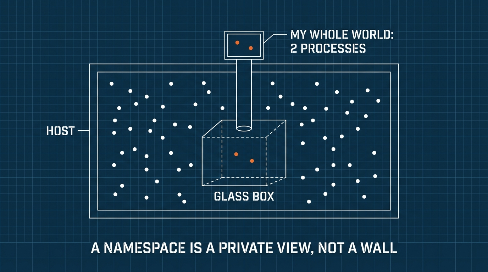
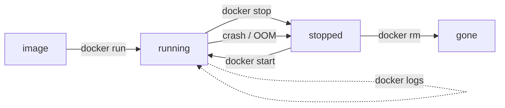

Part 1 claimed a container is "a normal process plus isolation". This part proves it — with commands you run yourself. By the end, containers stop being magic. That matters: engineers who know what a container *is* can debug one when it misbehaves.

## What you'll learn

- See a container from the outside: a plain process in the host's process list.
- Explain the three ingredients: namespaces (private view), cgroups (resource limits), and the layered image (private disk).
- Trigger and recognize an out-of-memory (OOM) kill — the most common container incident.
- Use the container lifecycle commands: run, stop, exec, logs, rm.

**Prerequisites:** Part 1 (what a container is). A Linux machine or Docker Desktop.

## 1. Proof: the host can see your "isolated" container

Run a container, then look at it from the outside:

```bash
# Inside a container: sleep for 10 minutes
docker run -d --name naptime alpine sleep 600

# Now, from the HOST, look at the normal process list:
ps aux | grep "sleep 600"
```

You'll see `sleep 600` in the host's process list — a regular process with a regular process ID. There is no virtual machine, no separate OS. The kernel is running your process directly; it just *lies* to the process about the world around it.

That lie has three parts. Let's meet each one.

## 2. Ingredient 1 — namespaces: a private view of the system

A **namespace** is a kernel feature that gives a process its own private copy of one part of the system. Docker uses several at once:

| Namespace | The container gets its own... | You've seen it when... |
|---|---|---|
| PID | process list (its main process is PID 1) | `ps` inside a container shows 2 processes, not 300 |
| Network | network interfaces, ports | two containers can both bind port 80 |
| Mount | filesystem tree | `ls /` inside shows the image's files, not the host's |
| UTS | hostname | the container's hostname is its ID |

See the PID namespace lie in action:

```bash
docker exec naptime ps aux   # inside: ~2 processes, sleep is PID 1
ps aux | wc -l               # host: hundreds
```

Same kernel, two different answers — that's a namespace.



One consequence you'll use forever: **PID 1 inside the container is your app**. When the container stops, the kernel sends signals to that PID 1. If your app ignores signals, stops take 10 seconds and end in a force-kill (we fix that in Part 5's best practices).

## 3. Ingredient 2 — cgroups: hard resource limits

A **cgroup** (control group) caps how much CPU and memory a group of processes may use. Without limits, one greedy container starves every neighbor on the machine.

Trigger a memory limit on purpose — this is the most useful failure to have seen *before* production:

```bash
# Give the container only 64MB, then ask it to allocate 200MB
docker run --rm -m 64m --name greedy \
  python:3.12-alpine \
  python -c "x = bytearray(200 * 1024 * 1024)"
echo $?   # prints 137
```

Exit code **137** means the kernel killed the process (128 + signal 9). This is an **OOM kill** (out-of-memory). Remember the pattern: *container died with 137, no error logs* → check its memory limit first. This exact symptom is the #1 container incident in real systems, and Kubernetes reports it as `OOMKilled` (Part 7).

## 4. Ingredient 3 — the image: a layered, read-only disk

The mount namespace needs a filesystem to show. That's the **image**: a stack of read-only **layers**, one per build step. When a container starts, Docker adds one thin *writable* layer on top.

```
┌─ writable layer (this container's changes — dies with it)
├─ layer 3: your app code          ─┐
├─ layer 2: pip install ...         ├─ the image (read-only, shared)
└─ layer 1: python:3.12-alpine     ─┘
```

Two rules fall out of this design:

- **Layers are shared.** Ten containers from one image reuse the same read-only layers. That's why containers are MBs and start in milliseconds.
- **The writable layer is disposable.** Files a container writes vanish when it's removed. Anything worth keeping goes in a *volume* (Part 4) — never in the container itself.

Prove the second rule:

```bash
docker exec naptime touch /im-temporary
docker rm -f naptime
docker run --rm alpine ls /im-temporary   # No such file — new container, fresh layer
```

## 5. The lifecycle you'll use daily



The commands, with the habits that matter:

- `docker run` creates **and** starts. `--rm` auto-removes on exit (use it for experiments). `-d` runs in the background.
- `docker logs <name>` shows stdout/stderr — containers log to stdout, not to files (Part 5 explains why).
- `docker exec -it <name> sh` opens a shell inside — your debugger.
- `docker stop` is polite (signal, then wait); `docker kill` is not. `docker rm -f` does stop + remove.
- `docker ps -a` shows stopped containers too — the ones you forgot about.

## Practice (15 minutes)

Run the proof sequence end to end:

```bash
# 1. Start a long-lived container
docker run -d --name lab alpine sleep 600

# 2. Namespace proof: two views of one kernel
docker exec lab ps aux        # tiny world
ps aux | grep "sleep 600"     # same process, seen from the host

# 3. OOM proof: exit code 137
docker run --rm -m 64m python:3.12-alpine \
  python -c "x = bytearray(200*1024*1024)"; echo "exit: $?"

# 4. Disposable-layer proof
docker exec lab touch /temp-file
docker rm -f lab
docker run --rm alpine ls /temp-file   # not found

# 5. Clean check
docker ps -a                  # nothing left over
```

Expected results: step 2 shows the same `sleep` from both sides. Step 3 prints `exit: 137`. Step 4 ends with "No such file or directory".

## Check yourself

1. A container "died with exit code 137 and no error in the logs". What happened, and what do you check first?
2. Why can two containers on one machine both listen on port 80?
3. A teammate saved important output to `/tmp` inside a container, removed the container, and the file is gone. Which ingredient explains this?

<details><summary>See answers</summary>

1. The kernel OOM-killed it: the process exceeded its cgroup memory limit (137 = 128 + signal 9). Check the container's memory limit and the app's real memory use.
2. Each container has its own network namespace, so each has its own private port 80. They only conflict if both try to publish to the same *host* port.
3. The writable layer. Container writes go to a disposable layer that is deleted with the container — persistent data needs a volume.

</details>

## Key takeaways

- A container is a host process the kernel lies to: you proved it by seeing the same process from inside and outside.
- Namespaces give a private *view* (PIDs, network, filesystem); cgroups give hard *limits* — and exit 137 means the memory limit won.
- Images are shared read-only layers plus one disposable writable layer: fast to start, cheap to copy, and never a place to store data.
- Daily toolkit: `run -d --rm`, `logs`, `exec -it`, `stop`, `ps -a` — and your app is PID 1, so it must handle signals.

**Read more:** processes, signals, and OOM at the OS level are CS Foundations Part 5.

*Next — Part 3: Building Images That Don't Embarrass You.*
