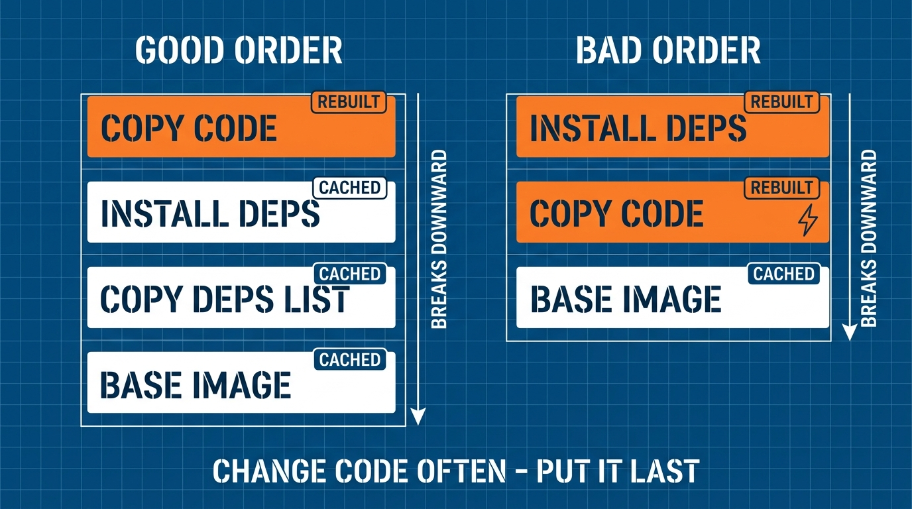

Bài 2 cho thấy image là một chồng layer. Bài này dạy bạn *build* các layer đó cho khéo. Khác biệt giữa một Dockerfile cẩu thả và một cái tốt: build 10 giây thay vì 5 phút, image 180 MB thay vì 1.2 GB. Cả hai khác biệt đến từ cùng hai ý tưởng.

## Bạn sẽ học được gì

- Đọc và viết Dockerfile: 7 lệnh quan trọng nhất.
- Dùng layer cache — và ngừng phá nó bằng thứ tự lệnh sai.
- Cắt kích thước image bằng base slim, `.dockerignore`, và multi-stage build.
- Nhận diện 2 lỗi Dockerfile kinh điển trong bất kỳ repo nào bạn tham gia.

**Cần biết trước:** Bài 1–2 (container, image, layer). Đã cài Docker.

## 1. Một Dockerfile, từng dòng

**Dockerfile** là công thức của image. Mỗi lệnh tạo một layer. Đây là ví dụ đầy đủ, thật thà cho một API Python nhỏ:

```dockerfile
# 1. Bắt đầu từ base image — chọn bản "slim", đừng bản full
FROM python:3.12-slim

# 2. Đặt thư mục làm việc bên trong image
WORKDIR /app

# 3. Copy RIÊNG danh sách dependency trước (thứ tự này quan trọng — xem mục 2)
COPY requirements.txt .

# 4. Cài dependency — một layer, không để lại rác cache
RUN pip install --no-cache-dir -r requirements.txt

# 5. Giờ mới copy phần code còn lại
COPY . .

# 6. Ghi chú cổng app lắng nghe
EXPOSE 8000

# 7. Lệnh mà PID 1 chạy (nhớ bài 2: app của bạn nhận signal)
CMD ["uvicorn", "main:app", "--host", "0.0.0.0", "--port", "8000"]
```

Build và chạy:

```bash
docker build -t my-api:dev .
docker run -d -p 8000:8000 my-api:dev
```

Đó là 90% mọi Dockerfile bạn sẽ đọc. 10% còn lại (`ENV`, `ARG`, `USER`, `HEALTHCHECK`) sẽ tới ở bài 5.

## 2. Cache: vì sao thứ tự lệnh quyết định tốc độ build

Docker cache mọi layer. Khi rebuild, nó tái dùng layer đã cache từ trên xuống **cho tới dòng đầu tiên có input thay đổi** — từ điểm đó trở xuống, mọi thứ build lại.

Một luật duy nhất này giải thích thứ tự `COPY` lạ lùng ở mục 1:

```text
THỨ TỰ TỐT (đổi code = rebuild 10s)         THỨ TỰ TỆ (đổi code = rebuild 5 phút)
────────────────────────────────────       ────────────────────────────────────
FROM python:3.12-slim            cached    FROM python:3.12-slim            cached
COPY requirements.txt .          cached    COPY . .                     ← THAY ĐỔI
RUN pip install ...              cached    RUN pip install ...          build lại!
COPY . .                     ← THAY ĐỔI    (pip cài lại tất cả, mọi lần)
```

Code của bạn đổi nhiều lần mỗi ngày. Dependency đổi mỗi tuần một lần. Vậy nên: **copy thứ ít đổi trước, thứ hay đổi sau cùng.** Toàn bộ phần tối ưu chỉ có vậy, và nó đáng giá vài phút cho mỗi lần build.



## 3. Kích thước: ba nhát cắt làm gần hết việc

Image to thì push chậm, pull chậm, khởi động chậm, và mang nhiều bề mặt tấn công hơn. Ba nhát cắt, theo thứ tự công sức:

**Nhát 1 — chọn base slim.** `python:3.12` nặng ~1 GB (kèm compiler và man page bạn không bao giờ dùng). `python:3.12-slim` ~150 MB. Một chữ, tiết kiệm ~850 MB. (Biến thể `alpine` còn nhỏ hơn, nhưng có thể làm hỏng các package Python cần glibc — slim là mặc định an toàn.)

**Nhát 2 — thêm `.dockerignore`.** `COPY . .` copy *tất cả*, gồm `.git`, virtualenv, dữ liệu test. Tạo `.dockerignore` cạnh Dockerfile:

```text
.git
.venv
__pycache__
*.pyc
tests/
.env
```

Dòng `.env` còn là luật **bảo mật**: secret không bao giờ được nướng vào layer của image — ai có image là đọc được mọi layer.

**Nhát 3 — multi-stage build** (nước đi pro, thiết yếu cho ngôn ngữ biên dịch):

```dockerfile
# Stage 1 "builder": có nguyên bộ toolchain, sẽ bị vứt đi
FROM node:22 AS builder
WORKDIR /app
COPY package*.json ./
RUN npm ci
COPY . .
RUN npm run build            # tạo ra dist/

# Stage 2: image bạn thật sự ship — chỉ server, không toolchain
FROM nginx:alpine
COPY --from=builder /app/dist /usr/share/nginx/html
```

Image cuối chỉ chứa stage 2. Node, npm và 800 MB `node_modules` không bao giờ được ship. Pattern này phổ quát: *build bằng image béo, ship bằng image gầy.*

## 4. Hai lỗi bạn giờ sẽ nhận ra khắp nơi

1. **`COPY . .` trước khi cài dependency** — mỗi lần đổi code là cài lại cả thế giới (mục 2). Bạn sẽ thấy lỗi này trong một nửa số Dockerfile trên mạng.
2. **Secret trong layer** — `COPY .env .` hay `RUN echo $TOKEN > config`. Layer là mãi mãi; `docker history` phơi chúng ra. Config đi vào lúc *runtime* (`docker run -e` hoặc mount file), không bao giờ lúc build.

## Thực hành (15 phút)

Tự đo các khoản thắng:

```bash
mkdir img-lab && cd img-lab
printf 'flask==3.0.3\n' > requirements.txt
printf 'print("hello")\n' > main.py

# 1. Bản "tệ"
cat > Dockerfile <<'EOF'
FROM python:3.12
COPY . .
RUN pip install --no-cache-dir -r requirements.txt
CMD ["python", "main.py"]
EOF
docker build -t lab:fat .            # ghi lại tổng thời gian
docker images lab:fat                # ghi lại SIZE (~1GB)

# 2. Sửa base image + thứ tự
cat > Dockerfile <<'EOF'
FROM python:3.12-slim
WORKDIR /app
COPY requirements.txt .
RUN pip install --no-cache-dir -r requirements.txt
COPY . .
CMD ["python", "main.py"]
EOF
docker build -t lab:slim .
docker images lab:slim               # so sánh SIZE

# 3. Chứng minh cache: đổi code, rebuild
echo 'print("v2")' > main.py
time docker build -t lab:slim .      # layer pip hiện CACHED; rebuild vài giây
```

Kết quả mong đợi: `lab:fat` cỡ 1 GB, `lab:slim` dưới 200 MB. Cú rebuild ở bước 3 tái dùng layer pip (tìm chữ `CACHED` trong output) và xong trong vài giây.

## Tự kiểm tra

1. Bạn đổi một dòng code mà rebuild mất 5 phút, cài lại toàn bộ dependency. Dockerfile sai chỗ nào?
2. Vì sao `COPY .env .` là một sự cố bảo mật, không chỉ là style xấu?
3. Multi-stage build giải quyết vấn đề gì, và quan trọng nhất với những ngôn ngữ nào?

<details><summary>Xem đáp án</summary>

1. Code được copy *trước* bước cài dependency, nên đổi code làm mất cache của layer cài đặt. Chuyển `COPY requirements.txt` + install lên trên `COPY . .`.
2. Secret thành một layer vĩnh viễn của image — ai pull được image là trích được nó bằng `docker history`/`docker save`, kể cả khi layer sau đã xoá file. Secret thuộc về runtime.
3. Nó tách toolchain build khỏi image được ship: biên dịch trong stage béo, chỉ copy artifact sang stage cuối gầy. Giá trị nhất với ngôn ngữ biên dịch/bundle (Go, Java, frontend Node) nơi toolchain to gấp bội artifact.

</details>

## Điều cần nhớ

- Bảy lệnh phủ 90% Dockerfile — và mỗi lệnh là một layer.
- Cache vỡ từ dòng thay đổi đầu tiên trở xuống: copy thứ ổn định (dependency) trước, thứ hay đổi (code) sau cùng.
- Kích thước đến từ ba nhát cắt: base slim, `.dockerignore` (đồng thời là luật secret), multi-stage build.
- Secret không bao giờ vào layer — layer là mãi mãi; config đi vào lúc runtime.

*Bài tiếp theo — Phần 4: Docker Compose: môi trường local thành code.*
