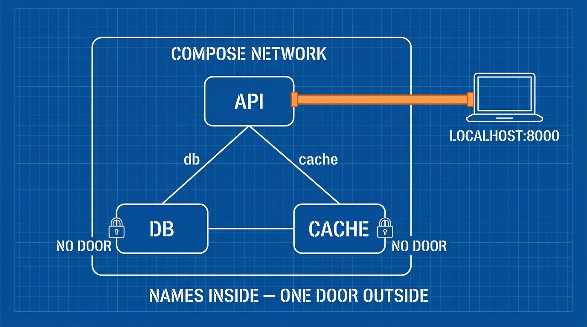

A real app is never one container. It's an API *plus* a database *plus* a cache — and telling a new teammate to start all three by hand, with the right ports and passwords, is the "works on my machine" problem all over again. **Docker Compose** fixes it: the whole stack described in one file, started with one command.

## What you'll learn

- Describe a multi-container stack in one `compose.yaml`.
- Explain the three building blocks: services, networks, volumes.
- Understand how containers find each other by *name* (this is the Kubernetes preview).
- Keep database data alive across restarts — and know when it gets deleted.

**Prerequisites:** Parts 1–3. Docker Desktop or Docker Engine with the compose plugin.

## 1. The file: three blocks describe everything

Here is a complete stack — API, Postgres, Redis:

```yaml
# compose.yaml
services:
  api:
    build: .                 # build from the Dockerfile in this folder (Part 3)
    ports:
      - "8000:8000"          # host:container — only the API is exposed
    environment:
      DATABASE_URL: postgres://app:secret@db:5432/appdb
      REDIS_URL: redis://cache:6379
    depends_on:
      - db
      - cache

  db:
    image: postgres:16
    environment:
      POSTGRES_USER: app
      POSTGRES_PASSWORD: secret
      POSTGRES_DB: appdb
    volumes:
      - dbdata:/var/lib/postgresql/data   # data survives restarts

  cache:
    image: redis:7

volumes:
  dbdata:                    # a named volume, managed by Docker
```

```bash
docker compose up -d      # start everything, in the right order
docker compose ps         # see the stack
docker compose logs api   # logs of one service
docker compose down       # stop and remove containers (volumes survive!)
```

Read the file top-down: **services** are the containers to run. **volumes** are the data that must outlive them. Networks are the third block — and Compose already made one for you, which is the interesting part.

## 2. Networking: containers find each other by name

Look at the API's config again: `DATABASE_URL: postgres://app:secret@db:5432/appdb`. The hostname is just **`db`** — the *service name*.

Compose puts all services on a shared private network, with built-in DNS that resolves service names to containers. Three consequences:

- **No IP addresses, ever.** `db` and `cache` work today, tomorrow, and on your teammate's machine. IPs change; names don't.
- **Only published ports are reachable from outside.** The API has `ports:`, so your browser reaches it at `localhost:8000`. Postgres has no `ports:` — it's reachable *only* by other services on the network. That's a security default worth keeping: your database should not be on localhost by accident.
- **This is the Kubernetes preview.** In Part 8 you'll meet K8s Services doing exactly this — stable names in front of changing containers. Learn it here with 3 services; it transfers directly.



## 3. Volumes: the data that must survive

Part 2 proved container storage is disposable. For a database that's a disaster — so the `db` service mounts a **named volume**: `dbdata:/var/lib/postgresql/data`. Docker stores that directory *outside* the container's writable layer.

The lifecycle rules to memorize:

| Command | Containers | Named volumes |
|---|---|---|
| `docker compose restart` | restarted | untouched |
| `docker compose down` | **removed** | untouched — data survives |
| `docker compose down -v` | removed | **deleted** — the reset button |

`down -v` is both the footgun and the feature: it wipes your local database. Terrifying in production thinking, *useful* locally — it's how you test your app against a completely fresh database.

One more mount type you'll use daily during development: a **bind mount** maps a host folder into the container, so code changes appear instantly without rebuilding:

```yaml
  api:
    build: .
    volumes:
      - ./src:/app/src     # live-edit code without rebuilds
```

Rule of thumb: **named volumes for data, bind mounts for code you're editing.**

## 4. The habits that make Compose pleasant

- **`depends_on` orders startup, not readiness.** Postgres's *container* starts before the API, but Postgres itself may not be accepting connections yet. Real fix: a `healthcheck` on `db` plus `depends_on: { db: { condition: service_healthy } }` — or an app that retries its DB connection (the robust answer you'll want in production anyway).
- **Don't commit real secrets.** Local throwaway passwords like `secret` are fine in `compose.yaml`; anything real belongs in a git-ignored `.env` file, which Compose reads automatically (`${DB_PASSWORD}` in the yaml).
- **One `docker compose up` = onboarding.** The measure of a good compose file: a new teammate clones the repo, runs one command, and has the full stack. If your README has 12 setup steps, the compose file isn't done.

## Practice (15 minutes)

Build the stack above and test the three big claims:

```bash
mkdir compose-lab && cd compose-lab
# minimal API stand-in: use redis + postgres + an alpine "app" that pings them
cat > compose.yaml <<'EOF'
services:
  app:
    image: alpine
    command: sh -c "apk add --no-cache postgresql-client redis >/dev/null &&
      until pg_isready -h db -U app; do sleep 1; done &&
      redis-cli -h cache ping && echo STACK-OK && sleep 600"
    depends_on: [db, cache]
  db:
    image: postgres:16
    environment: { POSTGRES_USER: app, POSTGRES_PASSWORD: secret, POSTGRES_DB: appdb }
    volumes: [ "dbdata:/var/lib/postgresql/data" ]
  cache:
    image: redis:7
volumes:
  dbdata:
EOF

docker compose up -d
docker compose logs app | tail -3     # expect: PONG + STACK-OK  (names worked!)

# Volume survival test
docker compose exec db psql -U app -d appdb -c "CREATE TABLE t(x int); INSERT INTO t VALUES (42);"
docker compose down                    # containers gone...
docker compose up -d
docker compose exec db psql -U app -d appdb -c "SELECT * FROM t;"   # 42 survives!

# The reset button
docker compose down -v                 # now the volume is gone too
```

Expected results: the app reaches `db` and `cache` *by name* (PONG + STACK-OK). The row `42` survives a full `down`/`up`. After `down -v`, a fresh `up` would have no table.

## Check yourself

1. Your API connects to `postgres://...@db:5432/...`. Nothing named `db` exists on your laptop — why does this work?
2. A teammate ran `docker compose down` and worries the local database is lost. Is it?
3. Why should the database service usually have no `ports:` section?

<details><summary>See answers</summary>

1. Compose's private network has DNS that resolves the *service name* `db` to its container. Names are stable; IPs aren't.
2. No — `down` removes containers but keeps named volumes. Only `down -v` deletes the data.
3. Without published ports, the DB is reachable only by services on the compose network — not from the host or the outside. Fewer exposed doors by default.

</details>

## Key takeaways

- One `compose.yaml`, one `up`: services (containers), networks (automatic, name-based), volumes (data that survives).
- Containers talk by service name over a private network; only published ports face the outside — a security default and a direct preview of Kubernetes Services.
- Named volumes for data, bind mounts for live-edited code; `down` keeps data, `down -v` is the reset button.
- `depends_on` orders startup only — readiness needs healthchecks or app-level retries.

*Next — Part 5: Registries, Tags & Container Best Practices.*
