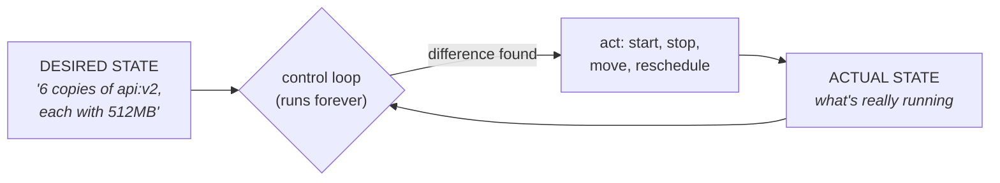

Stage A ended with a confession hidden in plain sight: everything ran on *one machine*. Real products outgrow one machine — and the moment you have two, a whole new class of problems appears that Docker alone does not solve. This part names those problems precisely, so Kubernetes (next part) arrives as an obvious answer instead of alien vocabulary.

## What you'll learn

- Name the four problems that appear the moment you run containers on more than one machine.
- Explain "desired state reconciliation" — the one idea underneath every orchestrator.
- Compare the three realistic options: Kubernetes, ECS-class, and serverless containers.
- Decide honestly whether you need an orchestrator *yet*.

**Prerequisites:** Stage A (Parts 1–5), especially Compose (Part 4) — orchestration is Compose's ideas, scaled out.

## 1. The day one machine stops being enough

Your Compose stack from Part 4 is a hit. Traffic grows. You buy a second server. Immediately, four questions with no good manual answers:

1. **Placement** — a new container needs to run. *Which machine?* The one with free memory? You're now a human scheduler, checking `htop` on N hosts before every deploy.
2. **Healing** — machine 2 dies at 3 a.m. Its containers just... stop existing. Who notices? Who restarts them elsewhere? (On one machine, `restart: always` handled crashes — but nothing handles *the machine itself* dying.)
3. **Discovery** — the API on machine 1 needs the cache that *was* on machine 2 but got restarted onto machine 3. Compose's name-based DNS (Part 4) only worked *inside one host's network*. Across machines, who keeps the phone book?
4. **Deploys** — rolling out v2 across 20 containers on 5 machines, a few at a time, health-checking each, rolling back on failure — by hand, that's an afternoon of terror per release.

Each problem is solvable with scripts. All four together, changing every hour, is a full-time job. That job is the **orchestrator**.

## 2. The one idea: desired state reconciliation

Every orchestrator — Kubernetes, ECS, Nomad — is the same machine at heart, and you already know it from Terraform (IaC series, Part 1):

You declare *what should be true*; a control loop compares it with *what is true* and fixes the difference — forever. Every headline feature is this loop wearing a costume:

- Machine dies → actual drops to 4 copies → loop starts 2 elsewhere. That's **self-healing** — not magic, just reconciliation.
- You change desired to `api:v3` → loop replaces containers a few at a time. That's a **rolling deploy**.
- You change desired to 12 copies (or an autoscaler does) → loop finds room on the fleet. That's **scaling**.

The mental shift, same as Terraform's: **stop giving commands, start declaring outcomes.** You never tell an orchestrator "restart that container" — you tell it what should exist, and restarts fall out.

## 3. Your three realistic options

| | Kubernetes (EKS/GKE/AKS) | ECS-class (managed, simpler) | Serverless containers (Fargate/Cloud Run-class) |
|---|---|---|---|
| You manage | Cluster concepts, YAML, upgrades | Service definitions, less surface | Almost nothing — image + CPU/RAM |
| Power & ecosystem | Maximum — the industry standard | Enough for most web/API workloads | Intentionally limited |
| Ops burden | Real, even managed | Low | Near zero |
| Cost shape | Cluster runs 24/7 | Cluster or serverless capacity | Scales to zero |
| Best when | Platform teams, complex needs, portability | AWS-native teams shipping services | Spiky traffic, small teams, simple services |

Honest guidance for 2026: **the skills transfer up, not down.** Learning Kubernetes concepts (Parts 7–10) prepares you for all three — ECS is the same reconciliation loop with fewer knobs; serverless is the loop with almost all knobs hidden. That's why this course teaches K8s concepts and then, in Part 11, asks the practical question "so what should *your team* actually run?" (spoiler: often not raw K8s).

## 4. Do you need one yet?

The honest checklist — you likely **don't** need an orchestrator if: one or two machines are enough; a 5-minute deploy window at 2 a.m. is acceptable; and one person can hold the whole system in their head. Compose plus a `restart: always` policy carries a surprising distance — and skipping the orchestrator is skipping a real ops tax.

You **do** need one when any of these become true: a machine dying must not wake anyone up; deploys must be zero-downtime and frequent; traffic swings force you to add/remove capacity weekly; or multiple teams ship to shared infrastructure. Then the tax pays for itself — and the next four parts teach you the standard way to pay it.

## Practice (10 minutes — thought experiment, no cluster needed)

Take your Part 4 compose stack and stress-test it on paper:

1. Draw your 3 services across **two** imagined machines. Decide placement yourself — which service goes where, and why? (You just did the scheduler's job.)
2. Now "kill" one machine with a pen stroke. List every step to recover manually: notice, decide where survivors go, start them, fix the connection strings. Time-estimate each step honestly.
3. Write the desired-state sentence for your stack in the orchestrator's language: "N copies of X with Y memory, reachable at name Z." Keep this sentence — in Part 7 you'll write it as real Kubernetes YAML and watch the loop do steps 1–2 for you.

## Check yourself

1. `restart: always` restarts crashed containers. Why doesn't that solve the healing problem in a multi-machine world?
2. What is the single idea underneath self-healing, rolling deploys, and autoscaling?
3. A 3-person startup runs one API with steady moderate traffic on two servers. Orchestrator now or later — and why?

See answers

1. Docker's restart policy lives *on* a machine — when the machine itself dies, there's nothing left running to restart anything. Healing across machines needs an outside supervisor with a fleet-wide view: the orchestrator.
2. Desired-state reconciliation: a control loop forever comparing declared state with actual state and correcting the difference. Each feature is one kind of difference being corrected.
3. Probably later. Two machines, steady traffic, tiny team — Compose + restart policies + a simple deploy script is less to operate and less to learn. The checklist flips when machine-death must be silent, deploys must be zero-downtime, or team/traffic growth forces it.

## Key takeaways

- One machine hides four problems; N machines expose them: placement, healing, discovery, deploys — the orchestrator's job description.
- Everything is one idea: desired state reconciliation — Terraform's mental model, running as a forever-loop for containers.
- Three realistic options (K8s, ECS-class, serverless containers) share that idea; learn K8s concepts and they transfer to all of them.
- Don't pay the ops tax before you must — Compose carries small systems far; the checklist tells you when the flip happens.

*Next — Part 7: Kubernetes Core: Pod, Deployment, Service.*
