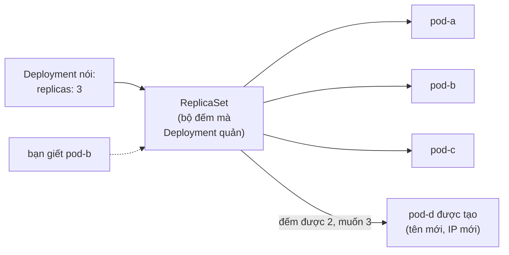

Kubernetes có một vấn đề từ vựng: hàng chục loại object, đa số bạn sẽ không đụng tới trong nhiều tháng. Phần lõi làm việc là **ba object**. Học mỗi cái *sinh ra để làm gì* — không chỉ YAML của nó — và output của `kubectl` bắt đầu có nghĩa. Bài này là ba object đó, cộng trải nghiệm tự-chữa-lành đầu tiên.

## Bạn sẽ học được gì

- Giải thích Pod, Deployment, Service mỗi cái một câu — và vì sao tồn tại ba tầng.
- Đọc và viết hai file YAML chạy một app thật.
- Dùng 6 lệnh kubectl của đời sống hằng ngày.
- Xem Kubernetes chữa lành một Pod bị giết — vòng lặp bài 6, trực tiếp.

**Cần biết trước:** Bài 6 (vì sao cần orchestration). Để thực hành: một cluster local bất kỳ — Kubernetes có sẵn trong Docker Desktop, `kind`, hoặc `minikube`.

## 1. Ba object, mỗi cái một câu

- **Pod** là đơn vị Kubernetes chạy: một hoặc vài container chung network và chung số phận. *Pod là cattle — chết thì bị thay, không bao giờ được sửa.* (Container của bài 2, giờ có scheduler quyết chỗ ở.)
- **Deployment** là bản hợp đồng desired-state của bạn: "giữ N bản của Pod template này chạy, và tung thay đổi từ từ." *Bạn gần như không bao giờ tạo Pod trực tiếp — bạn khai báo Deployment và Pod tự rơi ra.*
- **Service** là cái tên ổn định và địa chỉ ảo đứng trước một tập Pod luôn thay đổi. *Pod đến rồi đi, mỗi lần một IP mới; tên Service không bao giờ đổi.* (DNS theo tên của Compose bài 4, xây lại để sống sót qua sự xoay vòng của Pod.)

Vì sao ba tầng thay vì một? Tách vòng đời: Pod giữ *thứ chạy*, Deployment giữ *bao nhiêu và cập nhật thế nào*, Service giữ *cách với tới chúng*. Mỗi tầng đổi được mà không chạm tầng khác — bạn từng thấy nguyên tắc "một lý do để thay đổi" trong thiết kế code; đây là nó trong hạ tầng.

## 2. Hai file YAML chạy một app

```yaml
# deployment.yaml — CÁI GÌ chạy và BAO NHIÊU
apiVersion: apps/v1
kind: Deployment
metadata:
  name: web
spec:
  replicas: 3                      # trạng thái mong muốn: ba bản
  selector:
    matchLabels: { app: web }      # "pod của tôi là pod nhãn app=web"
  template:                        # Pod template — các thói quen bài 5 áp ở đây
    metadata:
      labels: { app: web }         # mỗi pod nhận nhãn này
    spec:
      containers:
        - name: web
          image: nginx:1.27        # tag bất biến (bài 5!)
          ports: [ { containerPort: 80 } ]
          resources:
            requests: { memory: "64Mi", cpu: "100m" }   # cho scheduler
            limits:   { memory: "128Mi" }               # trần cgroup (bài 2)
---
# service.yaml — cái TÊN ổn định đứng trước
apiVersion: v1
kind: Service
metadata:
  name: web                        # pod khác gọi app này ở http://web
spec:
  selector: { app: web }           # định tuyến tới pod nào nhãn app=web
  ports: [ { port: 80, targetPort: 80 } ]
```

Chất keo là **label và selector** — phần người mới hay bỏ sót. Không gì "chứa" gì cả: Deployment tìm Pod của nó theo nhãn; Service tìm đích theo nhãn. Ghép lỏng bằng tag, không phải bằng sở hữu. (Nếu một Service có vẻ không định tuyến đi đâu, phép kiểm đầu tiên luôn là: nhãn trong selector có khớp *chính xác* nhãn của Pod không?)

Để ý cả `resources.requests` vs `limits`: requests là thứ **scheduler** dùng để chọn node (bài toán đặt-chỗ của bài 6, giải bằng số học); limits là trần cgroup bạn gặp ở bài 2 — vượt trần memory là Pod bị `OOMKilled`, exit 137, cùng câu chuyện, bộ áo mới.

## 3. kubectl hằng ngày: sáu lệnh

```bash
kubectl apply -f .          # khai báo desired state (mọi YAML trong thư mục)
kubectl get pods            # thứ đang thật sự chạy (thêm -w để xem live)
kubectl describe pod <tên>  # phần VÌ SAO: events, restarts, quyết định scheduling
kubectl logs <tên>          # stdout (thói quen logging bài 5 trả lãi ở đây)
kubectl exec -it <tên> -- sh    # mở shell bên trong (anh em của docker exec)
kubectl delete -f .         # gỡ những gì các file này khai báo
```

Thói quen phân biệt người dùng thành thạo: **`describe` trước khi đoán.** Mục Events ở cuối trả lời thẳng đa số câu "sao pod của tôi Pending/CrashLooping/OOMKilled".

## 4. Xem vòng lặp chữa lành — cú giết đầu tiên

Vòng lặp reconciliation của bài 6, giờ quan sát được:



Giết một Pod và Kubernetes không restart nó — nó **thay thế**: tên mới, IP mới, có khi node mới. Đây chính xác là lý do tầng Service tồn tại: consumer cứ gọi `http://web` trong khi các Pod bên dưới xoay vòng. (ReplicaSet ở giữa là cơ chế đếm của Deployment — bạn sẽ thấy nó trong output `kubectl get`; không bao giờ sửa nó trực tiếp.)

## Thực hành (20 phút — cluster local)

```bash
# 0. Bật cluster (chọn một): Docker Desktop → enable Kubernetes, hoặc: kind create cluster

# 1. Deploy hai file ở mục 2
kubectl apply -f deployment.yaml -f service.yaml
kubectl get pods -w          # xem 3 pod đạt Running, rồi Ctrl-C

# 2. Demo tự-chữa-lành
kubectl get pods             # ghi lại tên các pod
kubectl delete pod <một-cái>         # ám sát một pod
kubectl get pods             # một BẢN THAY THẾ xuất hiện — tên mới — trong vài giây

# 3. Chứng minh cái tên sống qua sự xoay vòng
kubectl run tester --rm -it --image=alpine -- sh
# bên trong:  wget -qO- http://web   → HTML của nginx (bằng tên Service!)
# exit

# 4. Scale kiểu khai báo — sửa replicas: 3 -> 5 trong file, rồi:
kubectl apply -f deployment.yaml
kubectl get pods             # năm pod, hai cái mới tinh

# 5. Dọn dẹp
kubectl delete -f deployment.yaml -f service.yaml
```

Kết quả mong đợi: bước 2 hiện một tên Pod mới xuất hiện không cần bạn giúp — reconciliation, trực tiếp. Bước 3 với tới nginx bằng cái tên `web` từ một Pod khác. Bước 4 scale bằng cách sửa *file*, không phải bằng lệnh — declarative tới cùng.

## Tự kiểm tra

1. Vì sao khai báo Deployment thay vì tạo Pod trực tiếp?
2. Service tồn tại, Pod đang Running, nhưng request tới Service bị treo. Kiểm tra gì đầu tiên?
3. Một Pod hiện `OOMKilled` trong `describe`. Trường YAML nào liên quan, và bài nào trước đó giải thích cơ chế?

<details><summary>Xem đáp án</summary>

1. Pod trần không được quản: nó chết (hoặc node của nó chết) thì không gì tạo lại. Deployment giữ số lượng mong muốn và template, nên vòng lặp thay thế tổn thất và tung thay đổi từ từ được.
2. Khớp nhãn: `selector` của Service phải khớp chính xác nhãn của Pod. Nhãn lệch = Service định tuyến vào tập rỗng — cú cấu hình sai thầm lặng kinh điển.
3. `resources.limits.memory` — trần memory cgroup từ bài 2. Container vượt trần và kernel giết nó (exit 137); nâng limit hoặc sửa mức dùng memory của app.

</details>

## Điều cần nhớ

- Ba object gánh Kubernetes hằng ngày: Pod (đơn vị thay được), Deployment (hợp đồng số lượng + rollout), Service (cái tên sống qua xoay vòng).
- Label và selector là chất keo — không gì sở hữu gì; nhãn lệch là cú hỏng thầm lặng kinh điển.
- Requests nuôi scheduler, limits là trần cgroup bài 2 — `OOMKilled` là exit 137 mặc áo Kubernetes.
- Giết một Pod và xem nó được thay: reconciliation là thật, và mục Events của `describe` là trạm debug đầu tiên.

*Bài tiếp theo — Phần 8: Config, Secrets & traffic tìm Pod thế nào.*
