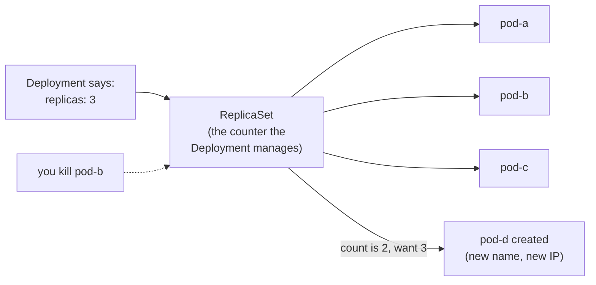

Kubernetes has a vocabulary problem: dozens of object types, most of which you won't touch for months. The working core is **three objects**. Learn what each one *is for* — not just its YAML — and `kubectl` output starts making sense. This part is those three, plus your first self-healing experience.

## What you'll learn

- Explain Pod, Deployment, and Service in one sentence each — and why three layers exist.
- Read and write the two YAML files that run a real app.
- Use the six kubectl commands of daily life.
- Watch Kubernetes heal a killed Pod — the Part 6 loop, live.

**Prerequisites:** Part 6 (why orchestration). For practice: any local cluster — Docker Desktop's built-in Kubernetes, `kind`, or `minikube`.

## 1. The three objects, one sentence each

- A **Pod** is the unit Kubernetes runs: one or more containers that share a network and fate. *Pods are cattle — they die and are replaced, never repaired.* (Part 2's containers, now with a scheduler deciding where they live.)
- A **Deployment** is your desired-state contract: "keep N replicas of this Pod template running, and roll out changes gradually." *You almost never create Pods directly — you declare Deployments and Pods fall out.*
- A **Service** is a stable name and virtual address in front of a changing set of Pods. *Pods come and go with new IPs each time; the Service name never changes.* (Compose's name-based DNS from Part 4, rebuilt to survive Pod churn.)

Why three layers instead of one? Separation of lifecycles: the Pod holds *what runs*, the Deployment holds *how many and how to update*, the Service holds *how to reach them*. Each can change without touching the others — you saw this "one reason to change" principle in code design; here it is in infrastructure.

## 2. The two YAML files that run an app

```yaml
# deployment.yaml — WHAT runs and HOW MANY
apiVersion: apps/v1
kind: Deployment
metadata:
  name: web
spec:
  replicas: 3                      # desired state: three copies
  selector:
    matchLabels: { app: web }      # "my pods are the ones labeled app=web"
  template:                        # the Pod template — Part 5's habits apply here
    metadata:
      labels: { app: web }         # each pod gets this label
    spec:
      containers:
        - name: web
          image: nginx:1.27        # immutable tag (Part 5!)
          ports: [ { containerPort: 80 } ]
          resources:
            requests: { memory: "64Mi", cpu: "100m" }   # for the scheduler
            limits:   { memory: "128Mi" }               # the cgroup cap (Part 2)
---
# service.yaml — the stable NAME in front
apiVersion: v1
kind: Service
metadata:
  name: web                        # other pods reach this app at http://web
spec:
  selector: { app: web }           # route to any pod labeled app=web
  ports: [ { port: 80, targetPort: 80 } ]
```

The glue is **labels and selectors** — the part newcomers miss. Nothing "contains" anything: the Deployment finds its Pods by label; the Service finds its targets by label. Loose coupling by tags, not ownership. (If a Service seems to route nowhere, the first check is always: do the selector labels *exactly* match the Pod labels?)

Notice also `resources.requests` vs `limits`: requests are what the **scheduler** uses to pick a node (Part 6's placement problem, solved with arithmetic); limits are the cgroup ceiling you met in Part 2 — exceed the memory limit and the Pod is `OOMKilled`, exit 137, same story, new costume.

## 3. Daily kubectl: six commands

```bash
kubectl apply -f .          # declare desired state (all YAML in this folder)
kubectl get pods            # what's actually running (add -w to watch live)
kubectl describe pod <name> # the WHY: events, restarts, scheduling decisions
kubectl logs <name>         # stdout (Part 5's logging habit pays off here)
kubectl exec -it <name> -- sh   # a shell inside (docker exec's twin)
kubectl delete -f .         # remove what these files declared
```

The habit that separates fluent users: **`describe` before guessing.** The Events section at the bottom answers most "why is my pod Pending/CrashLooping/OOMKilled" questions directly.

## 4. Watch the loop heal — your first kill

The Part 6 reconciliation loop, now observable:



Kill a Pod and Kubernetes doesn't restart it — it **replaces** it: new name, new IP, possibly a new node. This is exactly why the Service layer exists: consumers keep calling `http://web` while the Pods underneath churn. (The ReplicaSet in the middle is the Deployment's counter mechanism — you'll see it in `kubectl get` output; you never edit it directly.)

## Practice (20 minutes — local cluster)

```bash
# 0. Cluster up (pick one): Docker Desktop → enable Kubernetes, or: kind create cluster

# 1. Deploy the two files from section 2
kubectl apply -f deployment.yaml -f service.yaml
kubectl get pods -w          # watch 3 pods reach Running, then Ctrl-C

# 2. The self-healing demo
kubectl get pods             # note the pod names
kubectl delete pod <one-of-them>     # murder one
kubectl get pods             # a REPLACEMENT exists — new name — within seconds

# 3. Prove the stable name survives churn
kubectl run tester --rm -it --image=alpine -- sh
# inside:  wget -qO- http://web   → nginx HTML (by Service name!)
# exit

# 4. Declarative scaling — edit replicas: 3 -> 5 in the file, then:
kubectl apply -f deployment.yaml
kubectl get pods             # five pods, two brand new

# 5. Clean up
kubectl delete -f deployment.yaml -f service.yaml
```

Expected results: step 2 shows a new Pod name appear without your help — reconciliation, live. Step 3 reaches nginx by the name `web` from a different Pod. Step 4 scales by editing *the file*, not by command — declarative to the end.

## Check yourself

1. Why do you declare Deployments instead of creating Pods directly?
2. A Service exists, Pods are Running, but requests to the Service hang. What's the first thing to check?
3. A Pod shows `OOMKilled` in `describe`. Which YAML field is involved, and which earlier part explained the mechanism?

<details><summary>See answers</summary>

1. Bare Pods aren't managed: if one dies (or its node dies), nothing recreates it. A Deployment holds the desired count and template, so the loop replaces losses and can roll out changes gradually.
2. Label match: the Service's `selector` must exactly match the Pods' labels. Mismatched labels = a Service routing to an empty set — the classic silent misconfiguration.
3. `resources.limits.memory` — the cgroup memory cap from Part 2. The container exceeded it and the kernel killed it (exit 137); raise the limit or fix the app's memory use.

</details>

## Key takeaways

- Three objects carry daily Kubernetes: Pod (the replaceable unit), Deployment (desired count + rollout contract), Service (the name that survives churn).
- Labels and selectors are the glue — nothing owns anything; mismatched labels are the classic silent failure.
- Requests feed the scheduler, limits are the Part 2 cgroup cap — `OOMKilled` is exit 137 wearing Kubernetes clothes.
- Kill a Pod and watch it replaced: reconciliation is real, and `describe`'s Events section is your first debugging stop.

*Next — Part 8: Config, Secrets & How Traffic Finds Your Pod.*
