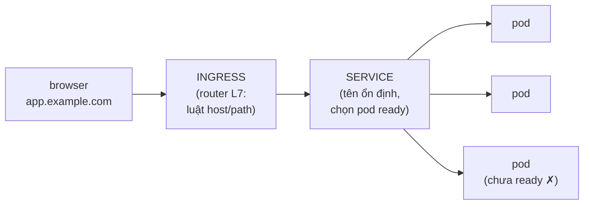

Bài 7 đã chạy được một app, nhưng còn hai lỗ hổng thật thà: config bị nướng cứng vào YAML, và "với tới app" nghĩa là một Pod thử nghiệm bên trong cluster. App thật đọc config thay đổi theo môi trường, giữ secret không được phép sống trong git, và nhận traffic từ thế giới bên ngoài. Bài này đóng cả hai lỗ hổng — và giới thiệu hai probe quyết định traffic có tới bạn hay không.

## Bạn sẽ học được gì

- Đưa configuration vào bằng ConfigMap và Secret — và chọn giữa env var với mount file.
- Lần theo ba chặng của một request: Ingress → Service → Pod.
- Dùng tên DNS trong cluster (`service.namespace`) đúng cách app gọi nhau ngoài đời.
- Cấu hình liveness và readiness probe — và biết vì sao nhầm lẫn hai cái gây sự cố thật.

**Cần biết trước:** Bài 7 (Pod, Deployment, Service). Thói quen "config đến từ môi trường" của bài 5 sắp trả lãi.

## 1. ConfigMap và Secret: config sống ngoài image

Bài 5 đã đặt luật: một image, config bơm vào lúc runtime. Kubernetes cho luật đó hai object:

```yaml
apiVersion: v1
kind: ConfigMap
metadata:
  name: web-config
data:
  LOG_LEVEL: "info"
  CACHE_TTL_SECONDS: "300"
---
apiVersion: v1
kind: Secret
metadata:
  name: web-secrets
stringData:                      # viết plain text; lưu dạng base64
  DATABASE_PASSWORD: "s3cr3t-tu-vault-khong-phai-tu-git"
```

Và Pod template tiêu thụ chúng:

```yaml
    spec:
      containers:
        - name: web
          image: myapp:1.4.2
          envFrom:
            - configMapRef: { name: web-config }    # mọi key thành env var
            - secretRef:    { name: web-secrets }
```

Hai ghi chú thật thà mà tutorial hay bỏ qua. Thứ nhất, **base64 của Secret là encoding, không phải encryption** — ai đọc được object Secret thì decode được bằng một lệnh. Giá trị thật của nó là sự tách bạch: quyền RBAC riêng, không có plain text trong YAML Deployment, và không có secret trong image (bài học layer của bài 5). Thứ hai, **team thật không commit YAML Secret vào git** — file ở trên là để học; secret production đến từ vault hoặc secrets manager của cloud qua operator/CSI. Cùng kỷ luật với Terraform state (series IaC, bài 3): giá trị nhạy cảm tồn tại, vậy hãy kiểm soát *nơi* nó sống.

**Env var hay mount file?** Env var cho một nhúm giá trị đơn (chúng được đọc một lần lúc khởi động — đổi config phải restart mới thấy). Mount thành file khi config vốn là một file trọn vẹn (kiểu nginx.conf) hoặc khi muốn thay đổi xuất hiện mà không đụng Pod spec — ConfigMap mount tự làm mới tại chỗ; env var thì không bao giờ.

## 2. Ba chặng: Ingress → Service → Pod



Mỗi chặng một việc:

- **Ingress** là cửa chính: router L7 (HTTP) ánh xạ hostname và path vào Service — `app.example.com → web-service`, `api.example.com/v2 → api-service` — và là chỗ chuẩn để kết thúc TLS. Nó cần một **ingress controller** (nginx-ingress, traefik, hoặc controller load-balancer của cloud) thật sự chạy trong cluster; object Ingress đứng một mình chỉ là luật không có động cơ.
- **Service** bạn đã biết từ bài 7: cái tên ổn định đứng trước đàn Pod xoay vòng.
- **Pod** nhận request — nhưng chỉ khi readiness probe của nó gật đầu (mục 4).

```yaml
apiVersion: networking.k8s.io/v1
kind: Ingress
metadata:
  name: web
spec:
  rules:
    - host: app.example.com
      http:
        paths:
          - path: /
            pathType: Prefix
            backend:
              service: { name: web, port: { number: 80 } }
```

## 3. DNS trong cluster: service gọi nhau bằng gì

Mỗi Service tự động có một tên DNS: `<service>.<namespace>`. Từ Pod cùng namespace, `http://web` trần là đủ (thực hành bài 7 đã chứng minh); khác namespace thì `http://web.team-a`. Đây là networking theo tên của Compose (bài 4) ở quy mô cluster — nghĩa là **config của app không bao giờ chứa IP**, chỉ chứa tên:

```text
DATABASE_HOST: "postgres.data-platform"     # tên Service, không bao giờ là IP
```

Tên trong config + Service phân giải tên = bạn dời, scale, thay thế Pod của database mà không chạm vào một consumer nào. Đó là trọn vẹn pattern.

## 4. Hai probe: còn sống không đồng nghĩa sẵn sàng

Kubernetes hỏi container của bạn hai câu khác nhau, và nối ngược dây gây sự cố thật:

| Probe | Câu hỏi | Khi fail |
|---|---|---|
| **Liveness** | "Còn sống không?" | Container bị **restart** |
| **Readiness** | "Nhận traffic được *ngay lúc này* không?" | Pod bị **rút khỏi Service** — không restart |

```yaml
          livenessProbe:
            httpGet: { path: /healthz, port: 8080 }
            periodSeconds: 10
            failureThreshold: 3      # ~30s fail → restart
          readinessProbe:
            httpGet: { path: /ready, port: 8080 }
            periodSeconds: 5         # fail nhanh → ngừng nhận traffic nhanh
```

Luật thiết kế: **`/healthz` chỉ kiểm tra chính mình; `/ready` được phép kiểm tra khả năng phục vụ tức thời.** Sự cố tự gây kinh điển là liveness probe đi kiểm tra database: DB chớp một nhịp, liveness fail khắp nơi, Kubernetes restart *mọi* Pod app cùng lúc, và một cú vấp dependency 30 giây thành một cơn bão restart. Rắc rối dependency thuộc về readiness (bước ra khỏi traffic, chờ) — không bao giờ thuộc về liveness. Readiness cũng chính là thứ khiến deploy zero-downtime của bài 10 chạy được: Pod mới không nhận traffic cho tới khi `/ready` gật.

## Thực hành (20 phút — cluster local)

Mở rộng bộ file bài 7:

```bash
# 1. Tạo config + secret, nối bằng envFrom (YAML mục 1), apply
kubectl apply -f .
kubectl exec deploy/web -- printenv | grep -E "LOG_LEVEL|DATABASE_PASSWORD"   # đủ cả hai

# 2. Chứng minh base64 ≠ bí mật
kubectl get secret web-secrets -o jsonpath='{.data.DATABASE_PASSWORD}' | base64 -d; echo

# 3. Xem readiness chặn traffic — thêm readinessProbe trỏ vào path
#    KHÔNG tồn tại (vd /nope), apply, rồi:
kubectl get pods            # cột READY hiện 0/1 — pod chạy nhưng không nhận gì
kubectl describe pod <một-cái> | tail -5    # events báo readiness probe failed
# sửa lại path (hoặc bỏ probe), apply lại → 1/1

# 4. Kiểm DNS từ pod tạm
kubectl run tester --rm -it --image=alpine -- nslookup web
```

Kết quả mong đợi: bước 2 in password plain text — bài học "encoding, không phải encryption" thành da thịt. Bước 3 là bước quan trọng: pod **Running** mà không phục vụ gì, vì ready ≠ sống. Bước 4 phân giải `web` ra một cluster IP — tên, không phải địa chỉ.

## Tự kiểm tra

1. Khi nào mount config thành file thay vì env var?
2. App của bạn phụ thuộc một database. Probe nào (nếu có) nên kiểm tra kết nối DB — và chọn nhầm cái kia thì hỏng kiểu gì?
3. Đồng đội nói "Secret an toàn mà, nó được base64-encode." Sửa lại cho chính xác thế nào?

<details><summary>Xem đáp án</summary>

1. Khi config vốn dĩ là một file trọn vẹn, hoặc khi muốn thay đổi xuất hiện không cần restart — ConfigMap mount tự cập nhật tại chỗ, env var đông cứng từ lúc container khởi động.
2. Readiness — Pod bước ra khỏi Service tới khi DB với được lại, không restart gì. Đặt vào liveness nghĩa là DB chớp một nhịp thì mọi Pod app restart đồng loạt: bão restart chồng lên cú vấp dependency.
3. Base64 là encoding đảo ngược được, không phải encryption — một lệnh là decode xong. Giá trị của Secret là tách bạch và kiểm soát truy cập (RBAC, không plain text trong YAML/image); secret thật nên đến từ hệ vault, không phải từ YAML trong git.

</details>

## Điều cần nhớ

- Config sống ngoài image: ConfigMap cho setting, Secret cho giá trị nhạy cảm — và base64 của Secret là encoding, không phải encryption; git không bao giờ giữ secret.
- Traffic đi ba chặng: Ingress (luật L7 + TLS, cần controller) → Service (tên ổn định) → chỉ những Pod ready.
- DNS trong cluster cho mỗi Service một cái tên (`service.namespace`) — config mang tên, không bao giờ mang IP.
- Liveness = "chết thì restart tôi"; readiness = "giữ traffic lại khi tôi chưa phục vụ được." Dependency thuộc về readiness; nối vào liveness là biến cú chớp thành bão restart.

*Bài tiếp theo — Phần 9: State, storage & batch job trên K8s.*
