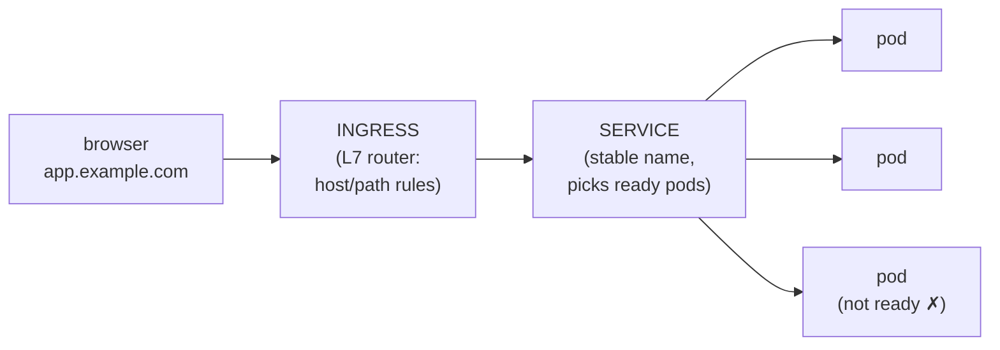

Part 7 ran an app, but two honest gaps remain: the config was baked into the YAML, and "reach the app" meant a test Pod inside the cluster. Real apps read config that changes per environment, hold secrets that must not live in git, and receive traffic from the outside world. This part closes both gaps — and introduces the two probes that decide whether traffic reaches you at all.

## What you'll learn

- Ship configuration with ConfigMaps and Secrets — and choose between env vars and mounted files.
- Trace a request's three hops: Ingress → Service → Pod.
- Use cluster DNS names (`service.namespace`) the way apps actually address each other.
- Configure liveness and readiness probes — and know why confusing them causes outages.

**Prerequisites:** Part 7 (Pods, Deployments, Services). Part 5's "config comes from the environment" habit is about to pay off.

## 1. ConfigMap and Secret: config lives outside the image

Part 5 established the rule: one image, config injected at runtime. Kubernetes gives that rule two objects:

```yaml
apiVersion: v1
kind: ConfigMap
metadata:
  name: web-config
data:
  LOG_LEVEL: "info"
  CACHE_TTL_SECONDS: "300"
---
apiVersion: v1
kind: Secret
metadata:
  name: web-secrets
stringData:                      # plain text here; stored base64-encoded
  DATABASE_PASSWORD: "s3cr3t-from-a-vault-not-from-git"
```

And the Pod template consumes them:

```yaml
    spec:
      containers:
        - name: web
          image: myapp:1.4.2
          envFrom:
            - configMapRef: { name: web-config }    # all keys become env vars
            - secretRef:    { name: web-secrets }
```

Two honesty notes the tutorials skip. First, **a Secret's base64 is encoding, not encryption** — anyone who can read the Secret object can decode it in one command. Its real value is separation: different RBAC permissions, no plain text in the Deployment YAML, and no secrets in the image (Part 5's layer lesson). Second, **real teams don't commit Secret YAML to git** — the file above is for learning; production secrets come from a vault or cloud secrets manager through an operator/CSI integration. Same discipline as Terraform state (IaC series, Part 3): the sensitive value exists, so control *where* it lives.

**Env vars or mounted files?** Env vars for a handful of scalar values (they're read once at startup — a config change needs a restart to be seen). Mount as files when config is a whole file (nginx.conf-style) or when you want updates to appear without rebuilding the Pod spec — mounted ConfigMaps refresh in place; env vars never do.

## 2. The three hops: Ingress → Service → Pod



Each hop has one job:

- **Ingress** is the front door: an L7 (HTTP) router mapping hostnames and paths to Services — `app.example.com → web-service`, `api.example.com/v2 → api-service` — and the standard place TLS terminates. It needs an **ingress controller** (nginx-ingress, traefik, or your cloud's load-balancer controller) actually running in the cluster; the Ingress object alone is just rules with no engine.
- **Service** you know from Part 7: the stable name in front of churning Pods.
- **Pod** receives the request — but only if its readiness probe says so (section 4).

```yaml
apiVersion: networking.k8s.io/v1
kind: Ingress
metadata:
  name: web
spec:
  rules:
    - host: app.example.com
      http:
        paths:
          - path: /
            pathType: Prefix
            backend:
              service: { name: web, port: { number: 80 } }
```

## 3. Cluster DNS: how services address each other

Every Service gets a DNS name automatically: `<service>.<namespace>`. From a Pod in the same namespace, plain `http://web` works (Part 7's practice proved it); across namespaces it's `http://web.team-a`. This is Compose's name-based networking (Part 4) at cluster scale — and it means **app config never contains IPs**, only names:

```text
DATABASE_HOST: "postgres.data-platform"     # a Service name, not an IP — ever
```

Names in config + Services resolving them = you can move, scale, and replace the database's Pods without touching a single consumer. That's the whole pattern.

## 4. The two probes: alive is not the same as ready

Kubernetes asks your container two different questions, and wiring them backwards causes real outages:

| Probe | The question | On failure |
|---|---|---|
| **Liveness** | "Are you alive at all?" | Container is **restarted** |
| **Readiness** | "Can you take traffic *right now*?" | Pod is **removed from the Service** — no restart |

```yaml
          livenessProbe:
            httpGet: { path: /healthz, port: 8080 }
            periodSeconds: 10
            failureThreshold: 3      # ~30s of failure → restart
          readinessProbe:
            httpGet: { path: /ready, port: 8080 }
            periodSeconds: 5         # fail fast → stop receiving traffic fast
```

The design rule: **`/healthz` checks only yourself; `/ready` may check your moment-to-moment ability to serve.** The classic self-inflicted outage is a liveness probe that checks the database: the DB blips, liveness fails everywhere, Kubernetes restarts *every* app Pod at once, and a 30-second dependency hiccup becomes a full restart storm. Dependency trouble belongs in readiness (step out of traffic, wait) — never in liveness. Readiness is also what makes Part 10's zero-downtime deploys work: a new Pod gets no traffic until `/ready` says yes.

## Practice (20 minutes — local cluster)

Extend Part 7's files:

```bash
# 1. Create config + secret, wire them with envFrom (YAML from section 1), apply
kubectl apply -f .
kubectl exec deploy/web -- printenv | grep -E "LOG_LEVEL|DATABASE_PASSWORD"   # both present

# 2. Prove base64 ≠ secrecy
kubectl get secret web-secrets -o jsonpath='{.data.DATABASE_PASSWORD}' | base64 -d; echo

# 3. Watch readiness gate traffic — add a readinessProbe pointing at a path
#    that does NOT exist (e.g. /nope), apply, then:
kubectl get pods            # READY column shows 0/1 — pods run but receive nothing
kubectl describe pod <one> | tail -5    # events say readiness probe failed
# fix the path (or remove the probe), apply again → 1/1

# 4. DNS check from a scratch pod
kubectl run tester --rm -it --image=alpine -- nslookup web
```

Expected results: step 2 prints the password in plain text — the "encoding, not encryption" lesson made visceral. Step 3 is the important one: pods **Running** yet serving nothing, because ready ≠ alive. Step 4 resolves `web` to a cluster IP — names, not addresses.

## Check yourself

1. When do you mount config as files instead of env vars?
2. Your app depends on a database. Which probe, if either, should check the DB connection — and what goes wrong if you pick the other one?
3. A teammate says "Secrets are secure, they're base64-encoded." What's the accurate correction?

<details><summary>See answers</summary>

1. When the config is a whole file by nature, or when you want changes to appear without a restart — mounted ConfigMaps update in place, env vars are frozen at container start.
2. Readiness — the Pod steps out of the Service until the DB is reachable again, no restarts. Putting it in liveness means a DB blip restarts every app Pod simultaneously: a restart storm on top of a dependency hiccup.
3. Base64 is reversible encoding, not encryption — one command decodes it. Secrets' value is separation and access control (RBAC, no plain text in Deployment YAML/images); real secret material should come from a vault-class system, not from YAML in git.

</details>

## Key takeaways

- Config lives outside the image: ConfigMaps for settings, Secrets for sensitive values — and Secret base64 is encoding, not encryption; git never holds secrets.
- Traffic makes three hops: Ingress (L7 rules + TLS, needs a controller) → Service (stable name) → ready Pods only.
- Cluster DNS gives every Service a name (`service.namespace`) — config carries names, never IPs.
- Liveness = "restart me if dead"; readiness = "hold traffic while I can't serve." Dependencies belong in readiness; wiring them into liveness turns blips into restart storms.

*Next — Part 9: State, Storage & Batch Jobs on K8s.*
