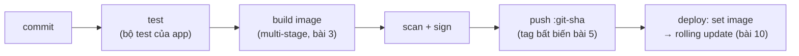

Mười một bài trước, container là một chiếc hộp bí ẩn. Giờ bạn biết nó là một process mặc hoá trang, biết build image gọn, chạy local bằng Compose, điều phối bằng Kubernetes, và chọn nền tảng một cách thật thà. Hồi kết này lắp mảnh cuối — con đường tự động từ `git push` tới Pod đang chạy — thêm lớp bảo mật phủ trọn con đường, và khép lại bằng điều khoá học này thật sự dạy.

## Bạn sẽ học được gì

- Lắp pipeline build-push-deploy cho container và nối vào các ý CI/CD bạn đã sở hữu.
- Áp checklist bảo mật container sáu điểm phủ đa số rủi ro ngoài đời.
- Nối image tag với deploy để mọi release truy vết được về một commit.
- Map những gì đã học sang series AWS và Terraform — và biết ba nước đi kế tiếp.

**Cần biết trước:** thật thà mà nói là cả series — bài này đứng trên bài 3 (image), 5 (registry), 8 (config), và 10 (deploy).

## 1. Pipeline: git push → Pod đang chạy

Series CS (S01-P12) cho bạn CI/CD cho code; series IaC (S12-P09) cho hạ tầng. Container nhận cùng nhịp năm phách, với image là artifact:



```yaml
# pseudo-CI — các job container, phương ngữ nào cũng vậy
on_push_to_main:
  - run: docker build -t registry.example.com/web:${GIT_SHA} .
  - run: scan-image web:${GIT_SHA} --fail-on critical     # cổng chặn, không phải báo cáo
  - run: docker push registry.example.com/web:${GIT_SHA}
  - run: kubectl set image deployment/web web=registry.example.com/web:${GIT_SHA}
```

Chi tiết gánh tải là cái **tag**: `:${GIT_SHA}` khiến mọi Pod đang chạy truy vết được về đúng một commit — `kubectl describe pod | grep Image` trả lời "production đang chạy code nào?" trong một dòng. Đây là luật "tag bất biến" của bài 5 trả cổ tức: rollback (`rollout undo` bài 10) quay về một bản build *đã biết*, và "trên máy em chạy được" chết hẳn vì image của máy *chính là* image của pipeline. Phần còn lại bạn đã sở hữu: exit code chặn cổng từng chặng (S02-P03), phần review hình-plan nằm trong PR, và cú deploy là rolling update bài 10 kích bằng một trường thay đổi.

## 2. Security: sáu thói quen phủ đa số rủi ro thật

Bảo mật container viết được cả sách; bộ làm việc gói trong một checklist. Mỗi mục là một bài học cũ mặc giáp:

1. **Base image tối giản** (bài 3): base họ slim/distroless chở ít package hơn — mỗi package vắng mặt là một CVE (Common Vulnerabilities and Exposures) bạn không bao giờ phải vá. Ít bề mặt, ít nhiễu khi scan, pull nhỏ hơn.
2. **Scan là cổng chặn, không phải báo cáo** (bài 5): pipeline *fail* khi có finding critical. Scanner chỉ gửi PDF là bài học alarm-fatigue lần nữa — báo cáo chất đống, cổng chặn hành động. Rebuild định kỳ kể cả không đổi code: base sạch hôm qua là danh sách CVE của tháng sau.
3. **Non-root, read-only** (thói quen bài 5, giờ cưỡng chế): `USER app` trong Dockerfile, và trong Kubernetes một `securityContext` — `runAsNonRoot: true`, `readOnlyRootFilesystem: true`, `allowPrivilegeEscalation: false`. Ba dòng biến "container escape" từ một thể loại thành một kỳ tích.
4. **Secret tránh xa image và bãi env** (bài 3, 8): không secret trong layer (`docker history` nhớ tất cả), object Secret thay plaintext, nguồn họ vault cho production. Một image bị lộ chỉ nên làm bạn mất code, không mất gì khác.
5. **Danh tính workload least-privilege** (role của S04-P02, trong cluster): mỗi workload có ServiceAccount riêng gắn đúng các quyền API nó dùng — ServiceAccount mặc định với RBAC rộng là chiếc key `AdministratorAccess` nằm trong repo, phiên bản cluster.
6. **Ký và xác minh xuất xứ**: ký image trong CI (tool họ cosign) và cho cluster chỉ nhận image có chữ ký. Điều này khép vòng mà scanning không khép được: không chỉ "nó sạch không?" mà **"có phải *mình* build nó không?"** — sự trung thực chuỗi-cung-ứng cho chính artifact.

Pattern xuyên cả sáu: **cấu trúc, không phải cảnh giác.** Như role-thay-key và pipeline-thay-laptop, mỗi thói quen xoá một thể loại sai lầm thay vì xin con người cẩn thận mãi mãi.

## 3. Tư duy container: khoá học này thật sự dạy gì

Bóc lớp YAML đi, mười một bài dạy năm ý tưởng chuyển giao được:

- **Mô hình process** (bài 1–2): container là process với namespace và cgroup — nên log, signal, exit code, OOM kill hành xử đúng như Linux xưa nay. Debug container là debug process.
- **Artifact bất biến** (bài 3, 5): build một lần, tag mãi mãi, config lúc runtime. Cùng ý tưởng chạy xuyên file Parquet (S02), file plan (S12-P08), model artifact (S03) — niềm tin đến từ bất biến cộng xuất xứ.
- **Khai báo, đừng ra lệnh** (bài 6–7): desired state + vòng lặp reconciliation. Ý tưởng của Terraform, của Kubernetes, và ngày càng là *cái* ý tưởng của vận hành hiện đại.
- **Tách rời bằng hợp đồng** (bài 4, 8–9): tên thay IP, claim thay disk, Service thay Pod — mỗi tầng nói chuyện với một giao diện và sống sót khi bên kia xoay vòng.
- **Trả tiền nền tảng có chủ đích** (bài 11): thuế là thật, mẫu số là số team, và "tool nhỏ hơn, chọn trong hiểu biết" là câu trả lời senior.

**Đi tiếp đâu — ba nước:** (1) các phần compute của series AWS (S04-P08) giờ đọc như "khoá học này, tính giá theo giờ"; (2) series Terraform chạy cùng vòng lặp khai báo thấp hơn một tầng — hạ tầng *chứa* cluster của bạn; (3) tự dựng lại một thứ của chính mình đầu-cuối: repo → pipeline → registry → cluster → rolling deploy, với checklist mục 2 xanh hết. Dự án đó đáng giá hơn mọi chứng chỉ.

## Thực hành (30 phút — capstone, cluster local)

Lắp cả khoá học vào một artifact:

```bash
# 1. Lấy một web app nhỏ bất kỳ (hoặc nginx + một trang tĩnh) và cho nó:
#    - Dockerfile multi-stage, USER app, base có pin (bài 3+5)
#    - một cú build: docker build -t web:$(git rev-parse --short HEAD) .

# 2. Scan và đọc kết quả như engineer, không như còi báo động:
#    (scanner họ trivy) — đếm critical trong layer CỦA BẠN vs của base image

# 3. Deploy đủ lễ nghĩa (bài 7-10):
#    Deployment có resources, đủ hai probe, securityContext (runAsNonRoot,
#    readOnlyRootFilesystem), một Service, và block strategy của bài 10
kubectl apply -f .

# 4. Ship một "release": đổi trang, rebuild với git sha MỚI, rồi
kubectl set image deployment/web web=web:<sha-mới>
kubectl rollout status deployment/web        # từng đợt, có probe của bạn gác

# 5. Trả lời câu hỏi production trong một dòng:
kubectl get deployment web -o jsonpath='{.spec.template.spec.containers[0].image}'
```

Kết quả mong đợi: bước 2 thường cho thấy đa số critical đến từ base image — lập luận base-tối-giản, định lượng trên chính bản build của bạn. Bước 4 lăn không rơi giọt downtime nào nhờ probe *của bạn*. Bước 5 in ra một image tag *chính là* một commit hash — production, truy vết được về một cái diff. Cả khoá học nằm trong output của một câu lệnh.

## Tự kiểm tra

1. Vì sao `:${GIT_SHA}` làm image tag là chốt trục của cả pipeline — nêu hai thứ nó làm khả thi.
2. Scanner báo 40 critical. Trước khi hoảng, cú chẻ đầu tiên là gì — và mục checklist nào rút con số nhiều nhất?
3. *Ký* image bảo đảm điều gì mà *scan* image không thể?

<details><summary>Xem đáp án</summary>

1. Truy vết được (mọi Pod đang chạy map về đúng một commit — audit và debug thành one-liner) và rollback an toàn (undo quay về bản build đã-biết, không đổi — bất khả thi với `:latest` khả biến có thể đã dời).
2. Chẻ finding thành "layer của mình" vs "layer của base image" — hai chủ sở hữu, hai cách sửa khác nhau. Base tối giản (họ slim/distroless) thường xoá đa số finding phía base một phát, vì các package dính lỗi đơn giản là không có ở đó.
3. Xuất xứ: rằng *pipeline của bạn* build đúng artifact này và nó không bị tráo sau đó. Scanner có thể cho qua một image độc-mà-không-CVE; xác minh chữ ký từ chối mọi thứ CI của bạn không sản xuất, bất kể kết quả scan.

</details>

## Điều cần nhớ

- Pipeline là năm phách — test, build, scan, push `:git-sha`, lăn — và tag commit-hash bất biến khiến production truy vết được, rollback an toàn.
- Security là sáu thói quen cấu trúc: base tối giản, scan-làm-cổng, non-root+read-only, secret ngoài artifact, danh tính least-privilege, xuất xứ có ký.
- Nội dung thật của khoá học là năm ý tưởng chuyển giao: process, artifact bất biến, trạng thái khai báo, hợp đồng giữa các tầng, chi phí nền tảng có chủ đích.
- 🏁 **Series hoàn chỉnh.** Tiếp theo: compute AWS (S04) tính giá khoá học này theo giờ; Terraform (S12) khai báo tầng bên dưới nó; và một capstone đầu-cuối của riêng bạn đáng giá hơn mọi chứng chỉ.

*Khép lại Docker & Kubernetes — xem [trang series](/series/docker-k8s) để có syllabus đầy đủ.*
