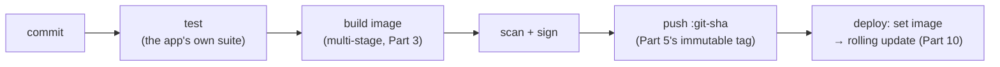

Eleven parts ago, a container was a mystery box. Now you know it's a process in a costume, you can build lean images, run them locally with Compose, orchestrate them with Kubernetes, and choose honestly among platforms. This finale assembles the last piece — the automated road from `git push` to running Pods — adds the security layer that spans the whole road, and closes with what this course was really about.

## What you'll learn

- Assemble the container build-push-deploy pipeline and connect it to the CI/CD ideas you already own.
- Apply the six-point container security checklist that covers most real-world risk.
- Wire image tags to deploys so every release is traceable to a commit.
- Map what you've learned onto the AWS and Terraform series — and know your next three moves.

**Prerequisites:** the whole series, honestly — this part stands on Parts 3 (images), 5 (registries), 8 (config), and 10 (deploys).

## 1. The pipeline: git push → running Pods

The CS series (S01-P12) gave you CI/CD for code; the IaC series (S12-P09) gave it for infrastructure. Containers get the same five-beat rhythm, with images as the artifact:



```yaml
# pseudo-CI — the container jobs, in every system's dialect
on_push_to_main:
  - run: docker build -t registry.example.com/web:${GIT_SHA} .
  - run: scan-image web:${GIT_SHA} --fail-on critical     # gate, not report
  - run: docker push registry.example.com/web:${GIT_SHA}
  - run: kubectl set image deployment/web web=registry.example.com/web:${GIT_SHA}
```

The load-bearing detail is the **tag**: `:${GIT_SHA}` makes every running Pod traceable to an exact commit — `kubectl describe pod | grep Image` answers "what code is in production?" in one line. This is Part 5's "immutable tags" rule paying its dividend: rollback (Part 10's `rollout undo`) returns to a *known* build, and "works on my machine" dies for good because the machine's image *is* the pipeline's image. Everything else in the pipeline you already own: exit codes gate stages (S02-P03), the plan-shaped review lives in the PR, and the deploy is Part 10's rolling update triggered by one field change.

## 2. Security: six habits that cover most real risk

Container security fills books; the working set fits a checklist. Each item is an earlier lesson wearing armor:

1. **Minimal base images** (Part 3): slim/distroless-class bases ship fewer packages — every absent package is a CVE (Common Vulnerabilities and Exposures) you'll never patch. Less surface, less scanning noise, smaller pulls.
2. **Scan as a gate, not a report** (Part 5): the pipeline *fails* on critical findings. A scanner that only emails PDFs is the alarm-fatigue lesson again — reports pile up, gates act. Rebuild periodically even without code changes: yesterday's clean base is next month's CVE list.
3. **Non-root, read-only** (Part 5's habit, now enforced): `USER app` in the Dockerfile, and in Kubernetes a `securityContext` — `runAsNonRoot: true`, `readOnlyRootFilesystem: true`, `allowPrivilegeEscalation: false`. Three lines that turn "container escape" from a category into an accomplishment.
4. **Secrets stay out of images and env dumps** (Parts 3, 8): no secrets in layers (`docker history` remembers everything), Secrets objects over plaintext, vault-class sources for production. A leaked image should cost you nothing but code.
5. **Least-privilege service identity** (S04-P02's roles, in-cluster): each workload gets its own ServiceAccount bound to only the API permissions it uses — the default ServiceAccount with broad RBAC is the cluster's `AdministratorAccess` key in a repo.
6. **Sign and verify provenance**: sign images in CI (cosign-class tooling) and let the cluster admit only signed images. This closes the loop scanning can't: not just "is it clean?" but **"did *we* build it?"** — supply-chain honesty for the artifact itself.

The pattern across all six: **structural, not vigilant.** Like roles-over-keys and pipelines-over-laptops, each habit removes a class of mistake instead of asking humans to be careful forever.

## 3. Thinking in containers: what this course was actually about

Strip away the YAML and eleven parts taught five transferable ideas:

- **The process model** (Parts 1–2): a container is a process with namespaces and cgroups — so logs, signals, exit codes, and OOM kills behave exactly as Linux always did. Debugging containers is debugging processes.
- **Immutable artifacts** (Parts 3, 5): build once, tag forever, configure at runtime. The same idea runs through Parquet files (S02), plan files (S12-P08), and model artifacts (S03) — trust comes from immutability plus provenance.
- **Declare, don't command** (Parts 6–7): desired state + reconciliation loop. Terraform's idea, Kubernetes's idea, and increasingly *the* idea of modern operations.
- **Decouple through contracts** (Parts 4, 8–9): names over IPs, claims over disks, Services over Pods — every layer talks to an interface and survives the other side churning.
- **Pay for platforms deliberately** (Part 11): the tax is real, the divisor is teams served, and "the smaller tool, chosen knowingly" is a senior answer.

**Where to go from here — three moves:** (1) the AWS series' compute parts (S04-P08) now read as "this course, priced by the hour"; (2) the Terraform series runs the same declarative loop one level down — infrastructure that *hosts* your clusters; (3) rebuild something you own end-to-end: repo → pipeline → registry → cluster → rolling deploy, with the section 2 checklist green. That project is worth more than any certificate.

## Practice (30 minutes — capstone, local cluster)

Assemble the whole course into one artifact:

```bash
# 1. Take any small web app (or nginx + a static page) and give it:
#    - a multi-stage Dockerfile, USER app, pinned base (Parts 3+5)
#    - a build: docker build -t web:$(git rev-parse --short HEAD) .

# 2. Scan it and read the result like an engineer, not an alarm:
#    (trivy-class scanner) — count criticals in YOUR layers vs the base image's

# 3. Deploy with full manners (Parts 7-10):
#    Deployment with resources, both probes, securityContext (runAsNonRoot,
#    readOnlyRootFilesystem), a Service, and the strategy block from Part 10
kubectl apply -f .

# 4. Ship a "release": change the page, rebuild with the NEW git sha, then
kubectl set image deployment/web web=web:<new-sha>
kubectl rollout status deployment/web        # waves, gated by your probe

# 5. Answer the production question in one line:
kubectl get deployment web -o jsonpath='{.spec.template.spec.containers[0].image}'
```

Expected results: step 2 usually shows most criticals come from the base image — the minimal-base argument, quantified on your own build. Step 4 rolls with zero downtime because of *your* probe. Step 5 prints an image tag that *is* a commit hash — production, traceable to a diff. That's the whole course in one command's output.

## Check yourself

1. Why is `:${GIT_SHA}` as the image tag the linchpin of the whole pipeline — name two things it makes possible.
2. Your scanner reports 40 criticals. Before panicking, what's the first split to make — and which checklist item shrinks the number most?
3. What does image *signing* guarantee that image *scanning* cannot?

<details><summary>See answers</summary>

1. Traceability (any running Pod maps to an exact commit — auditing and debugging become one-liners) and safe rollback (undo returns to a known, unchanged build — impossible with a mutable `:latest` that may have moved).
2. Split findings into "my layers" vs "base image layers" — they have different owners and fixes. A minimal (slim/distroless-class) base usually eliminates most of the base-layer findings at once, because the vulnerable packages simply aren't there.
3. Provenance: that *your* pipeline built this exact artifact and it wasn't substituted after the fact. A scanner can pass a malicious-but-CVE-free image; signature verification rejects anything your CI didn't produce, whatever its scan results.

</details>

## Key takeaways

- The pipeline is five beats — test, build, scan, push `:git-sha`, roll — and the immutable commit-hash tag makes production traceable and rollback safe.
- Security is six structural habits: minimal bases, scan-as-gate, non-root+read-only, secrets out of artifacts, least-privilege identities, signed provenance.
- The course's real content was five transferable ideas: processes, immutable artifacts, declared state, contracts between layers, deliberate platform costs.
- 🏁 **Series complete.** Next: AWS compute (S04) prices this course by the hour; Terraform (S12) declares the layer beneath it; and one end-to-end capstone of your own beats any certificate.

*This concludes Docker & Kubernetes — see the [series page](/series/docker-k8s) for the full syllabus.*
