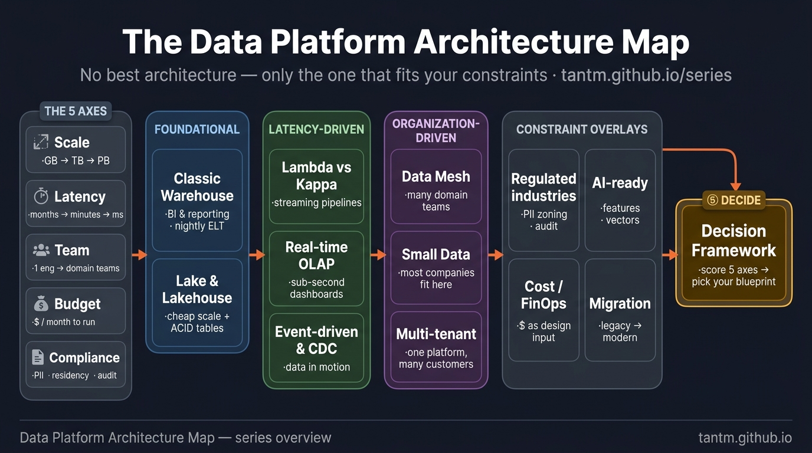
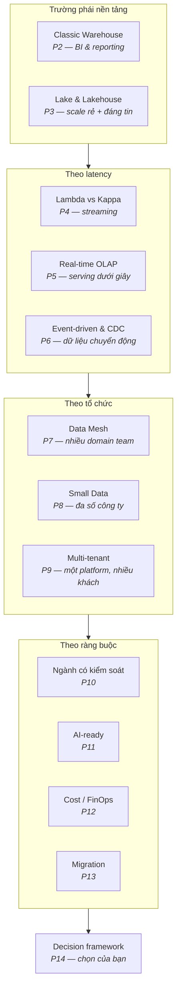

Hỏi năm architect thiết kế "một data platform" và bạn sẽ nhận năm sơ đồ khác nhau — và, khó chịu thay, cả năm đều có thể đúng. Data platform cho một startup 10 người, một chuỗi bán lẻ 500 cửa hàng, và một ngân hàng chịu kiểm soát là ba cỗ máy khác nhau tình cờ trùng tên.

Series này là chuyến tham quan có dẫn đường qua các trường phái kiến trúc lớn — warehouse, lakehouse, streaming, mesh, small data, multi-tenant, và hơn nữa — với một câu hỏi lặp đi lặp lại không khoan nhượng: **dưới ràng buộc nào thì bản thiết kế này thắng?**

## Tiền đề khó chịu: không có "tốt nhất"

Các cuộc tranh luận kiến trúc nghe như tranh luận công nghệ ("lakehouse vs warehouse!") nhưng thực ra là **tranh luận về ràng buộc**. Mỗi trường phái trên bản đồ đều được phát minh bởi ai đó mà ràng buộc của họ khiến trường phái trước đó trở nên đau đớn:

- Data lake ra đời vì warehouse không chứa nổi dữ liệu rẻ, bừa, phi cấu trúc.
- Lakehouse ra đời vì lake biến thành đầm lầy không ai dám tin.
- Kappa ra đời vì nuôi hai đường code của Lambda quá mệt.
- Data mesh ra đời vì một team trung tâm thành nút cổ chai của tất cả.
- Và phong trào phản đề "small data" ra đời vì đa số công ty ôm hết những thứ trên trong khi toàn bộ lịch sử dữ liệu của họ vẫn nằm gọn trên một con server to.

Không phát minh nào xoá phát minh trước. **Chúng xếp chồng.** Việc của bạn không phải chọn cái mới nhất — mà chọn cái có nỗi-đau-khai-sinh khớp với nỗi đau hiện tại của bạn.

## Năm trục thật sự quyết định

Trước mọi sơ đồ, hãy chấm điểm tình huống của bạn trên năm trục. Mọi khuyến nghị trong series đều truy về chúng:

| Trục | Câu hỏi | Vì sao nó thống trị |
|---|---|---|
| **Scale** | GB, TB hay PB — và tăng nhanh cỡ nào? | Dưới ~1 TB, gần như mọi thứ đều chạy; trên đó, vật lý bắt đầu bỏ phiếu |
| **Latency** | Quyết định theo tháng, phút, hay mili-giây? | Real-time đắt gấp ~10 lần batch về vận hành — chỉ trả tiền nếu business hành động theo nó |
| **Team** | 1 engineer, một team, hay nhiều domain team? | Kiến trúc có yêu cầu quân số; mesh với 3 engineer là một bức vẽ, không phải platform |
| **Budget** | Mỗi tháng chịu chi bao nhiêu để vận hành? | Cost là đầu vào kiến trúc, không phải chuyện tính sau (Phần 12 dành trọn cho nó) |
| **Compliance** | PII? Residency? Audit? Cơ quan quản lý? | Một câu "dữ liệu phải ở on-prem" lật cả bản đồ (Phần 10) |

Viết năm câu trả lời của bạn ra ngay — nghiêm túc đấy, vào một tờ note. Mỗi phần của series sẽ kết bằng việc chỉ ra câu trả lời nào hướng về, hay tránh xa, kiến trúc đó.

## Bản đồ

Bốn nhóm, một điểm kết. Nhóm **nền tảng** trả lời "dữ liệu sống ở đâu, hình thù thế nào". Nhóm **theo latency** tồn tại vì có người nói "dữ liệu hôm qua là quá cũ". Nhóm **theo tổ chức** tồn tại vì kiến trúc phải khớp hình dạng công ty (định luật Conway không tha cho data team). Nhóm **theo ràng buộc** là các lớp phủ — quy định, độ sẵn sàng AI, chi phí, và nghệ thuật di cư giữa tất cả những thứ trên mà không đánh rơi business.

## Cùng một bài toán, ba khách hàng, ba đáp án đều đúng

Để "còn tuỳ" bớt trừu tượng, đây là một bài toán — *"chúng tôi muốn dashboard bán hàng và tồn kho"* — được giải đúng theo ba cách:

- **Startup (2 engineer, 50 GB, không compliance):** Postgres replica + DuckDB + một BI tool. Không một hệ phân tán nào. Đây là Phần 8, và nó không phải phương án tạm — nó là kiến trúc ĐÚNG cho bộ ràng buộc này.
- **Chuỗi bán lẻ tầm trung (một data team, 5 TB, daily + vài luồng hourly):** warehouse hoặc lakehouse với các lớp medallion, batch ELT, có orchestration — Phần 2–3, cơm áo gạo tiền của ngành.
- **Ngân hàng (nhiều team, cơ quan quản lý, dữ liệu on-prem):** cùng các lớp logic đó, nhưng bọc trong PII zoning, audit lineage, kiểm soát residency, triển khai hybrid — Phần 10. Sơ đồ phình gấp đôi trước khi bảng đầu tiên được load, và đó là cái giá của ràng buộc, không phải over-engineering.

Cùng một câu hỏi business. Ba kiến trúc. Đều đúng. Đó là toàn bộ luận đề của series.

## Hai cảnh báo trước khi lên đường

1. **Resume-driven architecture là có thật.** Lực hút về phía "thứ đang trên sân khấu hội thảo" rất mạnh. Bản đồ ở trên không có trục "đang trend" — cố ý đấy.
2. **Kiến trúc là đồ thuê, không phải đồ mua đứt.** Ràng buộc sẽ đổi: startup lớn lên, business batch chuyển real-time. Phần 13 (migration) nằm trên bản đồ vì *mọi* platform sống lâu rồi cũng phải đi bộ giữa các trường phái. Thiết kế với lối ra trong đầu.

## Điều cần nhớ

- Không có kiến trúc data platform tốt nhất — mỗi trường phái sinh ra từ một nỗi đau cụ thể, và chúng xếp chồng chứ không thay thế nhau.
- Năm trục quyết định tất cả: scale, latency, hình dạng team, budget, compliance. Tự chấm điểm trước khi chạm vào sơ đồ.
- Cùng một nhu cầu business có các kiến trúc đúng khác nhau cho startup, công ty tầm trung, và enterprise chịu kiểm soát.
- Cảnh giác resume-driven architecture; thiết kế với migration trong đầu — ràng buộc rồi sẽ đổi.

*Tiếp theo — Phần 2: Data Warehouse cổ điển, vẫn chưa bị hạ bệ.*
