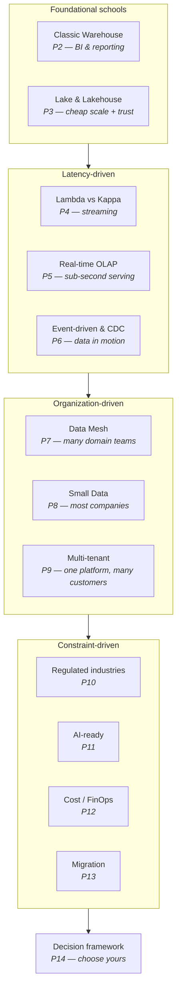

Ask five architects to design "a data platform" and you will get five different diagrams — and, uncomfortably, all five can be right. A data platform for a 10-person startup, a 500-store retailer, and a regulated bank are three different machines that happen to share a name.

This series is a guided tour of the major architecture schools — warehouse, lakehouse, streaming, mesh, small data, multi-tenant, and more — with one question asked relentlessly: **under which constraints does this design win?**

## What you'll learn

- Argue why there is no "best" data architecture — only fits and misfits.
- Score any use case on the five axes that actually decide an architecture.
- Navigate the map of 14 architectures this series covers.
- See how one problem gets three different right answers for three customers.

**Prerequisites:** the Data Engineer Roadmap (S02) helps a lot — this series chooses between the things S02 teaches you to build.

## 1. The uncomfortable premise: there is no "best"

Architecture debates sound like technology debates ("lakehouse vs warehouse!") but are actually **constraint debates**. Every school on this map was invented by someone whose constraints made the previous school painful:

- The data lake was born because warehouses couldn't hold cheap, messy, unstructured data.
- The lakehouse was born because lakes became swamps nobody could trust.
- Kappa was born because maintaining Lambda's two codepaths hurt.
- Data mesh was born because one central team became everyone's bottleneck.
- And the "small data" counter-movement was born because most companies adopted all of the above while their entire history still fits on one large server.

None of these inventions deleted the previous one. **They stacked.** Your job is not to pick the newest — it's to pick the one whose birth-pain matches your current pain.

## 2. The five axes that actually decide

Before any diagram, score your situation on five axes. Every recommendation in this series traces back to them:

| Axis | The question | Why it dominates |
|---|---|---|
| **Scale** | GBs, TBs, or PBs — and growing how fast? | Below ~1 TB, almost everything works; above, physics starts voting |
| **Latency** | Decisions in months, minutes, or milliseconds? | Real-time is 10× the operational cost of batch — pay only if the business acts on it |
| **Team** | 1 engineer, a team, or many domain teams? | Architectures have headcount requirements; a mesh with 3 engineers is a diagram, not a platform |
| **Budget** | What can you spend to run it monthly? | Cost is an architecture input, not an afterthought (Part 12 is entirely this) |
| **Compliance** | PII? Residency? Audit? Regulators? | One "data must stay on-prem" flips the whole map (Part 10) |

Write your five answers down now — seriously, in a note. Each part of this series ends by telling you which answers point toward, or away from, that architecture.

## 3. The map

Four groups, one ending. The **foundational** schools answer "where does data live and how is it shaped". The **latency-driven** group exists because someone said "yesterday's data is too old". The **organization-driven** group exists because architecture must match the shape of your company (Conway's law does not spare data teams). The **constraint-driven** group are overlays — regulation, AI-readiness, cost, and the art of migrating between all of the above without dropping the business.

## 4. Same problem, three customers, three right answers

To make "it depends" concrete, here's one problem — *"we want dashboards for sales and inventory"* — solved correctly three ways:

- **Startup (2 engineers, 50 GB, no compliance):** Postgres replica + DuckDB + a BI tool. Zero distributed systems. This is Part 8, and it is not a compromise — it is the correct architecture for these constraints.
- **Mid-size retailer (a data team, 5 TB, daily + some hourly):** a warehouse or lakehouse with medallion layers, batch ELT, orchestrated — Parts 2–3, the industry's bread and butter.
- **Bank (many teams, regulators, on-prem data):** the same logical layers, but wrapped in PII zoning, audit lineage, residency controls, hybrid deployment — Part 10. The diagram doubles in size before the first table is loaded, and that's the cost of the constraint, not over-engineering.

Same business question. Three architectures. All correct. That's the whole thesis of this series.

## 5. Two warnings before we start

1. **Resume-driven architecture is real.** The gravitational pull toward "what's on the conference stage" is strong. The map above has no "trendy" axis — that's deliberate.
2. **Architectures are rented, not bought.** Constraints change: the startup grows, the batch business goes real-time. Part 13 (migration) is on the map because *every* long-lived platform eventually walks between schools. Design with the exit in mind.

## Practice (10 minutes)

Score a real system on the five axes:

1. Pick one data system you know — at work, or a public case study.
2. Rate it 1–5 on each axis: data volume, freshness need, team size, budget sensitivity, compliance weight.
3. Write one sentence: "Given these scores, the architecture I'd expect is ___ — and what they actually run is ___." A mismatch is not automatically wrong; it's a question worth asking. You'll re-do this exercise with sharper eyes after Part 14's decision framework.

## Check yourself

1. Why does this series refuse to name a "best" architecture?
2. Name the five axes from memory.
3. A 5-person startup and a bank both need customer analytics. Which axes push them toward different architectures?

See answers

1. Because architecture is a fit between a design and a context — volume, freshness, team, budget, compliance. Change the context and the "best" answer changes with it.
2. Data volume, freshness requirement, team size/skill, budget sensitivity, compliance weight.
3. Team size (5 engineers vs hundreds), budget sensitivity (runway vs regulated budget), and compliance weight (almost none vs heavy) — pushing the startup toward simple managed/serverless and the bank toward governed, isolated, auditable platforms.

## Key takeaways

- There is no best data platform architecture — each school was born from a specific pain, and they stack rather than replace each other.
- Five axes decide everything: scale, latency, team shape, budget, compliance. Score yourself before touching a diagram.
- The same business need has different correct architectures for a startup, a mid-size company, and a regulated enterprise.
- Beware resume-driven architecture; design with migration in mind — constraints will change.

*Next up — Part 2: The Classic Data Warehouse, Still Undefeated.*
