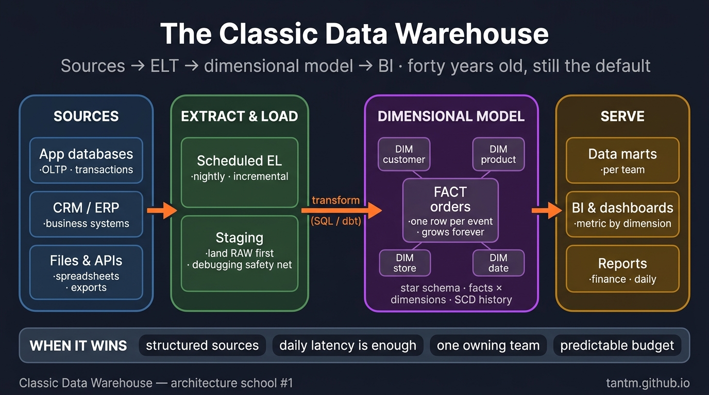
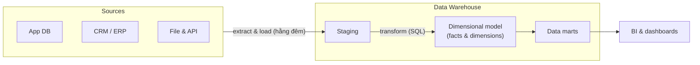

Cứ vài năm lại có một bài keynote tuyên bố data warehouse đã chết — bị lake giết, rồi lakehouse, rồi AI. Và năm nào cũng vậy, phần lớn báo cáo kinh doanh của thế giới vẫn lặng lẽ xuất xưởng từ một warehouse. Bốn mươi tuổi và vẫn là mặc định: sự trường thọ đó không phải quán tính, mà là **độ khớp**. Phần này giải thích kiến trúc cổ điển, vì sao nó khớp với nhiều công ty đến vậy, và chính xác khi nào nó hết khớp.

## Nỗi đau khai sinh

Warehouse được phát minh vì một lý do: **không thể phân tích dữ liệu ngay bên trong hệ thống đang vận hành business.** Database vận hành (OLTP) được tinh chỉnh cho hàng vạn giao dịch tí hon; analytics lại muốn quét khối lịch sử khổng lồ. Nhét cả hai vào một database thì báo cáo quý sẽ khoá cứng trang thanh toán. Vậy nên: chép dữ liệu ra, nắn lại theo câu hỏi, giữ lịch sử. Toàn bộ ý tưởng chỉ có thế.

## Sơ đồ chuẩn

Bốn nước đi, mỗi nước có tên hiện đại:

1. **Extract & Load** — chép từ nguồn theo lịch (hằng đêm là kinh điển; tool dạng EL thời nay làm sẵn việc này).
2. **Staging** — đáp dữ liệu THÔ trước. Khả năng debug sống ở đây: khi một con số trông sai, bạn còn chỗ để so với thứ thực sự đã tới.
3. **Transform** — SQL nắn staging thành **dimensional model**. Đây là chỗ dbt đứng trong modern stack; lưu ý thứ tự đã lật qua năm tháng từ ETL (transform trên đường vào) sang **ELT** (load thô, transform bên trong warehouse) — compute warehouse rẻ đi đã biến nó thành mặc định.
4. **Serve** — BI tool đọc facts và dimensions, thường qua các **data mart** theo phạm vi từng team.

## Kimball trong một lần ngồi

Dimensional model xứng đáng mười phút cuộc đời bạn, vì nó là ý tưởng thiết kế dữ liệu thành công nhất từng được xuất xưởng:

- **Fact table** — sự kiện kèm con số: một dòng mỗi order line, mỗi payment, mỗi page view. Dài và hẹp, lớn mãi.
- **Dimension table** — các danh từ để cắt lát: customer, product, store, date. Rộng và tương đối nhỏ.
- Ghép lại thành **star schema**: fact ở giữa, dimensions vây quanh.

Vì sao người làm business mê nó: mọi câu hỏi đọc thành *"metric theo dimension, lọc theo dimension"* — doanh thu **theo** vùng, **lọc** quý này. Vì sao engine mê nó: join dễ đoán (fact → dimension trên surrogate key), warehouse columnar nhai ngon lành. Bài toán khó duy nhất là **slowly changing dimension** — khách chuyển thành phố mà báo cáo năm ngoái vẫn phải hiện thành phố cũ thì sao (SCD Type 2: giữ các dòng theo phiên bản). Phần modeling của S02 sẽ đào sâu; ở đây chỉ cần biết bài toán này có sẵn catalog lời giải bốn mươi năm tuổi.

(Inmon vs Kimball, mỗi bên một dòng: Inmon = xây enterprise warehouse chuẩn hoá trước, suy ra marts; Kimball = xây thẳng dimensional marts, tích hợp bằng các dimension "conformed" dùng chung. Đa số team hiện đại rơi gần Kimball, kèm lớp raw/staging như một cái gật đầu với Inmon.)

## Khi nào nó vẫn là đáp án đúng

Chấm theo năm trục của Phần 1:

- **Scale:** vài GB tới vài chục TB — thoải mái. Cloud warehouse hiện đại kéo xa hơn, nhưng đây là vùng ngọt.
- **Latency:** quyết định theo ngày/tuần. Nếu "tính đến đêm qua" làm business hài lòng thì batch là một *tính năng* (rẻ, debug được, chạy lại được), không phải giới hạn.
- **Team:** một data team sở hữu pipeline đầu-cuối. Sở hữu tập trung ở đây là *điểm mạnh* — một nơi duy nhất định nghĩa "doanh thu".
- **Budget:** dễ đoán nhất trong mọi trường phái — compute chạy đêm + license BI. Không có hạ tầng streaming 24/7 ngồi không giữa các sự kiện.
- **Compliance:** câu chuyện chín muồi — access control, audit, lineage tooling đã có hàng chục năm.

Chân dung đó — nguồn có cấu trúc, nhịp hằng ngày, một team, phục vụ báo cáo — mô tả một tỷ lệ khổng lồ các công ty thật. Vì thế: chưa bị hạ bệ.

## Khi nào nên rời đi

- **Dữ liệu phi/bán cấu trúc ở khối lượng lớn** (log, event, tài liệu, ảnh) — nhét vào warehouse thì đắt và gượng gạo → Phần 3 (lakehouse).
- **Business hành động theo phút hoặc giây** (kiểm tra gian lận, vận hành live) → Phần 4–5.
- **Nhiều domain team giành nhau một backlog** — team trung tâm thành nút cổ chai → Phần 7 (mesh).
- **Dữ liệu nhỏ tới mức warehouse là nghi lễ** — startup 50 GB không cần bộ máy này → Phần 8 (small data).

## Cùng một warehouse, ba khách hàng

- **SME (archetype):** cloud warehouse managed, một EL tool, dbt, một BI tool. Một engineer chạy được. Trường hợp 80%.
- **Enterprise tầm trung:** cùng bộ khung + orchestration, môi trường (dev/prod), data mart theo phòng ban, kỷ luật SCD, giám sát chi phí.
- **Enterprise chịu kiểm soát:** vẫn bộ khung đó + PII zoning ở staging, quyền truy cập mức cột, chính sách retention, và thường thêm một quyết định residency (region nào/on-prem) — lớp phủ của Phần 10, không phải kiến trúc khác.

Bộ khung không đổi; lớp bọc thay đổi. Đó là bài học sẽ lặp lại suốt series này.

## Điều cần nhớ

- Warehouse tồn tại vì OLTP và analytics không thể chung một database; mọi thứ còn lại suy ra từ "chép ra, nắn lại, giữ lịch sử".
- ELT thay ETL: load thô, transform bằng SQL bên trong warehouse — dữ liệu staging là lưới an toàn khi debug.
- Star schema (facts × dimensions) sống bốn mươi năm vì cả người dùng business lẫn engine columnar đều yêu nó.
- Vẫn là đáp án đúng khi: nguồn có cấu trúc, latency theo ngày, một team sở hữu, budget dễ đoán. Rời đi khi khối phi cấu trúc, real-time, hoặc quy mô tổ chức ập tới.

*Tiếp theo — Phần 3: Lake, Warehouse, Lakehouse: cuộc hội tụ.*
