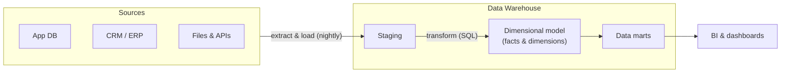
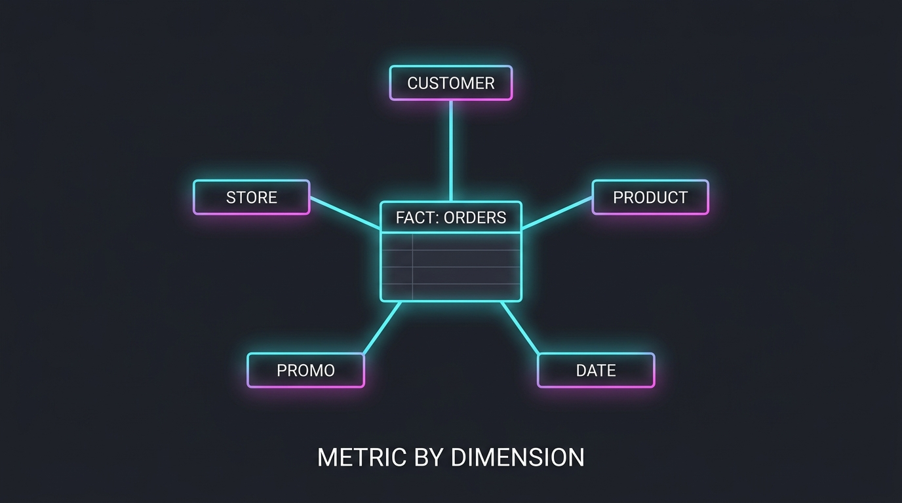

Every few years a keynote declares the data warehouse dead — killed by the lake, then by the lakehouse, then by AI. And every year, a majority of the world's business reporting quietly ships from a warehouse. Forty years old and still the default: that longevity is not inertia, it is **fit**. This part explains the classic architecture, why it fits so many companies, and precisely when it stops fitting.

## What you'll learn

- Explain why warehouses exist at all — the OLTP-vs-analytics conflict that started everything.
- Walk the four moves of the standard pipeline: extract & load, staging, transform, serve — and why ETL became ELT.
- Model a business question as a star schema (facts × dimensions) in one sitting.
- Score the warehouse on the Part 1 axes and name the exact conditions for walking away.

**Prerequisites:** Part 1 (the five evaluation axes). SQL basics help but aren't required — there's no code to run in this part.

## 1. The birth pain

The warehouse was invented for one reason: **you cannot analyze data inside the systems that run the business.** Operational databases (OLTP — online transaction processing) are tuned for many tiny transactions; analytics wants huge scans over history. Run both on one database and the quarterly report locks up the checkout page. So: copy data out, reshape it for questions, keep history. That's the whole idea.

## 2. The standard diagram

Four moves, each with a modern name:

1. **Extract & Load** — copy from sources on a schedule (nightly is the classic; tools of the EL kind do this off the shelf today).
2. **Staging** — land data raw first. Debuggability lives here: when a number looks wrong, you can compare against what actually arrived.
3. **Transform** — SQL reshapes staging into a **dimensional model**. This is where dbt lives in the modern stack; note the order flipped over the years from ETL (transform on the way in) to **ELT** (load raw, transform inside the warehouse) — cheap warehouse compute made that the default.
4. **Serve** — BI tools read facts and dimensions, often via team-scoped **data marts**.

## 3. Kimball in one sitting

The dimensional model deserves ten minutes of your life, because it is the most successful data design idea ever shipped:

- **Fact table** — events with numbers: one row per order line, per payment, per page view. Long and narrow, grows forever.
- **Dimension tables** — the nouns you slice by: customer, product, store, date. Wide and comparatively small.
- Together they form a **star schema**: facts in the middle, dimensions around it.

Why business users love it: every question reads as *"metric by dimension, filtered by dimension"* — revenue **by** region, **filtered to** this quarter. Why engines love it: joins are predictable (fact → dimension on surrogate keys), so columnar warehouses chew through it. The one hard problem is **slowly changing dimensions** — what happens when a customer moves cities and last year's report must still show the old city (SCD Type 2: keep versioned rows). S02's modeling part goes deeper; here it's enough to know the problem has a forty-year-old catalog of answers.

(Inmon vs Kimball, one line each: Inmon = build a normalized enterprise warehouse first, derive marts; Kimball = build dimensional marts directly, integrate via shared "conformed" dimensions. Most modern teams land closer to Kimball, with a raw/staging layer as a nod to Inmon.)

## 4. When it is still the right answer

Score it on the Part 1 axes:

- **Scale:** GBs to tens of TB — comfortably. Modern cloud warehouses stretch further, but this is the sweet spot.
- **Latency:** decisions made daily/weekly. If "as of last night" satisfies the business, batch is a feature (cheap, debuggable, retryable), not a limitation.
- **Team:** one data team owns the pipeline end to end. Central ownership is a *strength* here — one place where "revenue" is defined.
- **Budget:** the most predictable of all schools — nightly compute + BI licenses. No 24/7 streaming infrastructure idling between events.
- **Compliance:** mature story — access control, auditability, and lineage tooling are decades old.

That profile — structured sources, daily cadence, one team, reporting-driven — describes an enormous share of real companies. Hence: undefeated.

**When to walk away:**

- **Unstructured or semi-structured data at volume** (logs, events, documents, images) — storing these in a warehouse gets expensive and awkward → Part 3 (lakehouse).
- **The business acts in minutes or seconds** (fraud checks, live ops) → Parts 4–5.
- **Many domain teams fighting over one backlog** — the central team becomes the bottleneck → Part 7 (mesh).
- **Data volume so small a warehouse is ceremony** — a startup with 50 GB doesn't need this machinery → Part 8 (small data).

## 5. The same warehouse, three customers

- **SME (archetype):** managed cloud warehouse, one EL tool, dbt, one BI tool. One engineer can run it. The 80% case.
- **Mid-size enterprise:** same skeleton + orchestration, environments (dev/prod), data marts per department, SCD discipline, cost monitoring.
- **Regulated enterprise:** same skeleton again + PII zoning in staging, column-level access, retention policies, and often a residency decision (which region/on-prem) — the Part 10 overlay, not a different architecture.

The skeleton doesn't change; the wrapping does. That's a recurring lesson in this series.

## Practice (15 minutes — pen and paper)

Design the star for a food-delivery business:

1. Pick the core event and write its **fact table** header: one row per delivered order — which numeric columns belong (amount, delivery minutes, tip)? Which don't (customer email — that's a dimension attribute)?
2. Name **four dimensions** you'd hang around it, with 3 example attributes each.
3. Write three business questions in the pattern *metric by dimension, filtered by dimension* and check each one is answerable from your star with a single fact→dimension join per dimension.
4. Stress-test with SCD: a restaurant changes its commission tier mid-year. Which table changes, and what must be true so *last quarter's* report still shows the old tier?

Expected results: step 3 should feel mechanical — that's the schema working. Step 4's answer is a versioned row in the restaurant dimension (SCD Type 2), with the fact rows keeping the key of the version that was current at order time.

## Check yourself

1. Why can't analytics just run on the operational database — what exactly breaks?
2. What's the practical difference between ETL and ELT, and what made ELT the modern default?
3. A team has 30 GB of clean relational data, daily reporting needs, and one engineer. Warehouse school, lakehouse, or something smaller — and why?

See answers

1. OLTP is tuned for many small transactions; analytics runs huge historical scans. Sharing one database means analytic queries lock up or starve the transactional workload — the quarterly report competing with the checkout page.
2. ETL transforms before loading (transform logic lives outside the warehouse); ELT lands raw data first and transforms with SQL inside. Cheap, elastic warehouse compute made in-warehouse SQL transforms (the dbt pattern) simpler and more debuggable — staging keeps the raw evidence.
3. Warehouse school, in its smallest form (Part 8's small-data variant is close): structured data, daily cadence, one owner is exactly the warehouse's sweet spot. A lakehouse earns its complexity only with unstructured volume or engine diversity this team doesn't have.

## Key takeaways

- The warehouse exists because OLTP and analytics cannot share a database; everything else follows from "copy out, reshape, keep history".
- ELT replaced ETL: land raw, transform with SQL inside the warehouse — staging data is your debugging safety net.
- The star schema (facts × dimensions) is forty years old because both business users and columnar engines love it.
- Still the right answer for: structured sources, daily latency, one owning team, predictable budget. Walk away when unstructured volume, real-time, or organizational scale arrives.

*Next up — Part 3: Lake, Warehouse, Lakehouse: the Convergence.*
