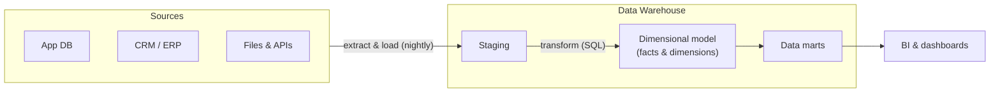

Every few years a keynote declares the data warehouse dead — killed by the lake, then by the lakehouse, then by AI. And every year, a majority of the world's business reporting quietly ships from a warehouse. Forty years old and still the default: that longevity is not inertia, it is **fit**. This part explains the classic architecture, why it fits so many companies, and precisely when it stops fitting.

## The birth pain

The warehouse was invented for one reason: **you cannot analyze data inside the systems that run the business.** Operational databases (OLTP) are tuned for many tiny transactions; analytics wants huge scans over history. Run both on one database and the quarterly report locks up the checkout page. So: copy data out, reshape it for questions, keep history. That's the whole idea.

## The standard diagram

Four moves, each with a modern name:

1. **Extract & Load** — copy from sources on a schedule (nightly is the classic; tools of the EL kind do this off the shelf today).
2. **Staging** — land data raw first. Debuggability lives here: when a number looks wrong, you can compare against what actually arrived.
3. **Transform** — SQL reshapes staging into a **dimensional model**. This is where dbt lives in the modern stack; note the order flipped over the years from ETL (transform on the way in) to **ELT** (load raw, transform inside the warehouse) — cheap warehouse compute made that the default.
4. **Serve** — BI tools read facts and dimensions, often via team-scoped **data marts**.

## Kimball in one sitting

The dimensional model deserves ten minutes of your life, because it is the most successful data design idea ever shipped:

- **Fact table** — events with numbers: one row per order line, per payment, per page view. Long and narrow, grows forever.
- **Dimension tables** — the nouns you slice by: customer, product, store, date. Wide and comparatively small.
- Together they form a **star schema**: facts in the middle, dimensions around it.

Why business users love it: every question reads as *"metric by dimension, filtered by dimension"* — revenue **by** region, **filtered to** this quarter. Why engines love it: joins are predictable (fact → dimension on surrogate keys), so columnar warehouses chew through it. The one hard problem is **slowly changing dimensions** — what happens when a customer moves cities and last year's report must still show the old city (SCD Type 2: keep versioned rows). S02's modeling part goes deeper; here it's enough to know the problem has a forty-year-old catalog of answers.

(Inmon vs Kimball, one line each: Inmon = build a normalized enterprise warehouse first, derive marts; Kimball = build dimensional marts directly, integrate via shared "conformed" dimensions. Most modern teams land closer to Kimball, with a raw/staging layer as a nod to Inmon.)

## When it is still the right answer

Score it on the Part 1 axes:

- **Scale:** GBs to tens of TB — comfortably. Modern cloud warehouses stretch further, but this is the sweet spot.
- **Latency:** decisions made daily/weekly. If "as of last night" satisfies the business, batch is a feature (cheap, debuggable, retryable), not a limitation.
- **Team:** one data team owns the pipeline end to end. Central ownership is a *strength* here — one place where "revenue" is defined.
- **Budget:** the most predictable of all schools — nightly compute + BI licenses. No 24/7 streaming infrastructure idling between events.
- **Compliance:** mature story — access control, auditability, and lineage tooling are decades old.

That profile — structured sources, daily cadence, one team, reporting-driven — describes an enormous share of real companies. Hence: undefeated.

## When to walk away

- **Unstructured or semi-structured data at volume** (logs, events, documents, images) — storing these in a warehouse gets expensive and awkward → Part 3 (lakehouse).
- **The business acts in minutes or seconds** (fraud checks, live ops) → Parts 4–5.
- **Many domain teams fighting over one backlog** — the central team becomes the bottleneck → Part 7 (mesh).
- **Data volume so small a warehouse is ceremony** — a startup with 50 GB doesn't need this machinery → Part 8 (small data).

## The same warehouse, three customers

- **SME (archetype):** managed cloud warehouse, one EL tool, dbt, one BI tool. One engineer can run it. The 80% case.
- **Mid-size enterprise:** same skeleton + orchestration, environments (dev/prod), data marts per department, SCD discipline, cost monitoring.
- **Regulated enterprise:** same skeleton again + PII zoning in staging, column-level access, retention policies, and often a residency decision (which region/on-prem) — the Part 10 overlay, not a different architecture.

The skeleton doesn't change; the wrapping does. That's a recurring lesson in this series.

## Key takeaways

- The warehouse exists because OLTP and analytics cannot share a database; everything else follows from "copy out, reshape, keep history".
- ELT replaced ETL: land raw, transform with SQL inside the warehouse — staging data is your debugging safety net.
- The star schema (facts × dimensions) is forty years old because both business users and columnar engines love it.
- Still the right answer for: structured sources, daily latency, one owning team, predictable budget. Walk away when unstructured volume, real-time, or organizational scale arrives.

*Next up — Part 3: Lake, Warehouse, Lakehouse: the Convergence.*
