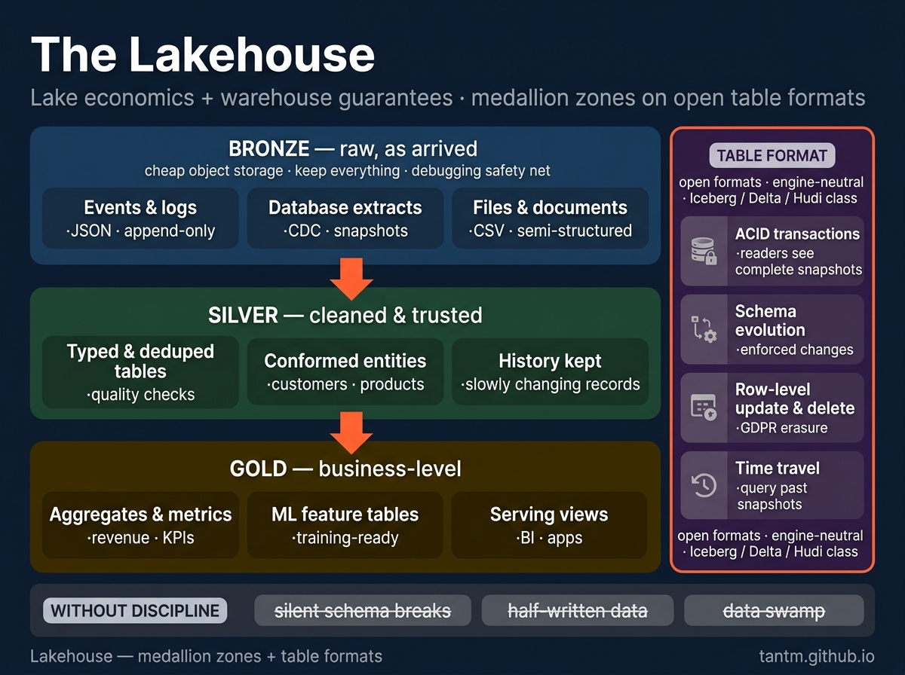
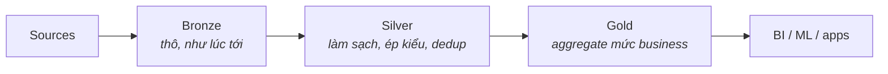

Phần 2 kết thúc ở giới hạn của warehouse: dữ liệu phi cấu trúc khối lượng lớn, và chi phí khi scale. Câu trả lời của ngành đi qua ba hồi — lake, đầm lầy, lakehouse — và hiểu vòng cung đó là tấm khiên tốt nhất để khỏi mua nhầm hồi kịch cho bộ ràng buộc của mình.

## Hồi 1 — Lake: cứ chứa trước, hỏi sau

Nỗi đau khai sinh: warehouse đòi cấu trúc *từ trước* (schema-on-write) và tính giá warehouse cho storage. Trong khi đó các công ty đang sinh ra log, event, ảnh — dữ liệu không schema và giá trị chưa rõ. Xoá thì tiếc; đưa vào warehouse thì đắt.

Cú cược của lake: **object storage rẻ đến phi lý — cứ giữ tất cả ở dạng thô, đến lúc đọc mới quyết cấu trúc** (schema-on-read). Đáp JSON, CSV, Parquet xuống storage kiểu S3; sau này trỏ query engine vào.

Cú cược thắng một nửa. Storage đúng là rẻ và scale vô hạn. Nhưng…

## Hồi 2 — Đầm lầy

Thiếu kỷ luật, một cái lake xuống cấp theo kịch bản dễ đoán:

- **Không ai giữ schema** — một producer đổi tên field; mọi reader hạ nguồn vỡ trong im lặng, vài tuần sau mới biết.
- **Không transaction** — job chết giữa chừng để lại nửa dataset; reader không có cách nào phân biệt.
- **Không update/delete** — object storage về tinh thần là append-only; "sửa bản ghi của một khách" (hay một yêu cầu xoá kiểu GDPR) nghĩa là ghi lại nguyên các partition.
- **Không tìm được gì** — mười nghìn folder, không catalog: "trong đống này, đâu mới là dữ liệu orders *thật*?"

"Data swamp" không phải từ đùa; đó là trạng thái kết mặc định của một cái lake vô kỷ luật. Thuốc chữa đến từ hai lớp.

## Hồi 3 — Lakehouse: hai thứ kỷ luật đặt lên trên lake

**Kỷ luật 1 — quy ước medallion.** Tổ chức lake thành các vùng theo mức độ tin cậy:

Bronze là lưới an toàn khi debug (vai trò y hệt staging ở Phần 2). Silver là nơi niềm tin bắt đầu. Gold là thứ business thực sự đọc. Tên gọi không quan trọng bằng bản hợp đồng: **mỗi lớp có cam kết chất lượng được định nghĩa rõ.**

**Kỷ luật 2 — table format.** Đây mới là cú đột phá. Iceberg, Delta Lake, Hudi là các lớp metadata ngồi trên file Parquet và dạy chúng phép tắc của database:

| Vấn đề đầm lầy | Câu trả lời của table format |
|---|---|
| Dữ liệu ghi dở vẫn bị nhìn thấy | ACID transaction — reader chỉ thấy snapshot trọn vẹn |
| Đổi tên field làm vỡ reader | Schema evolution có cưỡng chế |
| Không sửa/xoá được dòng | Update & delete mức dòng (merge) |
| "Thứ Ba tuần trước bảng này trông thế nào?" | Time travel về snapshot cũ |
| File nào thuộc bảng nào? | Chính format là câu trả lời — đống file trở thành bảng được quản lý |

Có table format bên dưới, lake thôi là đống folder và trở thành tập các bảng thật — query được bởi nhiều engine (Spark, Trino, DuckDB, và cả chính các cloud warehouse). Sự trung lập engine đó là điểm chiến lược: **format dữ liệu của bạn sống lâu hơn bất kỳ vendor đơn lẻ nào.**

Vậy lời chào hàng của lakehouse trong một dòng: **kinh tế của lake (object storage rẻ, format mở) + đảm bảo của warehouse (ACID, schema, catalog).** Cuộc hội tụ chạy cả hai chiều — warehouse giờ đọc thẳng open table format, còn engine lakehouse mọc SQL cỡ warehouse. Hai trường phái đang nhập một cách hữu hình; thứ còn phân biệt là *nguồn sự thật của dữ liệu bạn nằm ở đâu và trong format của ai*.

## Chấm theo năm trục

- **Scale:** điểm mạnh tiêu đề — TB tới PB, storage và compute scale độc lập.
- **Latency:** gốc batch như warehouse; ingest streaming vào bronze là khả thi (lãnh thổ của Phần 4).
- **Team:** cần độ chín engineering cao hơn managed warehouse — bạn tự lo bảo trì bảng (compaction, dọn snapshot), catalog, chọn engine. Đây là chi phí ẩn của trường phái.
- **Budget:** storage mỗi TB rẻ nhất mọi trường phái; chi phí compute phụ thuộc hoàn toàn kỷ luật query (Phần 12).
- **Compliance:** format hiện đại xử lý được xoá kiểu GDPR (đó chính xác là thứ row-level delete sửa); tooling catalog + lineage trẻ hơn của warehouse nhưng dùng được.

## Khi nào chọn, khi nào tránh

**Chọn lakehouse khi:** khối dữ liệu TB+ và đang lớn; nguồn có dữ liệu bán/phi cấu trúc; ML cần lịch sử thô; bạn muốn linh hoạt engine và format mở làm đường lui chiến lược.

**Tránh khi:** dữ liệu nhỏ và có cấu trúc (warehouse — hoặc stack small-data của Phần 8 — đơn giản hơn); team chỉ có một engineer bán thời gian (bảo trì bảng sẽ nuốt chửng họ); hoặc bạn chọn nó vì sơ đồ trông hiện đại (cảnh báo của Phần 1 áp dụng).

## Ba khách hàng, một lakehouse

- **Startup nặng event data:** bronze + một lớp silver, DuckDB/Trino để query — một "lakehouse-lite" lớn lên duyên dáng.
- **Tầm trung có data team:** medallion đầy đủ, một table format thống nhất, compaction theo lịch, catalog thật — setup kinh điển.
- **Enterprise chịu kiểm soát:** cùng bộ khung + bronze tách vùng PII/non-PII, khoá mã hoá theo domain, snapshot audit bất biến nhờ time travel — lại là lớp phủ Phần 10 trên bộ khung không đổi.

## Điều cần nhớ

- Lake đặt cược vào storage rẻ + schema-on-read; thiếu kỷ luật thì mặc định xuống cấp thành đầm lầy.
- Lakehouse = quy ước medallion (vùng tin cậy) + table format (ACID, schema evolution, update, time travel trên object storage).
- Open table format là nước cờ chiến lược: dữ liệu trung lập engine, sống lâu hơn vendor.
- Chi phí ẩn là độ chín engineering — bạn tự lo phần bảo trì mà managed warehouse giấu đi. Dữ liệu nhỏ có cấu trúc không cần bất cứ thứ gì ở đây.

*Tiếp theo — Phần 4: Lambda vs Kappa: kiến trúc batch & streaming.*
