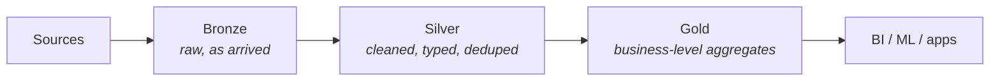

Part 2 ended with the warehouse's limits: unstructured data at volume, and cost at scale. The industry's answer went through three acts — lake, swamp, lakehouse — and understanding that arc is the best protection against buying the wrong act for your constraints.

## What you'll learn

- Tell the three acts apart — lake, swamp, lakehouse — and say what actually went wrong in act two.
- Use the medallion convention (bronze/silver/gold) as a trust contract, not a fashion.
- Explain what table formats (Iceberg/Delta/Hudi-class) add to Parquet files — and why engine-neutrality is the strategic point.
- Score the lakehouse on the five axes and name its hidden cost.

**Prerequisites:** Part 2 (the warehouse and its limits — this part starts where that one ended). Part 1's five axes.

## 1. The lake: store first, ask questions later

The birth pain: warehouses demanded structure *upfront* (schema-on-write) and charged warehouse prices for storage. Meanwhile companies were generating logs, events, images — data with no schema and uncertain value. Deleting it felt wrong; warehousing it cost too much.

The lake's bet: **object storage is absurdly cheap — keep everything raw, decide structure when you read it** (schema-on-read). Land JSON, CSV, Parquet in S3-style storage; point a query engine at it later.

The bet half-worked. Storage really is cheap and infinitely scalable. But…

## 2. The swamp

Without discipline, a lake degrades predictably:

- **No schema enforcement** — one producer renames a field; every downstream reader breaks silently, weeks later.
- **No transactions** — a job dies mid-write and leaves half a dataset; readers can't tell.
- **No update/delete** — object storage is append-only in spirit; "fix one customer's record" (or a GDPR erasure request) means rewriting whole partitions.
- **No discovery** — ten thousand folders, no catalog: "which of these is the *real* orders data?"

"Data swamp" isn't a joke term; it is the default end-state of an undisciplined lake. The cure came in two layers.

## 3. The lakehouse: two disciplines on top of the lake

**Discipline 1 — the medallion convention.** Organize the lake into zones by trust level:



Bronze is your debugging safety net (same role as staging in Part 2). Silver is where trust begins. Gold is what the business actually reads. The names matter less than the contract: **each layer has defined quality guarantees.**

**Discipline 2 — table formats.** The real breakthrough. Iceberg, Delta Lake, and Hudi are metadata layers that sit on top of Parquet files and give them database manners:

| Swamp problem | Table format answer |
|---|---|
| Half-written data visible | ACID transactions — readers see complete snapshots only |
| Renamed field breaks readers | Schema evolution with enforcement |
| Can't fix/delete rows | Row-level update & delete (merge) |
| "What did this look like last Tuesday?" | Time travel to previous snapshots |
| Which files are the table? | The format *is* the answer — files become a managed table |

With a table format underneath, a lake stops being a folder pile and becomes a set of real tables — queryable by many engines (Spark, Trino, DuckDB, and the cloud warehouses themselves). That engine-neutrality is the strategic point: **your data's format outlives any single vendor.**

So the lakehouse pitch in one line: **lake economics (cheap object storage, open formats) + warehouse guarantees (ACID, schema, catalog).** The convergence runs both directions — warehouses now read open table formats in place, and lakehouse engines grew warehouse-grade SQL. The two schools are visibly merging; what remains distinct is *where your data's source of truth lives and in whose format*.

## 4. Scoring it on the five axes

- **Scale:** the headline strength — TBs to PBs, storage and compute scale independently.
- **Latency:** batch-native like the warehouse; streaming ingestion into bronze is possible (Part 4's territory).
- **Team:** needs more engineering maturity than a managed warehouse — you own table maintenance (compaction, snapshot cleanup), catalog, and engine choices. This is the school's hidden cost.
- **Budget:** cheapest storage per TB of any school; compute cost depends entirely on your query discipline (Part 12).
- **Compliance:** modern formats handle GDPR-style deletes (that's literally what row-level delete fixed); catalog + lineage tooling is younger than the warehouse's but serviceable.

## 5. When to choose, when to avoid

**Choose the lakehouse when:** data volume is TB+ and growing; sources include semi/unstructured data; ML needs raw history; you want engine flexibility and open formats as an exit strategy.

**Avoid it when:** your data is small and structured (a warehouse — or Part 8's small-data stack — is simpler); your team is one part-time engineer (table maintenance will eat them); or you're choosing it because the diagram looks modern (Part 1's warning applies).

## 6. Three customers, one lakehouse

- **Startup with heavy event data:** bronze + one silver layer, DuckDB/Trino for queries — a "lakehouse-lite" that grows up gracefully.
- **Mid-size with a data team:** full medallion, one table format everywhere, scheduled compaction, a real catalog — the canonical setup.
- **Regulated enterprise:** same skeleton + bronze split into PII/non-PII zones, encryption keys per domain, immutable audit snapshots via time travel — again, the Part 10 overlay on an unchanged skeleton.

## Practice (20 minutes — DuckDB, no cloud)

Build a two-layer mini-medallion and feel the swamp problem it solves:

```python
import duckdb, pathlib
pathlib.Path("bronze").mkdir(exist_ok=True); pathlib.Path("silver").mkdir(exist_ok=True)

# 1. Bronze: land two "arrivals" — the second one has a renamed field (the swamp classic)
duckdb.sql("COPY (SELECT 1 AS id, 'a@x.com' AS email, 120 AS amount) TO 'bronze/day1.parquet'")
duckdb.sql("COPY (SELECT 2 AS id, 'b@x.com' AS mail,  250 AS amount) TO 'bronze/day2.parquet'")

# 2. Try reading bronze as one table — watch it break/misalign:
try:
    print(duckdb.sql("SELECT * FROM 'bronze/*.parquet'"))
except Exception as e:
    print("SWAMP:", e)

# 3. Silver: enforce the contract explicitly (typed, unified, deduped)
duckdb.sql("""COPY (
  SELECT id, email, amount FROM 'bronze/day1.parquet'
  UNION ALL
  SELECT id, mail AS email, amount FROM 'bronze/day2.parquet'
) TO 'silver/orders.parquet'""")
print(duckdb.sql("SELECT count(*), sum(amount) FROM 'silver/orders.parquet'"))
```

Expected results: step 2 fails (or silently misbehaves) — one renamed field and the "table" that was really a folder pile stops being readable: the swamp, reproduced in three lines. Step 3's silver layer is where trust begins — the rename is *handled at the boundary*, and downstream reads one clean contract. A table format automates exactly this discipline (plus transactions, deletes, and time travel) so humans don't have to remember it.

## Check yourself

1. Schema-on-read was the lake's founding bet. What did it actually buy, and what did it silently defer?
2. A GDPR erasure request arrives for one customer whose events live in three years of Parquet partitions. Why was this the swamp's nightmare, and what specifically fixed it?
3. A 2-person team with 200 GB of clean relational data asks if they should build a lakehouse "to be future-proof." What's your answer, using the axes?

<details><summary>See answers</summary>

1. It bought cheap, immediate landing of any data — no upfront modeling, nothing deleted. It deferred (not removed) the cost of structure: every reader must now know each file's schema, and nothing stops producers from breaking readers — the deferral compounds into the swamp.
2. Object storage had no row-level delete: erasing one customer meant rewriting every partition containing them. Table formats added row-level update/delete (merge) — the erasure becomes a small transactional operation instead of a bulk rewrite.
3. No — small, structured, tiny team scores as warehouse (or small-data stack) on every axis: the lakehouse's strengths (PB scale, unstructured data, engine diversity) are absent, while its hidden cost (table maintenance, catalog, engine choices) lands on two people. "Future-proof" is Part 1's diagram-looks-modern trap.

</details>

## Key takeaways

- The lake bet on cheap storage + schema-on-read; without discipline it degrades into a swamp by default.
- The lakehouse = medallion convention (trust zones) + table formats (ACID, schema evolution, updates, time travel on object storage).
- Open table formats are the strategic move: engine-neutral data that outlives vendors.
- Its hidden cost is engineering maturity — you own maintenance a managed warehouse would hide. Small structured data doesn't need any of this.

*Next up — Part 4: Lambda vs Kappa: Batch & Streaming Architectures.*
