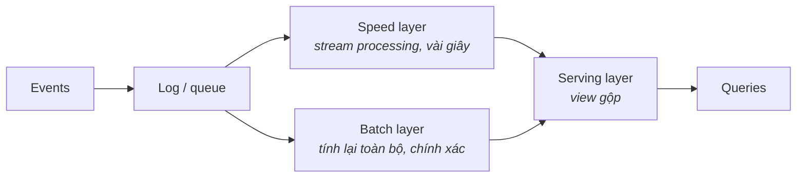
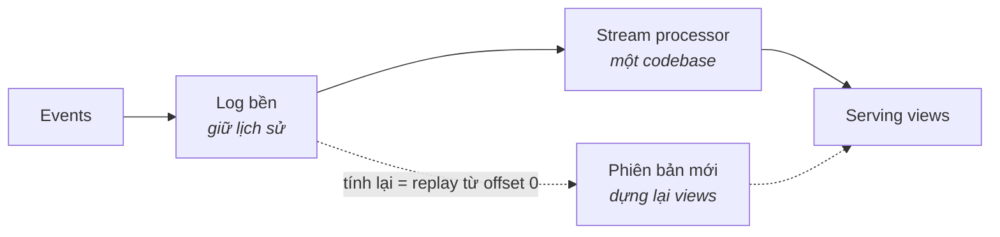

Phần 2–3 mặc định nhịp chạy đêm. Phần này nói về chuyện xảy ra khi business bảo: **"chúng tôi cần NGAY."** Hai trường phái kiến trúc trả lời câu đó — Lambda và Kappa — và giữa chúng là sự hiểu lầm đắt đỏ nhất của data engineering: xây streaming cho một business hành động theo ngày.

## Trước hết, câu hỏi gác cổng

Trước cả hai kiến trúc, hãy hỏi: **trong cửa sổ thời gian nào thì có người (hoặc hệ thống) thực sự hành động KHÁC ĐI nhờ dữ liệu này?**

- Chặn gian lận, định giá live, cảnh báo vận hành → giây tới phút. Nhu cầu streaming thật.
- "Sếp muốn dashboard tươi" → thường batch mỗi giờ thoả mãn với một phần mười chi phí.
- Báo cáo, tài chính, đa số BI → theo ngày. Phần 2 đã giải xong.

Streaming nhân ~10 lần bề mặt vận hành của bạn: hạ tầng 24/7, backpressure, exactly-once, on-call. Chỉ trả giá đó cho các use case hành động trong cửa sổ. Đa số platform rốt cuộc là **hybrid**: một đường streaming cho hai-ba use case real-time thật, batch cho mọi thứ còn lại.

## Lambda: hai con đường cho mỗi câu trả lời

Nỗi đau khai sinh (đầu 2010s): engine streaming nhanh nhưng xấp xỉ và mong manh; batch đúng nhưng chậm. Câu trả lời của Lambda — chạy **cả hai**:

Speed layer cho đáp án xấp xỉ *ngay bây giờ*; batch layer ghi đè bằng đáp án đúng *sau đó*; serving layer gộp lại.

Nó chạy được. Và nó đau ở đúng một chỗ: **mỗi metric bị cài đặt hai lần** — một trong stream processor, một trong batch job. Hai codebase, hai bộ kỹ năng, và một lớp bug vĩnh cửu khi hai đường bất đồng ("sao con số trên dashboard đổi lúc 2 giờ sáng?" — vì batch layer vừa sửa lưng speed layer).

## Kappa: một log, một đường code

Quan sát của Kappa: log hiện đại (kiểu Kafka) giữ được lịch sử, và stream processor hiện đại không còn xấp xỉ. Vậy xoá batch layer đi:

Cần sửa logic hay tính lại lịch sử? **Replay cái log** qua phiên bản mới của cùng đoạn code, rồi tráo view. Một codebase, không còn bất đồng lúc 2 giờ sáng.

Chi phí thật thà: cái log trở thành nguồn sự thật (retention và schema của *event* thành vấn đề hạng nhất); replay nhiều năm lịch sử qua stream processor chậm hơn batch engine quét file columnar; và analytics thuần lịch sử vẫn thích lakehouse hơn. Vì thế trên thực địa, các platform "Kappa" thường stream vào lakehouse (Phần 3) và để batch engine đọc cùng bộ bảng — biên giới streaming/batch đang tan từ cả hai phía (table format nhận streaming write; stream processor chạy SQL).

## Chọn theo năm trục

- **Latency:** trục quyết định. Có use case hành-động-trong-giây → bạn cần *một* đường streaming. Không có → đóng tab này, dùng Phần 2/3.
- **Team:** streaming là một bộ kỹ năng vận hành (consumer lag, backpressure, migrate state). Team chưa ai từng vận hành → bắt đầu bằng một đường Kappa nhỏ, đừng chơi Lambda toàn platform.
- **Scale:** cả hai scale xa; cái log là điểm nghẽn dễ scale nhất.
- **Budget:** compute luôn-bật + retention của log; đồng hồ tính tiền chạy lúc 3 giờ sáng kể cả khi không có gì xảy ra.
- **Compliance:** event thường mang PII vào một cái log giữ lâu — tính trước chuyện xoá theo key/crypto-shredding *trước khi* cơ quan quản lý hỏi (Phần 10).

**Khuyến nghị mặc định:** nếu 2026 buộc phải real-time, hãy bắt đầu hình-Kappa — một log, một codebase stream, đáp xuống bảng lakehouse — và chỉ thêm đường tính-lại kiểu batch ở chỗ replay chứng minh là quá chậm. Để dành Lambda đầy đủ cho ca hiếm thật sự cần tách "xấp-xỉ-ngay + đúng-sau".

## Ba khách hàng

- **Startup:** gần như chưa cần phần này. Micro-batch 5 phút trên stack Phần 8 giả "real-time" đủ thuyết phục cho dashboard.
- **Tầm trung với 1–2 use case real-time:** một log + một stream job đổ vào view OLAP/serving (Phần 5), mọi thứ khác giữ batch. Hybrid thực dụng.
- **Enterprise có nhu cầu event-driven thật:** cái log thành xương sống nhiều team dùng chung — lúc đó governance của topic và schema quan trọng hơn cả engine xử lý (Phần 6 tiếp câu chuyện này).

## Điều cần nhớ

- Câu hỏi gác cổng: trong cửa sổ nào thì có ai hành động? Không có hành-động-trong-phút → không cần kiến trúc streaming.
- Lambda = speed + batch layer, chính xác nhưng mỗi metric viết hai lần; Kappa = một log + một codebase, tính lại bằng replay.
- Thực địa hai trường phái hội tụ: stream vào bảng lakehouse, batch engine đọc cùng bảng.
- Streaming nhân ~10 lần bề mặt vận hành và chạy đồng hồ tiền 24/7 — mua theo từng use case, đừng mua toàn platform.

*Tiếp theo — Phần 5: Real-time analytics: tầng OLAP serving.*
