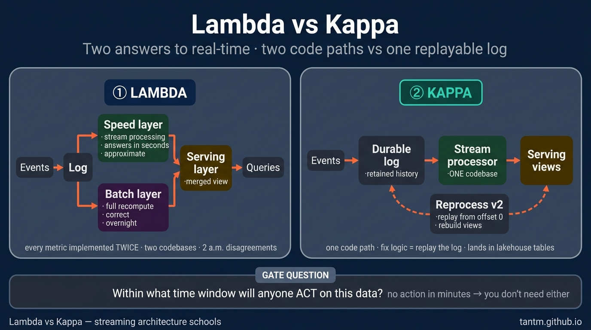
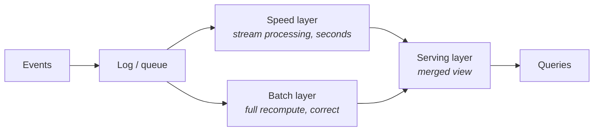
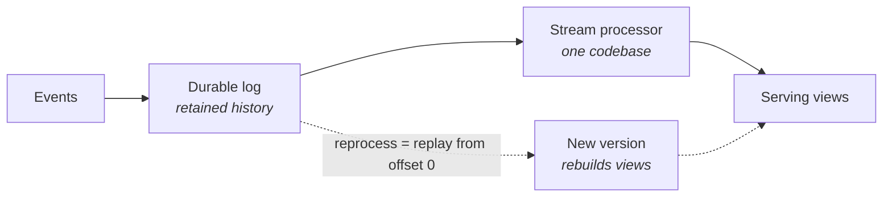

Parts 2–3 assumed a nightly rhythm. This part is about what happens when the business says: **"we need it now."** Two architecture schools answer that sentence — Lambda and Kappa — and between them sits the most expensive misunderstanding in data engineering: building streaming for a business that acts in days.

## First, the gate question

Before either architecture, ask: **within what time window will someone (or some system) actually act differently because of this data?**

- Fraud blocking, live pricing, ops alerting → seconds to minutes. Real streaming need.
- "The CEO wants the dashboard fresh" → usually hourly batch satisfies it at a tenth of the cost.
- Reports, finance, most BI → daily. Part 2 already solved this.

Streaming roughly 10×'s your operational surface: 24/7 infrastructure, backpressure, exactly-once semantics, on-call. Pay that only for the use cases that act in the window. Most platforms end up **hybrid**: a streaming path for two or three genuinely real-time use cases, batch for everything else.

## Lambda: two paths to every answer

The birth pain (early 2010s): streaming engines were fast but approximate and fragile; batch was correct but slow. Lambda's answer — run **both**:

The speed layer gives approximate answers *now*; the batch layer overwrites them with correct answers *later*; the serving layer merges.

It works. And it hurts in one specific place: **every metric is implemented twice** — once in the stream processor, once in the batch job. Two codebases, two skill sets, and a permanent class of bugs where the two paths disagree ("why does the dashboard number change at 2 a.m.?" — because the batch layer just corrected the speed layer).

## Kappa: one log, one code path

Kappa's observation: modern logs (Kafka-style) retain history, and modern stream processors are no longer approximate. So delete the batch layer:

Need to fix logic or recompute history? **Replay the log** through a new version of the same code, then swap views. One codebase, no 2 a.m. disagreements.

The honest costs: the log becomes your source of truth (retention and schema of *events* become first-class problems); replaying years of history through a stream processor is slower than a batch engine scanning columnar files; and truly historical analytics still prefer the lakehouse. Which is why in practice, "Kappa" platforms usually stream into a lakehouse (Part 3) and let batch engines read the same tables — the streaming/batch border has been dissolving from both sides (table formats accept streaming writes; stream processors run SQL).

## Choosing on the five axes

- **Latency:** the deciding axis. Act-in-seconds use cases exist → you need *a* streaming path. None → close this tab, use Part 2/3.
- **Team:** streaming is an operational skill set (consumer lag, backpressure, state migration). No one on the team has run it before → start with one small Kappa-style path, not a platform-wide Lambda.
- **Scale:** both scale far; the log is the bottleneck that scales easiest.
- **Budget:** always-on compute + log retention; the meter runs at 3 a.m. even when nothing happens.
- **Compliance:** events often carry PII into a log with long retention — plan key-based deletion/crypto-shredding *before* regulators ask (Part 10).

**Default recommendation:** if you must go real-time in 2026, start Kappa-shaped — one log, one stream codebase, landing into lakehouse tables — and add batch-style recompute only where replay proves too slow. Reserve full Lambda for the rare case where an approximate-now + correct-later split is genuinely required.

## Three customers

- **Startup:** almost never needs this part yet. A 5-minute micro-batch on the Part 8 stack fakes "real-time" convincingly for dashboards.
- **Mid-size with 1–2 real-time use cases:** one log + one stream job feeding OLAP/serving views (Part 5), everything else stays batch. The pragmatic hybrid.
- **Enterprise with true event-driven needs:** the log becomes a backbone shared by many teams — at which point governance of topics and schemas matters more than the processing engine (Part 6 continues here).

## Key takeaways

- The gate question: within what window does anyone act? No action-in-minutes → no streaming architecture.
- Lambda = speed + batch layers, correct but every metric written twice; Kappa = one log + one codebase, reprocessing by replay.
- In practice the schools converge: stream into lakehouse tables, batch engines read the same tables.
- Streaming ~10×'s operational surface and runs the meter 24/7 — buy it per use case, not platform-wide.

*Next up — Part 5: Real-time Analytics: the OLAP Serving Layer.*
