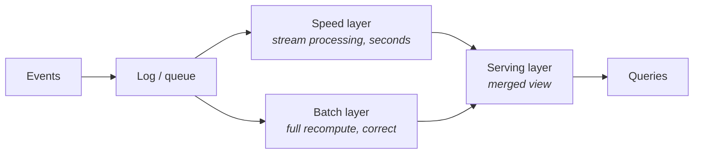
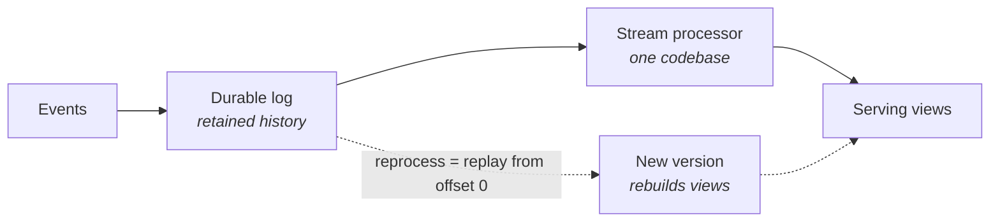

Parts 2–3 assumed a nightly rhythm. This part is about what happens when the business says: **"we need it now."** Two architecture schools answer that sentence — Lambda and Kappa. Between them sits the most expensive misunderstanding in data engineering: building streaming for a business that acts in days.

## What you'll learn

- Ask the gate question that decides whether you need streaming at all.
- Draw both architectures from memory and name the specific pain each one carries.
- Score a real-time proposal on the five axes, including the costs nobody quotes.
- Recommend a shape (and defend it) for a startup, a mid-size company, and an enterprise.

**Prerequisites:** Parts 2–3 (warehouse and lakehouse) — this part assumes you know what the batch path looks like.

## 1. First, the gate question

Before either architecture, ask: **within what time window will someone (or some system) actually act differently because of this data?**

- Fraud blocking, live pricing, ops alerting → seconds to minutes. Real streaming need.
- "The CEO wants the dashboard fresh" → usually hourly batch satisfies it at a tenth of the cost.
- Reports, finance, most BI → daily. Part 2 already solved this.

Streaming roughly 10×'s your operational surface: 24/7 infrastructure, **backpressure** (what happens when consumers fall behind producers), exactly-once semantics, on-call. Pay that only for the use cases that act in the window. Most platforms end up **hybrid**: a streaming path for two or three genuinely real-time use cases, batch for everything else.

## 2. Lambda: two paths to every answer

The birth pain (early 2010s): streaming engines were fast but approximate and fragile; batch was correct but slow. Lambda's answer — run **both**:

The speed layer gives approximate answers *now*; the batch layer overwrites them with correct answers *later*; the serving layer merges.

It works. And it hurts in one specific place: **every metric is implemented twice** — once in the stream processor, once in the batch job. Two codebases, two skill sets, and a permanent class of bugs where the two paths disagree ("why does the dashboard number change at 2 a.m.?" — because the batch layer just corrected the speed layer).

## 3. Kappa: one log, one code path

Kappa's observation: modern logs (Kafka-style) retain history, and modern stream processors are no longer approximate. So delete the batch layer:

Need to fix logic or recompute history? **Replay the log** through a new version of the same code, then swap views. One codebase, no 2 a.m. disagreements.

The honest costs come in three parts. The log becomes your source of truth, so retention and event schema turn into first-class problems. Replaying years of history through a stream processor is slower than a batch engine scanning columnar files. And truly historical analytics still prefer the lakehouse.

Which is why in practice, "Kappa" platforms usually stream into a lakehouse and let batch engines read the same tables. The streaming/batch border has been dissolving from both sides: table formats accept streaming writes, and stream processors run SQL.

## 4. Choosing on the five axes

- **Latency:** the deciding axis. Act-in-seconds use cases exist → you need *a* streaming path. None → close this tab, use Part 2/3.
- **Team:** streaming is an operational skill set (consumer lag, backpressure, state migration). No one on the team has run it before → start with one small Kappa-style path, not a platform-wide Lambda.
- **Scale:** both scale far; the log is the bottleneck that scales easiest.
- **Budget:** always-on compute + log retention; the meter runs at 3 a.m. even when nothing happens.
- **Compliance:** events often carry PII into a log with long retention — plan key-based deletion or crypto-shredding *before* regulators ask.

**Default recommendation:** if you must go real-time in 2026, start Kappa-shaped — one log, one stream codebase, landing into lakehouse tables — and add batch-style recompute only where replay proves too slow. Reserve full Lambda for the rare case where an approximate-now + correct-later split is genuinely required.

## 5. Three customers

- **Startup:** almost never needs this part yet. A 5-minute micro-batch fakes "real-time" convincingly for dashboards.
- **Mid-size with 1–2 real-time use cases:** one log plus one stream job feeding serving views, everything else stays batch. The pragmatic hybrid.
- **Enterprise with true event-driven needs:** the log becomes a backbone shared by many teams. At that point governance of topics and schemas matters more than the processing engine.

## Practice (20 minutes — paper exercise, run the gate question for real)

No cluster needed. Take three real use cases from a system you know (or invent a food-delivery app: order tracking, driver payouts, fraud blocking) and fill this table honestly:

| Use case | Who acts on it | Within what window | Cheapest architecture that satisfies it |
|---|---|---|---|
| … | a human? a system? nobody? | seconds / minutes / hours / days | streaming path / hourly batch / daily batch |

Rules that make the exercise honest:

1. "Nobody acts, we just look at it" is a legitimate answer — and it always means batch.
2. If the answer is "the dashboard should feel live", write down what changes when it *is* live. If nothing changes, the window is hours.
3. For every row where you wrote "streaming path", add a second line: who carries the pager for it at 3 a.m., and what they do when consumer lag climbs.

Then sketch the winning shape: draw the log once, draw the one or two streaming consumers, and draw everything else as batch reading the same tables.

Expected results: most tables come out with one streaming row at most — and the pager line is usually what converts a "we need real-time" conversation into "hourly is fine." The rows that survive that question are exactly the ones worth the 10× operational surface.

## Check yourself

1. A stakeholder says "we need real-time inventory." What do you ask before designing anything, and what answer would send you back to hourly batch?
2. Your dashboard number changes at 2 a.m. every night in a Lambda architecture. Is this a bug? Explain the mechanism.
3. Why do modern "Kappa" platforms usually still write into lakehouse tables instead of serving everything from the stream processor?

See answers

1. Ask within what window someone or some system actually acts differently because of the data. If the answer is "the purchasing team reviews stock every morning", nobody acts in seconds — hourly (or daily) batch satisfies it at a fraction of the operational cost.
2. Not a bug: it's the design. The speed layer served an approximate answer during the day; the batch layer recomputed the correct one overnight and overwrote it. It's also exactly the pain Lambda carries — every metric implemented twice, with a permanent class of disagreements between the two paths.
3. Because replaying long history through a stream processor is slow, and historical analytics is what columnar batch engines are good at. Writing to lakehouse tables gives one storage layer that both streaming writes and batch reads share — the two schools converging rather than competing.

## Key takeaways

- The gate question: within what window does anyone act? No action-in-minutes → no streaming architecture.
- Lambda = speed + batch layers, correct but every metric written twice; Kappa = one log + one codebase, reprocessing by replay.
- In practice the schools converge: stream into lakehouse tables, batch engines read the same tables.
- Streaming ~10×'s operational surface and runs the meter 24/7 — buy it per use case, not platform-wide.

*Next up — Part 5: Real-time Analytics: the OLAP Serving Layer.*
