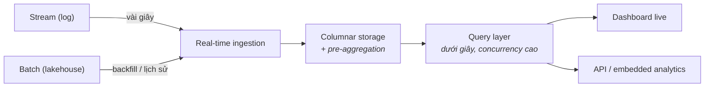

Phần 4 xây đường ống chuyển event trong vài giây. Phần này nói về căn phòng mà đường ống đổ vào: một query engine nơi **hàng nghìn người dùng dashboard nhận câu trả lời dưới một giây trên dữ liệu mới vài giây tuổi**. Tổ hợp đó — freshness × tốc độ × concurrency — là một trường phái kiến trúc riêng: real-time OLAP.

## Nỗi đau khai sinh

Warehouse (Phần 2) trả lời câu hỏi lớn trong vài giây-tới-phút, trên dữ liệu đêm qua — ổn cho analyst, sai cho màn hình vận hành live. Stream processor (Phần 4) tính toán liên tục nhưng không sinh ra để phục vụ hàng nghìn query cắt-lát tuỳ hứng. Khoảng trống ở giữa: *"analytics hướng khách hàng"* — dashboard live cho team vận hành, analytics nhúng trong sản phẩm SaaS, giám sát các business event. Một lớp engine mọc lên đúng vào khoảng trống đó: ClickHouse, Apache Druid, Apache Pinot, StarRocks, Apache Doris — các dự án khác nhau, chung một hình dạng.

## Hình dạng chung

Ba mánh tạo ra tốc độ, và cả ba đều là trade-off bạn nên nhận diện:

1. **Columnar storage + index quyết liệt** — cùng ý tưởng columnar của warehouse, tinh chỉnh cho lát cắt thời điểm thay vì các cú quét khổng lồ.
2. **Pre-aggregation** — engine tự duy trì các rollup từng phần (theo phút, theo dimension) để query của dashboard chỉ chạm hàng nghìn dòng thay vì hàng tỷ. Bạn trả giá bằng compute lúc ingest và kém linh hoạt với dạng câu hỏi hoàn toàn mới.
3. **Denormalization** — real-time OLAP ghét join lúc query. Star schema của Phần 2 bị cán phẳng thành các bảng rộng *trước khi* ingest. Bạn trả giá bằng công pipeline thượng nguồn và dữ liệu trùng lặp.

Để ý thứ vắng mặt: các engine này **không phải** nguồn sự thật. Chúng là **tầng serving** — một hình chiếu nhanh, vứt-được của dữ liệu mà nhà thật nằm ở lakehouse hoặc warehouse. Hãy đối xử với chúng như thứ rebuild được — một cái cache biết nói SQL.

## Chấm theo năm trục

- **Latency:** lý do trường phái này tồn tại — query p95 dưới một giây, dữ liệu tươi vài giây. Nếu chỉ cần một trong hai, có trường phái rẻ hơn (tươi-nhưng-chậm → stream vào lakehouse; nhanh-nhưng-theo-ngày → warehouse + BI cache).
- **Scale:** tốc độ ingest cao và concurrency query cao — góc phần tư "hàng nghìn người trên dữ liệu live" mà không trường phái nào khác phục vụ tốt.
- **Team:** thêm một hệ phân tán để vận hành (hoặc một managed service để trả tiền); cộng các pipeline cán-phẳng thượng nguồn. Không phải hệ đầu tiên nên có — là phần bổ sung cho Phần 3–4.
- **Budget:** cluster luôn-bật, size theo concurrency đỉnh. Sai lầm kinh điển là phục vụ analyst *nội bộ* (10 người, query khám phá) trên một engine định giá cho concurrency *bên ngoài*.
- **Compliance:** vì là tầng hình chiếu, cố giữ PII bên ngoài — serve các view đã pre-aggregate hoặc pseudonymize, để lakehouse có governance giữ sự thật thô (điểm cộng: chuyện xoá dữ liệu vẫn là bài toán của lakehouse).

## Chọn / tránh

**Chọn real-time OLAP khi:** analytics là một phần của *sản phẩm* (khách hàng nhìn thấy dashboard), hoặc một team vận hành dán mắt vào màn hình live và hành động trong vài phút, hoặc hàng nghìn query đồng thời đập vào dữ liệu tươi.

**Tránh khi:** dashboard nội bộ và mỗi giờ là đủ (Phần 2/3 + BI cache); "real-time" là gu thẩm mỹ của stakeholder chứ không phải cửa sổ hành động (câu hỏi gác cổng của Phần 4, lần nữa); hoặc team không kham nổi thêm một hệ stateful.

## Ba khách hàng

- **Startup có sản phẩm SaaS:** embedded analytics thường là nhu cầu real-time OLAP *chính đáng đầu tiên* — một cluster managed nhỏ phục vụ dashboard của khách, ăn event stream của app, trong khi BI nội bộ vẫn ở stack Phần 8.
- **Công ty tầm trung nặng vận hành** (archetype logistics, e-commerce): một cluster real-time OLAP cho màn hình điều hành; warehouse vẫn là sự thật cho tài chính. Hai engine, hai việc, tách bạch.
- **Enterprise / công ty data-product:** OLAP serving thành một tầng — nhiều mart đã cán phẳng, capacity planning theo tenant hoặc theo bề mặt sản phẩm (các câu hỏi multi-tenancy của Phần 9 ập đến rất nhanh ở đây).

## Điều cần nhớ

- Real-time OLAP lấp một góc phần tư: query dưới giây × dữ liệu tươi vài giây × concurrency cao — analytics hướng khách hàng và vận hành.
- Tốc độ đến từ columnar, pre-aggregation, denormalization — tất cả trả giá ở thượng nguồn, lúc ingest.
- Các engine này là tầng serving, không phải nguồn sự thật: hình chiếu rebuild-được của lakehouse/warehouse.
- Khoản chi hớ kinh điển: mua concurrency hạng bên-ngoài cho dashboard nội bộ; câu hỏi gác cổng của Phần 4 áp dụng cả ở đây.

*Tiếp theo — Phần 6: Data hướng sự kiện: CDC & Outbox.*
