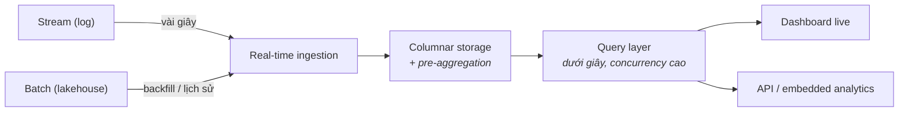

Phần 4 xây đường ống chuyển event trong vài giây. Phần này nói về căn phòng mà đường ống đổ vào: một query engine nơi **hàng nghìn người dùng dashboard nhận câu trả lời dưới một giây trên dữ liệu mới vài giây tuổi**. Tổ hợp đó — độ tươi nhân tốc độ nhân concurrency — là một trường phái kiến trúc riêng: real-time OLAP.

## Bạn sẽ học được gì

- Gọi tên chính xác khoảng trống mà real-time OLAP lấp, và hai trường phái rẻ hơn nằm hai bên nó.
- Giải thích ba mánh tạo ra tốc độ, và mỗi mánh trả giá gì ở thượng nguồn.
- Đối xử với các engine này như tầng serving chứ không phải nguồn sự thật — và biết vì sao điều đó quan trọng.
- Chấm một đề xuất real-time OLAP theo năm trục, gồm cả cú chi lố kinh điển.

**Cần biết trước:** Phần 2–4 (warehouse, lakehouse, và câu hỏi gác cổng của streaming).


## 1. Nỗi đau khai sinh

Warehouse trả lời câu hỏi lớn trong vài giây tới vài phút, trên dữ liệu đêm qua. Ổn cho analyst, sai cho màn hình vận hành live. Stream processor tính toán liên tục nhưng không sinh ra để phục vụ hàng nghìn query cắt-lát tuỳ hứng.

Khoảng trống giữa chúng là **analytics hướng khách hàng**: dashboard live cho team vận hành, analytics nhúng trong sản phẩm, giám sát các business event. Một lớp engine mọc lên đúng vào khoảng trống đó — ClickHouse, Apache Druid, Apache Pinot, StarRocks, Apache Doris. Các dự án khác nhau, chung một hình dạng.

## 2. Hình dạng chung



Ba mánh tạo ra tốc độ, và cả ba đều là trade-off bạn nên nhận diện:

1. **Columnar storage + index quyết liệt** — cùng ý tưởng columnar của warehouse, tinh chỉnh cho lát cắt thời điểm thay vì các cú quét khổng lồ.
2. **Pre-aggregation** — engine tự duy trì các rollup từng phần (theo phút, theo dimension) để query của dashboard chỉ chạm hàng nghìn dòng thay vì hàng tỷ. Bạn trả giá bằng compute lúc ingest và kém linh hoạt với dạng câu hỏi hoàn toàn mới.
3. **Denormalization** — real-time OLAP ghét join lúc query. Star schema bị cán phẳng thành các bảng rộng *trước khi* ingest. Bạn trả giá bằng công pipeline thượng nguồn và dữ liệu trùng lặp.

Để ý thứ vắng mặt: các engine này **không phải** nguồn sự thật. Chúng là **tầng serving** — một hình chiếu nhanh, vứt-được của dữ liệu mà nhà thật nằm ở lakehouse hoặc warehouse. Hãy đối xử với chúng như thứ rebuild được — một cái cache biết nói SQL.

## 3. Chấm theo năm trục

- **Latency:** lý do trường phái này tồn tại — query p95 dưới một giây, dữ liệu tươi vài giây. Nếu chỉ cần một trong hai, có trường phái rẻ hơn (tươi-nhưng-chậm → stream vào lakehouse; nhanh-nhưng-theo-ngày → warehouse + BI cache).
- **Scale:** tốc độ ingest cao và concurrency query cao — góc phần tư "hàng nghìn người trên dữ liệu live" mà không trường phái nào khác phục vụ tốt.
- **Team:** thêm một hệ phân tán để vận hành, hoặc một managed service để trả tiền, cộng các pipeline cán-phẳng thượng nguồn. Không phải hệ đầu tiên nên có — là phần bổ sung cho thứ bạn đang vận hành.
- **Budget:** cluster luôn-bật, size theo concurrency đỉnh. Sai lầm kinh điển là phục vụ analyst *nội bộ* (10 người, query khám phá) trên một engine định giá cho concurrency *bên ngoài*.
- **Compliance:** vì là tầng hình chiếu, cố giữ PII bên ngoài. Serve các view đã pre-aggregate hoặc pseudonymize, để lakehouse có governance giữ sự thật thô — điểm cộng là các yêu cầu xoá dữ liệu vẫn nằm ở lakehouse.

## 4. Chọn hay tránh

**Chọn real-time OLAP khi:** analytics là một phần của *sản phẩm* (khách hàng nhìn thấy dashboard), hoặc một team vận hành dán mắt vào màn hình live và hành động trong vài phút, hoặc hàng nghìn query đồng thời đập vào dữ liệu tươi.

**Tránh khi:** dashboard nội bộ và mỗi giờ là đủ (warehouse cộng BI cache là xong); "real-time" là gu thẩm mỹ của stakeholder chứ không phải cửa sổ hành động; hoặc team không kham nổi thêm một hệ stateful.

## 5. Ba khách hàng

- **Startup có sản phẩm SaaS:** embedded analytics thường là nhu cầu real-time OLAP *chính đáng đầu tiên* — một cluster managed nhỏ phục vụ dashboard của khách, ăn event stream của app, trong khi BI nội bộ vẫn ở stack đơn giản.
- **Công ty tầm trung nặng vận hành** (archetype logistics, e-commerce): một cluster real-time OLAP cho màn hình điều hành; warehouse vẫn là sự thật cho tài chính. Hai engine, hai việc, tách bạch.
- **Enterprise hoặc công ty data-product:** OLAP serving thành một tầng — nhiều mart đã cán phẳng, capacity planning theo tenant hoặc theo bề mặt sản phẩm. Các câu hỏi multi-tenancy ập đến rất nhanh ở đây.

## Thực hành (20 phút — cảm nhận pre-aggregation bằng DuckDB)

Bạn không dựng nổi một cluster Druid trong hai mươi phút, nhưng bạn *cảm nhận được* cái mánh khiến các engine này nhanh. Pre-aggregation là toàn bộ ý tưởng, và DuckDB cho thấy nó một cách thật thà:

```sql
-- duckdb olap.db
-- 5 triệu event tổng hợp, đúng hình dạng mà dashboard live query
CREATE TABLE events AS
SELECT (i % 200)                                   AS customer_id,
       (i % 7)                                     AS region_id,
       TIMESTAMP '2026-03-01 00:00:00' + INTERVAL (i % 86400) SECOND AS ts,
       (random() * 100)::DECIMAL(10,2)             AS amount
FROM range(5000000) t(i);

-- 1. Query thô mà dashboard sẽ chạy: quét tất cả, mỗi lần refresh
.timer on
SELECT region_id, date_trunc('minute', ts) AS m, sum(amount), count(*)
FROM events GROUP BY 1,2 ORDER BY 1,2 LIMIT 5;

-- 2. Pre-aggregate MỘT LẦN lúc ingest (đây là thứ engine tự duy trì hộ bạn)
CREATE TABLE events_rollup_1m AS
SELECT region_id, date_trunc('minute', ts) AS m, sum(amount) AS amt, count(*) AS n
FROM events GROUP BY 1,2;
SELECT count(*) FROM events_rollup_1m;              -- hàng nghìn dòng, không phải hàng triệu

-- 3. Cùng câu hỏi business đó, trả lời từ rollup
SELECT region_id, m, amt, n FROM events_rollup_1m ORDER BY 1,2 LIMIT 5;

-- 4. Giờ là cái giá của đánh đổi: câu hỏi mà rollup không trả lời nổi
SELECT customer_id, sum(amt) FROM events_rollup_1m GROUP BY 1;   -- LỖI: không có customer_id
SELECT customer_id, sum(amount) FROM events GROUP BY 1 LIMIT 5;  -- quay về quét toàn bộ
```

Kết quả mong đợi: query 1 quét cả năm triệu dòng và tốn thời gian thật; query 3 trả lời đúng câu hỏi business đó từ vài nghìn dòng đã pre-aggregate, gần như tức thì. Khoảng cách đó chính là thứ một engine real-time OLAP bán cho bạn — và bước 4 là cái giá: rollup đã bỏ mất `customer_id`, nên một dạng câu hỏi hoàn toàn mới rơi lại về cú quét thô. Pre-aggregation mua tốc độ cho những câu hỏi bạn đã lường trước, không mua cho những câu bạn chưa.

## Tự kiểm tra

1. Stakeholder muốn "một dashboard real-time" cho 8 analyst nội bộ xem mỗi sáng. Bạn đề xuất gì, và vì sao không dùng real-time OLAP?
2. Cluster OLAP của bạn mất sạch — đĩa bay hết. Chuyện này tệ tới mức nào, và điều gì quyết định câu trả lời?
3. Vì sao các engine này muốn bảng rộng đã denormalize, trong khi warehouse dạy bạn mô hình hoá bằng star schema?

<details><summary>Xem đáp án</summary>

1. Một warehouse (hoặc lakehouse) cộng một BI tool có cache, refresh mỗi giờ. Không ai hành động trong vài giây, nên bạn sẽ mua concurrency hạng-bên-ngoài và chi phí cluster luôn-bật cho tám người xem mỗi ngày một lần — đúng cú chi lố kinh điển mà trường phái này mời gọi.
2. Đáng lẽ chỉ là bất tiện, không phải thảm hoạ: tầng OLAP là một *hình chiếu*, nên bạn dựng lại nó từ lakehouse hay warehouse đang giữ sự thật. Điều quyết định câu trả lời là bạn có thật sự giữ đúng như vậy không — nếu có thứ gì chỉ đáp vào engine OLAP mà không có ở thượng nguồn, bạn vừa mất dữ liệu thật, và đó là bug kiến trúc chứ không phải sự cố phần cứng.
3. Vì các engine này né join lúc query để đạt độ trễ dưới một giây ở concurrency cao. Công join của star schema được dời lên thượng nguồn vào pipeline ingest, nơi cán phẳng fact và dimension thành bảng rộng — bạn trả bằng công pipeline và dữ liệu trùng lặp, và mua về tốc độ query.

</details>

## Điều cần nhớ

- Real-time OLAP lấp một góc phần tư: query dưới giây × dữ liệu tươi vài giây × concurrency cao — analytics hướng khách hàng và vận hành.
- Tốc độ đến từ columnar, pre-aggregation, denormalization — tất cả trả giá ở thượng nguồn, lúc ingest.
- Các engine này là tầng serving, không phải nguồn sự thật: hình chiếu rebuild-được của lakehouse/warehouse.
- Khoản chi hớ kinh điển: mua concurrency hạng bên-ngoài cho dashboard nội bộ; câu hỏi gác cổng của Phần 4 áp dụng cả ở đây.

*Tiếp theo — Phần 6: Data hướng sự kiện: CDC & Outbox.*
