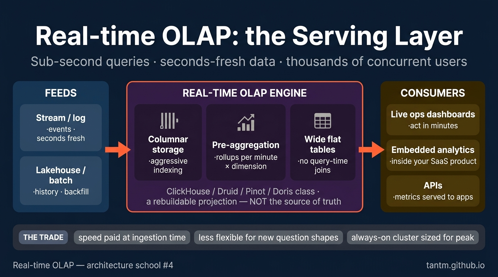
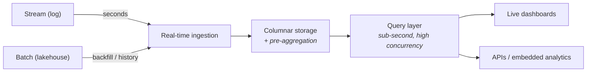

Part 4 built the pipes that move events in seconds. This part is about the room those pipes empty into: a query engine where **thousands of dashboard users get sub-second answers over data that is seconds old**. That combination — freshness times speed times concurrency — is its own architecture school: real-time OLAP.

## What you'll learn

- Name the exact gap real-time OLAP fills, and the two cheaper schools on either side of it.
- Explain the three tricks that buy the speed, and what each one costs upstream.
- Treat these engines as a serving layer rather than a source of truth — and know why that matters.
- Score a real-time OLAP proposal on the five axes, including the classic overspend.

**Prerequisites:** Parts 2–4 (warehouse, lakehouse, and the streaming gate question).



## 1. The birth pain

The warehouse answers big questions in seconds to minutes, over last night's data. Fine for analysts, wrong for a live ops screen. The stream processor computes continuously but isn't built to serve thousands of ad-hoc slice-and-dice queries.

The gap between them is **customer-facing analytics**: live dashboards for ops teams, embedded analytics inside a product, monitoring over business events. A class of engines grew into exactly that gap — ClickHouse, Apache Druid, Apache Pinot, StarRocks, Apache Doris. Different projects, one shared shape.

## 2. The shared shape



Three tricks make the speed possible, and all three are trade-offs you should recognize:

1. **Columnar storage + aggressive indexing** — the same columnar idea as the warehouse, tuned for point-in-time slices rather than giant scans.
2. **Pre-aggregation** — the engine maintains partial rollups (per minute, per dimension) so the dashboard query touches thousands of rows, not billions. You pay with ingestion-time compute and less flexibility on brand-new question shapes.
3. **Denormalization** — real-time OLAP hates joins at query time. The star schema gets flattened into wide tables *before* ingestion. You pay with upstream pipeline work and data duplication.

Notice what's missing: these engines are **not** your source of truth. They are a **serving layer** — a fast, disposable projection of data whose real home is the lakehouse or warehouse. Treat them as rebuildable, like a cache that speaks SQL.

## 3. Scoring on the five axes

- **Latency:** the reason this school exists — query p95 under a second, data freshness in seconds. If you need one but not both, cheaper schools exist (fresh-but-slow → stream into lakehouse; fast-but-daily → warehouse + BI cache).
- **Scale:** high ingest rates and high query concurrency — the "thousands of users on live data" quadrant nothing else serves well.
- **Team:** another distributed system to run, or a managed service to pay for, plus the upstream flattening pipelines. Not a first system — an addition to what you already operate.
- **Budget:** always-on cluster sized for peak concurrency. The classic mistake is serving *internal* analysts (10 users, exploratory queries) on an engine priced for *external* concurrency.
- **Compliance:** as a projection layer, keep PII out of it where possible. Serve pre-aggregated or pseudonymized views and let the governed lakehouse hold the raw truth — a nice bonus is that deletion requests stay a lakehouse problem.

## 4. Choose or avoid

**Choose real-time OLAP when:** analytics is part of your *product* (customers see dashboards), or an ops team stares at live screens and acts within minutes, or thousands of concurrent queries hit fresh data.

**Avoid when:** dashboards are internal and hourly is fine (a warehouse plus a BI cache does it); "real-time" is a stakeholder aesthetic rather than an action window; or the team can't operate another stateful system.

## 5. Three customers

- **Startup with a SaaS product:** embedded analytics is often the *first* legitimate real-time OLAP need — a small managed cluster serving customer dashboards, fed by the app's event stream, while internal BI stays on the simple stack.
- **Mid-size ops-heavy company** (logistics, e-commerce archetype): one real-time OLAP cluster for the ops control screen; the warehouse remains the truth for finance. Two engines, two jobs, clean split.
- **Enterprise or data-product company:** OLAP serving becomes a tier — multiple flattened marts, with capacity planning per tenant or per product surface. Multi-tenancy questions arrive quickly here.

## Practice (20 minutes — feel pre-aggregation with DuckDB)

You can't spin up a Druid cluster in twenty minutes, but you *can* feel the trick that makes these engines fast. Pre-aggregation is the whole idea, and DuckDB shows it honestly:

```sql
-- duckdb olap.db
-- 5 million synthetic events, the shape a live dashboard queries
CREATE TABLE events AS
SELECT (i % 200)                                   AS customer_id,
       (i % 7)                                     AS region_id,
       TIMESTAMP '2026-03-01 00:00:00' + INTERVAL (i % 86400) SECOND AS ts,
       (random() * 100)::DECIMAL(10,2)             AS amount
FROM range(5000000) t(i);

-- 1. The raw query a dashboard would run: scan everything, every refresh
.timer on
SELECT region_id, date_trunc('minute', ts) AS m, sum(amount), count(*)
FROM events GROUP BY 1,2 ORDER BY 1,2 LIMIT 5;

-- 2. Pre-aggregate ONCE at ingestion time (this is what the engine maintains for you)
CREATE TABLE events_rollup_1m AS
SELECT region_id, date_trunc('minute', ts) AS m, sum(amount) AS amt, count(*) AS n
FROM events GROUP BY 1,2;
SELECT count(*) FROM events_rollup_1m;              -- thousands of rows, not millions

-- 3. The same dashboard question, answered from the rollup
SELECT region_id, m, amt, n FROM events_rollup_1m ORDER BY 1,2 LIMIT 5;

-- 4. Now the cost of the trade: a question the rollup cannot answer
SELECT customer_id, sum(amt) FROM events_rollup_1m GROUP BY 1;   -- ERROR: no customer_id here
SELECT customer_id, sum(amount) FROM events GROUP BY 1 LIMIT 5;  -- back to the full scan
```

Expected results: query 1 scans all five million rows and takes real time; query 3 answers the same business question from a few thousand pre-aggregated rows, near-instantly. That gap is exactly what a real-time OLAP engine sells — and step 4 is the price: the rollup dropped `customer_id`, so a brand-new question shape falls back to the raw scan. Pre-aggregation buys speed for the questions you anticipated, not for the ones you didn't.

## Check yourself

1. A stakeholder wants "a real-time dashboard" for 8 internal analysts who review it each morning. What do you propose, and why not real-time OLAP?
2. Your OLAP cluster is lost entirely — disks gone. How bad is this, and what determines the answer?
3. Why do these engines want wide denormalized tables when the warehouse taught you to model with star schemas?

<details><summary>See answers</summary>

1. A warehouse (or lakehouse) plus a BI tool with caching, refreshed hourly. Nobody acts within seconds, so you'd be buying external-grade concurrency and always-on cluster cost for eight people looking once a day — the classic overspend this school invites.
2. It should be an inconvenience, not a disaster: the OLAP layer is a *projection*, so you rebuild it from the lakehouse or warehouse that holds the truth. What determines the answer is whether you actually kept it that way — if anything lands only in the OLAP engine and nowhere upstream, you just lost data, and that's an architecture bug, not a hardware one.
3. Because these engines avoid joins at query time to hit sub-second latency at high concurrency. The star schema's join work is moved upstream into the ingestion pipeline, which flattens facts and dimensions into wide tables — you pay in pipeline work and duplicated data, and you buy query speed.

</details>

## Key takeaways

- Real-time OLAP fills one quadrant: sub-second queries × seconds-fresh data × high concurrency — customer-facing and ops analytics.
- The speed comes from columnar storage, pre-aggregation, and denormalization — all paid for upstream, at ingestion time.
- These engines are a serving layer, not a source of truth: a rebuildable projection of the lakehouse/warehouse.
- The classic overspend is buying external-grade concurrency for internal dashboards; the gate question from Part 4 applies here too.

*Next up — Part 6: Event-Driven Data: CDC & the Outbox.*
