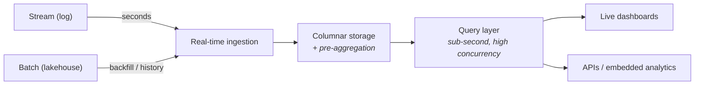

Part 4 built the pipes that move events in seconds. This part is about the room the pipes empty into: a query engine where **thousands of dashboard users get sub-second answers over data that is seconds old**. That combination — freshness × speed × concurrency — is its own architecture school: real-time OLAP.

## The birth pain

The warehouse (Part 2) answers big questions in seconds-to-minutes, over last night's data — fine for analysts, wrong for a live ops screen. The stream processor (Part 4) computes continuously but isn't built to serve thousands of ad-hoc slice-and-dice queries. The gap: *"customer-facing analytics"* — live dashboards for ops teams, embedded analytics inside a SaaS product, monitoring over business events. A class of engines grew into exactly that gap: ClickHouse, Apache Druid, Apache Pinot, StarRocks, Apache Doris — different projects, one shared shape.

## The shared shape

Three tricks make the speed possible, and all three are trade-offs you should recognize:

1. **Columnar storage + aggressive indexing** — the same columnar idea as the warehouse, tuned for point-in-time slices rather than giant scans.
2. **Pre-aggregation** — the engine maintains partial rollups (per minute, per dimension) so the dashboard query touches thousands of rows, not billions. You pay with ingestion-time compute and less flexibility on brand-new question shapes.
3. **Denormalization** — real-time OLAP hates joins at query time. The star schema of Part 2 gets flattened into wide tables *before* ingestion. You pay with upstream pipeline work and data duplication.

Notice what's missing: these engines are **not** your source of truth. They are a **serving layer** — a fast, disposable projection of data whose real home is the lakehouse or warehouse. Treat them as rebuildable, like a cache with SQL.

## Scoring on the five axes

- **Latency:** the reason this school exists — query p95 under a second, data freshness in seconds. If you need one but not both, cheaper schools exist (fresh-but-slow → stream into lakehouse; fast-but-daily → warehouse + BI cache).
- **Scale:** high ingest rates and high query concurrency — the "thousands of users on live data" quadrant nothing else serves well.
- **Team:** another distributed system to run (or a managed service to pay for); plus the upstream flattening pipelines. Not a first system — an addition to Parts 3–4.
- **Budget:** always-on cluster sized for peak concurrency. The classic mistake is serving *internal* analysts (10 users, exploratory queries) on an engine priced for *external* concurrency.
- **Compliance:** as a projection layer, keep PII out of it where possible — serve pre-aggregated or pseudonymized views and let the governed lakehouse hold the raw truth (nice bonus: deletes stay a lakehouse problem).

## Choose / avoid

**Choose real-time OLAP when:** analytics is part of your *product* (customers see dashboards), or an ops team stares at live screens and acts within minutes, or thousands of concurrent queries hit fresh data.

**Avoid when:** dashboards are internal and hourly is fine (Part 2/3 + a BI cache); "real-time" is a stakeholder aesthetic rather than an action window (Part 4's gate question, again); or the team can't operate another stateful system.

## Three customers

- **Startup with a SaaS product:** embedded analytics is often the *first* legitimate real-time OLAP need — a small managed cluster serving customer dashboards, fed by the app's event stream, while internal BI stays on the Part 8 stack.
- **Mid-size ops-heavy company** (logistics, e-commerce archetype): one real-time OLAP cluster for the ops control screen; the warehouse remains the truth for finance. Two engines, two jobs, clean split.
- **Enterprise / data-product company:** OLAP serving becomes a tier — multiple flattened marts, capacity planning per tenant or per product surface (Part 9's multi-tenancy questions arrive quickly here).

## Key takeaways

- Real-time OLAP fills one quadrant: sub-second queries × seconds-fresh data × high concurrency — customer-facing and ops analytics.
- The speed comes from columnar storage, pre-aggregation, and denormalization — all paid for upstream, at ingestion time.
- These engines are a serving layer, not a source of truth: a rebuildable projection of the lakehouse/warehouse.
- The classic overspend is buying external-grade concurrency for internal dashboards; the gate question from Part 4 applies here too.

*Next up — Part 6: Event-Driven Data: CDC & the Outbox.*
