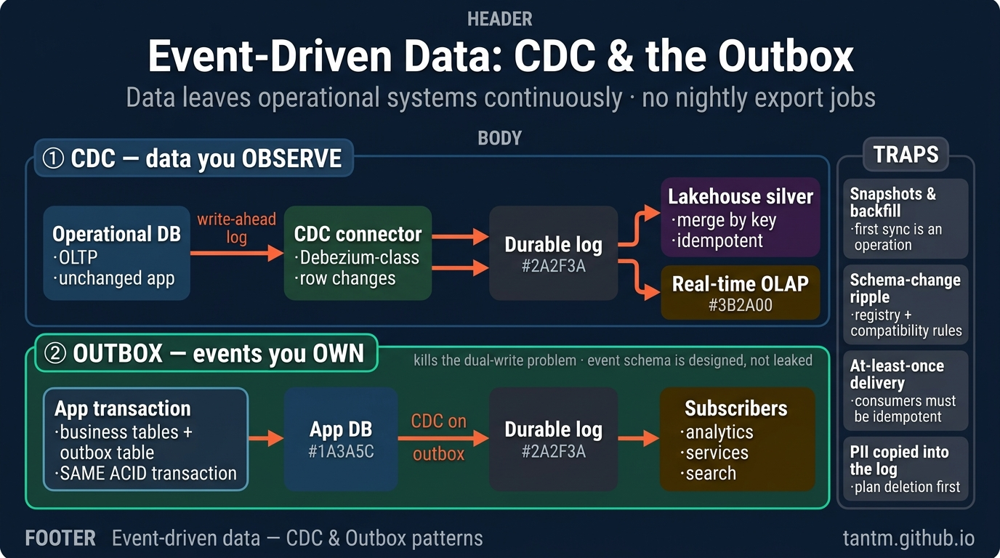
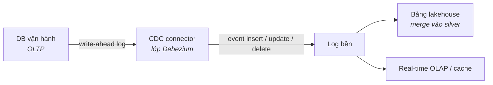
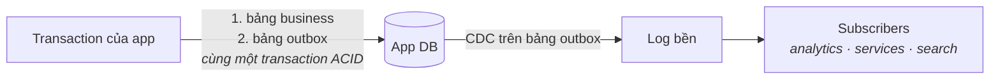

Các trường phái trước đều mặc định dữ liệu *tự dưng tới* — extract chạy đêm, file trong lake, event trong log. Phần này nói về chính chuyện "tới" đó: làm sao dữ liệu thoát khỏi hệ thống vận hành **liên tục, đáng tin, mà không phải nhờ từng team app viết job export**. Hai pattern thống trị: change data capture và outbox.

## Bạn sẽ học được gì

- Gọi tên ba bệnh mãn tính của extract chạy đêm, và mỗi pattern chữa bệnh nào.
- Giải thích CDC đọc cái gì, và ba điều brochure của vendor không nhắc tới.
- Nhận ra con bug dual-write ngay khi nhìn thấy, và sửa nó bằng pattern outbox.
- Quyết định khi nào nên *quan sát* một database và khi nào nên nhờ team đó *phát* event.

**Cần biết trước:** Phần 4 (cái log, replay, at-least-once). Phần 2–3 cho bối cảnh extract nuôi cái gì.



## 1. Nỗi đau khai sinh

Cú extract `SELECT *` chạy đêm có ba bệnh mãn tính. Nó nện vào source lúc 2 giờ sáng. Nó bỏ lỡ mọi thứ xảy ra *rồi bị hoàn tác* giữa hai lần chụp. Và lịch chạy của nó định trần độ tươi của bạn. Poll dày hơn chỉ là đổi bệnh một lấy bệnh ba.

Insight đứng sau CDC: **database vốn đã ghi một cuốn nhật ký hoàn hảo về mọi thay đổi — replication log của nó.** Hãy đọc cuốn đó thay vì query bảng.

## 2. CDC: cuốn nhật ký của database



CDC connector (pattern Debezium) bám đuôi write-ahead log và publish mỗi thay đổi dòng thành một event: *ảnh trước, ảnh sau, loại thao tác, timestamp*. Hạ nguồn, platform merge chúng vào bảng lakehouse (Phần 3) hoặc nuôi các tầng serving (Phần 5).

Điều khiến CDC được yêu: **không sửa một dòng code app nào** (app không biết mình đang bị quan sát), độ tươi cận real-time, và hết cảnh nện source lúc 2 giờ sáng. Điều tờ rơi quảng cáo bỏ qua:

- **Snapshot & backfill** — log chỉ giữ được một đoạn; lần sync đầu cần một snapshot nhất quán, và re-sync một bảng là một sự kiện vận hành, không phải một cú click.
- **Đổi schema là cắn** — `ALTER TABLE` ở source lan sóng tới mọi consumer. Thiếu schema registry và luật tương thích, CDC thành cỗ máy phá vỡ phân tán.
- **Bạn thừa kế data model của source** — CDC trung thành export các bảng nội bộ của app, kèm cả foreign key. Lớp silver của bạn phải dịch *ruột app* thành *ngữ nghĩa business*; bỏ qua bước dịch đó là ghép cứng cả platform vào ORM của một team khác.

## 3. Outbox: event có chủ đích

Event CDC nói *"dòng 4711 đã đổi"*. Thứ business thường cần là *"Đơn hàng 123 đã được đặt"* — một **event mức domain, có chủ đích**. Nhưng nếu app ghi vào database *rồi mới* publish lên log như hai bước rời, sớm muộn một bước sẽ fail một mình, và bạn có đơn-không-event hoặc event-không-đơn (bài toán dual-write).

Outbox pattern sửa nó bằng một mánh thật thà:



App ghi thay đổi business **và** event vào bảng `outbox` *trong cùng một transaction* — nên chúng commit hoặc fail cùng nhau. CDC sau đó chuyển các dòng outbox lên log. Tính nguyên tử từ database, việc giao hàng từ CDC, và schema của event được **thiết kế**, không phải rò rỉ từ bảng nội bộ.

Quy tắc bỏ túi: **CDC cho dữ liệu bạn quan sát** (hệ thống có sẵn không sửa được), **outbox cho event bạn sở hữu** (service do team mình xây). Platform chín chắn chạy cả hai.

## 4. Event làm nguồn sự thật — nên đi xa tới đâu

Event sourcing toàn phần (bản ghi *duy nhất* là event log; mọi state đều dẫn xuất) mạnh mẽ và đắt đỏ — đa số platform analytics không cần. Điểm giữa thực dụng: giữ database vận hành làm system-of-record, coi **event log là xương sống tích hợp**, và để lakehouse lưu lịch sử. Bạn có replayability (Kappa của Phần 4) mà không phải xây lại mọi ứng dụng.

Một bài học production đáng nguyên một đoạn: **consumer hạ nguồn phải idempotent.** CDC và log giao hàng kiểu at-least-once; cùng một thay đổi *chắc chắn sẽ* tới hai lần. Merge theo key + version vào bảng lakehouse khiến bản trùng vô hại. Riêng thói quen này chặn cả một thể loại sự cố "số liệu nhân đôi sau một đêm".

## 5. Chấm theo năm trục

- **Latency:** độ tươi giây-tới-phút cho *mọi* mục đích hạ nguồn cùng lúc — thường là cách rẻ nhất để làm nhiều thứ tươi hơn mà không cần pipeline riêng từng use case.
- **Team:** connector, schema registry, governance topic là bề mặt vận hành thật; "ai duyệt một thay đổi schema event" trở thành câu hỏi tổ chức (Phần 7 gửi lời chào).
- **Scale:** log scale tốt; điểm đau thường là bán kính nổ của một bảng nóng.
- **Budget:** hạ tầng connector + retention log; rẻ hơn vẻ ngoài nếu so với nuôi N job extract thủ công.
- **Compliance:** event sao chép PII vào một log giữ lâu — tính trước chuyện xoá theo key hoặc crypto-shredding (cùng cảnh báo Phần 4, nhân đôi vì CDC chép *tất cả*).

## 6. Ba khách hàng

- **Startup:** thường bỏ qua CDC lúc đầu — extract chạy đêm trên stack Phần 8 là đủ. Chỉ nên xài outbox sớm *nếu* giữa các service đã event-driven sẵn.
- **Tầm trung:** CDC trên 3–5 bảng lõi nuôi analytics; outbox cho service mới; mọi thứ đáp vào silver của lakehouse. Nước cờ hiện đại hoá tiêu chuẩn.
- **Enterprise:** cái log thành xương sống tích hợp của hàng chục team — lúc đó governance schema, ownership, và chính sách PII theo topic quan trọng hơn bất kỳ connector nào (và lớp phủ Phần 10 áp lên chính cái log).

## Thực hành (25 phút — tái hiện bug dual-write, rồi sửa bằng outbox)

Python thuần và SQLite. Bạn sẽ xem một hệ thống đánh mất event theo cách bình thường nhất có thể, rồi làm cho mất mát đó thành bất khả:

```python
import sqlite3, random
db = sqlite3.connect(":memory:")
db.executescript('''
CREATE TABLE orders(id INTEGER PRIMARY KEY, status TEXT);
CREATE TABLE outbox(id INTEGER PRIMARY KEY AUTOINCREMENT, payload TEXT, published INT DEFAULT 0);
''')
broker = []                       # giả lập message broker

# --- Bug dual-write: hai hệ thống, không transaction chung ---
def place_order_dual_write(order_id, broker_fails):
    db.execute("INSERT INTO orders VALUES (?,?)", (order_id, "placed"))
    db.commit()                                   # ghi 1: đã commit, vĩnh viễn
    if broker_fails:
        raise RuntimeError("broker không kết nối được")  # ghi 2 không bao giờ xảy ra
    broker.append(f"order {order_id} placed")

for oid, fails in [(1, False), (2, True), (3, False)]:
    try: place_order_dual_write(oid, fails)
    except RuntimeError as e: print(f"  đơn {oid}: {e}")

print("đơn trong DB:", [r[0] for r in db.execute("SELECT id FROM orders")])
print("event trong broker:", broker, " ← đơn 2 tồn tại nhưng KHÔNG AI hạ nguồn biết")

# --- Cách sửa outbox: một transaction ghi CẢ HAI dòng ---
broker.clear(); db.execute("DELETE FROM orders")
def place_order_outbox(order_id):
    with db:                                      # một transaction nguyên tử
        db.execute("INSERT INTO orders VALUES (?,?)", (order_id, "placed"))
        db.execute("INSERT INTO outbox(payload) VALUES (?)", (f"order {order_id} placed",))

def relay(broker_fails):                          # process riêng, retry mãi
    for rid, payload in db.execute("SELECT id,payload FROM outbox WHERE published=0").fetchall():
        if broker_fails: print(f"  relay: broker chết, sẽ retry event {rid}"); return
        broker.append(payload)
        db.execute("UPDATE outbox SET published=1 WHERE id=?", (rid,)); db.commit()

for oid in (1, 2, 3): place_order_outbox(oid)
relay(broker_fails=True)                          # broker sự cố đúng lúc relay chạy
print("sau sự cố — broker:", broker, " chưa publish:",
      db.execute("SELECT count(*) FROM outbox WHERE published=0").fetchone()[0])
relay(broker_fails=False)                         # broker hồi phục
print("sau hồi phục — broker:", broker, " chưa publish:",
      db.execute("SELECT count(*) FROM outbox WHERE published=0").fetchone()[0])
```

Kết quả mong đợi: ở lượt đầu, đơn 2 nằm trong database trong khi không event nào về nó tới được broker — không exception nào sống sót, không retry nào cứu được, và các hệ thống hạ nguồn đơn giản là sai vĩnh viễn. Đó là bug dual-write, và nó nhạt nhẽo đúng như vậy mỗi lần xảy ra. Với outbox, sự cố broker chẳng tốn gì: các event đã được commit bền vững cùng cái đơn, relay chỉ là chưa kịp chuyển đi, và khi broker quay lại thì cả ba đều tới. Để ý thứ đã đổi — không phải độ tin cậy của broker, mà là *nơi event được ghi*.

## Tự kiểm tra

1. Một service ghi vào database rồi publish lên Kafka. Cả hai thao tác "chạy tốt khi test". Bug ở đâu, và vì sao test không tìm ra?
2. Vì sao pattern outbox cần một process relay riêng thay vì cứ publish ở cuối transaction?
3. Team bạn muốn lấy event từ database của team khác. Khi nào bạn đề xuất CDC, và khi nào bạn nhờ họ phát event?

<details><summary>Xem đáp án</summary>

1. Dual write: hai lượt ghi không nằm trong một transaction, nên một cú crash hay sự cố broker ở giữa để lại database đã cập nhật còn event thì biến mất — vĩnh viễn và im lặng. Test hiếm khi tìm ra vì nó chỉ lộ ra khi lượt ghi thứ hai fail đúng vào khoảnh khắc tệ nhất, mà đó là sự kiện tần suất-production chứ không phải tần suất-test-suite.
2. Vì publish *bên trong* transaction đưa lại đúng con bug đó — lệnh gọi broker có thể thành công trong khi transaction sau đó rollback, hoặc ngược lại. Relay đọc các dòng outbox đã commit *sau khi* mọi chuyện xong và retry cho tới khi broker nhận, và đó là thứ khiến giao nhận là at-least-once chứ không phải cố-gắng-hết-sức.
3. Đề xuất CDC khi bạn cần *quan sát* dữ liệu mình không sở hữu và không thể nhờ họ đổi — nó không đòi hỏi gì từ code của họ, nhưng bạn nhận nguyên hình dạng bảng của họ, và mỗi lần họ đổi schema là một sự cố của bạn. Nhờ họ phát event khi dữ liệu đó là một hợp đồng business thật giữa các team: khi ấy họ sở hữu hình dạng event, tự do thay đổi phần ruột, còn bạn không bị dính chặt vào cách họ lưu trữ.

</details>

## Điều cần nhớ

- CDC đọc replication log của database: export liên tục, vô hình với app — nhưng bạn nhận kèm snapshot, sóng đổi schema, và data model nội bộ của source.
- Outbox pattern diệt bài toán dual-write: thay đổi business + event commit trong một transaction, CDC lo giao hàng.
- Quan sát bằng CDC, sở hữu bằng outbox; consumer phải idempotent vì mọi thứ tới kiểu at-least-once.
- Event log làm xương sống tích hợp cho bạn replayability mà không cần event sourcing toàn phần — và nó sao chép PII của bạn, nên hãy tính chuyện xoá trước tiên.

*Tiếp theo — Phần 7: Data Mesh: lời hứa, cái giá, thực tế.*
