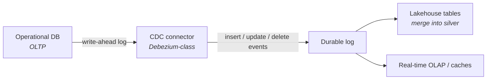
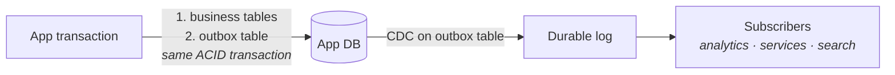

Every school so far assumed data somehow *arrives* — nightly extracts (Part 2), files in a lake (Part 3), events in a log (Parts 4–5). This part is about the arrival itself: how data escapes operational systems **continuously, reliably, and without asking every app team to write export jobs**. Two patterns dominate: change data capture and the outbox.

## The birth pain

The nightly `SELECT *` extract has three chronic diseases: it hammers the source at 2 a.m., it misses everything that happened *and was undone* between snapshots, and its schedule defines your freshness ceiling. Polling more often just trades disease one for disease three. The insight behind CDC: **the database already writes a perfect record of every change — its replication log.** Read that instead of querying tables.

## Pattern 1 — CDC: the database's diary

A CDC connector (the Debezium pattern) tails the write-ahead log and publishes every row change as an event: *before-image, after-image, operation, timestamp*. Downstream, the platform merges these into lakehouse tables (Part 3) or feeds serving layers (Part 5).

What makes CDC beloved: **zero application changes** (the app doesn't know it's being watched), near-real-time freshness, and no 2 a.m. hammering. What the brochure omits:

- **Snapshots & backfill** — the log only goes back so far; first sync requires a consistent snapshot, and re-syncing a table is an operational event, not a click.
- **Schema changes bite** — `ALTER TABLE` on the source ripples into every consumer. Without a schema registry and compatibility rules, CDC becomes a distributed breakage machine.
- **You inherit the source's data model** — CDC faithfully exports the app's private tables, foreign keys and all. Your silver layer must translate *app internals* into *business meaning*; skipping that translation couples your entire platform to another team's ORM.

## Pattern 2 — The outbox: intentional events

CDC events say *"row 4711 changed"*. Often what the business needs is *"Order 123 was placed"* — an **intentional, domain-level event**. But if the app writes to its database *and then* publishes to the log as two separate steps, one of them will eventually fail alone, and you get orders without events or events without orders (the dual-write problem).

The outbox pattern fixes it with one honest trick:

The app writes the business change **and** the event into an `outbox` table *in the same transaction* — so they commit or fail together. CDC then ships the outbox rows to the log. Atomicity from the database, delivery from CDC, and the event schema is **designed**, not leaked from internal tables.

Rule of thumb: **CDC for data you observe** (existing systems you can't change), **outbox for events you own** (services your teams build). Mature platforms run both.

## Events as a source of truth — how far to take it

Full event sourcing (the *only* record is the event log; all state is derived) is powerful and expensive — most analytics platforms don't need it. The pragmatic middle: keep operational databases as system-of-record, treat the **event log as the integration backbone**, and let the lakehouse persist history. You get replayability (Part 4's Kappa) without rebuilding every application.

One production lesson worth its own paragraph: **downstream consumers must be idempotent.** CDC and log deliveries are at-least-once; the same change *will* arrive twice. Merging by key + version into lakehouse tables makes duplicates harmless. This single habit prevents a whole genre of "numbers doubled overnight" incidents.

## Scoring on the five axes

- **Latency:** seconds-to-minutes freshness for *all* downstream uses at once — often the cheapest way to make many things fresher without per-use-case pipelines.
- **Team:** connectors, schema registry, and topic governance are real operational surface; who approves an event schema change becomes an org question (Part 7 says hello).
- **Scale:** logs scale; the pain point is usually the blast radius of one hot table's changes.
- **Budget:** connector infrastructure + log retention; cheaper than it looks compared to maintaining N bespoke extract jobs.
- **Compliance:** events copy PII into a retained log — plan key-scoped deletion or crypto-shredding up front (same warning as Part 4, doubled because CDC copies *everything*).

## Three customers

- **Startup:** usually skip CDC at first — nightly extracts on the Part 8 stack are fine. Adopt the outbox early *only* if you're already event-driven between services.
- **Mid-size:** CDC on the 3–5 core tables that power analytics; outbox for new services; everything lands in lakehouse silver. The standard modernization move.
- **Enterprise:** the log becomes an integration backbone across dozens of teams — at which point schema governance, ownership, and PII policy per topic matter more than any connector (and Part 10's overlay applies to the log itself).

## Key takeaways

- CDC reads the database's replication log: continuous, app-invisible export — but you inherit snapshots, schema-change ripple, and the source's internal model.
- The outbox pattern kills the dual-write problem: business change + event committed in one transaction, shipped by CDC.
- Observe with CDC, own with outbox; keep consumers idempotent because everything arrives at-least-once.
- The event log as integration backbone gives replayability without full event sourcing — and copies your PII, so plan deletion first.

*Next up — Part 7: Data Mesh: Promise, Price, Reality.*
