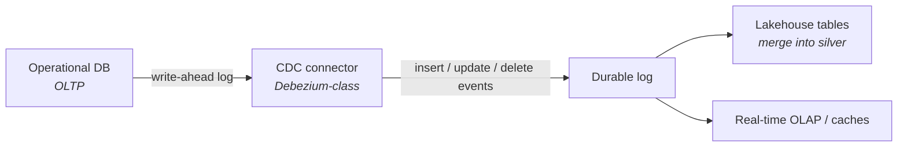
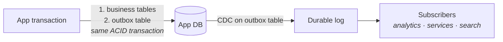

Every school so far assumed data somehow *arrives* — nightly extracts, files in a lake, events in a log. This part is about the arrival itself: how data escapes operational systems **continuously, reliably, and without asking every app team to write export jobs**. Two patterns dominate: change data capture and the outbox.

## What you'll learn

- Name the three chronic diseases of the nightly extract, and which one each pattern cures.
- Explain what CDC reads, and the three things vendor brochures don't mention.
- Recognize the dual-write bug on sight, and fix it with the outbox pattern.
- Decide when to *observe* a database and when to ask its team to *publish* events.

**Prerequisites:** Part 4 (the log, replay, at-least-once delivery). Parts 2–3 for context on what extracts feed.


## 1. The birth pain

The nightly `SELECT *` extract has three chronic diseases. It hammers the source at 2 a.m. It misses everything that happened *and was undone* between snapshots. And its schedule defines your freshness ceiling. Polling more often just trades the first disease for the third.

The insight behind CDC: **the database already writes a perfect record of every change — its replication log.** Read that instead of querying tables.

## 2. CDC: the database's diary



A CDC connector (the Debezium pattern) tails the write-ahead log and publishes every row change as an event: *before-image, after-image, operation, timestamp*. Downstream, the platform merges these into lakehouse tables (Part 3) or feeds serving layers (Part 5).

What makes CDC beloved: **zero application changes** (the app doesn't know it's being watched), near-real-time freshness, and no 2 a.m. hammering. What the brochure omits:

- **Snapshots & backfill** — the log only goes back so far; first sync requires a consistent snapshot, and re-syncing a table is an operational event, not a click.
- **Schema changes bite** — `ALTER TABLE` on the source ripples into every consumer. Without a schema registry and compatibility rules, CDC becomes a distributed breakage machine.
- **You inherit the source's data model** — CDC faithfully exports the app's private tables, foreign keys and all. Your silver layer must translate *app internals* into *business meaning*; skipping that translation couples your entire platform to another team's ORM.

## 3. The outbox: intentional events

CDC events say *"row 4711 changed"*. Often what the business needs is *"Order 123 was placed"* — an **intentional, domain-level event**. But if the app writes to its database *and then* publishes to the log as two separate steps, one of them will eventually fail alone, and you get orders without events or events without orders (the dual-write problem).

The outbox pattern fixes it with one honest trick:



The app writes the business change **and** the event into an `outbox` table *in the same transaction* — so they commit or fail together. CDC then ships the outbox rows to the log. Atomicity from the database, delivery from CDC, and the event schema is **designed**, not leaked from internal tables.

Rule of thumb: **CDC for data you observe** (existing systems you can't change), **outbox for events you own** (services your teams build). Mature platforms run both.

## 4. Events as a source of truth — how far to take it

Full event sourcing (the *only* record is the event log; all state is derived) is powerful and expensive — most analytics platforms don't need it. The pragmatic middle: keep operational databases as system-of-record, treat the **event log as the integration backbone**, and let the lakehouse persist history. You get replayability (Part 4's Kappa) without rebuilding every application.

One production lesson worth its own paragraph: **downstream consumers must be idempotent.** CDC and log deliveries are at-least-once; the same change *will* arrive twice. Merging by key + version into lakehouse tables makes duplicates harmless. This single habit prevents a whole genre of "numbers doubled overnight" incidents.

## 5. Scoring on the five axes

- **Latency:** seconds-to-minutes freshness for *all* downstream uses at once — often the cheapest way to make many things fresher without per-use-case pipelines.
- **Team:** connectors, schema registry, and topic governance are real operational surface; who approves an event schema change becomes an org question (Part 7 says hello).
- **Scale:** logs scale; the pain point is usually the blast radius of one hot table's changes.
- **Budget:** connector infrastructure + log retention; cheaper than it looks compared to maintaining N bespoke extract jobs.
- **Compliance:** events copy PII into a retained log — plan key-scoped deletion or crypto-shredding up front (same warning as Part 4, doubled because CDC copies *everything*).

## 6. Three customers

- **Startup:** usually skip CDC at first — nightly extracts on the Part 8 stack are fine. Adopt the outbox early *only* if you're already event-driven between services.
- **Mid-size:** CDC on the 3–5 core tables that power analytics; outbox for new services; everything lands in lakehouse silver. The standard modernization move.
- **Enterprise:** the log becomes an integration backbone across dozens of teams — at which point schema governance, ownership, and PII policy per topic matter more than any connector (and Part 10's overlay applies to the log itself).

## Practice (25 minutes — reproduce the dual-write bug, then fix it with an outbox)

Pure Python and SQLite. You'll watch a system lose an event in the most ordinary way possible, then make that loss impossible:

```python
import sqlite3, random
db = sqlite3.connect(":memory:")
db.executescript('''
CREATE TABLE orders(id INTEGER PRIMARY KEY, status TEXT);
CREATE TABLE outbox(id INTEGER PRIMARY KEY AUTOINCREMENT, payload TEXT, published INT DEFAULT 0);
''')
broker = []                       # pretend message broker

# --- The dual-write bug: two systems, no shared transaction ---
def place_order_dual_write(order_id, broker_fails):
    db.execute("INSERT INTO orders VALUES (?,?)", (order_id, "placed"))
    db.commit()                                   # write 1: committed, permanent
    if broker_fails:
        raise RuntimeError("broker unreachable")  # write 2 never happens
    broker.append(f"order {order_id} placed")

for oid, fails in [(1, False), (2, True), (3, False)]:
    try: place_order_dual_write(oid, fails)
    except RuntimeError as e: print(f"  order {oid}: {e}")

print("orders in DB:", [r[0] for r in db.execute("SELECT id FROM orders")])
print("events in broker:", broker, " ← order 2 exists but NOBODY downstream knows")

# --- The outbox fix: one transaction writes BOTH rows ---
broker.clear(); db.execute("DELETE FROM orders")
def place_order_outbox(order_id):
    with db:                                      # one atomic transaction
        db.execute("INSERT INTO orders VALUES (?,?)", (order_id, "placed"))
        db.execute("INSERT INTO outbox(payload) VALUES (?)", (f"order {order_id} placed",))

def relay(broker_fails):                          # separate process, retries forever
    for rid, payload in db.execute("SELECT id,payload FROM outbox WHERE published=0").fetchall():
        if broker_fails: print(f"  relay: broker down, will retry event {rid}"); return
        broker.append(payload)
        db.execute("UPDATE outbox SET published=1 WHERE id=?", (rid,)); db.commit()

for oid in (1, 2, 3): place_order_outbox(oid)
relay(broker_fails=True)                          # broker outage during the relay
print("after outage — broker:", broker, " unpublished:",
      db.execute("SELECT count(*) FROM outbox WHERE published=0").fetchone()[0])
relay(broker_fails=False)                         # broker recovers
print("after recovery — broker:", broker, " unpublished:",
      db.execute("SELECT count(*) FROM outbox WHERE published=0").fetchone()[0])
```

Expected results: in the first run, order 2 sits in the database while no event about it ever reaches the broker — no exception survives, no retry helps, and downstream systems are simply wrong forever. That is the dual-write bug, and it is this undramatic every time. With the outbox, the broker outage costs nothing: the events are already durably committed alongside the order, the relay just hasn't shipped them yet, and when the broker returns all three arrive. Note what changed — not the reliability of the broker, but *where the event is written*.

## Check yourself

1. A service writes to its database and then publishes to Kafka. Both operations "work fine in testing". What's the bug, and why won't testing find it?
2. Why does the outbox pattern need a separate relay process instead of just publishing at the end of the transaction?
3. Your team wants events from another team's database. When do you propose CDC, and when do you instead ask them to publish events?

<details><summary>See answers</summary>

1. Dual write: the two writes are not in one transaction, so a crash or broker outage between them leaves the database updated and the event missing — permanently and silently. Testing rarely finds it because it only appears when the second write fails at exactly the wrong moment, which is a production-frequency event, not a test-suite one.
2. Because publishing *inside* the transaction reintroduces the same bug — the broker call can succeed while the transaction later rolls back, or vice versa. The relay reads committed outbox rows *after* the fact and retries until the broker accepts them, which is what makes delivery at-least-once rather than best-effort.
3. Propose CDC when you need to *observe* data you don't own and can't ask them to change — it requires nothing from their code, but you get their table shape, and their schema changes become your incidents. Ask for published events when the data is a genuine business contract between teams: then they own the event shape, can evolve internals freely, and you're not coupled to their storage layout.

</details>

## Key takeaways

- CDC reads the database's replication log: continuous, app-invisible export — but you inherit snapshots, schema-change ripple, and the source's internal model.
- The outbox pattern kills the dual-write problem: business change + event committed in one transaction, shipped by CDC.
- Observe with CDC, own with outbox; keep consumers idempotent because everything arrives at-least-once.
- The event log as integration backbone gives replayability without full event sourcing — and copies your PII, so plan deletion first.

*Next up — Part 7: Data Mesh: Promise, Price, Reality.*
