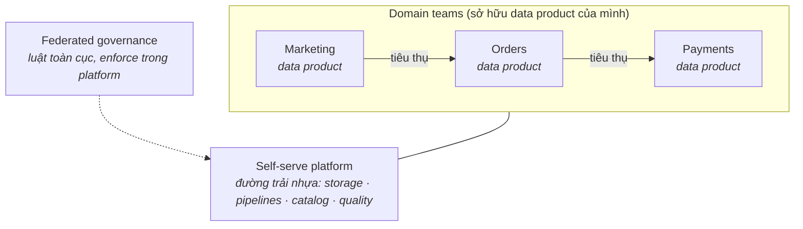

Các trường phái trước đều có sơ đồ về *hệ thống*. Data mesh khác hẳn: nó là sơ đồ về *con người*. Nó trả lời một thất bại tổ chức, không phải thất bại kỹ thuật — và đó chính xác là lý do nó vừa thật sự quan trọng, vừa là ý tưởng bị adopt quá đà nhất thập kỷ qua.

## Bạn sẽ học được gì

- Gọi tên đúng nút cổ chai tổ chức mà data mesh sinh ra để đáp lại.
- Nói được bốn nguyên tắc, và nguyên tắc nào các team luôn bỏ qua.
- Định giá cái mesh một cách thật thà trước khi đề xuất nó.
- Chạy "mesh-lite" — phiên bản mà đa số công ty thật ra nên dừng lại ở đó.

**Cần biết trước:** Phần 2–3 (warehouse và lakehouse) — mesh là nguyên tắc tổ chức đặt lên trên chúng, không thay thế chúng.

## 1. Nỗi đau khai sinh

Hình dung một công ty nơi Phần 2–6 đều chạy *tốt*: một data team trung tâm, một lakehouse khoẻ mạnh, streaming đúng chỗ. Giờ công ty có 40 product team — và team nào cũng đâm ticket vào cùng một data team trung tâm. Team này thuộc pipeline nhưng không thuộc domain ("đơn huỷ-rồi-khôi-phục có tính là churn event không?"). Backlog phình, các domain team bực mình tự xây pipeline chui, niềm tin xói mòn.

Đó là nỗi đau khai sinh: **team trung tâm thành nút cổ chai, còn tri thức domain nằm ở khắp nơi trừ chỗ việc data đang diễn ra.** Định luật Conway đến đòi nợ.

## 2. Bốn nguyên tắc

Data mesh (theo công thức của Zhamak Dehghani) đề xuất lật ngược quyền sở hữu:

1. **Domain ownership** — team orders sở hữu *dữ liệu* orders, không chỉ *service* orders. Pipeline, chất lượng, uptime: của họ.
2. **Data as a product** — mỗi domain publish dữ liệu như một sản phẩm cho team khác: có docs, tìm được, có version, có SLO và một owner gọi được.
3. **Self-serve data platform** — một team *platform* trung tâm (không phải team *pipeline* trung tâm) cung cấp đường trải nhựa: storage, orchestration, catalog, tooling chất lượng — để mỗi domain khỏi tự xây lại Phần 2–6 từ đầu.
4. **Federated computational governance** — luật toàn cục (PII, naming, interoperability) định nghĩa chung, được platform enforce *tự động*, không phải một hội đồng review từng dataset.

Để ý thứ mesh *không phải*: nó không phải một công nghệ. Mọi ô ở trên đều xây được từ vật liệu Phần 2–6. Mesh là một cuộc tái phân công quyền sở hữu trên đống vật liệu đó.

## 3. Cái giá (đọc trước khi mua)

- **Quân số có kỹ năng data ở MỌI domain.** Mỗi team sở hữu cần người xây và vận hành được pipeline. Mười domain ≈ mười data engineer bán thời gian *cộng thêm* team platform. Đây là ràng buộc loại phần lớn công ty khỏi cuộc chơi.
- **Một team platform thật.** "Self-serve" là một sản phẩm phải được xây và bảo trì. Nếu đường trải nhựa của bạn là một trang wiki hướng dẫn, các domain sẽ tự trải đường riêng — chúc mừng, bạn có "hỗn loạn phi tập trung", đúng thứ hồi trước nhưng nhiều Kafka hơn.
- **Kỷ luật sản phẩm cho dữ liệu.** SLO, versioning, chính sách deprecate, on-call cho *dataset*. Đa số tổ chức chưa từng vận hành dữ liệu kiểu này; đó là hoá đơn văn hoá, trả hằng tháng.
- **Federation là chính trị khó.** Ai định nghĩa "customer"? Khi hai domain bất đồng, governance-bằng-hội-đồng sẽ quay lại bằng cửa sau, trừ khi luật toàn cục ít, sắc, và tự động hoá.

## 4. Reality check: ai mới thật sự đủ lớn?

Heuristic thật thà: mesh bắt đầu tự trả tiền cho nó ở khoảng **nhiều domain team (cỡ chục trở lên), mỗi team có producer và consumer dữ liệu thật, và một team platform bạn đủ người để lập**. Dưới ngưỡng đó, bốn nguyên tắc tốn nhiều hơn cái nút cổ chai chúng chữa. Một data team ba engineer mà adopt mesh là đang tái tổ chức một nút cổ chai thành ba nút cổ chai nhỏ hơn và cô đơn hơn.

## 5. Mesh-lite: phiên bản đa số team nên chạy

Bạn có thể gặt phần lớn giá trị mà không cần cuộc đại tái tổ chức:

- Giữ **team trung tâm**, nhưng áp **kỷ luật data-as-a-product** cho đầu ra của nó: mỗi bảng gold có owner, docs, SLO, chính sách deprecate.
- Trao quyền sở hữu lớp silver cho **2–3 domain chín nhất về data** trước — một pilot, không phải một tuyên cáo.
- Đầu tư sớm vào **self-serve platform** (catalog, quality check, pipeline template) — phần này sinh lời *ở mọi quy mô*.
- Viết ra **năm luật toàn cục** (PII, naming, quy trình đổi schema, bậc SLA, access) và tự động hoá việc enforce.

Mesh-lite không phải phương án nhún nhường; với đa số công ty tầm trung, nó chính là trạng thái đích.

## 6. Chấm theo năm trục

- **Team:** trục quyết định, đảo ngược so với mọi trường phái khác — mesh sinh ra *cho* bài toán nhiều-team và *chỉ* bài toán đó.
- **Scale:** scale tổ chức, không phải scale dữ liệu — một mesh toàn gigabyte vẫn hoàn toàn hợp lý nếu bốn mươi team đụng vào nó.
- **Latency/Budget:** thừa kế từ các trường phái nền mà mỗi domain dùng; team platform là khoản cố định mới.
- **Compliance:** federated governance làm tốt thì *mạnh hơn* review tập trung (luật enforce bằng code); làm dở thì là lỗ hổng compliance mang cái tên hiện đại.

## 7. Ba khách hàng

- **Startup:** bỏ qua. Bạn là một domain. Làm Phần 8 và tiếp tục ship.
- **Tầm trung:** mesh-lite — kỷ luật sản phẩm + self-serve platform + một-hai domain pilot. Mỗi năm xem lại.
- **Enterprise lớn hàng chục team:** ca mesh chính hiệu — và lộ trình migration (Phần 13) quan trọng ngang cái đích: pilot domain trước, platform thứ hai, tuyên cáo sau cùng.

## Thực hành (25 phút — viết một contract data product, rồi định giá cái mesh)

Bài này không có code để chạy; kiểu hỏng của nó là hỏng tổ chức, nên bài tập cũng vậy. Làm cả hai nửa bằng cách viết ra — tốn hai mươi lăm phút, và đó là hai artifact quyết định một đề xuất mesh có sống nổi khi va vào thực tế hay không.

**Nửa 1 — bản contract (15 phút).** Chọn một dataset công ty bạn thật sự sản xuất và viết contract data product của nó gọn trong một trang:

| Mục | Câu trả lời của bạn |
|---|---|
| Tên và mục đích trong một câu | |
| Team sở hữu (một team có thật, có lịch trực có thật) | |
| Schema: các cột, kiểu, và cột nào được đảm bảo ổn định | |
| Grain: một dòng nghĩa là chính xác cái gì? | |
| SLA độ tươi: cập nhật xong trước lúc nào, đo bằng gì | |
| Đảm bảo chất lượng: điều gì luôn đúng (duy nhất, không null, khoảng giá trị) | |
| Consumer khám phá và xin quyền truy cập ra sao | |
| Chính sách thay đổi phá vỡ: báo trước bao lâu, versioning, khai tử | |
| 3 giờ sáng nó trễ hoặc sai thì sao — ai bị page | |

**Nửa 2 — cái giá (10 phút).** Với chính dataset đó, trả lời thật thà: team sở hữu tốn bao nhiêu giờ mỗi tháng cho nó *sau khi* contract này tồn tại? Nhân với số dataset bạn kỳ vọng họ sở hữu. Rồi hỏi roadmap của team đó còn chỗ không, và ai đã nói với họ.

Kết quả mong đợi: hai dòng cuối của contract là chỗ đa số bản nháp sụp đổ — các team vui vẻ "sở hữu" một dataset cho tới khi hai chữ *bị page* và *báo trước* xuất hiện, vì đó là khoảnh khắc quyền sở hữu thôi là một cái sơ đồ và trở thành một lịch trực. Nếu bạn không gọi được tên một người thật cho dòng 3-giờ-sáng, bạn không có data product; bạn có một cái bảng do ai đó publish. Còn nửa 2 thường lộ ra câu trả lời thật thà cho câu hỏi bạn đã đủ lớn cho mesh chưa: nếu phần việc platform chưa được cấp ngân sách và các team sở hữu không còn chỗ trống, một đề xuất mesh sẽ đẻ ra đúng cái nút cổ chai trung tâm cũ cộng thêm chi phí phối hợp.

## Tự kiểm tra

1. Ban lãnh đạo muốn "áp dụng data mesh" để chữa chuyện giao hàng chậm từ một team data trung tâm 4 người phục vụ 3 team sản phẩm. Bạn khuyên gì?
2. Trong bốn nguyên tắc, tổ chức hay bỏ qua cái nào nhất, và bỏ qua thì chuyện gì xảy ra?
3. Công ty bạn thật sự có 15 team sản phẩm và một nút cổ chai có thật. Bạn xây gì trước — và điều gì khiến bạn dừng lại trước khi làm mesh đầy đủ?

Xem đáp án

1. Đừng áp dụng mesh. Với 3 team tiêu thụ, chi phí phối hợp của quyền sở hữu phân tán lớn hơn cái nút cổ chai nó gỡ bỏ — một team trung tâm 4 người thường là cấu trúc *hiệu quả* ở quy mô đó. Hãy chữa chuyện giao hàng bằng quy trình tiếp nhận tốt hơn, ưu tiên rõ ràng hơn, và công cụ tự phục vụ; xem lại chuyện mesh khi số team tăng lên, chứ không phải khi số lời than tăng lên.
2. Self-serve platform. Domain ownership, tư duy sản phẩm và federated governance đều là những thứ tuyên bố được trong một cuộc họp; platform là thứ duy nhất đòi hỏi engineering có ngân sách. Bỏ qua nó nghĩa là mỗi team domain tự tay nặn pipeline, kiểm chất lượng và phân quyền riêng — bạn nhận chi phí phối hợp của mesh mà không có chút đòn bẩy nào, và chất lượng nhảy múa theo từng team.
3. Xây self-serve platform trước: đường-đã-lát cho ingestion, một catalog, các phép kiểm chất lượng chuẩn, và phân quyền mà team domain dùng được không cần mở ticket. Điều khiến bạn dừng trước mesh đầy đủ: nếu vài domain đã phủ phần lớn nhu cầu, mesh-lite (một nhúm data product được chứng thực do domain sở hữu, mọi thứ còn lại vẫn trung tâm) gom được phần lớn giá trị với một phần nhỏ chi phí phối hợp.

## Điều cần nhớ

- Data mesh giải một nút cổ chai tổ chức, không phải kỹ thuật: domain ownership, data-as-product, self-serve platform, federated governance.
- Cái giá là quân số ở mọi domain, một team platform thật, và kỷ luật sản phẩm cho dữ liệu — ràng buộc loại phần lớn công ty.
- Mesh-lite (kỷ luật sản phẩm + đường trải nhựa + domain pilot) gặt phần lớn giá trị ở tầm trung, và thường là trạng thái đích chứ không phải bước đệm.
- Adopt mesh vì sơ đồ tổ chức của bạn, đừng bao giờ vì một bài nói hội thảo.

*Tiếp theo — Phần 8: Kiến trúc Small Data (đa số công ty là small data).*
