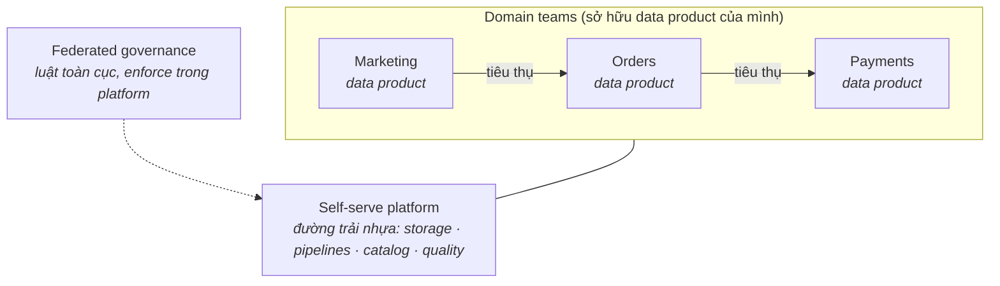

Các trường phái trước đều có sơ đồ về *hệ thống*. Data mesh khác hẳn: nó là sơ đồ về *con người*. Nó trả lời một thất bại tổ chức, không phải thất bại kỹ thuật — và đó chính xác là lý do nó vừa thật sự quan trọng, vừa là ý tưởng bị adopt quá đà nhất thập kỷ qua.

## Nỗi đau khai sinh

Hình dung một công ty nơi Phần 2–6 đều chạy *tốt*: một data team trung tâm, một lakehouse khoẻ mạnh, streaming đúng chỗ. Giờ công ty có 40 product team — và team nào cũng đâm ticket vào cùng một data team trung tâm. Team này thuộc pipeline nhưng không thuộc domain ("đơn huỷ-rồi-khôi-phục có tính là churn event không?"). Backlog phình, các domain team bực mình tự xây pipeline chui, niềm tin xói mòn.

Đó là nỗi đau khai sinh: **team trung tâm thành nút cổ chai, còn tri thức domain nằm ở khắp nơi trừ chỗ việc data đang diễn ra.** Định luật Conway đến đòi nợ.

## Bốn nguyên tắc

Data mesh (theo công thức của Zhamak Dehghani) đề xuất lật ngược quyền sở hữu:

1. **Domain ownership** — team orders sở hữu *dữ liệu* orders, không chỉ *service* orders. Pipeline, chất lượng, uptime: của họ.
2. **Data as a product** — mỗi domain publish dữ liệu như một sản phẩm cho team khác: có docs, tìm được, có version, có SLO và một owner gọi được.
3. **Self-serve data platform** — một team *platform* trung tâm (không phải team *pipeline* trung tâm) cung cấp đường trải nhựa: storage, orchestration, catalog, tooling chất lượng — để mỗi domain khỏi tự xây lại Phần 2–6 từ đầu.
4. **Federated computational governance** — luật toàn cục (PII, naming, interoperability) định nghĩa chung, được platform enforce *tự động*, không phải một hội đồng review từng dataset.

Để ý thứ mesh *không phải*: nó không phải một công nghệ. Mọi ô ở trên đều xây được từ vật liệu Phần 2–6. Mesh là một cuộc tái phân công quyền sở hữu trên đống vật liệu đó.

## Cái giá (đọc trước khi mua)

- **Quân số có kỹ năng data ở MỌI domain.** Mỗi team sở hữu cần người xây và vận hành được pipeline. Mười domain ≈ mười data engineer bán thời gian *cộng thêm* team platform. Đây là ràng buộc loại phần lớn công ty khỏi cuộc chơi.
- **Một team platform thật.** "Self-serve" là một sản phẩm phải được xây và bảo trì. Nếu đường trải nhựa của bạn là một trang wiki hướng dẫn, các domain sẽ tự trải đường riêng — chúc mừng, bạn có "hỗn loạn phi tập trung", đúng thứ hồi trước nhưng nhiều Kafka hơn.
- **Kỷ luật sản phẩm cho dữ liệu.** SLO, versioning, chính sách deprecate, on-call cho *dataset*. Đa số tổ chức chưa từng vận hành dữ liệu kiểu này; đó là hoá đơn văn hoá, trả hằng tháng.
- **Federation là chính trị khó.** Ai định nghĩa "customer"? Khi hai domain bất đồng, governance-bằng-hội-đồng sẽ quay lại bằng cửa sau, trừ khi luật toàn cục ít, sắc, và tự động hoá.

## Reality check: ai mới thật sự đủ lớn?

Heuristic thật thà: mesh bắt đầu tự trả tiền cho nó ở khoảng **nhiều domain team (cỡ chục trở lên), mỗi team có producer và consumer dữ liệu thật, và một team platform bạn đủ người để lập**. Dưới ngưỡng đó, bốn nguyên tắc tốn nhiều hơn cái nút cổ chai chúng chữa. Một data team ba engineer mà adopt mesh là đang tái tổ chức một nút cổ chai thành ba nút cổ chai nhỏ hơn và cô đơn hơn.

## Mesh-lite: phiên bản đa số team nên chạy

Bạn có thể gặt phần lớn giá trị mà không cần cuộc đại tái tổ chức:

- Giữ **team trung tâm**, nhưng áp **kỷ luật data-as-a-product** cho đầu ra của nó: mỗi bảng gold có owner, docs, SLO, chính sách deprecate.
- Trao quyền sở hữu lớp silver cho **2–3 domain chín nhất về data** trước — một pilot, không phải một tuyên cáo.
- Đầu tư sớm vào **self-serve platform** (catalog, quality check, pipeline template) — phần này sinh lời *ở mọi quy mô*.
- Viết ra **năm luật toàn cục** (PII, naming, quy trình đổi schema, bậc SLA, access) và tự động hoá việc enforce.

Mesh-lite không phải phương án nhún nhường; với đa số công ty tầm trung, nó chính là trạng thái đích.

## Chấm theo năm trục

- **Team:** trục quyết định, đảo ngược so với mọi trường phái khác — mesh sinh ra *cho* bài toán nhiều-team và *chỉ* bài toán đó.
- **Scale:** scale tổ chức, không phải scale dữ liệu — một mesh toàn gigabyte vẫn hoàn toàn hợp lý nếu bốn mươi team đụng vào nó.
- **Latency/Budget:** thừa kế từ các trường phái nền mà mỗi domain dùng; team platform là khoản cố định mới.
- **Compliance:** federated governance làm tốt thì *mạnh hơn* review tập trung (luật enforce bằng code); làm dở thì là lỗ hổng compliance mang cái tên hiện đại.

## Ba khách hàng

- **Startup:** bỏ qua. Bạn là một domain. Làm Phần 8 và tiếp tục ship.
- **Tầm trung:** mesh-lite — kỷ luật sản phẩm + self-serve platform + một-hai domain pilot. Mỗi năm xem lại.
- **Enterprise lớn hàng chục team:** ca mesh chính hiệu — và lộ trình migration (Phần 13) quan trọng ngang cái đích: pilot domain trước, platform thứ hai, tuyên cáo sau cùng.

## Điều cần nhớ

- Data mesh giải một nút cổ chai tổ chức, không phải kỹ thuật: domain ownership, data-as-product, self-serve platform, federated governance.
- Cái giá là quân số ở mọi domain, một team platform thật, và kỷ luật sản phẩm cho dữ liệu — ràng buộc loại phần lớn công ty.
- Mesh-lite (kỷ luật sản phẩm + đường trải nhựa + domain pilot) gặt phần lớn giá trị ở tầm trung, và thường là trạng thái đích chứ không phải bước đệm.
- Adopt mesh vì sơ đồ tổ chức của bạn, đừng bao giờ vì một bài nói hội thảo.

*Tiếp theo — Phần 8: Kiến trúc Small Data (đa số công ty là small data).*
